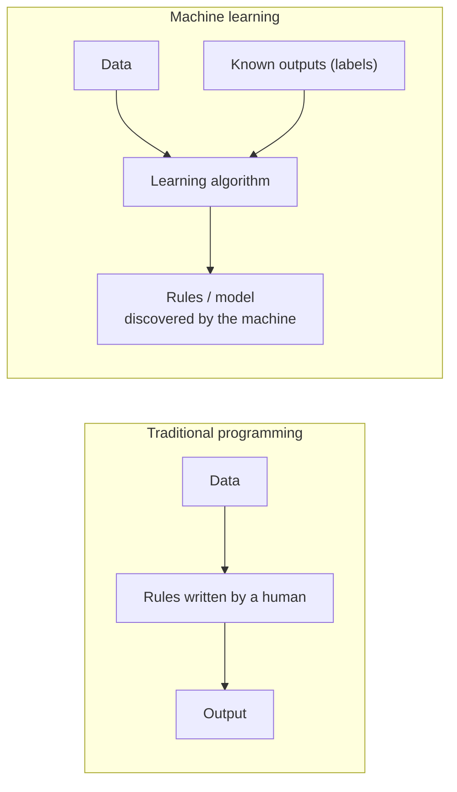

# What Is Machine Learning?

Machine learning is an application of artificial intelligence that involves algorithms and data that automatically analyze and make decision by itself without human intervention.

OR

Machine Learning (ML) is a branch of Artificial Intelligence (AI) that enables systems to learn from data, identify patterns, and make decisions with minimal human intervention.

Instead of being explicitly programmed to perform a task, ML algorithms learn from experience.

### The three pillars of the definition

1. **Relationship to AI** — ML is a subset, or "application", of the broader field of Artificial Intelligence.
2. **The inputs** — ML needs two things and only two things to work: **algorithms** (the mathematical instructions) and **data** (the experience to learn from).
3. **The goal** — autonomy. The system *automatically* analyses information and decides by itself, so the programmer never has to write a rule for every possible case.

### ML versus traditional programming

In traditional programming a human writes the rules and the computer applies them. In machine learning the human supplies data and examples of the right answer, and the machine works out the rules. This single reversal is what the whole subject rests on.
