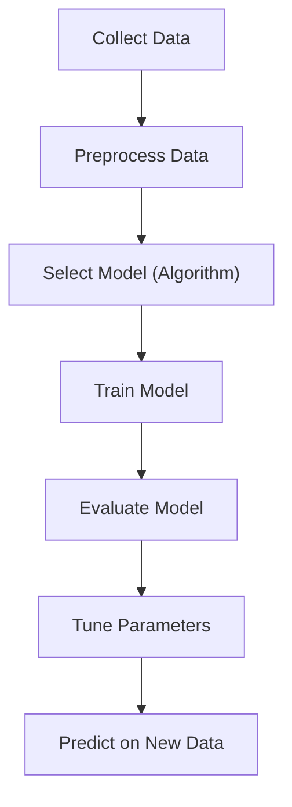

# Modeling

### What is Modeling?

Modeling is the process of creating a machine learning model that learns patterns from the training data and can make predictions or decisions on new (unseen) data.

### Modeling Workflow

- Collect Data: Input dataset (e.g., CSV, Excel)
- Preprocess Data: Cleaning, encoding, normalization, feature scaling, splitting
- Select Model (Algorithm)
  - Classification → SVM, KNN, Decision Tree
  - Regression → Linear Regression
  - Clustering → K-Means
- Train Model: Model learns from training data
- Evaluate Model: Accuracy, precision, recall, confusion matrix, etc.
- Tune Parameters: Adjust hyperparameters (e.g., GridSearchCV)
- Predict on New Data: Final model makes predictions on unseen data

### Goal of Modeling

To build a generalized model that performs well on unseen/test data, not just the training data.

### Good Modeling Practices

- Use cross-validation (e.g., K-Fold)
- Avoid overfitting (model memorizes training data)
- Avoid underfitting (model is too simple)
- Use feature scaling when needed
- Choose the right evaluation metric for your problem

### Types of Models based on Task

| Task | Examples |
| --- | --- |
| Classification | SVM, KNN, Naive Bayes |
| Regression | Linear Regression, Ridge, Lasso |
| Clustering | K-Means, DBSCAN |
| Dim. Reduction | PCA, t-SNE |
| Deep Learning | ANN, CNN, RNN |
