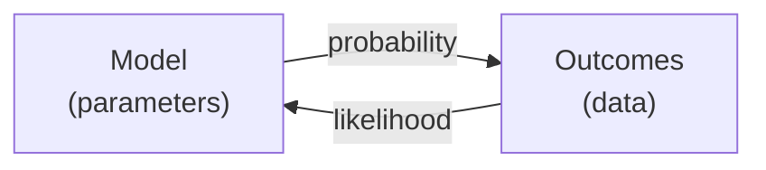
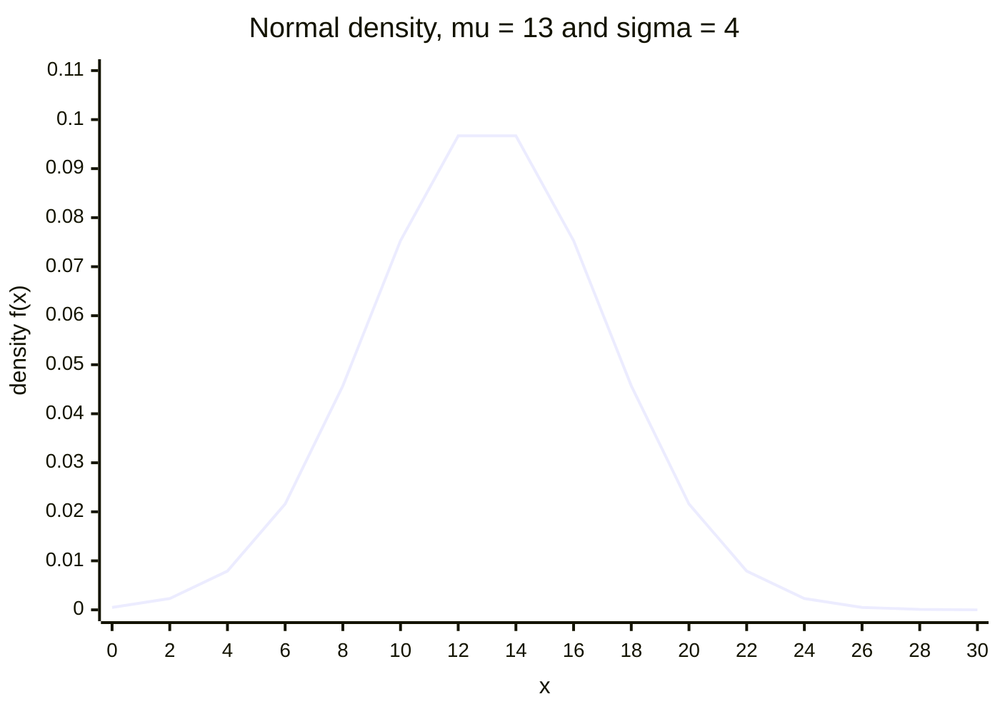

# Maximum Likelihood Estimation

Maximum Likelihood Estimation (MLE) is a statistical technique used to estimate the parameters of a probability distribution by maximizing the likelihood function.

It is widely applied in machine learning, statistics, and AI to optimize models for tasks such as classification, regression, and generative modeling.

The procedure: assume the data comes from some family of distributions (say Gaussian) whose parameters — the mean $\mu$, the standard deviation $\sigma$ — are unknown; write the likelihood as a function of those parameters with the data held fixed; then find the parameter values at the peak, usually by differentiating the **log**-likelihood and setting it to zero.

MLE is not a side topic. Logistic regression finds its weights by MLE. Linear regression under Gaussian noise has an OLS solution that *is* the MLE solution. Generative models learn a data distribution by maximising likelihood.

### What does Likelihood mean?

Likelihood is a fundamental concept in statistics and machine learning that measures how well a set of parameters explains a given dataset.

Unlike probability, which measures the chance of an event occurring, likelihood quantifies how probable the observed data is under a specific model.

Numerically the likelihood $L(\theta \mid x)$ equals the density $P(x \mid \theta)$, but it is read as a function of the **parameters** $\theta$ with the data $x$ fixed, rather than a function of the data with the parameters fixed. A higher likelihood means the parameters fit the observed data better.

### Difference between Likelihood and Probability

- Probability: Given a known model and parameters, probability predicts future outcomes.
- Likelihood: Given observed data, likelihood estimates the best parameters for a model.



Geometrically, on the same bell curve:

- **Probability is an area.** $P(a \le X \le b) = \int_a^b f(x \mid \theta)\,dx$ — the shaded region between two data values.
- **Likelihood is a height.** $L(\theta \mid x) = f(x \mid \theta)$ — the value of the curve at one observed point.

**Worked numbers.** Take a normal distribution with $\mu = 13$ and $\sigma = 4$:

$$f(x \mid \mu, \sigma) = \frac{1}{\sigma\sqrt{2\pi}}\, e^{-\frac{1}{2}\left(\frac{x-\mu}{\sigma}\right)^2}$$

- Probability that $5 \le x \le 10$: $0.204$ (an area).
- Probability that $-1000 \le x \le 1000$: $1.000$ — effectively the whole curve, and the total area under any density is always 1.
- Likelihood of $\mu = 13, \sigma = 4$ if the observed value was $x = 10$: $0.075$ (a height).
- Likelihood of the same parameters if the observed value was $x = 14$: $0.097$.



Read the curve two ways. **Probability** is an area under it — the region between $x=5$ and $x=10$ integrates to $0.204$. **Likelihood** is a height on it: at the observed $x = 10$ the curve stands at $0.0753$, and at $x = 14$ it stands at $0.0967$. Those are exactly the $0.075$ and $0.097$ quoted below.

Conclusion: if the observed value was 14, it is *more likely* that the parameters are $\mu = 13$ and $\sigma = 4$, because $0.097 > 0.075$. In probability the parameters are fixed and the data varies; in likelihood the data is fixed and the parameters vary.

### Recursive estimation: prior, likelihood, posterior over time

When the quantity being estimated changes over time — a robot's position, a tracked object — the same three terms recur at every step:


- $\theta$ — the state being estimated; $z_k$ — the measurement at time $k$; $x_{1:k}$ — all observations up to $k$.
- **Prediction** moves the particles (candidate states) forward with a motion model, spreading them out — this produces the prior.
- **Update** weights each particle by the likelihood $L(z_k \mid \theta_k)$: particles near the peak of the likelihood curve get large weights, particles at the edges get small ones. This is where "maximum likelihood" enters — the best-matching hypotheses are the most important.
- **Resampling** duplicates heavy particles and discards light ones, concentrating computation in high-probability regions and solving the degeneracy problem where one particle would eventually hold all the weight.

Unlike a Kalman filter, which assumes a Gaussian, this particle-based scheme represents distributions of any shape.

### Maximum Likelihood Estimation with the Binomial Distribution

Consider an experiment with two outcomes, success ($S$) and failure ($F$), for each subject, run over $n$ subjects. The sequence of outcomes can be arranged as

```
S S F S F F F S S F S ...... F
```

where there are $x$ successes out of $n$ trials. The probability distribution of $x$ is

$$f(x) = \binom{n}{x} p^x (1-p)^{n-x}, \qquad x = 0, 1, \dots, n$$

where $p = \text{prob}(S)$ and $1 - p = \text{prob}(F)$. The mean and variance of $x$ are $np$ and $np(1-p)$.

Written out with factorials:

$$P(X) = \frac{n!}{X!\,(n-X)!}\, p^X q^{\,n-X}, \qquad 0 \le X \le n$$

$$\mu = n \cdot p, \qquad \sigma^2 = n \cdot p \cdot q, \qquad \sigma = \sqrt{n \cdot p \cdot q}$$

Term by term:

- $\binom{n}{x} = \frac{n!}{x!(n-x)!}$ — the binomial coefficient, the number of ways to arrange $x$ successes among $n$ trials.
- $p^x$ — the probability of getting those $x$ successes.
- $(1-p)^{n-x}$ or $q^{n-x}$ — the probability of the remaining $n - x$ failures, with $p + q = 1$.

The four assumptions of a binomial experiment: a **fixed** number of trials $n$; **independent** trials; exactly **two** outcomes per trial; and a **constant** success probability $p$.

For MLE this PMF is read as the likelihood function $L(p \mid x, n)$, and the task is to find the $p$ that maximises it given the observed number of successes $x$ — which, for the binomial, works out to the intuitive $\hat{p} = x/n$.
