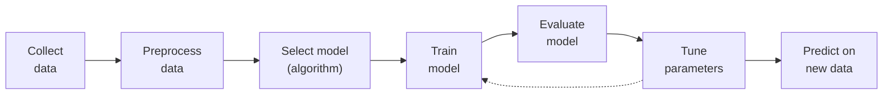

# Modeling

### What is Modeling?

Modeling is the process of creating a machine learning model that learns patterns from the training data and can make predictions or decisions on new (unseen) data.

Four parts: the **training data** (historical, with known answers), the **learning** (finding relationships in it), the **model** (the functional form of what was learned) and the **goal** — applying it to unseen data to produce a prediction ("this image is a cat") or a decision ("deny this transaction"). Building the model is *training*; using it afterwards is *inference*.

### Modeling Workflow

- Collect Data: Input dataset (e.g., CSV, Excel)
- Preprocess Data: Cleaning, encoding, normalization, feature scaling, splitting
- Select Model (Algorithm)
  - Classification → SVM, KNN, Decision Tree
  - Regression → Linear Regression
  - Clustering → K-Means
- Train Model: Model learns from training data
- Evaluate Model: Accuracy, precision, recall, confusion matrix, etc.
- Tune Parameters: Adjust hyperparameters (e.g., GridSearchCV)
- Predict on New Data: Final model makes predictions on unseen data

Model selection is driven by the output you need: a category → classification, a number → regression, hidden groups → clustering. Hyperparameter tuning turns the algorithm's external knobs — the $k$ in k-NN, a tree's depth — often by grid search (`GridSearchCV`), and feeds straight back into training.

### Goal of Modeling

To build a generalized model that performs well on unseen/test data, not just the training data.

**Generalisation** is the ability to be right about data never seen in training, which requires learning the underlying pattern rather than memorising examples. High training accuracy alone proves nothing; it may simply be **overfitting**.

### Good Modeling Practices

- Use cross-validation (e.g., K-Fold)
- Avoid overfitting (model memorizes training data)
- Avoid underfitting (model is too simple)
- Use feature scaling when needed
- Choose the right evaluation metric for your problem

- **K-Fold cross-validation** splits the data into $K$ subsets and trains $K$ times, each time holding out a different subset for testing. Averaging those results estimates performance far more reliably than one arbitrary split.
- **Overfitting** is a too-complex model learning the noise: excellent on training data, poor on new data. It is the high-**variance** failure.
- **Underfitting** is a too-simple model — a straight line through curved data. Poor on both training and test data. It is the high-**bias** failure.
- **Feature scaling** is mandatory for distance-based algorithms (k-NN, clustering) and gradient-descent-based ones (linear regression, neural networks).
- **Metric choice** matters: on a dataset where 99 % of samples are one class, a model that always predicts the majority scores 99 % accuracy and is useless. Precision, recall and F1 expose that; for regression, MSE or $R^2$ are appropriate.

### Types of Models based on Task

| Task | Examples |
| --- | --- |
| Classification | SVM, KNN, Naive Bayes |
| Regression | Linear Regression, Ridge, Lasso |
| Clustering | K-Means, DBSCAN |
| Dim. Reduction | PCA, t-SNE |
| Deep Learning | ANN, CNN, RNN |

One task, many algorithms. Classification predicts discrete categories; regression predicts continuous values; clustering groups unlabelled data; dimensionality reduction simplifies by cutting features; deep learning stacks layers to model complex patterns in unstructured data — CNNs typically for images, RNNs for sequences such as text and time series.
