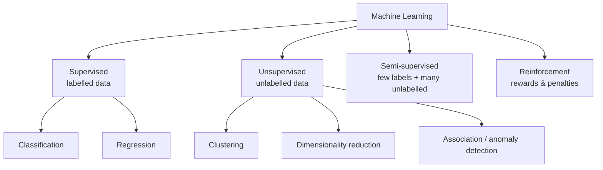
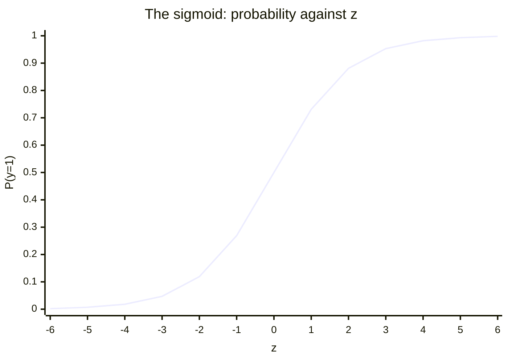
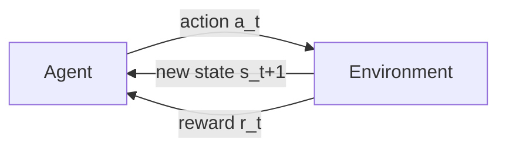

# Major Categories of ML Techniques

- Supervised Learning
- Unsupervised Learning
- Semi-supervised Learning
- Reinforcement Learning

### 1. Supervised Learning

Definition: The algorithm learns from labeled data, where the input comes with a known output.

Algorithm Used:

1. Linear Regression
2. Logistic Regression
3. Decision Trees
4. Support Vector Machines (SVM)
5. Neural Networks

**Labelled data** means that for every training input the correct answer — the *label* or *target* — is supplied alongside it. The labels act as a teacher: the algorithm predicts, compares against the known answer, and adjusts its parameters to shrink the error. The goal is to learn a mapping $Y = f(X)$ that generalises to new, unseen $X$.

Supervised learning solves exactly two kinds of problem:

- **Regression** — predict a quantity (house price, temperature).
- **Classification** — predict a category (spam/ham, benign/malignant).

#### Linear Regression

A 2D scatter plot of data points. A straight line ($y = mx + c$) fitted through the points, minimizing residuals (errors).

$$y = mx + c$$

- $y$ — the dependent variable, the value being predicted.
- $x$ — the independent variable, the input feature.
- $m$ — the slope: how much $y$ changes per one-unit change in $x$.
- $c$ — the y-intercept: the value of $y$ when $x = 0$.

For each real point $(x_i, y_i)$ the model predicts $\hat{y}_i$, and the **residual** is $y_i - \hat{y}_i$ — the vertical gap between the point and the line. Ordinary Least Squares picks the $m$ and $c$ that minimise the sum of the *squares* of those residuals, which is what "best fit" means.

#### Logistic Regression

Logistic Regression is a supervised machine learning algorithm used for classification problems. It predicts the probability that an input belongs to a particular class, such as Yes/No, Pass/Fail, Spam/Not Spam, or Disease/No Disease.

The output of a linear equation is squashed into $[0, 1]$ by the **sigmoid** (S-curve):

$$\sigma(z) = \frac{1}{1 + e^{-z}}, \qquad z = w^T x + b$$

The curve rises from an asymptote at $y = 0$ to an asymptote at $y = 1$, so its output reads directly as a probability. A **threshold** — conventionally $0.5$ — converts that probability into a label:

- if $P(y = 1 \mid x) \ge 0.5$ → predict class 1
- if $P(y = 1 \mid x) < 0.5$ → predict class 0

The curve is bounded by asymptotes at 0 and 1, crosses $0.5$ at $z = 0$, and is steepest there — the region where the model is least certain.

A point read off the curve at $y = 0.8$ means an 80 % chance of the positive class; $y = 0.3$ means 30 %. The threshold can be moved away from $0.5$ to make a model deliberately more sensitive (catch every disease case) or more specific (never raise a false alarm).

#### Application of Supervised Learning

- Spam detection in emails
- Credit scoring
- Disease diagnosis
- Customer churn Prediction

All four need a large body of **labelled historical data**. Three of them are classification; credit scoring can be either classification (approve/reject) or regression (predict a numeric score).

### 2. Unsupervised Learning

Unsupervised learning is a type of machine learning where the model is trained on data without labeled outputs.

Unlike supervised learning, where the algorithm learns from input-output pairs, in unsupervised learning the model tries to find:

1. patterns
2. structures
3. groupings in the data on its own.

Unsupervised learning works with unlabeled data, meaning the target/output variable is not provided. The goal is to discover hidden patterns, structures, or relationships in the data.

Supervised learning has $(X, Y)$; unsupervised learning has only $X$. There is no cheat sheet, so the algorithm must find the relationships itself.

#### Most Commonly Used Unsupervised Algorithms in Machine Learning Practical's

- K-Means Clustering
- Hierarchical Clustering
- DBSCAN
- PCA (Principal Component Analysis)
- Apriori Algorithm

#### Characteristics

- No labels: The algorithm only sees input features.
- Goal: Discover hidden patterns or intrinsic structures in the data.
- Common tasks:
  - Clustering (e.g., grouping similar customers)
  - Dimensionality reduction (e.g., reducing the number of features while preserving information)
  - Anomaly detection

**Clustering** partitions the data so that members of a group resemble each other more than they resemble outsiders — for example splitting a customer base into "big spenders" and "bargain hunters" without being told those groups exist. **Dimensionality reduction** cuts the number of input variables to simplify the model, speed up training and make high-dimensional data drawable in 2D or 3D. **Anomaly detection** picks out the rare observation that differs sharply from the rest, which is how a fraudulent transaction gets flagged.

| Algorithm | Technique | Main Use |
| --- | --- | --- |
| K-Means | Clustering | Group similar data |
| Hierarchical Clustering | Clustering | Build cluster hierarchy |
| DBSCAN | Clustering | Density-based clustering & outlier detection |
| PCA | Dimensionality Reduction | Reduce features |
| Apriori | Association | Find item relationships |
| FP-Growth | Association | Efficient rule mining |
| GMM | Clustering | Probabilistic clustering |
| Autoencoder | Representation Learning | Feature extraction |
| SOM | Visualization | Pattern discovery |

Reading the table by technique: most of these algorithms are clustering methods. K-Means uses distance to centroids, DBSCAN uses **density** and so finds arbitrarily shaped clusters plus noise, and GMM is the probabilistic ("soft") counterpart that assumes a mixture of Gaussians. PCA reduces features. Apriori and FP-Growth mine **association rules** ("people who buy bread also buy butter"). Autoencoders learn compact representations with a neural network, and Self-Organising Maps project the input space onto a low-dimensional grid for visualisation.

### 3. Semi-supervised Learning

Semi-Supervised Learning is a machine learning approach that uses both labeled and unlabeled data for training. Typically, a small portion of the dataset is labeled, while a large portion is unlabeled.

#### Why Use Semi-Supervised Learning?

Labeling data is often expensive and time-consuming, while unlabeled data is abundant. Semi-supervised learning leverages both to improve model performance.

Example:

- 1000 student records available
- Only 100 records have labels (Pass/Fail)
- Remaining 900 records are unlabeled
- A semi-supervised algorithm learns from both datasets to make better predictions.

The economics drive the method. Getting a label usually needs a human expert — a doctor must look at the X-ray to call it "pneumonia" — which is slow and costly, while collecting raw unlabelled X-rays is cheap. Semi-supervised learning uses the small labelled seed to anchor the classes and the large unlabelled pool to learn the shape of the data, so the decision boundary is far better than what 100 records alone could support.

#### Applications

- Email Spam Detection
- Image Classification
- Speech Recognition
- Medical Diagnosis
- Text Classification
- Fraud Detection

### 4. Reinforcement Learning

Reinforcement Learning is a type of machine learning where an agent learns by interacting with an environment and receives rewards or penalties based on its actions. The goal is to maximize the total reward over time.

#### Basic Components

- Agent – The learner or decision-maker.
- Environment – The world in which the agent operates.
- Action – A move made by the agent.
- State – The current situation of the environment.
- Reward – Feedback received after an action.
- Policy – Strategy used by the agent to choose actions.

In symbols: state $s_t$, action $a_t$, reward $r_t$, and policy $\pi$ mapping states to actions.

#### Working Process

- Agent observes the current state.
- Agent takes an action.
- Environment responds with a new state.
- Agent receives a reward or penalty.
- Agent learns from the feedback and improves future decisions.

The loop runs thousands or millions of times. The objective is never the immediate reward but the **cumulative** reward over time, so the agent will accept a small loss now for a larger gain later.

#### Example: Maze Game

- Agent: Robot
- Environment: Maze
- Action: Move Up, Down, Left, Right
- Reward: +10 for reaching the goal
- Penalty: -1 for hitting a wall
- The robot learns the shortest path by maximizing rewards.

The robot starts with no map. Because every wall collision costs $-1$ and only the goal pays $+10$, maximising the total reward is the same thing as finding the shortest collision-free path.

#### Common Reinforcement Learning Algorithms

- Q-Learning
  - Model-free RL algorithm.
  - Learns the value of actions in each state.
- SARSA (State-Action-Reward-State-Action)
  - Updates values based on the action actually taken.
- Deep Q-Network (DQN)
  - Combines Q-Learning with neural networks.
  - Used in game-playing AI.
- Policy Gradient Methods
  - Directly learn the policy function.
- Actor-Critic Methods
  - Combine value-based and policy-based learning.

Q-Learning is **off-policy**: it learns about the optimal policy while behaving differently. SARSA is **on-policy**: it updates using the action the agent actually took. DQN replaces the Q-table with a deep network so the method survives huge state spaces such as raw game pixels. Policy-gradient methods skip value estimation and optimise the policy directly. Actor-Critic keeps both: the **actor** proposes actions, the **critic** scores them.

#### Applications

- Game Playing (e.g., Chess AI)
- Robotics
- Self-Driving Cars
- Traffic Signal Control
- Recommendation Systems
- Resource Management

Games are *closed* environments — fixed rules, well-defined states — which is why RL excels there. Robotics and driving are *open* environments full of uncertainty. Traffic control and data-centre resource management are, at heart, optimisation problems.

### Comparison of all Learning Types

| Learning Type | Data Used | Goal |
| --- | --- | --- |
| Supervised Learning | Labelled Data | Predict outputs |
| Unsupervised Learning | Unlabelled Data | Find patterns |
| Semi-Supervised Learning | Both labelled & unlabelled data | Improve learning |
| Reinforcement Learning | Rewards & Penalties | Learn optimal actions |

The choice of paradigm is dictated by two questions: what data do you have, and what do you want out of it. No labels and a need for groups → unsupervised. Labels and a need for prediction → supervised. Expensive labels → semi-supervised. A sequence of decisions with delayed feedback → reinforcement.
