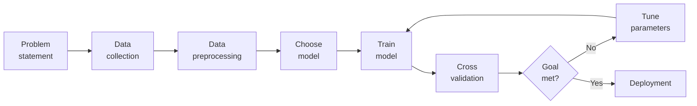

# The Machine Learning Pipeline

<svg viewBox="0 0 720 660" role="img" aria-label="The machine learning lifecycle as a ten-step cycle">
  <circle class="cyc-ring" cx="360.0" cy="330.0" r="190.0"/>
  <path class="cyc-tip" d="M -6 -5 L 0 0 L -6 5" transform="translate(418.7 149.3) rotate(18.0)"/>
  <path class="cyc-tip" d="M -6 -5 L 0 0 L -6 5" transform="translate(513.7 218.3) rotate(54.0)"/>
  <path class="cyc-tip" d="M -6 -5 L 0 0 L -6 5" transform="translate(550.0 330.0) rotate(90.0)"/>
  <path class="cyc-tip" d="M -6 -5 L 0 0 L -6 5" transform="translate(513.7 441.7) rotate(126.0)"/>
  <path class="cyc-tip" d="M -6 -5 L 0 0 L -6 5" transform="translate(418.7 510.7) rotate(162.0)"/>
  <path class="cyc-tip" d="M -6 -5 L 0 0 L -6 5" transform="translate(301.3 510.7) rotate(198.0)"/>
  <path class="cyc-tip" d="M -6 -5 L 0 0 L -6 5" transform="translate(206.3 441.7) rotate(234.0)"/>
  <path class="cyc-tip" d="M -6 -5 L 0 0 L -6 5" transform="translate(170.0 330.0) rotate(270.0)"/>
  <path class="cyc-tip" d="M -6 -5 L 0 0 L -6 5" transform="translate(206.3 218.3) rotate(306.0)"/>
  <path class="cyc-tip" d="M -6 -5 L 0 0 L -6 5" transform="translate(301.3 149.3) rotate(342.0)"/>
  <g class="cyc-node">
    <circle cx="360.0" cy="140.0" r="26.0"/>
    <text class="cyc-num" x="360.0" y="145.0" text-anchor="middle">01</text>
    <text class="cyc-lab" x="360.0" y="90.0" text-anchor="middle"><tspan x="360.0">Problem</tspan><tspan x="360.0" dy="15">definition</tspan></text>
  </g>
  <g class="cyc-node">
    <circle cx="471.7" cy="176.3" r="26.0"/>
    <text class="cyc-num" x="471.7" y="181.3" text-anchor="middle">02</text>
    <text class="cyc-lab" x="498.7" y="135.1" text-anchor="start"><tspan x="498.7">Data</tspan><tspan x="498.7" dy="15">collection</tspan></text>
  </g>
  <g class="cyc-node">
    <circle cx="540.7" cy="271.3" r="26.0"/>
    <text class="cyc-num" x="540.7" y="276.3" text-anchor="middle">03</text>
    <text class="cyc-lab" x="584.4" y="257.1" text-anchor="start"><tspan x="584.4">Cleaning &</tspan><tspan x="584.4" dy="15">preprocessing</tspan></text>
  </g>
  <g class="cyc-node">
    <circle cx="540.7" cy="388.7" r="26.0"/>
    <text class="cyc-num" x="540.7" y="393.7" text-anchor="middle">04</text>
    <text class="cyc-lab" x="584.4" y="402.9" text-anchor="start"><tspan x="584.4">Exploratory</tspan><tspan x="584.4" dy="15">data analysis</tspan></text>
  </g>
  <g class="cyc-node">
    <circle cx="471.7" cy="483.7" r="26.0"/>
    <text class="cyc-num" x="471.7" y="488.7" text-anchor="middle">05</text>
    <text class="cyc-lab" x="498.7" y="536.9" text-anchor="start"><tspan x="498.7">Feature</tspan><tspan x="498.7" dy="15">engineering</tspan></text>
  </g>
  <g class="cyc-node">
    <circle cx="360.0" cy="520.0" r="26.0"/>
    <text class="cyc-num" x="360.0" y="525.0" text-anchor="middle">06</text>
    <text class="cyc-lab" x="360.0" y="582.0" text-anchor="middle"><tspan x="360.0">Model</tspan><tspan x="360.0" dy="15">selection</tspan></text>
  </g>
  <g class="cyc-node">
    <circle cx="248.3" cy="483.7" r="26.0"/>
    <text class="cyc-num" x="248.3" y="488.7" text-anchor="middle">07</text>
    <text class="cyc-lab" x="221.3" y="536.9" text-anchor="end"><tspan x="221.3">Model</tspan><tspan x="221.3" dy="15">training</tspan></text>
  </g>
  <g class="cyc-node">
    <circle cx="179.3" cy="388.7" r="26.0"/>
    <text class="cyc-num" x="179.3" y="393.7" text-anchor="middle">08</text>
    <text class="cyc-lab" x="135.6" y="402.9" text-anchor="end"><tspan x="135.6">Evaluation</tspan><tspan x="135.6" dy="15">& tuning</tspan></text>
  </g>
  <g class="cyc-node">
    <circle cx="179.3" cy="271.3" r="26.0"/>
    <text class="cyc-num" x="179.3" y="276.3" text-anchor="middle">09</text>
    <text class="cyc-lab" x="135.6" y="257.1" text-anchor="end"><tspan x="135.6">Model</tspan><tspan x="135.6" dy="15">deployment</tspan></text>
  </g>
  <g class="cyc-node">
    <circle cx="248.3" cy="176.3" r="26.0"/>
    <text class="cyc-num" x="248.3" y="181.3" text-anchor="middle">10</text>
    <text class="cyc-lab" x="221.3" y="135.1" text-anchor="end"><tspan x="221.3">Monitoring &</tspan><tspan x="221.3" dy="15">maintenance</tspan></text>
  </g>
  <text class="cyc-hub" x="360.0" y="324.0" text-anchor="middle">Machine Learning</text>
  <text class="cyc-hub" x="360.0" y="348.0" text-anchor="middle">Lifecycle</text>
</svg>

The dotted return arrow is the reason this is called a **lifecycle** rather than a checklist: monitoring turns up drift, drift triggers a new problem definition, and the cycle starts again.

A shorter seven-stage form of the same pipeline is also common — Data Collection → Feature Engineering → Model Training → Evaluation → Deployment → Monitoring → Maintenance.

### The training loop inside the pipeline

Everything inside the loop repeats: train, cross-validate, check the goal, tune hyperparameters, train again. Only when the performance target is met does the model leave for deployment.

### Step 1: Problem Definition

The first step is clearly defining the problem that needs to be solved. A well-framed problem provides the foundation to determine the project goals, expected outcomes and the type of solution required.

- Ensures alignment between business needs and technical solutions
- Define project objectives, scope and success criteria
- Ensure clarity in desired outcomes

This step decides what the model actually predicts — "will this customer churn?" (classification) is a different project from "how much will this customer spend?" (regression). It also bridges stakeholders who want revenue and engineers who need a loss function to minimise. A badly framed problem wastes the entire budget downstream because there is no agreed measure of success.

### Step 2: Data Collection

Data Collection phase involves systematic collection of datasets that can be used as raw data to train model. The quality and variety of data directly affect the model's performance.

Here are some basic features of Data Collection:

- Relevance: Collect data should be relevant to the defined problem and include necessary features.
- Quality: Ensure data quality by considering factors like accuracy and ethical use.
- Quantity: Gather sufficient data volume to train a robust model.
- Diversity: Include diverse datasets to capture a broad range of scenarios and patterns.

This is where "garbage in, garbage out" is decided. Relevance means the features actually influence the target. Quality means accurate *and* ethically obtained. Quantity means enough samples that the model learns patterns instead of coincidences. Diversity means every real-world situation the model will meet is represented, which is the first defence against bias.

### Step 3: Data Cleaning and Preprocessing

Raw data is often messy and unstructured and if we use this data directly to train then it can lead to poor accuracy.

We need to do data cleaning and preprocessing which often involves:

- Data Cleaning: Address issues such as missing values, outliers and inconsistencies in the data.
- Data Preprocessing: Standardize formats, scale values and encode categorical variables for consistency.
- Data Quality: Ensure that the data is well-organized and prepared for meaningful analysis.

Typical defects: a blank age field (missing value), a height recorded as 10 feet (outlier from a typo), "USA" in one row and "United States" in the next (inconsistency). Scaling stops one large-magnitude feature from dominating; encoding turns "Red"/"Blue" into numbers the algorithm can compute with.

### Step 4: Exploratory Data Analysis (EDA)

To find patterns and characteristics hidden in the data Exploratory Data Analysis (EDA) is used to uncover insights and understand the dataset's structure. During EDA patterns, trends and insights are provided which may not be visible by naked eyes. This valuable insight can be used to make informed decision.

Here are the basic features of Exploratory Data Analysis:

- Exploration: Use statistical and visual tools to explore patterns in data.
- Patterns and Trends: Identify underlying patterns, trends and potential challenges within the dataset.
- Insights: Gain valuable insights for informed decisions making in later stages.
- Decision Making: Use EDA for feature engineering and model selection

EDA leans on **visualisation** (histograms, scatter plots, box plots) and **descriptive statistics** (mean, median, standard deviation, correlation matrices). It is not decoration: what you see here dictates which features you build next and which algorithm suits the data's shape.

### Step 5: Feature Engineering and Selection

Feature engineering and selection is a transformative process that involve selecting only relevant features to enhance model efficiency and prediction while reducing complexity.

Here are the basic features of Feature Engineering and Selection:

- Feature Engineering: Create new features or transform existing ones to capture better patterns and relationships.
- Feature Selection: Identify subset of features that most significantly impact the model's performance.
- Domain Expertise: Use domain knowledge to engineer features that contribute meaningfully for prediction.
- Optimization: Balance set of features for accuracy while minimizing computational complexity.

| Aspect | Feature Selection | Feature Engineering |
| --- | --- | --- |
| Purpose | Choose the most useful existing features | Create new or transformed features |
| Input | Existing variables | Existing variables + domain knowledge |
| Goal | Reduce irrelevant/redundant data | Improve representation of patterns |
| Effect | Simpler, faster, less overfitting | Better predictive power |
| Example | Selecting age and salary from 100 columns | Creating BMI from weight and height |

Selection is **subtractive** — drop 98 of 100 columns and keep Age and Salary. Engineering is **additive/transformative** — compute $\text{BMI} = \text{weight} / \text{height}^2$, a quantity that was not in the raw data at all. Selection is the primary tool against overfitting and the curse of dimensionality; engineering is usually the fastest route to higher accuracy.

#### Feature selection methods compared

| Point of comparison | Filter | Wrapper | Embedded | Hybrid |
| --- | --- | --- | --- | --- |
| How it works | Statistical scores computed before any model is trained | Trains a model repeatedly on different subsets and keeps the best | The model selects features while it trains | Filter out weak features first, then refine with wrapper/embedded |
| Math intuition | correlation $r$, chi-square $\chi^2$, ANOVA F, mutual information | accuracy, F1, RMSE over the subset space | L1 penalty driving coefficients to 0; Gini / information gain | statistical score + model-based selection |
| Model dependency | Independent of the model | Strongly model-dependent | Tied to the specific algorithm | Partly independent, partly dependent |
| Captures interactions | No | Yes | Sometimes (trees yes, Lasso partly) | Yes, after the filter stage |
| Speed | Fastest — no training | Slowest — repeated training | Medium | Medium to slow |
| Accuracy | Moderate — may miss interactions | Highest — considers combinations | High and reliable in practice | Very high |
| Best used for | High-dimensional data, initial cleaning | Small/medium data where accuracy dominates | Tree models, regularised linear models, production | Large noisy data needing speed and accuracy |

Filter methods look only at intrinsic properties of the data, which makes them fast but blind to features that are useless alone and powerful together. Wrapper methods treat selection as a search problem and pay for it in compute, with a real risk of overfitting to one dataset. Embedded methods get selection for free: a decision tree naturally splits on the best feature, and Lasso (L1) drives useless coefficients to exactly zero. Hybrid methods drop the obvious junk with a filter and then spend wrapper effort only on what survives.

### Step 6: Model Selection

For a good machine learning model, model selection is a very important part as we need to find model that aligns with our defined problem, nature of the data, complexity of problem and the desired outcomes.

Here are the basic features of Model Selection:

- Complexity: Consider the complexity of the problem and the nature of the data when choosing a model.
- Decision Factors: Evaluate factors like performance, interpretability and scalability when selecting a model.
- Experimentation: Experiment with different models to find the best fit for the problem.

No single algorithm wins everywhere — this is the "No Free Lunch" theorem. The three decision factors pull against each other: **performance** (how accurate), **interpretability** (can a human explain a decision, which is mandatory in medicine and law) and **scalability** (millions of rows, millisecond responses). Because the trade-off is empirical, model selection is inherently experimental.

### Step 7: Model Training

With the selected model the machine learning lifecycle moves to model training process.

This process involves exposing model to historical data allowing it to learn patterns, relationships and dependencies within the dataset.

Here are the basic features of Model Training:

- Iterative Process: Train the model iteratively, adjusting parameters to minimize errors and enhance accuracy.
- Optimization: Fine-tune model to optimize its predictive capabilities.
- Validation: Rigorously train model to ensure accuracy to new unseen data.

One training step is: predict → measure the error → nudge the parameters to reduce it. Repeat for many passes over the data (**epochs**), typically driven by **gradient descent**. The target is never a perfect score on the training set but low error on data the model has never seen.

### Step 8: Model Evaluation and Tuning

Model evaluation involves rigorous testing against validation or test datasets to test accuracy of model on new unseen data. It provides insights into model's strengths and weaknesses. If the model fails to achieve desired performance levels we may need to tune model again and adjust its hyperparameters to enhance predictive accuracy.

Here are the basic features of Model Evaluation and Tuning:

- Evaluation Metrics: Use metrics like accuracy, precision, recall and F1 score to evaluate model performance.
- Strengths and Weaknesses: Identify the strengths and weaknesses of the model through rigorous testing.
- Iterative Improvement: Initiate model tuning to adjust hyperparameters and enhance predictive accuracy.
- Model Robustness: Iterative tuning to achieve desired levels of model robustness and reliability.

**Accuracy** is the share of correct predictions; **precision**, **recall** and **F1** matter when the classes are imbalanced, such as a rare disease. Tuning adjusts **hyperparameters** — the settings that are *not* learned from data, such as the learning rate or a tree's maximum depth — as opposed to **parameters**, which are learned.

### Step 9: Model Deployment

Now model is ready for deployment for real-world application. It involves integrating the predictive model with existing systems allowing business to use this for informed decision-making.

Here are the basic features of Model Deployment:

- Integrate with existing systems
- Enable decision-making using predictions
- Ensure deployment scalability and security
- Provide APIs or pipelines for production use

A model in a notebook is worth nothing. Deployment wires it into the website, app or database so it receives live data automatically. **Scalability** keeps it standing under traffic spikes; **security** protects the model and the data flowing through it; an **API** lets other software call it, and a **pipeline** automates the flow from source to prediction to consumer.

### Step 10: Model Monitoring and Maintenance

After Deployment models must be monitored to ensure they perform well over time. Regular tracking helps detect data drift, accuracy drops or changing patterns and retraining may be needed to keep the model reliable in real-world use.

Here are the basic features of Model Monitoring and Maintenance:

- Track model performance over time
- Detect data drift or concept drift
- Update and retrain the model when accuracy drops
- Maintain logs and alerts for real-time issues

A model is trained on the past, and the world moves. A house-price model fitted in 2019 misprices 2024 houses.

- **Data drift** — the statistical properties of the *inputs* change.
- **Concept drift** — the *relationship* between inputs and target changes.

The response is retraining on recent data, with logging and alerting so engineers hear about it before the users do.
