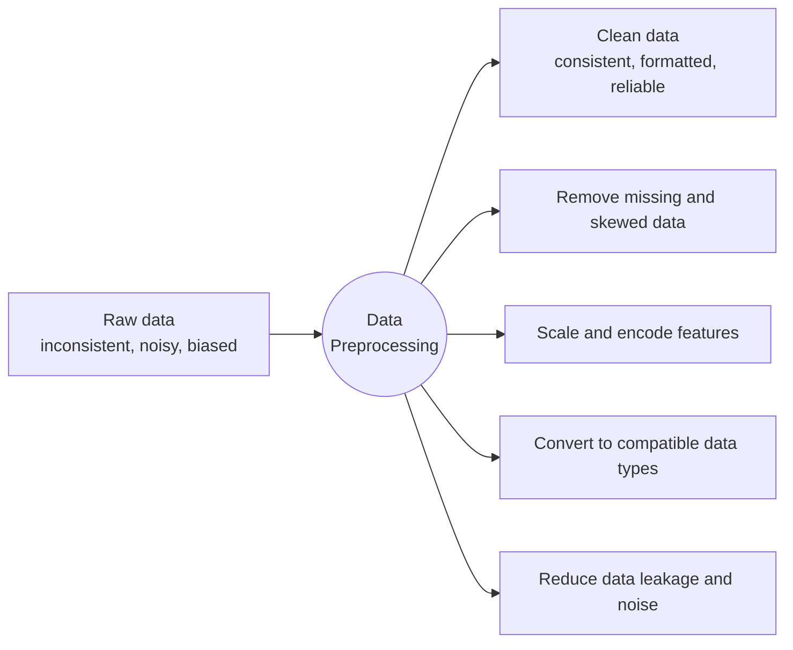
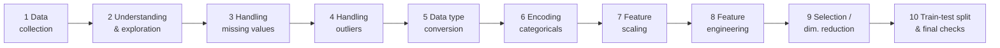
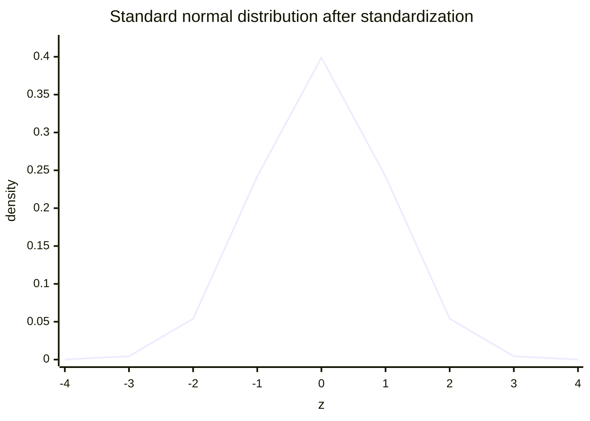
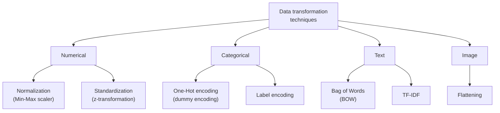

# Data Preprocessing

### Definition

Data Preprocessing is the process of cleaning, transforming, and preparing raw data before feeding it into a machine learning model. It improves data quality and helps models learn more effectively.

Preprocessing is the bridge between collection and training, and it has three moves: **cleaning** (fix typos, drop duplicates, deal with impossible values), **transforming** (normalise, encode) and **preparing** (split into train and test).

### Need for Data Preprocessing

- Removes errors and inconsistencies
- Handles missing values
- Reduces noise and outliers
- Converts data into a suitable format
- Improves model accuracy and performance

Note the last item on the diagram: **data leakage**, where information from the test set — or from the future — sneaks into training and produces a model that looks brilliant in the lab and fails in production. Scaling parameters such as the mean or the maximum must be computed on the training set alone and then applied to the test set.

### The Data Preprocessing Pipeline

### Data Cleaning Steps

| Step | What it does | Why it matters |
| --- | --- | --- |
| Handling missing values | Fill in or remove missing data | Many algorithms simply refuse to run on nulls |
| Removing duplicates | Ensure unique records | Duplicates give some patterns extra weight → model bias |
| Handling outliers | Prevent extreme values from skewing results | Outliers drag the mean and the regression line |
| Fixing data types | Convert incorrect types | You cannot do arithmetic on a string, or time-series analysis on a text date |

### Feature Scaling: Standardization

Standardization (also called Z-score normalisation) transforms a feature to have mean $0$ and standard deviation $1$:

$$z = \frac{x - \mu}{\sigma}$$

- $z$ — the standardised value (the Z-score), i.e. how many standard deviations the point sits from the mean.
- $x$ — the original value.
- $\mu$ — the mean of that feature across the dataset. Subtracting it **centres** the data at zero.
- $\sigma$ — the standard deviation of that feature. Dividing by it **scales** the spread to one.

A normally distributed feature becomes the **standard normal distribution**, with the bulk of the data between $-3$ and $+3$. Standardisation is unbounded, which is exactly why it is more robust to outliers than Min-Max scaling: one extreme value cannot squash everything else into a sliver of the range. It is essential for PCA (which hunts directions of maximum variance), SVM and k-NN (which measure distances), and gradient descent (which converges faster when features share a scale). Note that standardisation changes location and scale but not shape — a skewed feature stays skewed, just centred at zero.

### Normalization

Min-Max normalisation squeezes a feature into $[0, 1]$:

$$X_{new} = \frac{X - X_{min}}{X_{max} - X_{min}}$$

- $X_{min}$ — the minimum observed value of the feature; subtracting it maps the minimum to $0$.
- $X_{max} - X_{min}$ — the range; dividing by it maps the maximum to $1$.

Why it is needed: if Age runs 0–100 and Annual Income runs 20 000–200 000, any distance-based algorithm (k-NN, K-Means, SVM) is effectively deciding on income alone. After normalisation both features get an equal vote. The weakness is the mirror image of the strength — because it depends on $X_{min}$ and $X_{max}$, a single huge outlier compresses every other point into a narrow band near zero.

### Normalisation versus standardisation

| Parameter | Normalisation | Standardisation |
| --- | --- | --- |
| Scaling | Uses the highest and lowest values | Uses mean and standard deviation |
| Applying | When features are on separate scales | When zero mean and unit standard deviation are wanted |
| Range | Bounded, 0 to 1 | Not bounded |
| Effect of outliers | Affected by outliers | Less affected by outliers |
| Data distribution | Use when the distribution is unknown | Use when the data is Gaussian / normally distributed |
| Also known as | Scaling normalisation, Min-Max scaling | Z-score |

### Data Transformation Techniques

- **Numerical** — normalisation squashes into a range; standardisation centres and scales.
- **Categorical** — label encoding assigns an integer per category; one-hot encoding creates a binary column per category so that no false ordering is implied.
- **Text** — Bag of Words counts occurrences; TF-IDF weights a word by how distinctive it is to one document relative to the whole corpus, which is how common words like "the" get discounted.
- **Image** — flattening turns a $28 \times 28$ pixel grid into a 784-element 1D vector so it can enter a dense layer.

### Steps in Data Preprocessing

#### 1. Data Collection

Gather data from various sources such as:

- Databases
- CSV/Excel files
- Sensors
- Websites
- APIs

Databases hold structured data (SQL or NoSQL); CSV and Excel are flat tabular exports; sensors stream real-time IoT readings; websites are scraped for semi-structured content; **APIs** (Application Programming Interfaces) let one program request data from another, such as weather or market feeds.

#### 2. Data Cleaning

Identify and correct errors in the dataset.

Handling Missing Values

Methods:

- Remove records with missing values
- Replace with Mean
- Replace with Median
- Replace with Mode

Which to choose:

- **Deletion** — only when the dataset is large and the missing entries are few; otherwise you lose information and can introduce bias.
- **Mean** — numerical data without significant outliers.
- **Median** — numerical data *with* outliers, because the median is robust.
- **Mode** — categorical data such as Colour or City.

Handling Duplicate Data

- Remove repeated records to avoid bias.

A repeated record tells the model that a pattern is more common than it really is, which inflates test metrics and hurts generalisation.

Handling Outliers

Outliers are unusually high or low values.

Example:

- Salary = [25,000, 30,000, 35,000, 500,000]
- Here, 500,000 is an outlier.

The first three values sit within ₹10,000 of each other; the fourth is more than fourteen times the next highest, which is what makes it an outlier rather than merely a large value.

Techniques:

- Z-Score
- IQR (Interquartile Range)
- Clipping

- **Z-Score** — flag a point when $|z| > 3$, i.e. more than three standard deviations from the mean.
- **IQR** — with $IQR = Q_3 - Q_1$, flag anything below $Q_1 - 1.5 \times IQR$ or above $Q_3 + 1.5 \times IQR$.
- **Clipping (Winsorising)** — do not delete; cap the value at a threshold such as the 1st and 99th percentile.

#### 3. Data Integration

Combine data from multiple sources into a single dataset.

Example:

- Student information database
- Examination database
- Merged into one dataset.

Two problems dominate integration. **Entity identification** — is `customer_id` in system A the same thing as `cust_no` in system B? And **value conflicts** — the same real-world attribute recorded in different units or formats (kg versus lb). Integration also tends to create redundancy, the same attribute arriving twice under two names, which must be resolved or the model will double-count it.

#### 4. Data Transformation

Convert data into a suitable format.

##### A. Normalization

Scales values between 0 and 1.

$$X_{new} = \frac{x-x_{min}}{x_{max}-x_{min}}$$

Example: Marks = 50, Min = 0, Max = 100

$$\frac{50 - 0}{100 - 0} = \frac{50}{100} = 0.5$$

Normalized value = 0.5

##### B. Standardization

Transforms data to have mean = 0 and standard deviation = 1.

$$z=\frac{x-\mu}{\sigma}$$

##### C. Encoding Categorical Data

| Gender | Label Encoding |
| --- | --- |
| Male | 0 |
| Female | 1 |

Label encoding exists because models do arithmetic, and arithmetic needs numbers rather than the words "Male" and "Female". Its limitation is that the model may read the integers as a *ranking* — that $1$ is somehow greater or better than $0$ — which is meaningless for nominal data such as gender or city. One-hot encoding avoids that by giving each category its own binary column, at the cost of extra columns and the dummy-variable trap (multicollinearity), which is why one column is often dropped.
