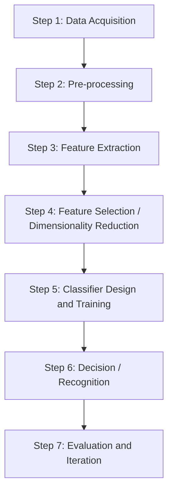

# Pattern Recognition

### What is Pattern Recognition?

Pattern recognition is the automated or cognitive process of identifying recurring structures, trends, or regularities within data. It enables humans and machines to categorize information, predict outcomes, and learn from their environment.

Pattern recognition is the automated discovery and classification of patterns in data using algorithms. Given an input (like an image, sound, or text), the system learns to identify which class or category it belongs to.

Examples:

- Identifying handwritten digits (0–9) from images → Digit recognition
- Recognizing faces in photos → Face recognition
- Classifying emails as spam or not → Spam detection

Pattern Recognition is the process of using machine learning algorithms to recognize patterns. It means sorting data into categories by analyzing the patterns present in the data. One of the main benefits of pattern recognition is that it can be used in many different areas. In a typical pattern recognition application, the raw data is processed and converted into a form that a machine can use.

Pattern recognition involves classifying and clustering patterns.

- Classification: Classification is when we teach a system to put things into categories. We do this by showing the system examples with known labels (like "apple" or "orange") so it can learn and label new things. This is part of supervised learning, where we give the system the answers to learn from.
- Clustering: Clustering is when the system groups similar things together without any labels. It looks at the data and tries to find natural groups. This is part of unsupervised learning, where the system learns by itself without knowing the answers beforehand.

### Core concepts of pattern recognition

- Pattern: Any measurable object, signal or data instance that contains identifiable characteristics.
- Feature: A measurable property used to describe a pattern and distinguish between classes.
- Classifier: A model or function that assigns class labels based on features.
- Decision Boundary: The separating surface in feature space that divides different classes.
- Feature Space: A multidimensional space where each pattern is represented as a vector of features.
- Training Data: Labelled examples used to teach the model how to recognize patterns.

### Working of a Pattern Recognition System

#### Step 1: Data Acquisition

Use a sensor to collect raw data. Examples:

- Camera captures object images.
- Microphone records speech.
- Wearable sensor records heart-rate signals.

#### Step 2: Pre-processing

1. Clean and standardize raw data to make it suitable for analysis:
   - Noise removal (smoothing, filtering).
   - Normalization/standardization (e.g., scaling pixel values to [0, 1]).
   - Segmentation (extracting the object of interest from the background).
2. Goal: reduce variability that is not relevant to the pattern itself.

#### Step 3: Feature Extraction

1. Transform pre-processed data into feature vectors:
   - Image: edges, color histograms, shapes, deep learned embeddings.
   - Audio: MFCCs, spectral features, energy.
   - Text: n-grams, TF–IDF, embeddings.
2. These features should capture the essential properties that help distinguish classes.

#### Step 4: Feature Selection / Dimensionality Reduction

1. Remove redundant or irrelevant features using:
   - Correlation analysis, mutual information, filter/wrapper methods.
   - PCA or other dimensionality reduction techniques.
2. Benefits: less overfitting, faster training/inference, simpler models.

#### Step 5: Classifier Design and Training

1. Choose a model family: k-NN, logistic regression, SVM, decision trees, random forests, neural networks, etc.
2. Train the model using the training set:
   - Learn parameters (weights, thresholds) or store instances (instance-based methods like k-NN).
   - Tune hyperparameters (regularization strength, number of neighbors, network depth) using validation data.

#### Step 6: Decision / Recognition

For a new input pattern:

- Apply the same preprocessing and feature extraction steps.
- Feed the resulting feature vector into the trained classifier.
- Obtain predicted class label (and optionally class probabilities or scores).

#### Step 7: Evaluation and Iteration

- Evaluate performance on a separate test set: Use metrics such as accuracy, precision, recall, F1-score, confusion matrix, ROC–AUC.
- Identify failure cases: Misclassified patterns, borderline cases, classes with poor recall.
- Iterate: Improve features, adjust preprocessing, change model or gather more/better data.
