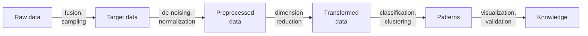
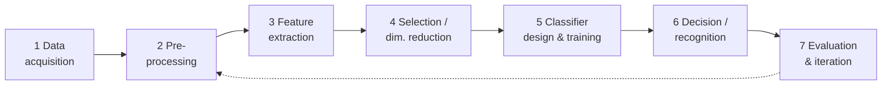
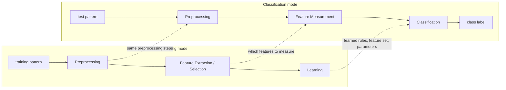
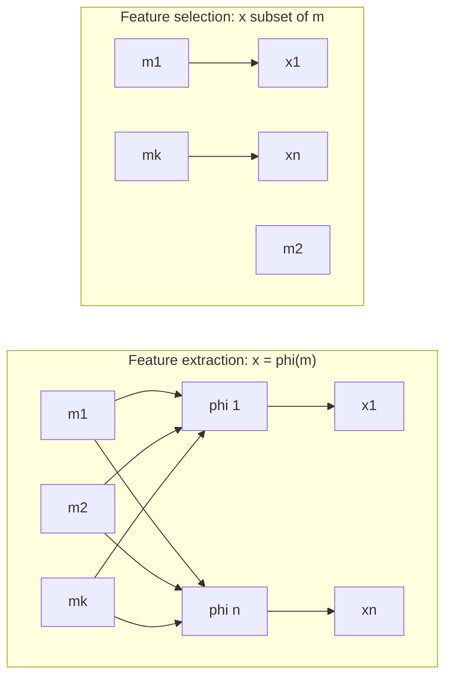
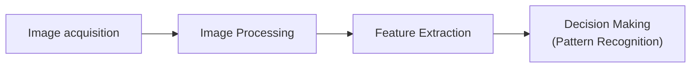
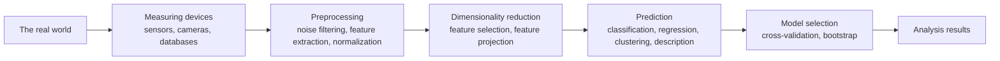
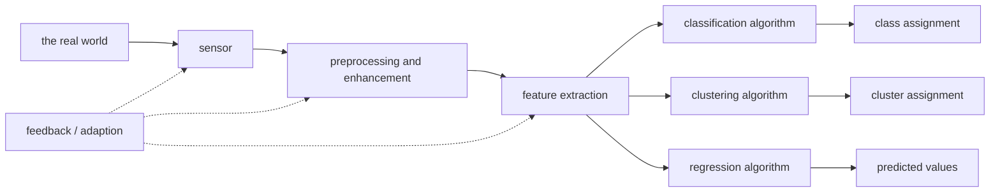
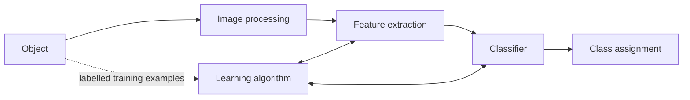
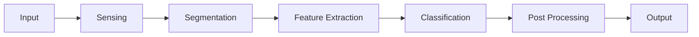

# Pattern Recognition

### What is Pattern Recognition?

Pattern recognition is the automated or cognitive process of identifying recurring structures, trends, or regularities within data. It enables humans and machines to categorize information, predict outcomes, and learn from their environment.

Pattern recognition is the automated discovery and classification of patterns in data using algorithms. Given an input (like an image, sound, or text), the system learns to identify which class or category it belongs to.

Examples:

- Identifying handwritten digits (0–9) from images → Digit recognition
- Recognizing faces in photos → Face recognition
- Classifying emails as spam or not → Spam detection

The definition is deliberately dual — **cognitive** (what a brain does) and **automated** (what software does), because the machine is imitating a natural human ability. What is being looked for is threefold: **recurring structures** (the arrangement of pixels that forms a face), **trends** (a rising stock price) and **regularities** (the grammar of a language). What it buys is also threefold: **categorisation**, **prediction** and **learning**.

Pattern Recognition is the process of using machine learning algorithms to recognize patterns. It means sorting data into categories by analyzing the patterns present in the data. One of the main benefits of pattern recognition is that it can be used in many different areas. In a typical pattern recognition application, the raw data is processed and converted into a form that a machine can use.

### From raw data to knowledge

Data is useless raw. It is fused and sampled into target data, de-noised and normalised into preprocessed data, compressed by dimension reduction into transformed data, turned into patterns by classification or clustering, and finally validated and visualised into **knowledge** — the actionable insight that was the point of the exercise.

### Classification and clustering

Pattern recognition involves classifying and clustering patterns.

- Classification: Classification is when we teach a system to put things into categories. We do this by showing the system examples with known labels (like "apple" or "orange") so it can learn and label new things. This is part of supervised learning, where we give the system the answers to learn from.
- Clustering: Clustering is when the system groups similar things together without any labels. It looks at the data and tries to find natural groups. This is part of unsupervised learning, where the system learns by itself without knowing the answers beforehand.

**Classification worked example.** Feature tables are recorded for two known classes — apples measured at $(150, 0.80, 7.0)$ and $(170, 0.78, 7.5)$, oranges at $(130, 0.40, 6.3)$ and $(145, 0.38, 6.7)$, where the three rows might be weight, a colour index and a diameter. Those labelled vectors run through preprocessing → feature extraction → classification → recognition, and a new fruit comes out labelled "Apple". Notice that the apple values are consistently higher on these features; that consistency is precisely what the classifier learns.

**Clustering worked example.** A jumbled pile of oranges, strawberries and blackberries goes in with no labels. The algorithm compares colour, size and texture, and three groups come out — one box of each fruit. It never learns the *names*, only that these things belong together and those do not.

### Core concepts of pattern recognition

- Pattern: Any measurable object, signal or data instance that contains identifiable characteristics.
- Feature: A measurable property used to describe a pattern and distinguish between classes.
- Classifier: A model or function that assigns class labels based on features.
- Decision Boundary: The separating surface in feature space that divides different classes.
- Feature Space: A multidimensional space where each pattern is represented as a vector of features.
- Training Data: Labelled examples used to teach the model how to recognize patterns.

Read them as a chain. The **pattern** is the whole object; a **feature** is one measurable attribute of it; plot the features and you get the **feature space**, in which every pattern is a point (a vector); the **classifier** is the function that decides which region a point falls in; the **decision boundary** is the line, surface or hyperplane between regions; and **training data** is the labelled study material from which the boundary is learned.

### Working of a Pattern Recognition System

#### Step 1: Data Acquisition

Use a sensor to collect raw data. Examples:

- Camera captures object images.
- Microphone records speech.
- Wearable sensor records heart-rate signals.

The sensor is the interface between a physical phenomenon and digital data: light becomes a pixel array, sound waves become a digital audio signal, an electrical or optical body signal becomes a time series.

#### Step 2: Pre-processing

1. Clean and standardize raw data to make it suitable for analysis:
   - Noise removal (smoothing, filtering).
   - Normalization/standardization (e.g., scaling pixel values to [0, 1]).
   - Segmentation (extracting the object of interest from the background).
2. Goal: reduce variability that is not relevant to the pattern itself.

That last line is the whole purpose. Static in audio, graininess in a photograph and the room behind a face are all variability that has nothing to do with the identity being recognised; **segmentation** in particular isolates the object from its background.

#### Step 3: Feature Extraction

1. Transform pre-processed data into feature vectors:
   - Image: edges, color histograms, shapes, deep learned embeddings.
   - Audio: MFCCs, spectral features, energy.
   - Text: n-grams, TF–IDF, embeddings.
2. These features should capture the essential properties that help distinguish classes.

#### Step 4: Feature Selection / Dimensionality Reduction

1. Remove redundant or irrelevant features using:
   - Correlation analysis, mutual information, filter/wrapper methods.
   - PCA or other dimensionality reduction techniques.
2. Benefits: less overfitting, faster training/inference, simpler models.

Step 3 *creates* features from raw data; step 4 *refines* the list down to the useful ones. Selection picks a subset; dimensionality reduction such as PCA mathematically compresses many features into fewer new ones that retain most of the information.

#### Step 5: Classifier Design and Training

1. Choose a model family: k-NN, logistic regression, SVM, decision trees, random forests, neural networks, etc.
2. Train the model using the training set:
   - Learn parameters (weights, thresholds) or store instances (instance-based methods like k-NN).
   - Tune hyperparameters (regularization strength, number of neighbors, network depth) using validation data.

Parametric models (logistic regression, neural networks) learn weights. Instance-based models (k-NN) store the training examples and compare at prediction time. Hyperparameters — the $k$ in k-NN, a tree's depth — are never learned from the data; they are tuned on a **validation set**.

#### Step 6: Decision / Recognition

For a new input pattern:

- Apply the same preprocessing and feature extraction steps.
- Feed the resulting feature vector into the trained classifier.
- Obtain predicted class label (and optionally class probabilities or scores).

"The same" is not optional. A model trained on height in metres cannot be fed height in inches; if test-time processing differs from training-time processing, the features no longer mean what the model learned.

#### Step 7: Evaluation and Iteration

- Evaluate performance on a separate test set: Use metrics such as accuracy, precision, recall, F1-score, confusion matrix, ROC–AUC.
- Identify failure cases: Misclassified patterns, borderline cases, classes with poor recall.
- Iterate: Improve features, adjust preprocessing, change model or gather more/better data.

A single score is not analysis. Looking at *which* patterns failed — the borderline cases, the class with poor recall, the confusions visible in the matrix — is what tells you whether to fix the features, the preprocessing, the model or the data.

### Two processes: training mode and classification mode

Training mode consumes labelled patterns and produces a model, with a feedback loop back to preprocessing and feature extraction when learning goes badly. Classification mode consumes an unlabelled test pattern and produces a label. The vertical arrows carry everything learned in training — the preprocessing recipe, the chosen features, the classifier parameters — into the operational path, which is why the two pipelines must stay in step.

### Generic concepts for pattern recognition

- **Feature vector** $\mathbf{x} \in X$ — a vector of observations (measurements); $\mathbf{x}$ is a point in the feature space $X$.
- **Hidden state** $y \in Y$ — cannot be measured directly; patterns with equal hidden state belong to the same class.
- **Task** — design a classifier (decision rule) $q: X \to Y$ that decides the hidden state from an observation.

Every pattern carries a hidden state — its identity, its category — which we cannot observe. So we take measurements $x_1, x_2, \dots, x_n$, bundle them into a feature vector $\mathbf{x}$ (a numerical fingerprint of the pattern), and build a function that maps that fingerprint back to the hidden state.

### Pattern Representation by Feature Vector for Character Recognition

$$X = [x_1, x_2, \dots, x_n], \quad \text{each } x_j \in \mathbb{R}$$

- $x_j$ may be an object measurement.
- $x_j$ may be a count of object parts.
- Example: object represented as [#holes, area, moments, …].

A digitised character is a grid of 0s and 1s — 0 for background, 1 for ink. Two routes lead from that grid to a feature vector. **Flatten it**, so every pixel becomes one component $x_j$; this is simple but very high-dimensional and sensitive to noise. Or **extract structure** — the number of closed loops (B has 2, O has 1, C has 0), the area, statistical moments that describe the pixel distribution regardless of position or rotation. The second route gives fewer, more robust dimensions at the cost of more preprocessing.

Good features are **discriminative**: very similar for objects of the same class (all the A's), very different across classes (an A versus a B).

### Example: a linear classifier

Task: identity recognition. Measure **height** and **weight**, so the hidden-state set is $Y = \{H, J\}$ and the feature space is $X = \mathbb{R}^2$.

$$q(\mathbf{x}) = \begin{cases} H & \text{if } (\mathbf{w} \cdot \mathbf{x}) + b \ge 0 \\ J & \text{if } (\mathbf{w} \cdot \mathbf{x}) + b < 0 \end{cases}$$

Training examples: $\{(\mathbf{x}_1, y_1), \dots, (\mathbf{x}_l, y_l)\}$.

- $\mathbf{w}$ — the weight vector, which fixes the orientation of the boundary.
- $b$ — the bias, which shifts the boundary away from the origin.
- $(\mathbf{w} \cdot \mathbf{x}) + b = 0$ — the decision boundary itself, the line at which the classifier is indifferent.

Plot $x_1$ (height) against $x_2$ (weight) and the two people form two clusters; the line separates them. Data that *can* be split by such a line is called **linearly separable**. Training means learning the $\mathbf{w}$ and $b$ that separate the training set best; prediction means substituting a new $(\text{height}, \text{weight})$ and reading the sign.

### Feature extraction: good and bad features

Task: to extract features which are good for classification. Good features mean that

- objects from the same class have similar feature values, and
- objects from different classes have different values.

Plotted, "good" features give two tight clusters with a clean gap that a straight line can exploit. "Bad" features give one intermingled cloud in which no boundary — simple or complex — can separate the classes, because the features simply do not carry the distinguishing information. The two properties have names: **intra-class similarity** (tight clusters) and **inter-class separability** (distance between clusters). No algorithm recovers from bad features.

### Feature extraction methods

The problem is an optimisation over the parameters of the feature extractor:

- **Supervised methods** — the objective function is a criterion of separability (discriminability) of labelled examples, e.g. linear discriminant analysis (LDA).
- **Unsupervised methods** — a lower-dimensional representation that preserves important characteristics of the input data is sought, e.g. principal component analysis (PCA).

In extraction every new feature $x_j$ is a function $\varphi_j$ of all the original measurements $m_1 \dots m_k$ — a change of coordinate system, like turning height and weight into BMI. In selection the outputs are simply a subset of the inputs, drawn straight through with no transformation. Both move from a $k$-dimensional space to an $n$-dimensional one with $n < k$.

### Pattern Recognition for Embedded Vision

Three families of technique apply:

- Template matching
- Statistical / structural pattern recognition
- Neural networks

Real embedded-vision data is rarely linearly separable: plot two extracted features and the two classes overlap in the middle, so the decision boundary that separates them is a **wavy, non-linear** curve rather than a straight line. In an SVM picture, the circled points near the boundary are the **support vectors** — the few examples that actually determine where the boundary sits.

- **Template matching** compares a stored template against the image pixel-by-pixel (cross-correlation). Direct, but expensive over large searches.
- **Statistical** treats features as random variables and models each class with a distribution — Bayesian classifiers, SVMs.
- **Structural** looks at the relationships between parts ("a face has two eyes above a nose") using graphs or formal grammars.
- **Neural networks** learn the pattern hierarchy themselves; in modern embedded vision this means CNNs.

### Embedded Vision System

An embedded vision system runs computer vision inside a device that is not a general-purpose computer — a drone, a smart camera, medical equipment, an industrial robot — under tight limits on power, memory and speed. Acquisition is hardware (a CMOS or CCD sensor turning light into pixels). Image processing is *low-level* vision: noise reduction, sharpening, RGB-to-greyscale. Feature extraction is *mid-level*: edges, corners, blobs, textures. Decision making is *high-level*: classify and act — stop the car, unlock the phone, reject the part. Features rather than raw pixels are used precisely because the device cannot afford the pixels.

### Pattern Recognition models

1. **Template matching**
2. **Statistical Pattern Recognition** — based on an underlying statistical model of patterns and pattern classes.
3. **Structural (or syntactic) Pattern Recognition** — pattern classes represented by means of formal structures such as grammars, automata, strings, etc.
4. **Neural networks** — the classifier is represented as a network of cells modelling neurons of the human brain (the connectionist approach).

Statistical PR places patterns as points in a feature space and separates them with probability-based boundaries. Structural PR decomposes a complex pattern into **primitives** and describes how they legally combine, exactly as grammar governs a language. The neural approach stores its knowledge implicitly in connection weights learned during training rather than in explicit rules.

The same three-way split is often drawn as **Statistical / Syntactic / Neural** pattern recognition models. Statistical suits quantitative data; syntactic suits structured, qualitative data such as character recognition or scene analysis; neural suits large, high-dimensional, unstructured data.

### Pattern Recognition System

Preprocessing here includes vector normalisation, $u = v / \|v\|$, which rescales a vector to unit length so that no single feature dominates by magnitude alone. After dimensionality reduction the classes become visible as separated clusters in a low-dimensional plot of $f_1$ against $f_2$. **Model selection** closes the loop with cross-validation and bootstrap resampling, which estimate how well the system will generalise rather than how well it memorised.

A second common drawing of the same system splits the output by task:

The same features feed three different destinations: **classification** for a discrete label, **clustering** for a group, **regression** for a continuous value. The feedback path lets performance at the output retune the sensor, the preprocessing or the feature set.

A third variant emphasises the learning algorithm:

- Image acquisition and image processing.
- Feature extraction aims to create discriminative features good for classification.
- Classifier.
- The learning algorithm sets the PR system from training examples — supervised learning.

The bidirectional arrows matter: during training the learning algorithm tunes *both* the feature extractor and the classifier.

### Sensing to post-processing

Segmentation finds *where* the object is; classification decides *what* it is; post-processing filters, thresholds and formats the result for the application.

### Applications of PR

- Image recognition — objects, places, people, handwriting, actions.
- Text pattern recognition and NLP — sentiment analysis, spam detection, translation.
- Audio and voice recognition — spoken words, speaker identification, music recognition.
- Medicine — medical imaging, genomic sequencing, diagnostic assistance.
- Cybersecurity — network intrusion, malware signatures, fraudulent transactions.

Pattern recognition is what lets a computer "see" and "hear": without it an image is only a grid of numbers.
