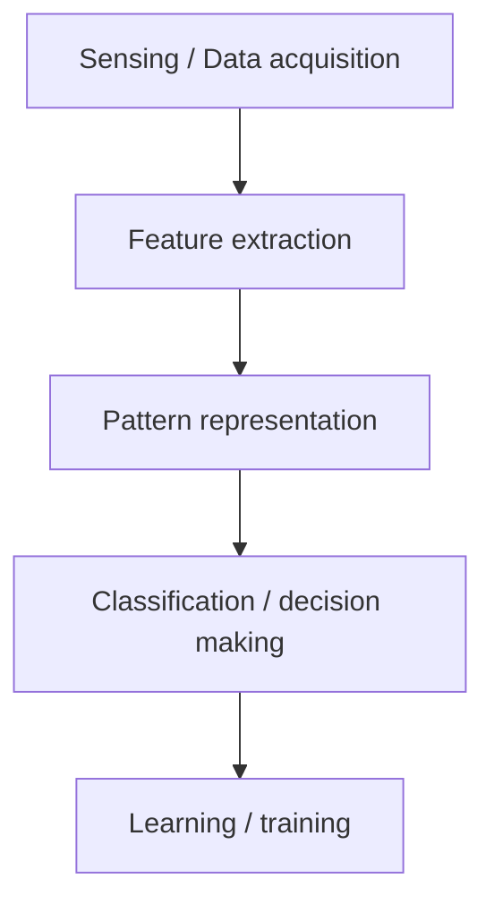

# Pattern Representation

Pattern representation in machine learning is the mathematical and structural method used to transform raw, unstructured data (such as images, text, audio, or physical measurements) into a standardized format that computer algorithms can process and analyze.

Because machine learning models cannot interpret raw real-world objects directly, representation acts as the crucial translation layer that distills complex inputs into distinct, quantifiable properties.

A pattern is represented by a set of $d$ features, or attributes, viewed as a $d$-dimensional feature vector:

$$\mathbf{x} = (x_1, x_2, \dots, x_d)^T$$

The superscript $T$ is the **transpose**: the vector is written horizontally to save space but is mathematically a **column vector**, which is the standard convention in linear algebra and machine learning. The dimensionality $d$ is the number of attributes measured, and it is the dimensionality of the feature space in which the pattern is a single point. That abstraction is what lets algorithms compute distances between patterns, find clusters and draw boundaries.

### Core Paradigms of Pattern Representation

Depending on the nature of the data and the learning task, patterns are represented using one of three primary frameworks:

#### 1. Statistical (Vector) Representation

This is the most popular approach in machine learning. A pattern is represented as a single point or a feature vector in a multi-dimensional mathematical space.

- Feature Vector: An ordered set of $d$ measurable attributes, written as $X = [x_1, x_2, ..., x_d]^T$.
- Feature Space: The multi-dimensional space formed by these vectors.
- Example: Representing a house pattern by its size ($x_{1}$), number of bedrooms ($x_{2}$), and age ($x_{3}$).

The **order** is part of the representation: if the first slot is size, it must be size in every vector. Two features give a plane, three a volume, $d$ a $d$-dimensional hyperspace in which the learning algorithm looks for clusters and boundaries.

#### 2. Structural (Syntactic) Representation

When the relationships between parts of an object are more important than individual numeric values, structural representation is used.

- Graphs & Trees: Patterns are modeled as nodes (sub-patterns) connected by edges (relationships).
- Strings & Grammars: Complex patterns are broken down into a sequence of simpler primitives, much like words in a sentence.
- Example: Describing a chemical molecule by how its atoms are bonded together.

The focus shifts from values to **topology**. A chair is four legs, a seat and a back in a particular arrangement, whatever the exact dimensions; a molecule's properties come from which atom bonds to which, not from the atom count. **Nodes** are the primitives, **edges** are the relationships, and a **grammar** states which combinations are legal.

#### 3. Neural-Based (Hierarchical) Representation

Deep learning models automate representation through artificial neural networks.

- Tensors: High-dimensional arrays (e.g., matrices for 2D images, 3D tensors for video).
- Latent Spaces: Raw data passes through layers, and the network extracts condensed, hierarchical representations automatically.
- Example: A face image is represented as raw pixels, which the network converts into edge representations, then facial feature representations.

This is the shift from human-engineered features to learned ones. Low layers detect edges and colour gradients, middle layers assemble them into parts (an eye, a nose), high layers assemble parts into objects (a face). The intermediate encodings live in a **latent space** — a compressed representation that keeps what matters and discards noise.

### Pattern representation

Pattern representation is: How we represent the data for the machine learning algorithm. The form of representation influences the accuracy of classification.

Which is the practical point of the whole section: choosing the right features and the right way to encode them often matters more than choosing the algorithm.

### Concept of Pattern Recognition

Pattern recognition involves following stages:

- Sensing / Data acquisition (e.g., capturing an image or recording audio)
- Feature extraction (extract meaningful properties like edges in an image, frequency in audio)
- Pattern representation (representing data in a form suitable for classification, like vectors)
- Classification / decision making (assigning the input to a class using a model, like k-NN, SVM, neural network)
- Learning / training (training the model on labeled examples so it can generalize to new inputs)

Example:

Suppose we want to classify flowers:

| Feature | Meaning |
| --- | --- |
| petal length | numerical value |
| petal width | numerical value |
| sepal length | numerical value |
| sepal width | numerical value |

These four continuous measurements are the standard feature set of the **Iris** dataset, the classic introductory classification problem.

A flower can be represented as a vector of features:

$$X = [\text{petal length}, \text{petal width}, \text{sepal length}, \text{sepal width}]$$

If we want to recognize handwritten digits:

$$X = [\text{pixel 1 intensity}, \text{pixel 2 intensity}, ..., \text{pixel n intensity}]$$

In speech recognition:

$$X = [\text{frequency at time t1}, \text{frequency at time t2}, ...]$$

Note the dimensionalities: 4 for the flower, $784$ for a $28 \times 28$ greyscale digit, one component per time step for the speech signal. Because all three end up as vectors of numbers, the *same* algorithms — linear regression, SVM, neural networks — apply to all three problems.

### Pattern representation forms

- Vector → Most common (e.g., $[x_1, x_2, ..., x_d]$)
- Graph → For relational patterns (e.g., social networks)
- Strings → For text or DNA sequences
- Trees → For hierarchical data

Vectors align with linear algebra and standard statistical models, which is why they dominate. Graphs win when the connections matter as much as the entities. Strings win when order is critical — language, DNA, protein sequences. Trees win on nested parent-child data — file systems, org charts, parse trees.
