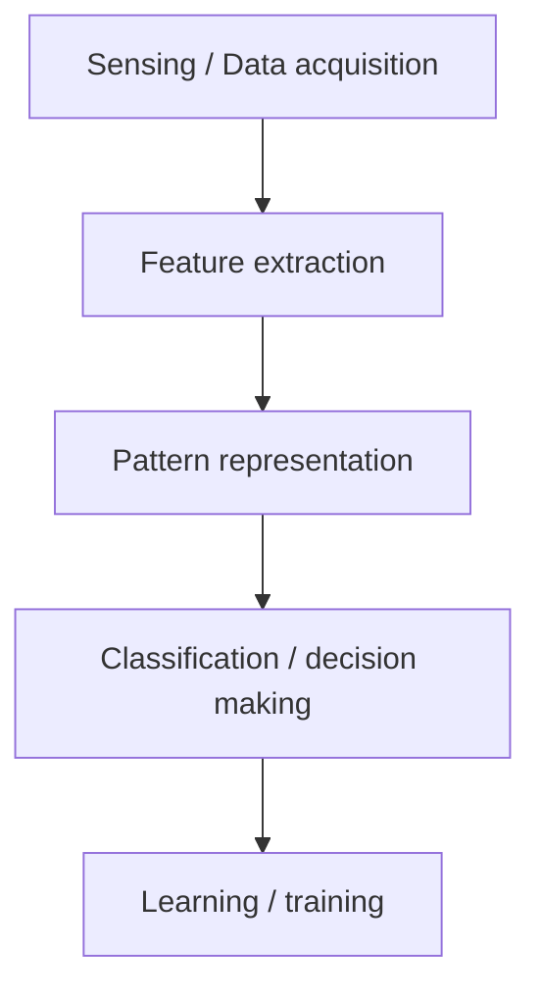

# Pattern Representation

Pattern representation in machine learning is the mathematical and structural method used to transform raw, unstructured data (such as images, text, audio, or physical measurements) into a standardized format that computer algorithms can process and analyze.

Because machine learning models cannot interpret raw real-world objects directly, representation acts as the crucial translation layer that distills complex inputs into distinct, quantifiable properties

### Core Paradigms of Pattern Representation

Depending on the nature of the data and the learning task, patterns are represented using one of three primary frameworks:

#### 1. Statistical (Vector) Representation

This is the most popular approach in machine learning. A pattern is represented as a single point or a feature vector in a multi-dimensional mathematical space.

- Feature Vector: An ordered set of $d$ measurable attributes, written as $X = [x_1, x_2, ..., x_d]^T$.
- Feature Space: The multi-dimensional space formed by these vectors.
- Example: Representing a house pattern by its size ($x_{1}$), number of bedrooms ($x_{2}$), and age ($x_{3}$)

#### 2. Structural (Syntactic) Representation

When the relationships between parts of an object are more important than individual numeric values, structural representation is used.

- Graphs & Trees: Patterns are modeled as nodes (sub-patterns) connected by edges (relationships).
- Strings & Grammars: Complex patterns are broken down into a sequence of simpler primitives, much like words in a sentence.
- Example: Describing a chemical molecule by how its atoms are bonded together.

#### 3. Neural-Based (Hierarchical) Representation

Deep learning models automate representation through artificial neural networks.

- Tensors: High-dimensional arrays (e.g., matrices for 2D images, 3D tensors for video).
- Latent Spaces: Raw data passes through layers, and the network extracts condensed, hierarchical representations automatically.
- Example: A face image is represented as raw pixels, which the network converts into edge representations, then facial feature representations

### Pattern representation

Pattern representation is: How we represent the data for the machine learning algorithm. The form of representation influences the accuracy of classification.

### Concept of Pattern Recognition

Pattern recognition involves following stages:

- Sensing / Data acquisition (e.g., capturing an image or recording audio)
- Feature extraction (extract meaningful properties like edges in an image, frequency in audio)
- Pattern representation (representing data in a form suitable for classification, like vectors)
- Classification / decision making (assigning the input to a class using a model, like k-NN, SVM, neural network)
- Learning / training (training the model on labeled examples so it can generalize to new inputs)

Example:

Suppose we want to classify flowers:

| Feature | Meaning |
| --- | --- |
| petal length | numerical value |
| petal width | numerical value |
| sepal length | numerical value |
| sepal width | numerical value |

A flower can be represented as a vector of features:

$$X = [\text{petal length}, \text{petal width}, \text{sepal length}, \text{sepal width}]$$

If we want to recognize handwritten digits:

$$X = [\text{pixel 1 intensity}, \text{pixel 2 intensity}, ..., \text{pixel n intensity}]$$

In speech recognition:

$$X = [\text{frequency at time t1}, \text{frequency at time t2}, ...]$$

### Pattern representation forms

- Vector → Most common (e.g., $[x_1, x_2, ..., x_n]$)
- Graph → For relational patterns (e.g., social networks)
- Strings → For text or DNA sequences
- Trees → For hierarchical data
