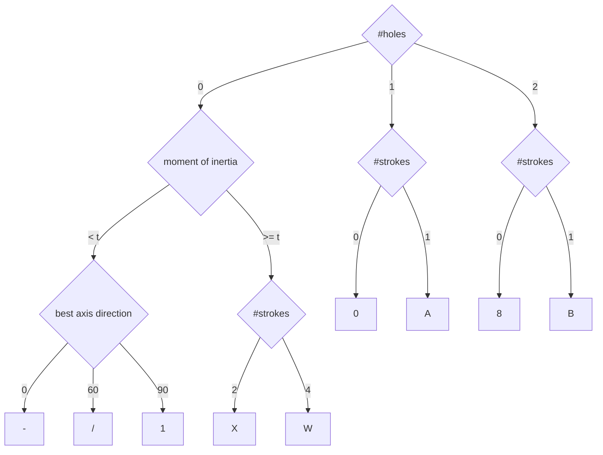
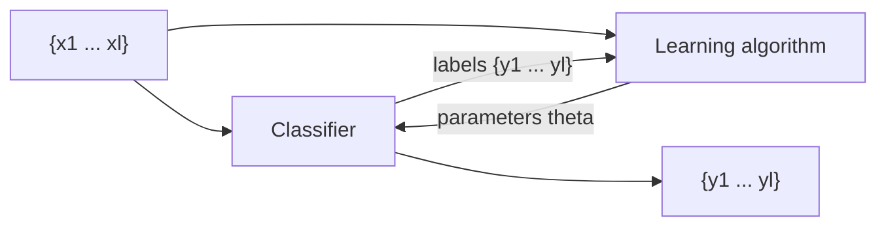

# Classifiers and Decision Regions

### Classifier as a partition of feature space

A classifier partitions feature space $X$ into **class-labeled regions** such that

$$X = X_1 \cup X_2 \cup \dots \cup X_{|Y|}, \qquad X_i \cap X_j = \emptyset \ \ (i \neq j)$$

Classification consists of determining to which region a feature vector $\mathbf{x}$ belongs. The borders between decision **regions** are called decision **boundaries**.

The two set conditions carry real meaning:

- **Exhaustive** — the union of the regions is the whole space, so every possible input gets a class. There are no undefined zones.
- **Mutually exclusive** — the regions are disjoint, so no point belongs to two classes at once.

A simple classifier carves the space into a few contiguous regions with near-straight edges. A more powerful one (a decision tree, k-NN) produces wavy boundaries and can even assign **non-contiguous** regions to the same class — two separate territories both labelled $X_1$ — which is perfectly legal and often necessary.

### Decision-Tree Classifier

Character recognition worked as a tree over geometric features:

- Uses subsets of features in sequence.
- Feature extraction may be interleaved with classification decisions.
- Can be easy to design and efficient in execution.

Three properties are worth naming. **Sequential feature use** — each node tests one feature rather than all of them at once. **Interleaved, lazy extraction** — "best axis direction" is computed only for characters that have zero holes and a low moment of inertia; a character with one hole never pays that cost. **Interpretability** — the whole model reads as IF-THEN rules, unlike a neural network.

Splits can be categorical (0, 1 or 2 holes) or numerical against a threshold (moment of inertia $< t$ versus $\ge t$). Features nearer the root are the more discriminative ones. Trees can be hand-designed for simple problems or learned by ID3, C4.5 or CART.

### Classification using nearest class mean

- Compute the Euclidean distance between feature vector $X$ and the mean of each class.
- Choose the closest class, if close enough (reject otherwise).

$$d(X, \mu) = \sqrt{(x_1 - \mu_1)^2 + (x_2 - \mu_2)^2}$$

Training is trivial: average the feature vectors of each class to get its centroid. Prediction: measure the distance from the new point to every centroid and take the nearest. The **reject** clause matters — if even the nearest mean is further away than some threshold, the classifier declines to answer and labels the point unknown, which is safer than a confident wrong guess.

NCM is extremely cheap because only one mean vector per class is stored, unlike k-NN which keeps the entire training set. Its assumption is the price: classes are taken to be roughly spherical with similar spread, so elongated or very unequal clusters break it. Mahalanobis distance can replace Euclidean to soften that.

### Unsupervised learning as an iterative loop

- **Input** — training examples $\{x_1, \dots, x_l\}$ without information about the hidden state.
- **Clustering** — the goal is to find clusters of data sharing similar properties.
- Classifier $q: X \times \Theta \to Y$
- Learning algorithm (supervised) $L: (X \times Y)^l \to \Theta$

Read the loop carefully, because the diagram deliberately contains a *supervised* learner inside an *unsupervised* framework. We have no labels, so we guess: the classifier assigns provisional labels from the current parameters $\theta$, the learning algorithm treats those provisional labels as if they were ground truth and updates $\theta$, and the improved $\theta$ produces better labels next round. The cycle repeats until the assignment stops changing.

### Example of an unsupervised learning algorithm: k-Means

$$y = q(x) = \arg \min_{i=1, \dots, k} \| x - m_i \|$$

$$m_i = \frac{1}{|I_i|} \sum_{j \in I_i} x_j, \qquad I_i = \{ j : q(x_j) = i \}$$

with parameters $\theta = \{m_1, \dots, m_k\}$, and the goal of minimising

$$\sum_{i=1}^{l} \| x_i - m_{q(x_i)} \|^2$$

That objective is the **Within-Cluster Sum of Squares** (WCSS): the total squared Euclidean distance from every point to the centroid of the cluster it was assigned to. The algorithm alternates two steps, which map exactly onto the loop above:

1. **Assignment (the classifier)** — give each point the label of its nearest centroid, via $\arg\min$.
2. **Update (the learning algorithm)** — move each centroid to the arithmetic mean of the points currently assigned to it.

Convergence to a *local* minimum of WCSS is guaranteed; the global minimum is not. The resulting boundaries are **Voronoi** boundaries — the perpendicular bisectors between centroids — so every point in a region is genuinely closer to that region's centroid than to any other.
