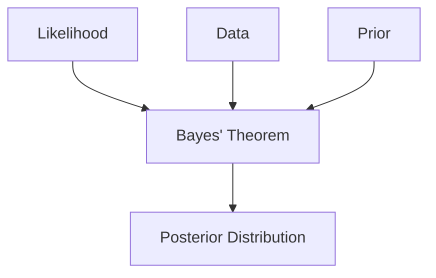
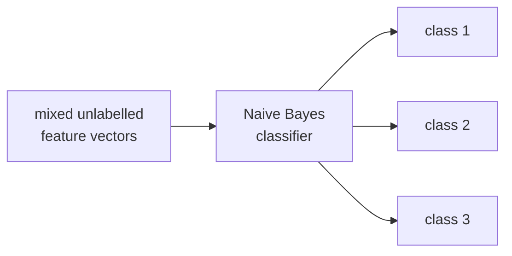

# Basics of Probability and Bayes' Theorem

Probability provides a foundation for reasoning about uncertainty in machine learning.

Key ideas:

- Probability of event A ($P(A)$) → Likelihood that event A happens ($0 \le P(A) \le 1$)
- Joint probability ($P(A, B)$) → Probability A and B both happen
- Conditional probability ($P(A|B)$) → Probability A happens given B happens
- Bayes' rule:

$$P(A\mid B)=\frac{P(B\mid A)\,P(A)}{P(B)}$$

In pattern recognition, probability tells us how likely it is that an input belongs to a certain class.

Machine learning models almost never deal in certainties, so probability is how a model expresses how sure it is. In classification the quantity we want is $P(\text{class} \mid \text{features})$, and Bayes' rule is what lets us compute it from the more accessible $P(\text{features} \mid \text{class})$.

### Conditional Probability

Conditional probability is the probability of an event occurring based on the occurrence of another event. Conditional probability questions often involve picking two objects from a set, because once the first object has been picked the probabilities change for the second pick.

**Marble example.** A bag holds 3 red and 4 blue marbles:

$$P(\text{red}) = \frac{3}{7}, \qquad P(\text{blue}) = \frac{4}{7}$$

Pick one red marble out and do not replace it. Two red and four blue remain:

$$P(\text{red}) = \frac{2}{6}, \qquad P(\text{blue}) = \frac{4}{6}$$

The probabilities are calculated based on what has already occurred. These are **dependent events**, and the mechanism is sampling **without replacement**: the denominator (the sample space) drops by one on every draw, and the numerator drops too if the item removed belonged to the event being measured. Note that $P(\text{blue})$ changed from $4/7$ to $4/6$ even though no blue marble was touched — a shrinking sample space is enough.

### Formal definition

The conditional probability of an event $A$ assuming that $B$ has occurred, denoted $P(A \mid B)$, equals

$$P(A \mid B) = \frac{P(A \cap B)}{P(B)} \tag{1}$$

which can be proven directly using a Venn diagram. Multiplying through, this becomes the **multiplication rule**

$$P(A \mid B)\,P(B) = P(A \cap B) \tag{2}$$

which generalises to the **chain rule**

$$P(A \cap B \cap C) = P(A)\,P(B \mid A)\,P(C \mid A \cap B) \tag{3}$$

and rearranging (1) gives

$$P(B \mid A) = \frac{P(B \cap A)}{P(A)} \tag{4}$$

Equation (1) requires $P(B) > 0$. The intuition is a **shrinking sample space**: instead of considering every outcome, look only at the outcomes where $B$ holds, and ask what fraction of *that* smaller universe also has $A$ — which is exactly why the division by $P(B)$ appears. On a Venn diagram, $P(A \mid B)$ is the share of circle $B$ that overlaps $A$. The chain rule extends this to a sequence of events and is the foundation of Bayesian networks, Naive Bayes and Hidden Markov Models.

**Birthday example.** Let $A$ = today is your birthday and $B$ = your birthday is in this month. The events are dependent. In a 31-day month:

- $P(A) = 1/31$
- $P(A \mid B) = (1/31) / 1 = 1/31$
- $P(B \mid A) = (1/31) / (1/31) = 1$

The last line is the instructive one: if today *is* your birthday, then your birthday being in this month is certain, so the conditional probability is exactly 1. Note also the test for independence — events are independent when $P(B \mid A) = P(B)$; here they are not equal, so the events are dependent.

### Bayes' Theorem

Bayes' Theorem is a fundamental concept in probability and statistics, widely used in machine learning — especially in classification tasks.

$$P(A|B) = \frac{P(B|A) \cdot P(A)}{P(B)}$$

| Term | Name | Reading |
| --- | --- | --- |
| $P(A \mid B)$ | Posterior | probability of $A$ being true given that $B$ is true |
| $P(B \mid A)$ | Likelihood | probability of $B$ being true given that $A$ is true |
| $P(A)$ | Prior | probability of $A$ being true — the existing knowledge |
| $P(B)$ | Evidence / marginalisation | probability of $B$ being true; normalises the result |

In machine-learning terminology the same equation reads

$$\text{Posterior} = \frac{\text{prior} \times \text{likelihood}}{\text{evidence}}$$

**Spam-filter reading of each term.** The **prior** is the general probability that any email is spam. The **likelihood** is the probability that a spam email contains the word "Winner". The **evidence** is the probability that *any* email contains "Winner". The **posterior** is what we actually want: given that this email contains "Winner", how likely is it to be spam? The evidence term is what forces the posteriors across all classes to sum to 1.

Note that $P(A \mid B) \neq P(B \mid A)$. Confusing the two — the probability of the hypothesis given the data versus the probability of the data given the hypothesis — is the classic error.

### Components of Bayes' Theorem

Bayesian inference updates belief as evidence arrives. The **prior** is what we believed beforehand (drawn as a dotted, wide curve — plenty of uncertainty). The **data** is what we observed (a histogram). The **likelihood** says how well the data supports each hypothesis. The **posterior** is the synthesis: a single narrower curve sitting between the prior and the data, closer to whichever is stronger. The posterior is proportional to likelihood × prior.

Advantages:

- Easy to implement
- Handles uncertainty well
- Works well with small data
- Performs well in text classification problems

The small-data strength comes from the prior: existing knowledge supplements limited training data, which is why Bayesian methods are often chosen over deep learning when data is scarce.

### Applications of Bayes Theorem

1. Naive Bayes Classifier
2. Bayes optimal classifier
3. Bayesian Optimization

Bayes' Theorem is used in Naive Bayes classifiers to calculate the probability of a class label given a set of features, assuming that the features are conditionally independent.

### The Naive Bayes Classifier

Role of Bayes' Theorem in Naive Bayes classifiers:

- The Naive Bayes classifier is a simple probabilistic classifier based on applying Bayes' theorem with a strong (naive) independence assumption between the features.
- It is widely used for text classification, spam filtering, and other tasks involving high-dimensional data.
- Despite its simplicity, the Naive Bayes classifier often performs well in practice and is computationally efficient.

$$P(C_k \mid \mathbf{x}) = \frac{P(\mathbf{x} \mid C_k)\,P(C_k)}{P(\mathbf{x})}$$

The word **naive** names the simplifying assumption: every feature is taken to be independent of every other feature given the class. Classifying a fruit as an apple from "red" and "round", the model treats redness as telling it nothing about roundness. That is rarely true in the real world, yet the assumption collapses the maths to a product of simple terms and the classifier still performs remarkably well — the performance paradox worth remembering for a viva.

In a two-feature plot the classifier's regions are separated by curved boundaries meeting at a junction, and a new point is assigned to whichever class has the highest posterior. Naive Bayes is a **generative** model: it models each class's distribution rather than the boundary directly. Its strengths are speed, modest data requirements, natural multi-class handling and excellent behaviour on high-dimensional text where every word is a feature.
