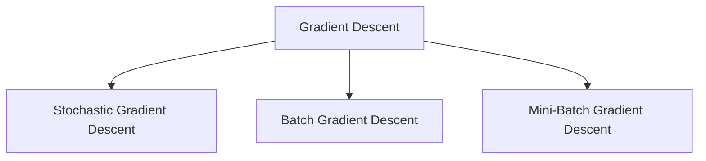

# Gradient Descent for Convex Functions

- Gradient Descent is an optimization algorithm used to minimize a function by updating parameters in the opposite direction of the gradient of the loss function.
- Gradient Descent is an optimization algorithm that is used to minimize a function by slowly moving in the direction of steepest descent, which is defined by the negative of the gradient.

The gradient-descent update rule:

$$\theta := \theta - \alpha \nabla_\theta J(\theta)$$

### Types of Gradient Descents

3 types of gradient descent:

1. Stochastic Gradient Descent
2. Batch Gradient Descent
3. Mini-Batch Gradient Descent

- **Stochastic Gradient Descent** — in extreme cases, gradient descent picks one instance of training data at every step and update based on that one instance of data point
- **Batch Gradient Descent** — in batch gradient descent, the algorithm uses whole data-set to update the values of coefficients.
- **Mini-Batch Gradient Descent** — in mini-batch gradient descent, algorithm picks a mini batch from the whole data-set at every step and update the values of coefficients. This method has the advantages of both stochastic and batch gradient descent.

Different Types of Gradient Descent:

### What is Convex Function?

- A convex function is a function where the line segment between any two points on the graph lies above or on the graph itself.

### Properties of Convex Functions

| Property | Explanation |
| --- | --- |
| Single global minimum | Only one lowest point; no local minima |
| Second derivative ≥ 0 | $f''(x) \geq 0$ for all $x$ |
| Gradient always increasing | Slope gets steeper as $x$ increases |
| Easy to optimize | Gradient descent always converges to the global minimum |

### Why Are Convex Functions Important in ML?

- Most machine learning algorithms (like linear regression, logistic regression) use convex cost functions.
- Convexity ensures easy optimization with algorithms like gradient descent.
- It don't get stuck in local minima.

### Real-World Applications of Convex Cost Functions

| Application | Convex Function Used | Algorithm |
| --- | --- | --- |
| House price prediction | MSE | Linear Regression |
| Spam classification | Log Loss (cross-entropy) | Logistic Regression |
| Face recognition | Hinge Loss | SVM |
| Resource allocation in cloud | Quadratic Cost Functions | Optimization Systems |

### Real Time Example

Let's say we want to predict the price of a house based on its size (in square feet). We can use Linear Regression, where the cost function used is a convex function.

1. Predict house price using:
2. Model (Hypothesis Function):

$$\hat{y} = w_0 + w_1 x$$

This is a convex function. Its plot looks like a bowl-shaped curve, and it has only one global minimum. Since, the MSE is convex, algorithms like gradient descent can find the best $w_0$, $w_1$ easily.
