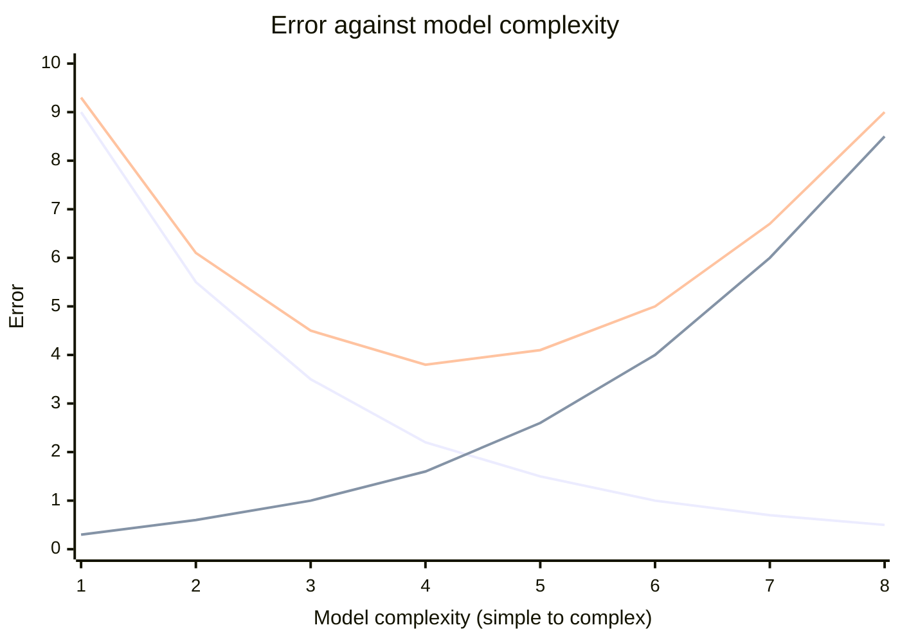

# Bias–Variance Tradeoff

Every time we train a model we are trying to minimise the **Total Error**, and that error decomposes into three parts:

$$\text{Total Error} = \text{Bias}^2 + \text{Variance} + \text{Irreducible Error}$$

- **Bias²** — reducible. Error from approximating a complex real problem with a much simpler model.
- **Variance** — reducible. Error from sensitivity to small fluctuations in the training set.
- **Irreducible error** — noise inherent in the problem itself, which no model can remove. It is why the total-error curve never touches zero.

Bias is squared because bias can be positive or negative; squaring measures the magnitude of the deviation from the truth.

### 1. What is Bias? (the "underfitter")

Bias is the error introduced by approximating a real-life problem (which is usually complicated) with a much simpler model.

- **The problem:** the model makes too many assumptions. It is "prejudiced" about what the data should look like.
- **Result: underfitting.** No matter how much data you give it, it just cannot learn the pattern.
- **Visual:** a straight line trying to fit a curved U-shaped dataset. It is simply too simple to get it right.

Plot a linear fit against U-shaped (quadratic) data and the failure is systematic, not random: the line sits below the points at both edges and above them in the middle. Adding more data does not help, because the *architecture* is what is limiting. High bias, low variance — consistently wrong.

### 2. What is Variance? (the "overfitter")

Variance is the model's sensitivity to small fluctuations in the training set.

1. **The problem:** the model learns the "noise" in the data rather than just the signal. It follows every single data point like a hyper-active puppy.
2. **Result: overfitting.** The model performs amazingly on training data but fails miserably on new, unseen data.
3. **Visual:** a wiggly, complex line that passes through every single point on your graph but looks like a mess.

A high-degree polynomial $y = w_0 + w_1x + \dots + w_nx^n$ on noisy data produces exactly that: many inflection points, sharp turns to reach each individual point, and a shape that would change drastically if one point moved. Low bias, high variance.

### The tradeoff curve

Three curves, in the order plotted: **Bias²** falls monotonically as the model grows more flexible; **Variance** rises monotonically for the same reason; **Total Error** is their sum and therefore U-shaped. Its minimum is the **optimal model complexity** — the "sweet spot". To the left of it the model underfits; to the right it overfits.

### Why do we need to "balance" them?

In a perfect world we want **low bias** and **low variance**. In reality there is a tug-of-war:

- As you make a model more **complex** (to reduce bias), it starts to pick up noise, and **variance** increases.
- As you make a model **simpler** (to reduce variance), it loses its ability to learn, and **bias** increases.

**The sweet spot:** the point where the sum of Bias² and Variance is at its lowest — the best model complexity.

### The golf pro analogy

Imagine a golfer taking several practice shots toward a hole. The hole represents the **true relationship** in your data, the balls are the model's predictions.

- **Bias** is the distance between the centre of your ball cluster and the hole.
- **Variance** is the "spread", how scattered the balls are from each other.

The four scenarios on the green:

1. **Low bias / low variance (the Pro):** all balls land in or right next to the hole — accurate and consistent. The ideal.
2. **Low bias / high variance (the Wild Hitter):** balls scattered all over the green but centred on the hole. Right on average, wildly inconsistent. **Overfitting.**
3. **High bias / low variance (the Consistent Miss):** a tight cluster, twenty feet left of the hole. Consistent, systematically wrong. **Underfitting.**
4. **High bias / high variance (the Amateur):** scattered *and* nowhere near the hole. The worst case.

The same four states are often drawn as bullseye targets: tight-and-off-centre, tight-and-centred, spread-and-centred, spread-and-off-centre.

### The bridge to regularization

When we find ourselves with **high variance (overfitting)**, our model is being too "flexible" — trying too hard to please every data point in the training set.

This is exactly where **regularization (L1 and L2)** comes in. Regularization acts like a "penalty" or a "leash" that prevents the model from becoming too complex. It forces the model to stay simpler, effectively trading a tiny bit of bias to significantly reduce the variance.

Mathematically, overfitting shows up as **exceptionally large coefficients** $W$: to produce the sharp wiggles needed to pass through every noisy point, the weights must blow up. So the fix is to penalise their size:

$$L = \text{Residual Sum of Squares (RSS)} + \text{Penalty}$$
