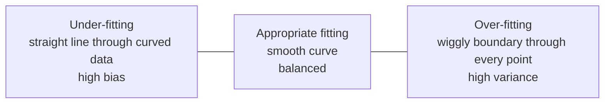

# Regularization

- Regularization adds a penalty term to the loss function to reduce over fitting by discouraging overly complex models.
- By adding a penalty for complexity, regularization encourages simpler and more generalizable models.
- **Prevents overfitting:** adds constraints to the model to reduce the risk of memorising noise in the training data.
- **Improves generalization:** encourages simpler models that perform better on new, unseen data.

The principle behind it is Occam's razor: given two models that fit equally well, the simpler one is more likely to be right about the future.



Regularization is the force that pulls the right-hand picture back towards the middle one.

### Types of Regularization

There are mainly 3 types of regularization techniques, each applying penalties in different ways to control model complexity and improve generalization.

### a. L1 Regularization (Lasso)

A regression model which uses the L1 regularization technique is called **LASSO (Least Absolute Shrinkage and Selection Operator)** regression.

1. It adds the absolute value of magnitude of the coefficient as a penalty term to the loss function $L$.
2. This penalty can shrink some coefficients to zero, which helps in selecting only the important features and ignoring the less important ones.

$$\text{Cost} = \frac{1}{n} \sum_{i=1}^{n} (y_i - \hat{y}_i)^2 + \lambda \sum_{j=1}^{m} \lvert w_j \rvert$$

Where $m$ is the number of features, $n$ the number of examples, $y_i$ the actual target value, $\hat{y}_i$ the predicted target value, $w_j$ the coefficient of feature $j$, and $\lambda$ the regularization parameter controlling the strength of the penalty. If $\lambda = 0$ the cost reduces to ordinary least squares; as $\lambda \to \infty$ all coefficients are driven towards zero.

Lasso does two things at once: it **shrinks** coefficients, and because the L1 penalty can push them to *exactly* zero, it performs **automatic feature selection**, producing a sparse and more interpretable model.

```python
from sklearn.linear_model import Lasso
from sklearn.model_selection import train_test_split
from sklearn.datasets import make_regression
from sklearn.metrics import mean_squared_error

X, y = make_regression(n_samples=100, n_features=5, noise=0.1, random_state=42)
X_train, X_test, y_train, y_test = train_test_split(X, y, test_size=0.2, random_state=42)

lasso = Lasso(alpha=0.1)
lasso.fit(X_train, y_train)
y_pred = lasso.predict(X_test)

mse = mean_squared_error(y_test, y_pred)
print(f"Mean Squared Error: {mse}")
print("Coefficients:", lasso.coef_)
```

```
Mean Squared Error: 0.06362439921332456
Coefficients: [60.50305581 98.52475354 64.3929265 56.96061238 35.52928502]
```

- `make_regression(n_samples=100, n_features=5, noise=0.1, random_state=42)` generates a regression dataset with 100 samples, 5 features and some noise.
- `train_test_split(..., test_size=0.2, random_state=42)` splits the data into 80 % training and 20 % testing sets.
- `Lasso(alpha=0.1)` creates a Lasso model with regularization strength `alpha` set to 0.1; `alpha` is the code's name for $\lambda$.
- `random_state=42` fixes the seed so the data and the split are reproducible.
- The learned weights live in `.coef_`; with a larger `alpha`, more of them would be exactly zero.

### b. L2 Regularization (Ridge)

A regression model that uses the L2 regularization technique is called **Ridge regression**. It adds the squared magnitude of the coefficient as a penalty term to the loss function. It handles **multicollinearity** by shrinking the coefficients of correlated features, reducing their variance and preventing any single feature from dominating the model.

$$\text{Cost} = \frac{1}{n} \sum_{i=1}^{n} (y_i - \hat{y}_i)^2 + \lambda \sum_{j=1}^{m} w_j^2$$

Ridge shrinks coefficients **towards** zero but never exactly to zero, so every feature stays in the model with reduced influence. That is the crucial contrast with Lasso.

```python
from sklearn.linear_model import Ridge
from sklearn.datasets import make_regression
from sklearn.model_selection import train_test_split
from sklearn.metrics import mean_squared_error

X, y = make_regression(n_samples=100, n_features=5, noise=0.1, random_state=42)
X_train, X_test, y_train, y_test = train_test_split(X, y, test_size=0.2, random_state=42)

ridge = Ridge(alpha=1.0)
ridge.fit(X_train, y_train)
y_pred = ridge.predict(X_test)

mse = mean_squared_error(y_test, y_pred)
print("Mean Squared Error:", mse)
print("Coefficients:", ridge.coef_)
```

```
Mean Squared Error: 4.114050771972589
Coefficients: [59.87954432 97.15091098 63.24364738 56.31999433 35.34591136]
```

Note that none of Ridge's coefficients is zero, and compare with the Lasso run above.

### Why L1 zeroes coefficients and L2 does not

Both penalties can be written as a **constraint** on the coefficients rather than as an added term:

$$\text{L1 (Lasso)}: \ \lvert \beta_1 \rvert + \lvert \beta_2 \rvert \le C \qquad\qquad \text{L2 (Ridge)}: \ \beta_1^2 + \beta_2^2 \le C$$

In the $(\beta_1, \beta_2)$ plane the least-squares error forms concentric elliptical contours around the unconstrained OLS solution, and the regularised answer is the point where the smallest ellipse first **touches** the constraint region.

- The L1 region is a **diamond** with sharp corners *on the axes*. An ellipse approaching it very often touches a corner — and a corner means one coefficient is exactly zero. Hence sparsity and feature selection.
- The L2 region is a smooth **circle** with no corners, so the touch point almost never lands on an axis. Every coefficient is shrunk, none eliminated.

A smaller budget $C$ corresponds to a larger penalty $\lambda$.

### c. Elastic Net

**Elastic Net Regression** is a combination of both L1 as well as L2 regularization. It combines both L1 (absolute values) and L2 (squared values) penalties on the coefficients, with the help of an extra hyperparameter that controls the ratio of the L1 and L2 regularization.

$$\text{Cost} = \frac{1}{n} \sum_{i=1}^{n}(y_i - \hat{y}_i)^2 + \lambda \left( (1 - \alpha) \sum_{j=1}^{m} \lvert w_j \rvert + \alpha \sum_{j=1}^{m} w_j^2 \right)$$

- $\lambda$ — overall regularization strength.
- $\alpha$ — the mixing parameter, $0 \le \alpha \le 1$. In this form $\alpha = 0$ leaves only the L1 term (pure Lasso) and $\alpha = 1$ leaves only the L2 term (pure Ridge); values in between blend the two. **Conventions differ between textbooks and libraries** — in scikit-learn the parameter is `l1_ratio`, where `l1_ratio=1` is pure Lasso and `l1_ratio=0` is pure Ridge — so always check which convention a question is using.

Why it exists: faced with a group of highly correlated features, Lasso arbitrarily keeps one and zeroes the rest, while Ridge keeps them all. Elastic Net finds the middle ground, which is why it is preferred on wide datasets with correlated predictors.

```python
from sklearn.linear_model import ElasticNet
from sklearn.datasets import make_regression
from sklearn.model_selection import train_test_split
from sklearn.metrics import mean_squared_error

X, y = make_regression(n_samples=100, n_features=10, noise=0.1, random_state=42)
X_train, X_test, y_train, y_test = train_test_split(X, y, test_size=0.2, random_state=42)

model = ElasticNet(alpha=1.0, l1_ratio=0.5)
model.fit(X_train, y_train)

y_pred = model.predict(X_test)
mse = mean_squared_error(y_test, y_pred)

print("Mean Squared Error:", mse)
print("Coefficients:", model.coef_)
```

```
Mean Squared Error: 7785.886176938014
Coefficients: [16.84528938 31.77080959 4.05901996 40.18486737 57.25856154
 45.81463318 58.97979422 -0. 3.82816854 41.1096051]
```

The `-0.` in that output is the point of the example: the L1 half of Elastic Net has performed feature selection and eliminated one feature entirely.

In general:

$$\text{Regularized Loss} = \text{Original Loss} + \lambda \cdot (\text{Penalty})$$

Where $\lambda$ (lambda) controls the strength of the penalty.

### Benefits of Regularization

1. **Prevents overfitting:** helps models focus on underlying patterns instead of memorising noise in the training data.
2. **Enhances performance:** prevents excessive weighting of outliers or irrelevant features, improving overall model accuracy.
3. **Stabilizes models:** reduces sensitivity to minor data changes, ensuring consistency across different data subsets.
4. **Prevents complexity:** keeps the model from becoming too complex, which matters most with limited or noisy data.
5. **Handles multicollinearity:** reduces the magnitudes of correlated coefficients, improving model stability.
6. **Promotes consistency:** ensures reliable performance across different datasets, reducing the risk of large performance shifts.
