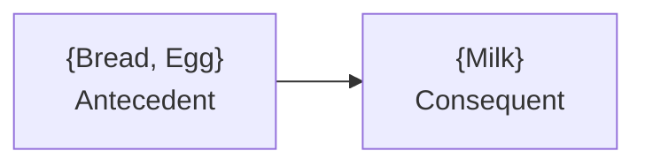
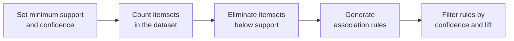
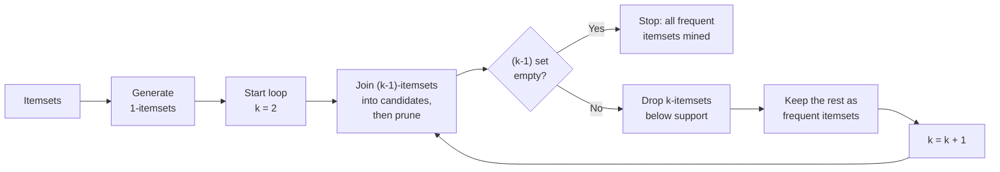

# Apriori Algorithm for Association Rules

- Association rule learning is a rule-based machine learning method to find relationships (associations) between variables in large datasets.

Real life example:

- If a customer buys bread and butter, they are likely to buy jam. This is an example of a market basket analysis.

A rule has two halves, and the vocabulary is examinable:

with **Itemset** $=$ {Bread, Egg, Milk}, the union of the two sides. The rule $X \Rightarrow Y$ asserts co-occurrence, not causation.

### Support, confidence and lift

For an itemset $X = \{x_1, \dots, x_k\}$, find all rules $X \Rightarrow Y$ with minimum support and confidence, where

- **support** $s$ is the probability that a transaction contains $X \cup Y$;
- **confidence** $c$ is the conditional probability that a transaction having $X$ also contains $Y$.

$$s(X \Rightarrow Y) = \frac{\sigma(X \cup Y)}{N}, \qquad c(X \Rightarrow Y) = \frac{\sigma(X \cup Y)}{\sigma(X)} = P(Y \mid X)$$

**Lift** is the ratio of the observed support to the support expected if $X$ and $Y$ were independent; a lift greater than 1 indicates a genuine positive association rather than coincidence.

Worked example on five transactions:

| Transaction-id | Items bought |
| --- | --- |
| 10 | A, B, D |
| 20 | A, C, D |
| 30 | A, D, E |
| 40 | B, E, F |
| 50 | B, C, D, E, F |

With $sup_{min} = 50\%$ and $conf_{min} = 50\%$, the frequent patterns are $\{A{:}3, B{:}3, D{:}4, E{:}3, AD{:}3\}$ and the association rules are

- $A \Rightarrow D$ — support $3/5 = 60\%$, confidence $3/3 = 100\%$
- $D \Rightarrow A$ — support $3/5 = 60\%$, confidence $3/4 = 75\%$

Note the asymmetry: support is symmetric, but confidence is not. Whenever $A$ appears, $D$ appears too, so $c(A \Rightarrow D) = 100\%$; but $D$ also appears without $A$, so $c(D \Rightarrow A)$ is only 75 %.

### Steps of Apriori Algorithm

- Set minimum support and confidence
- Generate all frequent itemsets:
  - Count itemsets in the dataset
  - Eliminate itemsets below the support threshold
- Generate association rules from the frequent item sets
- Filter rules based on confidence and lift

The engine underneath is the **Apriori property** (downward closure): every non-empty subset of a frequent itemset must itself be frequent. Contrapositively, if any subset is infrequent then the superset cannot be frequent — so it can be **pruned** without ever being counted. Without that pruning the number of candidate combinations grows exponentially.

### Worked example of the level-wise search

Database $D$ with four transactions, $minsup = 0.5$, so the required support count is $0.5 \times 4 = 2$:

| TID | Items |
| --- | --- |
| 100 | 1 3 4 |
| 200 | 2 3 5 |
| 300 | 1 2 3 5 |
| 400 | 2 5 |

**Scan 1** — count single items to get $C_1$, then prune below count 2 to get $L_1$:

| $C_1$ itemset | sup | | $L_1$ itemset | sup |
| --- | --- | --- | --- | --- |
| {1} | 2 | | {1} | 2 |
| {2} | 3 | | {2} | 3 |
| {3} | 3 | | {3} | 3 |
| {4} | 1 | | | |
| {5} | 3 | | {5} | 3 |

{4} is dropped: its count of 1 is below the threshold.

**Scan 2** — self-join $L_1$ to get the candidate pairs $C_2 = \{12, 13, 15, 23, 25, 35\}$, count them, and prune:

| $C_2$ itemset | sup | | $L_2$ itemset | sup |
| --- | --- | --- | --- | --- |
| {1 2} | 1 | | | |
| {1 3} | 2 | | {1 3} | 2 |
| {1 5} | 1 | | | |
| {2 3} | 2 | | {2 3} | 2 |
| {2 5} | 3 | | {2 5} | 3 |
| {3 5} | 2 | | {3 5} | 2 |

**Scan 3** — the only 3-item candidate is $C_3 = \{2\,3\,5\}$, because all of its 2-subsets ({2 3}, {2 5}, {3 5}) are in $L_2$. Its count is 2, so $L_3 = \{2\,3\,5\}$ with support 2. Three database scans in total, one per level.

### Applications of Apriori Algorithm

- **E-commerce:** Used to recommend products that are often bought together like laptop + laptop bag, increasing sales.
- **Food Delivery Services:** Identifies popular combos such as burger + fries, to offer combo deals to customers.
- **Streaming Services:** Recommends related movies or shows based on what users often watch together like action + superhero movies.
- **Financial Services:** Analyzes spending habits to suggest personalized offers such as credit card deals based on frequent purchases.
- **Travel & Hospitality:** Creates travel packages like flight + hotel by finding commonly purchased services together.
- **Health & Fitness:** Suggests workout plans or supplements based on users' past activities like protein shakes + workouts.
