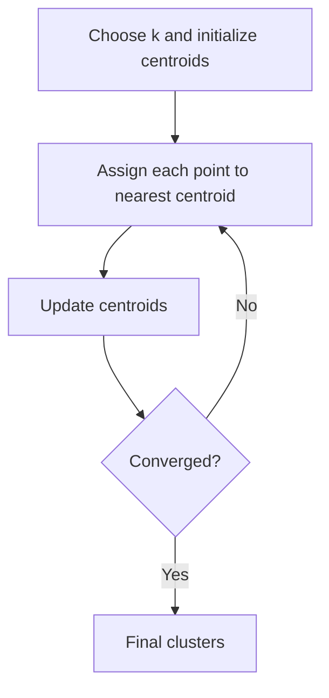

# Clustering: K-Means and Kernel K-Means

- Clustering is an unsupervised learning technique used to group similar data points into clusters, where the similarity is measured using a distance metric (Centroid) (like Euclidean distance).
- **Goal:** Partitions data into (k) clusters by minimizing the sum of squared distances between data points and their cluster centroids.

K-Means Model work flow:

### K-Kernel Means Algorithm

- **Algorithm:** Extends K-means by using a kernel function to map data into a higher-dimensional space, enabling the detection of non-linear clusters.
- **Assumptions:** Relies on the choice of an appropriate kernel (e.g., RBF, polynomial).
