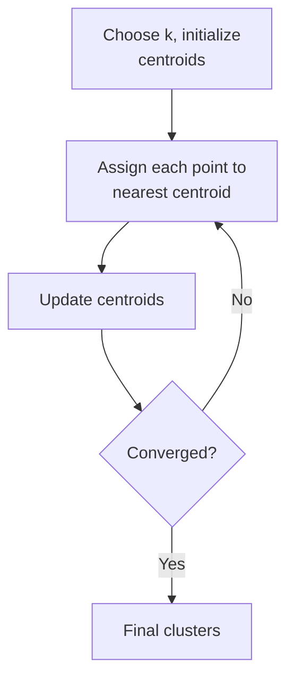

# Clustering: K-Means and Kernel K-Means

- Clustering is an unsupervised learning technique used to group similar data points into clusters, where the similarity is measured using a distance metric (Centroid) (like Euclidean distance).
- **Goal:** Partitions data into (k) clusters by minimizing the sum of squared distances between data points and their cluster centroids.

That objective is the **within-cluster sum of squares**:

$$\min \sum_{i=1}^{l} \| x_i - m_{q(x_i)} \|^2$$

where $m_j$ is the centroid of cluster $j$ and $q(x_i)$ is the cluster assigned to point $x_i$.

K-Means Model work flow:

The two steps in the loop are the assignment step, $q(x) = \arg\min_i \|x - m_i\|$, and the update step, $m_i = \frac{1}{|I_i|}\sum_{j \in I_i} x_j$. Convergence to a *local* minimum is guaranteed; the global minimum is not, which is why K-Means is usually run several times from different initialisations.

### K-Kernel Means Algorithm

- **Algorithm:** Extends K-means by using a kernel function to map data into a higher-dimensional space, enabling the detection of non-linear clusters.
- **Assumptions:** Relies on the choice of an appropriate kernel (e.g., RBF, polynomial).

Plain K-Means can only draw straight-edged (Voronoi) boundaries, so concentric rings or crescent shapes defeat it. Mapping the data through $\phi(x)$ first makes those shapes linearly separable in the new space, and the kernel trick means we never have to compute $\phi(x)$ explicitly — only inner products.
