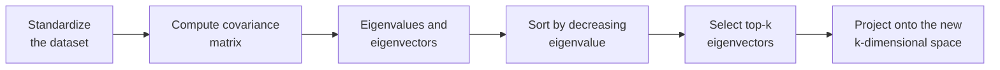

# Dimensionality Reduction: PCA and Kernel PCA

### What is Dimensionality Reduction?

- Dimensionality Reduction reduces the number of input variables (features) in a dataset while preserving as much information (variance) as possible.

Benefits:

- Reduces computational cost
- Removes noise/redundancy
- Improves visualization (e.g., 2D plots)
- Avoids curse of dimensionality

### Steps of PCA

- Standardize the dataset.
- Compute the covariance matrix of the data.
- Calculate eigenvalues and eigenvectors of the covariance matrix.
- Sort eigenvectors by decreasing eigenvalues.
- Select top-k eigenvectors (principal components).
- Project data onto the new k-dimensional space.

Standardisation comes first for a reason: PCA chases variance, so a feature measured in large units would dominate the components purely because of its scale. Each **eigenvector** of the covariance matrix is a direction in feature space and its **eigenvalue** is the variance captured along that direction — so sorting by eigenvalue ranks the directions by how much information they carry.

- Principal Component Analysis (PCA) is a technique used to reduce the dimensionality of a dataset while preserving most of its original variation.
- PCA is a linear method and it may not work well when the data has a non-linear structure. In such cases, instead of PCA, Kernel PCA can be used.

Note also that PCA is **unsupervised** — it ignores class labels — which is exactly the contrast with LDA drawn in Unit I: maximum spread is not the same thing as maximum class separation.

### Kernel PCA

- **Goal:** Extend PCA to capture non-linear patterns using the kernel trick — project data into a higher-dimensional space.
- **Idea:**
  - Use a non-linear mapping $\phi(x)$ to map input data into high-dimensional space.
  - Compute PCA in that space using only dot products via a kernel function.
