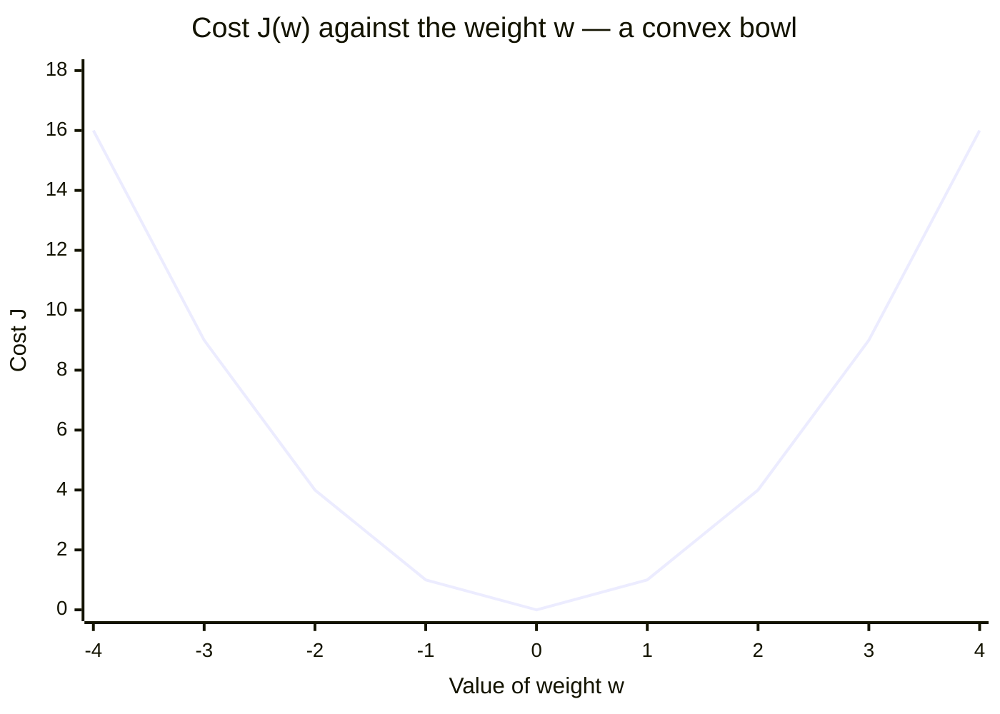

# Cost Function

In Linear Regression, the cost function measures how far the predicted values $\hat{y}$ are from the actual values $y$. It helps identify and reduce errors to find the best-fit line. The most common cost function is **Mean Squared Error (MSE)**, the average of squared differences between actual and predicted values:

$$J = \frac{1}{n} \sum_{i=1}^{n} (\hat{y}_i - y_i)^2, \qquad \hat{y}_i = \theta_1 + \theta_2 x_i$$

- $J$ — the cost (loss, objective) function, a single number summarising total error.
- $n$ — the number of data points; the factor $\frac{1}{n}$ turns the sum into a mean.
- $\hat{y}_i$ — the model's prediction; $y_i$ — the ground truth.
- $(\hat{y}_i - y_i)^2$ — the squared error for one prediction.
- $\theta_1$ is the intercept and $\theta_2$ the slope, the two parameters being learned.

To minimise this cost we use **gradient descent**, which iteratively updates $\theta_1$ and $\theta_2$ until the MSE reaches its lowest value. That state is called **convergence**.

Written with weights and bias, the same cost appears as

$$\text{cost}(W, b) = \frac{1}{m} \sum_{i=1}^{m} \left( H(x^{(i)}) - y^{(i)} \right)^2$$

where $H(x^{(i)})$ is the hypothesis (prediction) for the $i$-th input, $y^{(i)}$ is its actual target, and $m$ is the number of training examples.

### The cost curve

Reading the curve: the model starts at some **initial weight** high on one arm, the **derivative of cost** $\frac{dJ}{dw}$ at that point gives the slope, each **learning step** moves downhill by an amount set by the learning rate, and the **point of convergence** is the vertex where $\frac{dJ}{dw} \approx 0$ and the cost is minimum. In two parameters the same shape becomes a 3D bowl (a paraboloid) over the $(W, b)$ plane, with the deep blue minimum at the centre.
