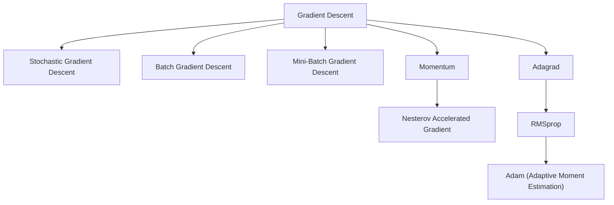

# Gradient Descent for Convex Functions

- Gradient Descent is an optimization algorithm used to minimize a function by updating parameters in the opposite direction of the gradient of the loss function.
- Gradient Descent is an optimization algorithm that is used to minimize a function by slowly moving in the direction of steepest descent, which is defined by the negative of the gradient.

The gradient-descent update rule:

$$\theta := \theta - \alpha \nabla_\theta J(\theta)$$

- $\nabla_\theta J(\theta)$ — the gradient, a vector of partial derivatives that points in the direction of steepest **ascent**.
- The minus sign is the whole idea: to go down, step *against* the gradient.
- $\alpha$ — the **learning rate**, the step size. Too large and the algorithm overshoots or diverges; too small and training crawls.

The classic image is standing on a hillside in fog: you cannot see the valley floor, but you can feel which way the ground falls, so you step that way and repeat.

### How it works

1. Start with random values for slope and intercept.
2. Calculate the error between predicted and actual values.
3. Find how much each parameter contributes to the error (gradient).
4. Update the parameters in the direction that reduces the error.
5. Repeat until the error is as small as possible.
6. This helps the model find the best-fit line for the data.

Step 3 is calculus — $\frac{\partial J}{\partial m}$ and $\frac{\partial J}{\partial c}$ — and step 4 is the update rule above.

### Types of Gradient Descents

3 types of gradient descent:

1. Stochastic Gradient Descent
2. Batch Gradient Descent
3. Mini-Batch Gradient Descent

- **Stochastic Gradient Descent** — in extreme cases, gradient descent picks one instance of training data at every step and update based on that one instance of data point
- **Batch Gradient Descent** — in batch gradient descent, the algorithm uses whole data-set to update the values of coefficients.
- **Mini-Batch Gradient Descent** — in mini-batch gradient descent, algorithm picks a mini batch from the whole data-set at every step and update the values of coefficients. This method has the advantages of both stochastic and batch gradient descent.

The only thing that changes between the three is **how much data is used to compute one update**. Batch is stable but slow and memory-hungry; SGD is fast but its path to the minimum is noisy, and that noise can actually help it escape poor local minima; mini-batch (typically 32, 64 or 128 samples) is the modern default because it balances the two and vectorises well on a GPU.

Different Types of Gradient Descent:

Beyond the three data-based variants, the family extends in two directions. **Velocity** methods — Momentum, and its look-ahead refinement Nesterov Accelerated Gradient — add a fraction of the previous update to the current one, gaining speed in a consistent direction and damping oscillations. **Adaptive learning rate** methods give every parameter its own step size: Adagrad scales by the history of gradients (good for sparse data), RMSprop replaces that history with an exponentially decaying average so the rate cannot vanish, and Adam combines momentum with RMSprop and is the standard choice in deep learning.

| Variant | Advantages | Disadvantages |
| --- | --- | --- |
| Batch gradient descent | Guaranteed convergence to global optimum (for convex functions) | Computationally expensive for large datasets, slow convergence |
| Stochastic gradient descent | Faster convergence, more efficient for large datasets | High variance, may not converge to the global optimum |
| Mini-batch gradient descent | Balanced convergence speed and computational cost, efficient for large datasets | Choice of mini-batch size can be a challenge |
| Momentum gradient descent | Faster convergence, less likely to get stuck in local minima | May overshoot and oscillate around the optimum |
| Adagrad | Adaptive learning rate, efficient for sparse data | Can stop learning too early |
| RMSProp | Adaptive learning rate, efficient for non-stationary problems | Can stop learning too early, requires tuning of hyperparameters |
| Adam | Adaptive learning rate, efficient for large datasets and noisy data | Can converge to suboptimal solutions, requires tuning of hyperparameters |

Adagrad's failure mode has a name worth remembering: the accumulated squared gradients in its denominator keep growing, so the effective learning rate shrinks towards zero and training stalls. RMSprop's decaying average is the fix.

### What is Convex Function?

- A convex function is a function where the line segment between any two points on the graph lies above or on the graph itself.

Geometrically, pick any two points on the bowl and join them: the chord passes through the air *inside* the bowl, never below the surface. In 2D this is the familiar "U"; in two parameters it is a paraboloid.

### Properties of Convex Functions

| Property | Explanation |
| --- | --- |
| Single global minimum | Only one lowest point; no local minima |
| Second derivative ≥ 0 | $f''(x) \geq 0$ for all $x$ |
| Gradient always increasing | Slope gets steeper as $x$ increases |
| Easy to optimize | Gradient descent always converges to the global minimum |

The second-order condition $f''(x) \ge 0$ is the formal test for convexity: the curvature never turns downward. Consequently the gradient is **monotonically increasing**, and any local minimum is automatically the global minimum.

### Why Are Convex Functions Important in ML?

- Most machine learning algorithms (like linear regression, logistic regression) use convex cost functions.
- Convexity ensures easy optimization with algorithms like gradient descent.
- It don't get stuck in local minima.

If the cost surface were non-convex — wavy, full of pits — gradient descent could settle in a local minimum that is not the best solution. Deep neural networks live in exactly that non-convex world, which is why their training is so much more delicate than fitting a linear regression.

### Real-World Applications of Convex Cost Functions

| Application | Convex Function Used | Algorithm |
| --- | --- | --- |
| House price prediction | MSE | Linear Regression |
| Spam classification | Log Loss (cross-entropy) | Logistic Regression |
| Face recognition | Hinge Loss | SVM |
| Resource allocation in cloud | Quadratic Cost Functions | Optimization Systems |

MSE is quadratic and therefore convex. Log loss stays convex while penalising confident mistakes ever more steeply. Hinge loss is piecewise-linear and convex, and it is what turns maximum-margin classification into a solvable convex program. Quadratic costs of the form $ax^2+bx+c$ with $a>0$ are convex by construction.

### Real Time Example

Let's say we want to predict the price of a house based on its size (in square feet). We can use Linear Regression, where the cost function used is a convex function.

1. Predict house price using: input $x$ = size of the house, output $y$ = price of the house
2. Model (Hypothesis Function):

$$\hat{y} = w_0 + w_1 x$$

where $\hat{y}$ is the predicted price, $w_0$ the intercept, and $w_1$ the slope — how much the price changes per square foot.

We use Mean Squared Error as the loss function:

$$J(w_0, w_1) = \frac{1}{n} \sum_{i=1}^{n} (\hat{y}_i - y_i)^2$$

This is a convex function. Its plot looks like a bowl-shaped curve, and it has only one global minimum. Since the MSE is convex, algorithms like gradient descent can find the best $w_0$, $w_1$ easily.
