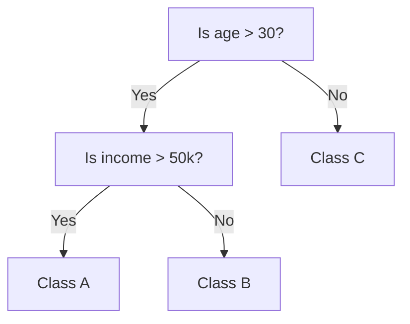

# Decision Tree

- **Purpose:** Used for both classification and regression.
- **Concept:**
  - A tree-like structure where each internal node tests a feature.
  - Branches represent outcomes of the test.
  - Leaf nodes represent class labels or predicted values.

A decision tree is a type of machine learning model that is used when the relationship between a set of predictor variables and a response variable is non-linear.

### How it works

- Uses measures like Gini Impurity or Entropy to split nodes.
- Greedy algorithm (splits that give the best immediate gain).

```
Is age > 30?
    Yes: Is income > 50k?
            Yes → Class A
            No  → Class B
    No → Class C
```



### Advantages

- Easy to understand and visualize.
- Handles both numerical and categorical data.

### Limitations

- Prone to over fitting.
