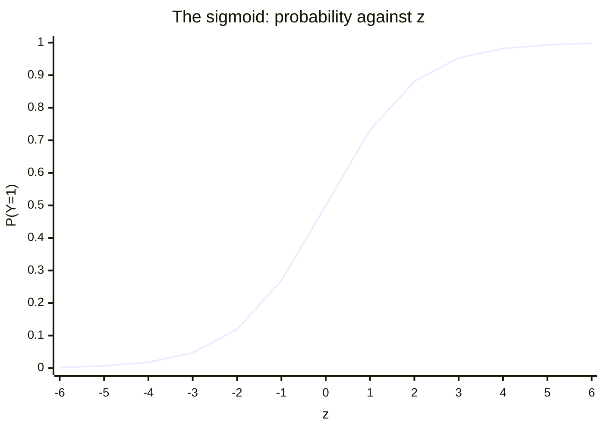

# Logistic Regression

- **Purpose:** Used for binary classification (e.g., spam or not spam).
- **Concept:**
  1. Logistic regression uses the logistic (sigmoid) function to predict probabilities.
  2. It models the probability that an instance belongs to a particular class.
- **Formula:**

$$P(Y = 1) = \frac{1}{1 + e^{-(\beta_0 + \beta_1 X_1 + \dots + \beta_n X_n)}}$$

which is the sigmoid applied to a linear combination of the features:

$$\sigma(z) = \frac{1}{1 + e^{-z}}, \qquad z = \beta_0 + \beta_1 X_1 + \dots + \beta_n X_n$$

- $P(Y=1)$ — the probability that the instance belongs to the positive class.
- $e$ — Euler's number, $\approx 2.718$.
- $\beta_0$ — the intercept; $\beta_1 \dots \beta_n$ — the weights on the features $X_1 \dots X_n$.
- As the linear sum grows large and positive, $P \to 1$; as it grows large and negative, $P \to 0$.

The curve is bounded by asymptotes at 0 and 1, passes through $0.5$ at $z = 0$, and is steepest there — which is why the region near the decision threshold is where the model is least certain.

### Main key definition

- Output is between 0 and 1 (probability).
- If probability > 0.5 → class 1, else class 0.
- Assumes linear relationship between input features and log-odds.

That third point is the precise statement of the model. The **logit** — the log of the odds — is linear in the features:

$$\text{logit}(p) = \ln\!\left(\frac{p}{1-p}\right) = \beta_0 + \beta_1 x_1 + \dots + \beta_n x_n$$

So logistic regression *is* a linear model; the sigmoid is only the link that converts that linear score into a probability. The name says "regression" because of this linear core, but the task is **classification**. The threshold of $0.5$ is a convention and can be moved to trade sensitivity against specificity.

### Examples

- Email spam detection
- Disease prediction (e.g., diabetes: yes/no)
- Loan approval
