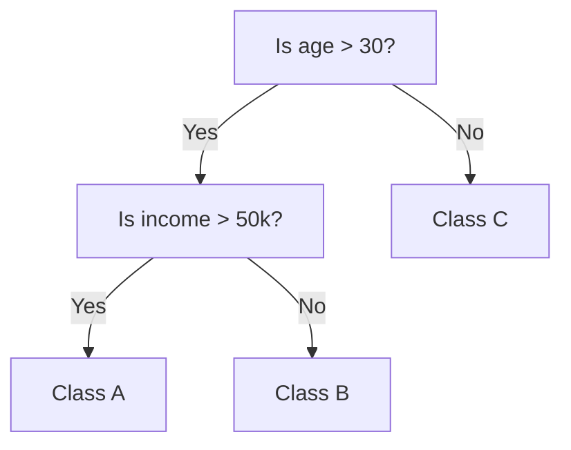

# Decision Tree

- **Purpose:** Used for both classification and regression.
- **Concept:**
  - A tree-like structure where each internal node tests a feature.
  - Branches represent outcomes of the test.
  - Leaf nodes represent class labels or predicted values.

A decision tree is a type of machine learning model that is used when the relationship between a set of predictor variables and a response variable is non-linear.

That is the tree's real selling point: it assumes no functional form at all. Instead of fitting one global equation, it partitions the feature space into regions, which lets it capture complex non-linear patterns that a linear model would miss.

### How it works

- Uses measures like Gini Impurity or Entropy to split nodes.
- Greedy algorithm (splits that give the best immediate gain).

At each node the algorithm asks which feature and which threshold best increase the **purity** of the resulting children. **Gini impurity** measures how often a randomly chosen element would be labelled wrongly; **entropy** measures disorder, and the reduction in entropy is the **information gain**. The algorithm is **greedy** because it takes the best split available right now, without checking whether a worse split now would allow a better tree later.

```
Is age > 30?
    Yes: Is income > 50k?
            Yes → Class A
            No  → Class B
    No → Class C
```



Trace a 35-year-old earning ₹40k: age > 30 is Yes, income > 50k is No, so the prediction is **Class B**.

### Advantages

- Easy to understand and visualize.
- Handles both numerical and categorical data.

A decision tree is **white-box** AI: the path from root to leaf *is* the explanation. And unlike linear models or SVMs, it splits on categories directly ("Colour is Red") without one-hot encoding.

### Limitations

- Prone to over fitting.

Left unchecked, a tree will keep splitting until every training example is perfectly classified — memorising noise and outliers along the way. The fixes are **pruning** (cutting branches that add little) and limiting the **maximum depth**, or moving to an ensemble.
