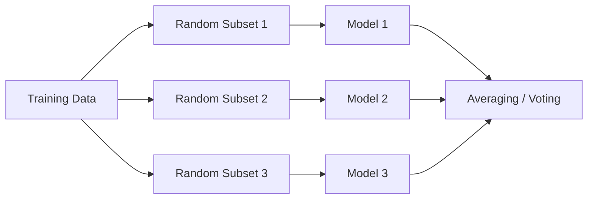
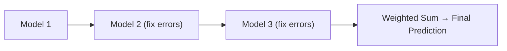
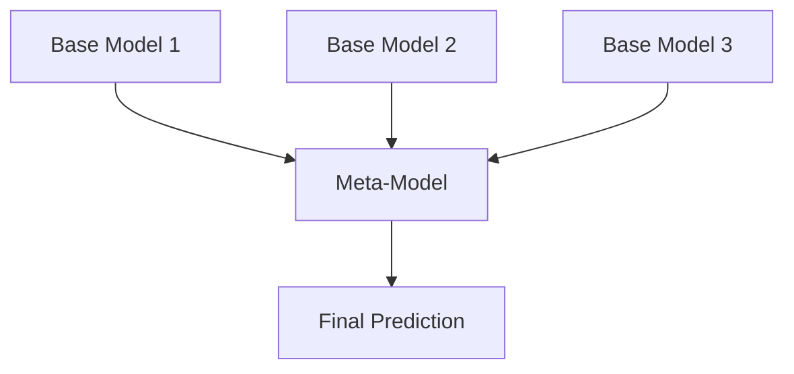

# Ensemble Learning

- Ensemble learning is a technique in machine learning where multiple models (often called "weak learners") are trained and combined to solve the same problem.
- The idea is that a group of models working together can outperform a single strong model.

### When to Use Ensemble Learning?

- You have high variance or high bias in your model.
- Your base models are diverse and complementary.
- You want to increase model performance in competitions (e.g., Kaggle).

### Real-Life Example

Imagine trying to guess a movie's rating:

- One friend uses past ratings
- Another reads online reviews
- A third watches the trailer

Each has weaknesses alone, but combining their opinions gives a better estimate. That's ensemble learning!

- Accuracy: Highest

### Types of Ensemble learning

#### Bagging (Bootstrap Aggregating)

- Models are trained independently on different random subsets of the training data.
- Their results are then combined—usually by averaging (for regression) or voting (for classification).
- This helps reduce variance and prevents over fitting.

Example Algorithms:

- Random Forest (uses decision trees + bagging)

How Bagging Learning model works:

#### Boosting

- Models are trained one after another. Each new model focuses on fixing the errors made by the previous ones.
- The final prediction is a weighted combination of all models, which helps reduce bias and improve accuracy.
- Models are trained sequentially, each new model focusing on correcting the errors of the previous ones.
- Final prediction is a weighted sum of all models.
- Reduces bias and variance

Popular Boosting Algorithms:

- AdaBoost (Adaptive Boosting)
- Gradient Boosting (GBM)
- XGBoost
- LightGBM
- CatBoost

#### Stacking (Stacked Generalization)

- Multiple different models (often of different types) are trained, and their predictions are used as inputs to a final model, called a meta-model.
- The meta-model learns how to best combine the predictions of the base models, aiming for better performance than any individual model.
- The predictions of base models are fed to a meta-model (e.g., logistic regression) that learns how to best combine them.
- Leverages strengths of different models
- Useful when base learners are diverse.

