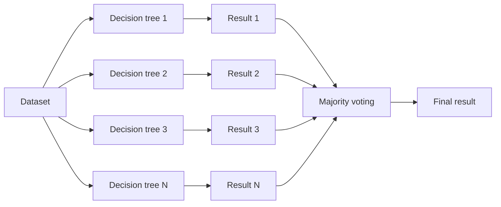

# Random Forest

- **Purpose:** An ensemble method for classification and regression.
- **Concept:**
  - Combines many decision trees (a "forest").
  - Each tree is trained on a random subset of data and features (bootstrap).
  - Final output:
    - Classification → majority voting
    - Regression → average prediction

- Reduces over fitting of individual trees.

For classification the aggregation is the mode of the individual predictions:

$$\hat{y} = \text{mode}\{h_1(x), h_2(x), \dots, h_N(x)\}$$

If 80 of 100 trees say Class A and 20 say Class B, the forest says Class A. For regression the mode is replaced by the mean.

### Two sources of randomness

A forest only works if its trees are **different**, and the difference comes from two deliberate injections of randomness:

1. **Bootstrap sampling of rows** — each tree sees a random sample of the data drawn *with replacement*, so some rows repeat and others are left out.
2. **Random subset of features at each split** — instead of considering all features, each split considers only $m_{try}$ of them, which stops one dominant feature from appearing at the top of every tree.

Typical settings differ by task:

| Setting | Classification | Regression |
| --- | --- | --- |
| `mtry` (features per split) | $\sqrt{\text{no. of descriptors}}$ | (no. of descriptors) / 3 |
| `nodesize` (minimum leaf size) | 1 | 5 |
| `ntree` (trees in the forest) | ~500 | ~500 |
| Pruning | none — trees grown fully | none |

Because each tree is trained on a bootstrap sample, the rows it did *not* see — the **out-of-bag (OOB)** samples — can be used to validate that tree, giving an internal cross-validation for free without a separate hold-out set. Trees are deliberately left unpruned: each one is high-variance on its own, and the averaging across the forest is what removes that variance.

### Advantages

- More accurate and stable than a single decision tree.
- Improved accuracy, a built-in method for descriptor selection, resistance to overfitting, easy to train, and still built from human-interpretable trees.

### Key Concepts

- Bagging (Bootstrap Aggregating)
- Randomness in feature selection and data sample improves generalization.

### Use Cases

- Fraud detection
- Medical diagnosis
- Stock market prediction

### Worked example: churn classification

Run Random Forest classification on the independent variables *Contract, Tenure, Internet Service, Tech Support, Online Security* with target variable *Churn*:

| Churn (Y) | Contract | Tenure | Internet Service | Tech Support | Online Security |
| --- | --- | --- | --- | --- | --- |
| Yes | Month-to-month | 2 | DSL | No internet service | Yes |
| No | Two-year | 72 | Fibre optic | No | No |
| Yes | Month-to-month | 29 | Fibre optic | No | No internet service |
| No | One-year | 12 | DSL | Yes | No |
| Yes | Month-to-month | 30 | DSL | Yes | No |

| Classification evaluation metric | Value |
| --- | --- |
| Accuracy | 78.6 % |
| Classification error | 21.4 % |

$$\text{Classification error} = 100\% - \text{Accuracy} = 100 - 78.6 = 21.4\%$$

Classification accuracy is a crucial criterion for assessing model performance, and by the heuristic used here a model with prediction accuracy above 75 % is useful — so this model is an excellent fit. The 21.4 % error means roughly a 1-in-5 chance of misclassifying a customer's churn status.

### Difference Between Random Forest and Decision Tree

| Property | Random Forest | Decision Tree |
| --- | --- | --- |
| Nature | Ensemble of multiple decision trees | Single Decision Tree |
| Interpretability | Less interpretable due to ensemble nature. | Highly interpretable. |
| Overfitting | Due to ensemble averaging it is less prone to overfitting. | More prone to overfitting specially in case of deep trees. |
| Training Time | Since multiple trees are constructed, training time becomes more, and training speed becomes less. | A single tree needs to be built and trained, hence faster in comparison. |
| Stability to change | Since overall average is taken due to ensemble, it is more stable to change. | It becomes quite sensitive to variation in data. |
| Predictive Time | Multiple predictions, hence longer prediction time and slower prediction speed. | Faster prediction as compared to random forest, since a single prediction is made. |
| Performance | Generally performs well on large datasets. | It can perform well on small and large dataset as well. |
| Handling Outliers | Due to ensemble averaging more robust to outliers. | It is more susceptible to outliers. |
| Feature Importance | Do not provide feature score directly rather uses ensemble to decide feature score. | Provide feature score directly which are less reliable. |

The trade-off in one line: the forest buys stability and accuracy with training time, inference time and interpretability. Where millisecond latency matters, a single tree traverses once while a forest traverses 500 times.

| Feature | Logistic Regression | Decision Tree | Random Forest |
| --- | --- | --- | --- |
| Type | Linear Model | Non-linear Tree | Ensemble of Trees |
| Use for | Classification | Both | Both |
| Interpretability | High | Moderate | Low (Black Box) |
| Over fitting Risk | Low | High | Low |
| Performance | Moderate | Fast but unstable | High accuracy |
