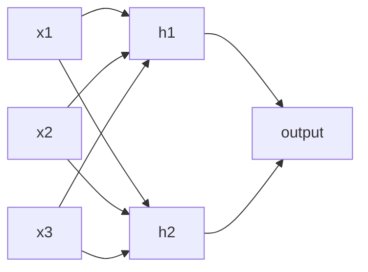

# Neural Networks

### What is Neural Network?

- Neural networks are machine learning models that mimic the complex functions of the human brain.
- These models consist of interconnected nodes or neurons that process data, learn patterns and enable tasks such as pattern recognition and decision-making.
- They are inspired by the human brain and consist of interconnected nodes or neurons arranged in layers.

### Understanding Neural Networks in Deep Learning

Neural networks are capable of learning and identifying patterns directly from data without pre-defined rules. These networks are built from several key components:

- **Neurons:** The basic units that receive inputs, each neuron is governed by a threshold and an activation function.
- **Connections:** Links between neurons that carry information, regulated by weights and biases.
- **Weights and Biases:** These parameters determine the strength and influence of connections.
- **Propagation Functions:** Mechanisms that help process and transfer data across layers of neurons.
- **Learning Rule:** The method that adjusts weights and biases over time to improve accuracy.

A single neuron computes a weighted sum of its inputs plus a bias and passes it through an activation function:

$$a = f\!\left(\sum_j w_j x_j + b\right)$$

Learning in neural networks follows a structured, three-stage process:

- **Input Computation:** Data is fed into the network.
- **Output Generation:** Based on the current parameters, the network generates an output.
- **Iterative Refinement:** The network refines its output by adjusting weights and biases, gradually improving its performance on diverse tasks.

That refinement is gradient descent again, with the gradients supplied by backpropagation. Note that the loss surface of a deep network is **non-convex**, which is why the convexity discussion above matters: the guarantees available to linear and logistic regression do not carry over.
