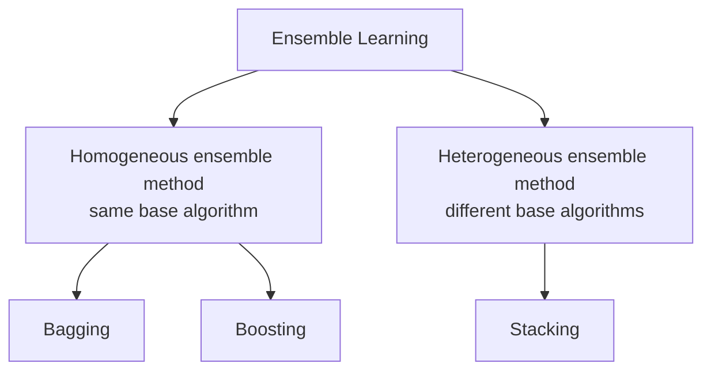
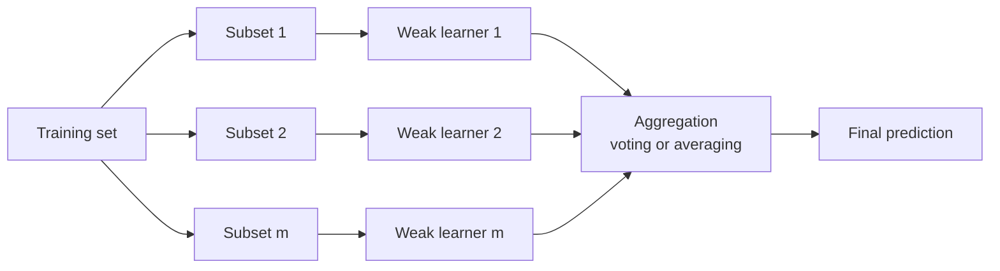
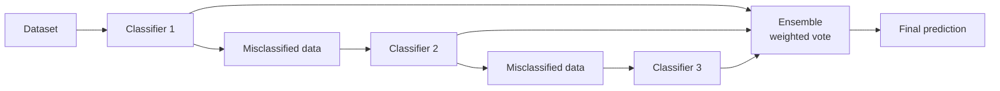
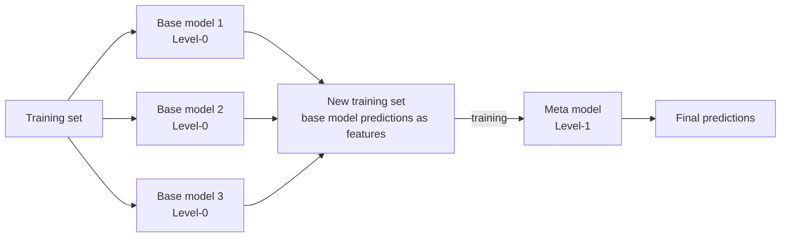

# Ensemble Learning

- Ensemble learning is a technique in machine learning where multiple models (often called "weak learners") are trained and combined to solve the same problem.
- The idea is that a group of models working together can outperform a single strong model.

A **weak learner** is a model only slightly better than random guessing — a shallow tree, for instance. The ensemble bet is that their individual errors are different enough to cancel, leaving the shared signal behind. This is the "wisdom of the crowd".

### When to Use Ensemble Learning?

- You have high variance or high bias in your model.
- Your base models are diverse and complementary.
- You want to increase model performance in competitions (e.g., Kaggle).

The **diversity** condition is not optional: if all base models make the same mistakes, averaging them changes nothing. Which failure you are fixing decides the method — bagging attacks **variance**, boosting attacks **bias**.

### Real-Life Example

Imagine trying to guess a movie's rating:

- One friend uses past ratings
- Another reads online reviews
- A third watches the trailer

Each has weaknesses alone, but combining their opinions gives a better estimate. That's ensemble learning!

Each friend is a base learner drawing on a different information source: historical data, text sentiment, audio-visual content. A trailer can mislead; past ratings can miss a change in a director's style. Combined, the individual biases partly cancel.

A heterogeneous ensemble of Linear Regression, SVM, Decision Tree and a Neural Network feeding one combiner can reach the highest accuracy of any arrangement here — around 96 % on the deck's illustration — at the cost of compute and interpretability.

### Types of Ensemble learning

**Homogeneous** ensembles repeat one algorithm and get their diversity from the data (Random Forest is all decision trees). **Heterogeneous** ensembles combine different algorithm families, which is what stacking is built for.

#### Bagging (Bootstrap Aggregating)

- Models are trained independently on different random subsets of the training data.
- Their results are then combined—usually by averaging (for regression) or voting (for classification).
- This helps reduce variance and prevents over fitting.

Example Algorithms:

- Random Forest (uses decision trees + bagging)

How Bagging Learning model works:

Notation for the process: there are $m$ subsets and therefore $m$ weak learners, $n$ instances in the initial dataset, and $N$ sample points in a particular subset, with ideally $n > N$. (In textbook bagging $N = n$, but sampling *with replacement* means some points repeat and others are left out — those left out are the out-of-bag samples.)

Two properties define bagging: the learners are trained **independently and in parallel**, and the aggregation is a plain vote or average. It reduces **variance** without materially increasing bias.

#### Boosting

- Models are trained one after another. Each new model focuses on fixing the errors made by the previous ones.
- The final prediction is a weighted combination of all models, which helps reduce bias and improve accuracy.
- Models are trained sequentially, each new model focusing on correcting the errors of the previous ones.
- Final prediction is a weighted sum of all models.
- Reduces bias and variance

Popular Boosting Algorithms:

- AdaBoost (Adaptive Boosting)
- Gradient Boosting (GBM)
- XGBoost
- LightGBM
- CatBoost

The mechanism is *learning from mistakes*: train a weak learner, find which points it got wrong, raise the weight of those points, train the next learner to concentrate on them, and repeat for $m$ rounds. The final answer is a weighted vote in which more accurate learners get more say:

$$H(x) = \text{sign}\!\left(\sum_t \alpha_t h_t(x)\right)$$

Boosting is **sequential** — it cannot be parallelised across rounds the way bagging can — and its primary target is **bias**.

#### Stacking (Stacked Generalization)

- Multiple different models (often of different types) are trained, and their predictions are used as inputs to a final model, called a meta-model.
- The meta-model learns how to best combine the predictions of the base models, aiming for better performance than any individual model.
- The predictions of base models are fed to a meta-model (e.g., logistic regression) that learns how to best combine them.
- Leverages strengths of different models
- Useful when base learners are diverse.

The four steps: train the Level-0 base models on the training set; collect their predictions; assemble those predictions as the **features** of a new training set; train the Level-1 **meta-model** on it. The meta-model does not see the original raw features — it sees only what the base models said, and it learns whom to trust when they disagree ("when the SVM and the tree conflict, the SVM is usually right"). Logistic regression is a common choice of meta-model for classification.

Two cautions. Stacking needs **diverse** base learners, since correlated learners give the meta-model nothing to arbitrate. And it overfits easily if the meta-model is trained on predictions the base models made on data they were themselves trained on — the standard remedy is **out-of-fold** (cross-validated) predictions when building the new training set.

### Bagging versus boosting versus stacking

| | Bagging | Boosting | Stacking |
| --- | --- | --- | --- |
| Base learners | Same type | Same type | Usually different types |
| Training order | Parallel, independent | Sequential | Base models parallel, then a meta-model |
| Data per learner | Bootstrap sample | Reweighted towards past errors | Full set (out-of-fold predictions) |
| Combination | Vote / average | Weighted vote | Learned by the meta-model |
| Primarily reduces | Variance | Bias | Both, by learning the combination |
| Example | Random Forest | AdaBoost, XGBoost | Stacked generalisation |
