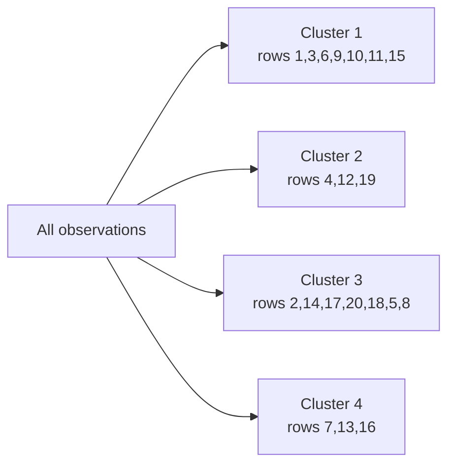

# Dendrograms

- A dendrogram is a tree-like diagram that shows how clusters are merged.
- The dendrogram is a tree diagram that displays the groups that are formed by clustering observations at each step and their similarity levels.
- The similarity level is measured along the vertical axis (alternately, you can display the distance level), and the different observations are listed along the horizontal axis.

The axes carry all the information. Along the **horizontal axis** sit the individual observations, the leaves of the tree — ordered so that branches do not cross, which is why they are rarely in numerical order. The **vertical axis** is distance or similarity, and the height of each horizontal connector is the distance at which those two clusters merged. Low merge, very similar; high merge, quite different.

### Interpretation

1. Use the dendrogram to view how the clusters are formed at each step and to assess the similarity (or distance) levels of the clusters that are formed.
2. To view the similarity (or distance) levels, hold your pointer over a horizontal line in the dendrogram. The pattern of how similarity or distance values change from step to step can help you to choose the final grouping for your data.
3. The step where the values change abruptly may identify a good point to define the final grouping.
4. The decision about final grouping is also called cutting the dendrogram. Cutting the dendrogram is similar to drawing a line across the dendrogram to specify the final grouping.
5. You can also compare dendrograms for different final groupings to determine which final grouping makes the most sense for your data.

Point 3 is the practical rule for choosing $k$: look for a **large vertical gap** between one merge and the next. A big jump means the next merge is joining things that are substantially unalike, which makes the level just below it a natural place to stop.

Cutting the tree is a simple mechanic with a precise meaning: draw a horizontal line at a chosen height, and the number of vertical branches it crosses is the number of clusters. Cutting a dendrogram of A–E at distance 5, for instance, yields two clusters, {A, B, C} and {D, E}. For a divisive tree over A–H, cutting at dissimilarity 6 gives {A, B, C, D} and {E, F, G, H}.

The trade-off is fixed and symmetric:

- Cut **higher** → **fewer** clusters, but **lower** similarity within them.
- Cut **lower** → **more** clusters, but **higher** similarity within them.

### Example Dendrogram

Complete linkage, Euclidean distance, twenty observations, with the vertical axis running from 100 (maximum similarity, every point its own cluster) down to 0 (all points merged):

1. This dendrogram was created using a final partition of 4 clusters, which occurs at a similarity level of approximately 40.
2. The first cluster (far left) is composed of seven observations (the observations in rows 1, 3, 6, 9, 10, 11, and 15 of the worksheet).
3. The second cluster, directly to the right, is composed of 3 observations (the observations in rows 4, 12, and 19 in the worksheet).
4. The third cluster is composed of 7 observations (the observations in rows 2, 14, 17, 20, 18, 5, and 8). The fourth cluster, on the far right, is composed of 3 observations (the observations in rows 7, 13, and 16).
5. If you cut the dendrogram higher, then there would be fewer final clusters, but their similarity level would be lower.
6. If you cut the dendrogram lower, then the similarity level would be higher, but there would be more final clusters.

Within that tree, observations 17 and 20 merge at a similarity near 95 — they are almost identical — while the final merge of the two halves happens at similarity 0, showing those halves are maximally distinct. Cutting at 66.67 would give many small clusters; cutting near 20 would give two large ones.

The underlying metric is Euclidean distance,

$$d(p, q) = \sqrt{\sum_{i=1}^{n} (p_i - q_i)^2}$$

and the linkage is complete, $D(C_1, C_2) = \max\{d(a,b) : a \in C_1, b \in C_2\}$, which is why the clusters come out compact.
