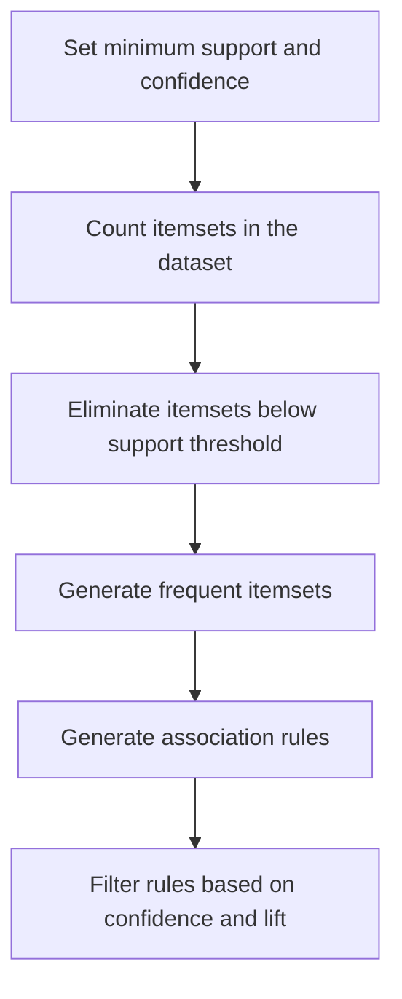

# Apriori Algorithm for Association Rules

- Association rule learning is a rule-based machine learning method to find relationships (associations) between variables in large datasets.

Real life example:

- If a customer buys bread and butter, they are likely to buy jam.
- This is an example of a market basket analysis.

### Steps of Apriori Algorithm

- Set minimum support and confidence
- Generate all frequent itemsets:
  - Count itemsets in the dataset
  - Eliminate itemsets below the support threshold
- Generate association rules from the frequent item sets
- Filter rules based on confidence and lift

### Applications of Apriori Algorithm

- E-commerce: Used to recommend products that are often bought together like laptop + laptop bag, increasing sales.
- Food Delivery Services: Identifies popular combos such as burger + fries, to offer combo deals to customers.
- Streaming Services: Recommends related movies or shows based on what users often watch together like action + superhero movies.
- Financial Services: Analyzes spending habits to suggest personalized offers such as credit card deals based on frequent purchases.
- Travel & Hospitality: Creates travel packages like flight + hotel by finding commonly purchased services together.
- Health & Fitness: Suggests workout plans or supplements based on users' past activities like protein shakes + workouts.
