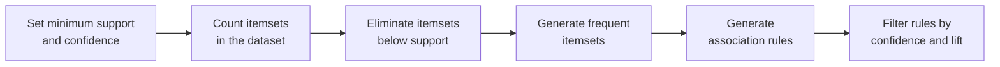

# Apriori Algorithm for Association Rules

- Association rule learning is a rule-based machine learning method to find relationships (associations) between variables in large datasets.

Real life example:

- If a customer buys bread and butter, they are likely to buy jam.
- This is an example of a market basket analysis.

A rule $X \Rightarrow Y$ has an **antecedent** $X$ (the "if" side, e.g. {Bread, Egg}) and a **consequent** $Y$ (the "then" side, e.g. {Milk}); together they form the **itemset** {Bread, Egg, Milk}. The rule states co-occurrence, not causation.

Given an itemset $X = \{x_1, \dots, x_k\}$, we look for all rules with minimum support and confidence, where **support** $s$ is the probability that a transaction contains $X \cup Y$ and **confidence** $c$ is the conditional probability that a transaction containing $X$ also contains $Y$:

$$s(X \Rightarrow Y) = \frac{\sigma(X \cup Y)}{N}, \qquad c(X \Rightarrow Y) = \frac{\sigma(X \cup Y)}{\sigma(X)} = P(Y \mid X)$$

Support is symmetric; confidence is not. **Lift** compares the observed support against what it would be if $X$ and $Y$ were independent, so lift $> 1$ signals a real association rather than a coincidence.

### Steps of Apriori Algorithm

- Set minimum support and confidence
- Generate all frequent itemsets:
  - Count itemsets in the dataset
  - Eliminate itemsets below the support threshold
- Generate association rules from the frequent item sets
- Filter rules based on confidence and lift

The **Apriori property** (downward closure) is what makes this tractable: every non-empty subset of a frequent itemset must itself be frequent, so any candidate containing an infrequent subset can be pruned before it is ever counted. Without that pruning the candidate count grows exponentially. The algorithm proceeds level by level — join the frequent $(k-1)$-itemsets to form candidates, prune, scan the database to count, keep what clears the threshold, increment $k$ — and stops when a level produces nothing frequent. A full numeric trace of the level-wise search appears in Unit II.

### Applications of Apriori Algorithm

- E-commerce: Used to recommend products that are often bought together like laptop + laptop bag, increasing sales.
- Food Delivery Services: Identifies popular combos such as burger + fries, to offer combo deals to customers.
- Streaming Services: Recommends related movies or shows based on what users often watch together like action + superhero movies.
- Financial Services: Analyzes spending habits to suggest personalized offers such as credit card deals based on frequent purchases.
- Travel & Hospitality: Creates travel packages like flight + hotel by finding commonly purchased services together.
- Health & Fitness: Suggests workout plans or supplements based on users' past activities like protein shakes + workouts.

The business patterns behind these are **cross-selling** (laptop → bag), **product bundling** (flight + hotel) and **personalisation** (recommendations from past activity).
