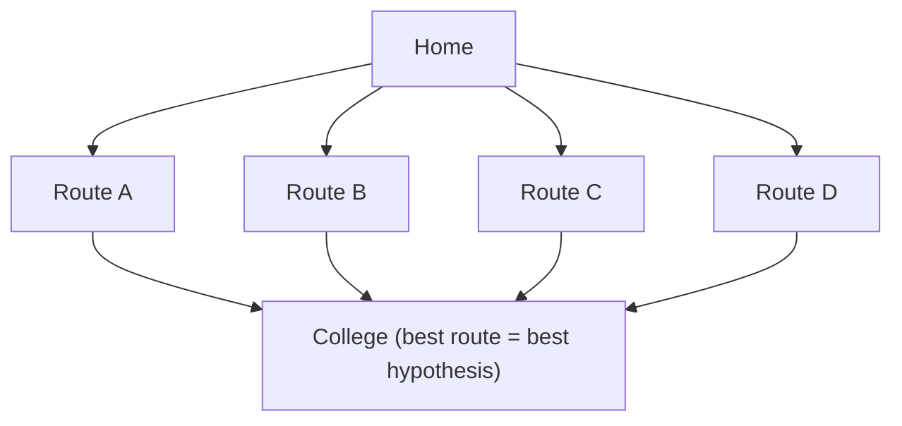

# Hypothesis Space

### What is a Hypothesis?

- In Machine Learning, a hypothesis is a mathematical function or model that maps input features (X) to an output (Y).
- It is the model's prediction function learned from the training data.
- Mathematically, $Y = h(X)$ where:
  - X = Input (Features)
  - Y = Output (Target/Class)
  - h = Hypothesis

#### Example

Suppose we want to predict the marks of a student based on study hours.

| Study Hours | Marks |
| --- | --- |
| 2 | 35 |
| 4 | 55 |
| 6 | 72 |

A possible hypothesis is $h(x)$, where:

- x = Study Hours
- h(x) = Predicted Marks

### What is Hypothesis Space?

- The Hypothesis Space is the set of all possible hypotheses (models) that a learning algorithm can choose from to solve a problem.
- It is denoted by $H$, where each hypothesis represents a different model.
- Hypothesis Space is the collection of all candidate functions that can approximate the relationship between inputs and outputs.

### Why is Hypothesis Space Needed?

1. A machine learning algorithm does not know the correct model initially.
2. Instead, it searches among many possible models to find the one that best fits the training data.
3. The collection of all these possible models is called the Hypothesis Space.

### Real-Life Analogy

- "Find the best route from your home to college."
- Possible routes are: 1. Route A  2. Route B  3. Route C  4. Route D
- Each route is a possible solution.
- Similarly,
  1. Each model = one hypothesis
  2. All models together = hypothesis space
  3. The ML algorithm chooses the best route (best hypothesis).

### Example of Hypothesis Space

Suppose we want to classify emails as Spam or Not Spam. Possible hypotheses:

1. Hypothesis 1: If email contains "Lottery" → Spam
2. Hypothesis 2: If email contains "Free" → Spam
3. Hypothesis 3: If email contains "Lottery" AND "Prize" → Spam
4. Hypothesis 4: Always predict Not Spam

All these hypothesis together form Hypothesis SPACE.

### Mathematical Representation

- Suppose $h(x) = wx + b$.
- Different values of w and b produce different hypotheses.
