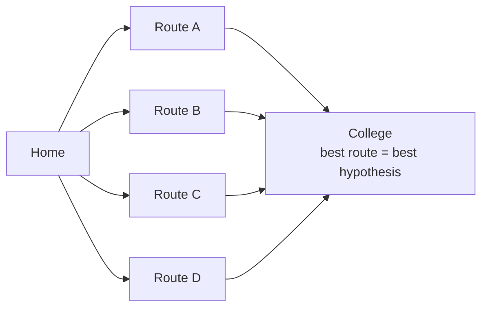

# Hypothesis Space

### What is a Hypothesis?

- In Machine Learning, a hypothesis is a mathematical function or model that maps input features (X) to an output (Y).
- It is the model's prediction function learned from the training data.
- Mathematically, $Y = h(X)$ where:
  - X = Input (Features)
  - Y = Output (Target/Class)
  - h = Hypothesis

Written as a mapping,

$$h : X \to Y$$

which says that $h$ takes any element of the input (feature) space $X$ and produces a prediction in the output (label) space $Y$. $Y$ may be continuous (regression) or discrete (classification). A hypothesis is not fixed in advance — it is *selected* by the learning algorithm during training.

#### Example

Suppose we want to predict the marks of a student based on study hours.

| Study Hours | Marks |
| --- | --- |
| 2 | 35 |
| 4 | 55 |
| 6 | 72 |

A possible hypothesis is $h(x)$, where:

- x = Study Hours
- h(x) = Predicted Marks

$$h(x) = 10x + 15$$

Check it against the table: $h(2) = 35$ and $h(4) = 55$ match exactly, while $h(6) = 75$ against an actual 72 — an error of 3. That is why the slide calls it a *possible* hypothesis rather than the right one: many lines fit this data, and the learning algorithm's job is to find the one with the least total error. Here 10 is the weight (marks gained per extra hour of study) and 15 is the bias (predicted marks for zero hours).

### What is Hypothesis Space?

- The Hypothesis Space is the set of all possible hypotheses (models) that a learning algorithm can choose from to solve a problem.
- It is denoted by $H$, where each hypothesis represents a different model.
- Hypothesis Space is the collection of all candidate functions that can approximate the relationship between inputs and outputs.

$$H = \{h_1, h_2, h_3, \dots, h_n\}$$

The set may be finite or, more usually, infinite — every possible straight line, every possible decision tree. Choosing a model class *is* choosing $H$, and learning is then a **search** through $H$ for the member with the lowest error.

### Why is Hypothesis Space Needed?

1. A machine learning algorithm does not know the correct model initially.
2. Instead, it searches among many possible models to find the one that best fits the training data.
3. The collection of all these possible models is called the Hypothesis Space.

Without a defined $H$ the search would be unbounded and there would be no systematic way to look for a solution. The size of $H$ also sets the two failure modes: too small and the correct solution may not be inside it (underfitting, high bias); too large and the search can land on a hypothesis tuned to the training set's noise (overfitting).

### Real-Life Analogy

- "Find the best route from your home to college."
- Possible routes are: 1. Route A  2. Route B  3. Route C  4. Route D
- Each route is a possible solution.
- Similarly,
  1. Each model = one hypothesis
  2. All models together = hypothesis space
  3. The ML algorithm chooses the best route (best hypothesis).

### Example of Hypothesis Space

Suppose we want to classify emails as Spam or Not Spam. Possible hypotheses:

1. Hypothesis 1: If email contains "Lottery" → Spam
2. Hypothesis 2: If email contains "Free" → Spam
3. Hypothesis 3: If email contains "Lottery" AND "Prize" → Spam
4. Hypothesis 4: Always predict Not Spam

All these hypothesis together form Hypothesis SPACE.

Note the range on display: three feature-based rules, one of which uses a logical AND, plus a **constant** baseline hypothesis that ignores the input entirely. The baseline is a legitimate member of $H$ — and a useful one, because any real model must beat it.

### Mathematical Representation

- Suppose $h(x) = wx + b$.
- Different values of w and b produce different hypotheses.

$$h_1(x) = 2x + 1, \qquad h_2(x) = 3x + 5, \qquad h_3(x) = 5x - 2$$

The collection

$$H = \{2x + 1,\; 3x + 5,\; 5x - 2,\; \dots\}$$

is the Hypothesis Space — here, the set of *all* linear functions of one variable. Every distinct pair $(w, b)$ is one hypothesis inside it, and training is the search for the best pair. Choosing this $H$ is also a commitment: a linear hypothesis space cannot represent a non-linear pattern, no matter how much data it is given.
