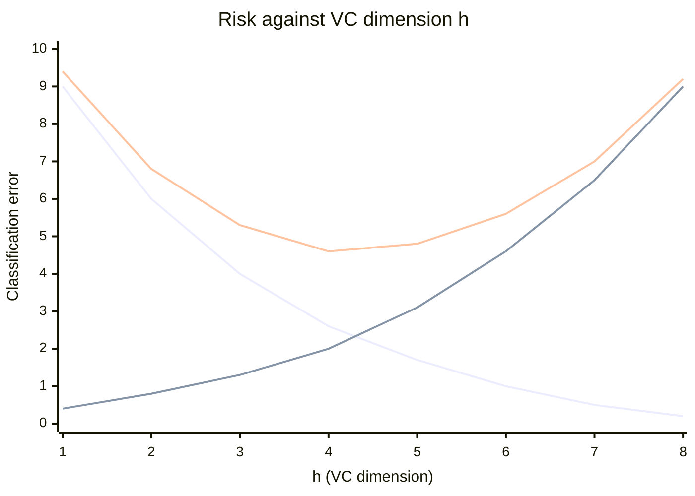

# VC Dimension

### VC Dimension (Vapnik–Chervonenkis Dimension)

1. VC dimension measures the capacity (complexity) of a hypothesis space — how well a model can fit various patterns.
2. It is the maximum number of points that can be shattered (i.e., classified correctly in all possible ways) by the hypothesis class.

Examples:

- VC Dimension of a linear classifier in 2D: 3
- VC Dimension of a decision stump (1-level decision tree): 1
- VC Dimension of a k-nearest neighbor (if k=1): infinite

**Shattering** is a counting condition. A set of $N$ points admits $2^N$ possible binary labellings; the hypothesis class shatters that set only if for *every one* of those $2^N$ labellings there exists a hypothesis in the class that realises it exactly.

- A line in 2D can shatter 3 points in general position, but not 4 in an XOR/checkerboard arrangement — hence $VC = 3$. In general, a linear classifier in $d$ dimensions has $VC = d + 1$.
- A 1-nearest-neighbour model assigns each point the label of its nearest training point, so it can reproduce *any* labelling of *any* number of points. Its capacity — and its appetite for overfitting — is unbounded.

### VC Dimension (Detail)

- The Vapnik-Chervonenkis (VC) dimension is a measure of the capacity of a hypothesis set to fit different data sets.
- It was introduced by Vladimir Vapnik and Alexey Chervonenkis in the 1970s and has become a fundamental concept in statistical learning theory.
- The VC dimension is a measure of the complexity of a model, which can help us understand how well it can fit different data sets.
- The VC dimension of a hypothesis set H is the largest number of points that can be shattered by H.
- A hypothesis set H shatters a set of points S if, for every possible labeling of the points in S, there exists a hypothesis in H that correctly classifies the points.

Formally, $VC(H)$ is the size of the largest finite subset of $X$ shattered by $H$:

$$VC(H) = \max\{\,n : \exists S,\ |S| = n,\ H \text{ shatters } S\,\}$$

If $VC(H) = k$, then for every set of $k+1$ points there exists a labelling that cannot be shattered — no hypothesis in $H$ is consistent with it. If arbitrarily large finite subsets of $X$ can be shattered, then $VC(H) = \infty$.

The proof obligations are asymmetric and worth memorising: to show $VC(H) \ge k$ you need **one** set of $k$ points that *is* shattered; to show $VC(H) < k+1$ you must show that **no** set of $k+1$ points can be shattered.

#### Example: spherical decision functions

Spherical decision functions $f(c, r, \mathbf{x})$ — circles in the plane, with centre $c$, radius $r$, and the rule $h(\mathbf{x}) = +1$ if $\|\mathbf{x} - c\| \le r$ — **can shatter 3 points but cannot shatter 4**.

With three points in a triangle, some circle picks out any subset you like: one point alone, a pair, or all three — all $2^3 = 8$ labellings are achievable. With four points arranged as a triangle plus one point *inside* it, label the three outer points positive and the inner point negative: no circle can enclose the three outer points without also enclosing the inner one. One impossible labelling is enough, so the VC dimension of circles in 2D is 3.

### VC dimension and empirical risk

Three curves, in the order plotted: **empirical risk** falls monotonically as capacity grows, because a more flexible model fits the training data ever more closely; the **confidence interval** (the complexity penalty, roughly $\propto \sqrt{h/N}$) rises monotonically; and **true risk**, their sum, is U-shaped. The minimum of that U is the optimal capacity. To its left the model **underfits**; to its right it **overfits**.

$$R(h) \le R_{\text{emp}}(h) + \Omega\!\left(\frac{h}{N}\right)$$

This picture is the argument for **Structural Risk Minimization** over plain ERM: empirical risk is a decreasing function of VC dimension, so minimising it alone drives capacity upward without limit. The optimal model sits at the minimum of the *true* risk curve, not the empirical one.

### Why is it important?

- Helps understand underfitting vs overfitting
- A model with high VC dimension can overfit.
- A balance is needed between model complexity and generalization.
