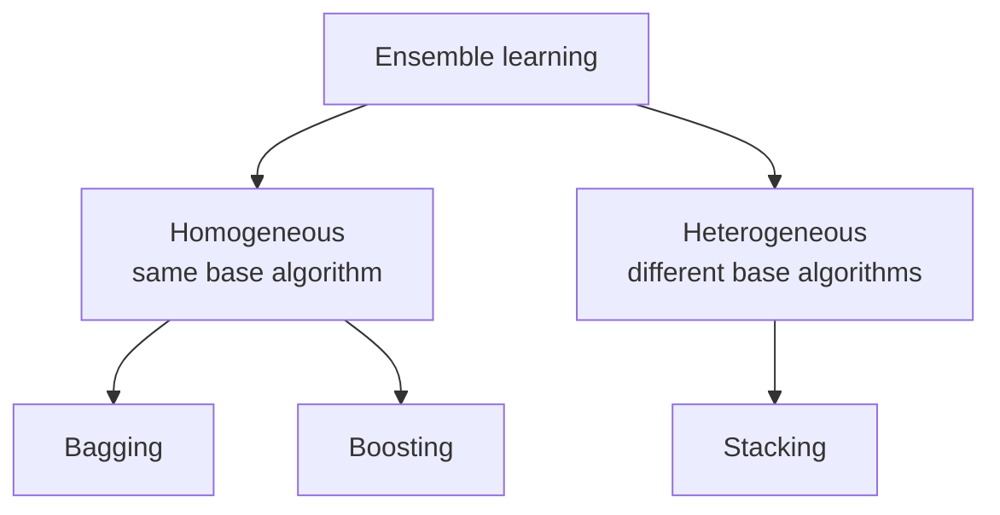
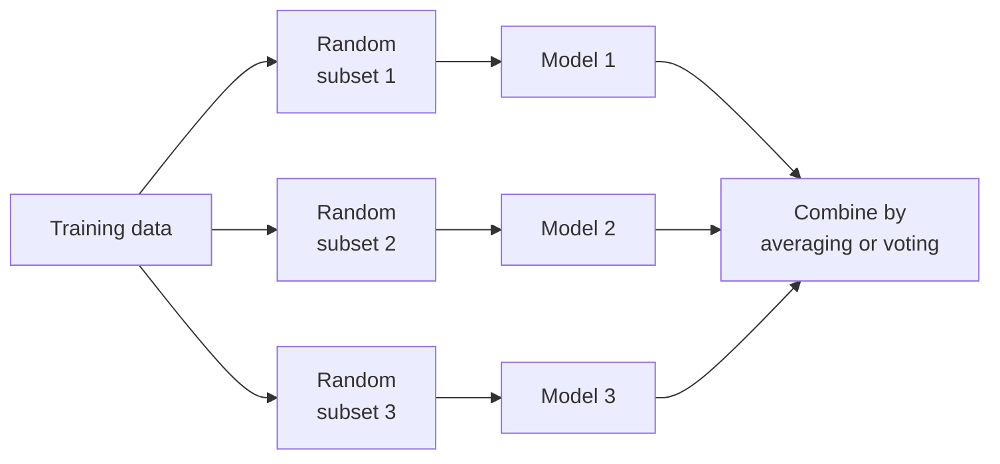
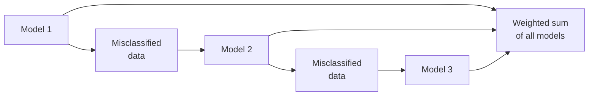
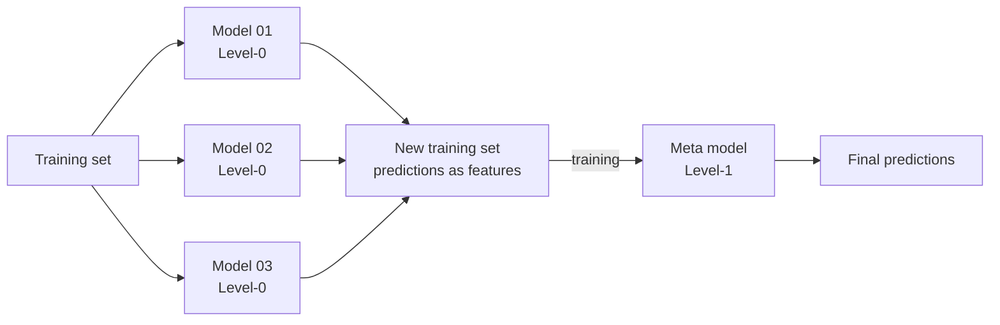

# 3.3 Ensemble Methods

Ensemble Methods (Boosting, Bagging, Random Forests)

### Ensemble learning

- Ensemble learning is a technique in machine learning where multiple models (often called "weak learners") are trained and combined to solve the same problem.
- The idea is that a group of models working together can outperform a single strong model.

A **weak learner** performs only slightly better than chance on its own. The ensemble works because their errors are not identical: aggregate enough diverse learners and the individual mistakes cancel while the shared signal survives.

### When to Use Ensemble Learning?

- You have high variance or high bias in your model.
- Your base models are diverse and complementary.
- You want to increase model performance in competitions (e.g., Kaggle).

Which problem you have decides the method: **bagging** attacks high variance, **boosting** attacks high bias. The **diversity** requirement is strict — models that make the same errors add nothing when combined.

#### Real-Life Example

- Imagine trying to guess a movie's rating:
  - One friend uses past ratings
  - Another reads online reviews
  - A third watches the trailer
- Each has weaknesses alone, but combining their opinions gives a better estimate. That's ensemble learning!

Each friend is a base learner on a different information source — historical data, text sentiment, audio-visual content — and each has a characteristic blind spot. A trailer can mislead; past ratings can miss a change in style. Averaging the three opinions cancels part of every individual bias.

Accuracy: Highest

### Types of Ensemble learning

#### Bagging (Bootstrap Aggregating)

- Models are trained independently on different random subsets of the training data.
- Their results are then combined—usually by averaging (for regression) or voting (for classification).
- This helps reduce variance and prevents over fitting.
- Example Algorithms:
  - Random Forest (uses decision trees + bagging)

The subsets are drawn **with replacement**, so a point can appear more than once in one subset and not at all in another; the ones left out are the out-of-bag samples used for internal validation. The learners train **independently and in parallel**, and the aggregation is a plain vote or mean:

$$H(x) = \text{mode}\{h_1(x), h_2(x), h_3(x)\}$$

Bagging reduces **variance** without materially increasing bias.

#### Boosting

- Models are trained one after another. Each new model focuses on fixing the errors made by the previous ones.
- The final prediction is a weighted combination of all models, which helps reduce bias and improve accuracy.
- Models are trained sequentially, each new model focusing on correcting the errors of the previous ones.
- Final prediction is a weighted sum of all models.
- Reduces bias and variance

The loop is train → test → find the false predictions → raise the weight of those examples → train the next weak learner on them, repeated for $m$ rounds. The final decision is a weighted vote in which the more accurate learners speak louder:

$$H(x) = \text{sign}\!\left(\sum_t \alpha_t h_t(x)\right)$$

Because each round depends on the previous one, boosting cannot be parallelised across rounds the way bagging can.

Popular Boosting Algorithms:

- AdaBoost (Adaptive Boosting)
- Gradient Boosting (GBM)
- XGBoost
- LightGBM
- CatBoost

#### Stacking (Stacked Generalization)

- Multiple different models (often of different types) are trained, and their predictions are used as inputs to a final model, called a meta-model.
- The meta-model learns how to best combine the predictions of the base models, aiming for better performance than any individual model.
- The predictions of base models are fed to a meta-model (e.g., logistic regression) that learns how to best combine them.
- Leverages strengths of different models
- Useful when base learners are diverse.

Four steps: train the Level-0 base models on the training set; collect their predictions; treat those predictions as the **features** of a new training set; train the Level-1 **meta-model** on it. The meta-model never sees the original raw features — it sees only what the base models said, and it learns whom to trust when they disagree. Logistic regression is a common meta-model for classification because it blends inputs smoothly.

Two cautions. Base learners must be **diverse**, or there is nothing for the meta-model to arbitrate. And stacking overfits if the meta-model is trained on predictions the base models made about their own training data — the standard fix is **out-of-fold** (cross-validated) predictions when constructing the new training set.

| | Bagging | Boosting | Stacking |
| --- | --- | --- | --- |
| Base learners | Same type | Same type | Usually different types |
| Training order | Parallel, independent | Sequential | Base models parallel, then a meta-model |
| Combination | Vote / average | Weighted vote | Learned by the meta-model |
| Primarily reduces | Variance | Bias | Both, by learning the combination |
| Example | Random Forest | AdaBoost, XGBoost | Stacked generalisation |

#### Real-Life Example

- Imagine trying to guess a movie's rating:
  - One friend uses past ratings
  - Another reads online reviews
  - A third watches the trailer
- Each has weaknesses alone, but combining their opinions gives a better estimate. That's ensemble learning!
