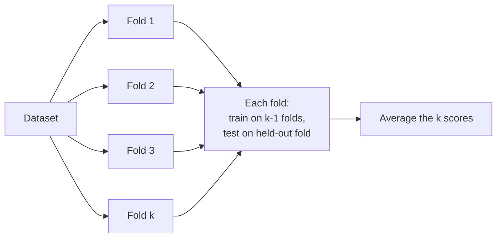

# Validation Techniques

- Hold-out method (train/test split)
- k-Fold Cross-Validation
- Leave-One-Out Cross-Validation (LOOCV)
- Stratified sampling (for imbalanced datasets)

- **Hold-out** splits the data once, commonly 80/20. It is fast, but the estimate depends on the luck of that single split.
- **k-Fold** trains $k$ times, each time holding out a different fold, and averages the $k$ scores. More computation, far lower variance in the estimate.
- **LOOCV** is the extreme case $k = N$: one sample held out per round. It squeezes the maximum training data out of the dataset but requires $N$ retrainings, so it is expensive.
- **Stratified sampling** preserves the class proportions inside every fold. On a dataset that is 95 % "no disease" and 5 % "disease", an unstratified fold could contain almost no positive cases, making the evaluation meaningless.
