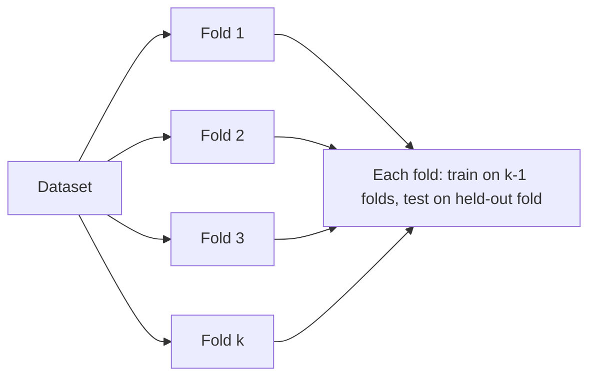

# Validation Techniques

- Hold-out method (train/test split)
- k-Fold Cross-Validation
- Leave-One-Out Cross-Validation (LOOCV)
- Stratified sampling (for imbalanced datasets)

```mermaid
flowchart LR
    D["Dataset"] --> F1["Fold 1"]
    D --> F2["Fold 2"]
    D --> F3["Fold 3"]
    D --> Fk["Fold k"]
    F1 --> T["Each fold: train on k-1 folds, test on held-out fold"]
    F2 --> T
    F3 --> T
    Fk --> T
```
