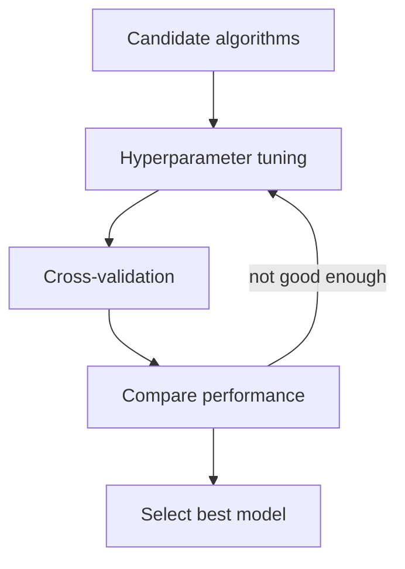

# Model Selection Strategies

- Comparing multiple algorithms
- Hyperparameter tuning
  - Grid Search
  - Random Search
  - Bayesian Optimization
- Automated Machine Learning (AutoML)

```mermaid
flowchart TD
    A["Candidate algorithms"] --> B["Hyperparameter tuning"]
    B --> C["Cross-validation"]
    C --> D["Compare performance"]
    D --> E["Select best model"]
    D -->|"not good enough"| B
```
