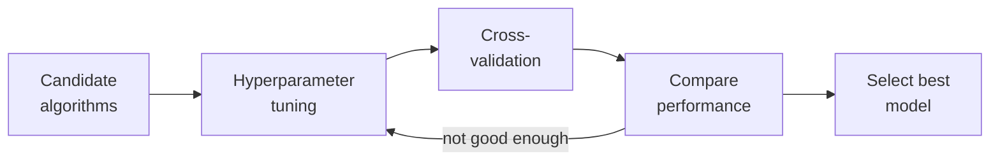

# Model Selection Strategies

- Comparing multiple algorithms
- Hyperparameter tuning
  - Grid Search
  - Random Search
  - Bayesian Optimization
- Automated Machine Learning (AutoML)

Selection happens at three levels. First, **compare algorithm families** — logistic regression against random forest against gradient boosting — to see which architecture suits the data. Second, **tune the hyperparameters** of the chosen algorithm, the settings that are not learned from data:

- **Grid Search** is brute force: try every combination in a predefined grid. Systematic, exhaustive, and expensive.
- **Random Search** samples combinations at random. Often finds a better configuration than grid search in far fewer trials, especially in high-dimensional parameter spaces.
- **Bayesian Optimization** is *informed* search: it builds a probabilistic model of the objective and uses it to choose the most promising configuration to try next, so each evaluation improves the next guess.

Third, **AutoML** automates the whole pipeline — feature engineering, algorithm choice and tuning together.
