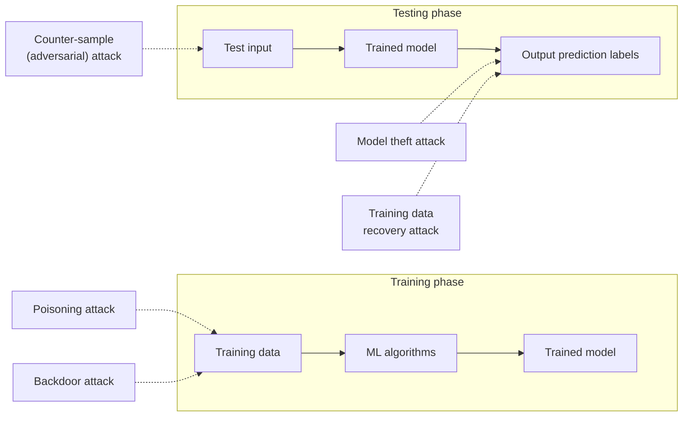

# Machine Learning Security

Evaluation asks whether a model is accurate. Security asks whether it can be **attacked**, and the attack surface splits neatly across the two phases of the lifecycle.

**Integrity attacks on training data:**

- **Poisoning attack** — the attacker injects malicious samples into the training set to degrade overall performance or force specific misclassifications.
- **Backdoor attack** — the attacker plants a *trigger* in the training data. The model behaves normally on ordinary inputs but acts maliciously whenever the trigger appears.

**Evasion attack at inference:**

- **Counter-sample (adversarial) attack** — the input is perturbed by an amount often invisible to a human, yet enough to flip the trained model's prediction. The model itself is untouched; it is simply fooled.

**Privacy and confidentiality attacks on outputs:**

- **Model theft attack** — the attacker queries the model repeatedly and uses the answers to train a shadow model that mimics it, stealing the intellectual property.
- **Training data recovery (inversion) attack** — the attacker analyses the outputs to reconstruct or infer sensitive information about the data the model was trained on.

The lesson is that securing an ML system is not just server security: the integrity of the *data*, the robustness of the *inputs*, and the privacy of the *outputs* are all separate attack surfaces.
