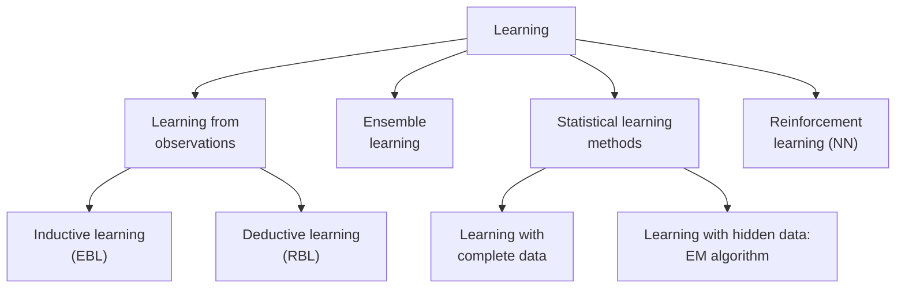

# 3.2 Introduction to Statistical Learning Theory

- Statistical Learning Theory (SLT) is a theoretical framework for understanding how machines learn from data and make predictions.
- It provides the mathematical foundations behind many modern machine learning algorithms and helps explain their performance, limitations, and generalization ability.

Where the rest of the course studies particular algorithms, SLT studies the *general* problem of inferring a predictive function from data. It answers "why does this work, and when will it fail?" using probability theory, and it delivers three things: an account of **performance**, an account of **limitations**, and mathematical bounds on **generalization ability**.

The goals of learning are **understanding** and **prediction**. Learning falls into many categories — supervised, unsupervised, online, reinforcement — and in all of them the learning problem consists of **inferring the function that maps between the input and the output**, such that the learned function can be used to predict output from future input.

### Where statistical learning sits

**Inductive** learning generalises from specific examples; **deductive** learning derives specifics from general rules. Within statistical learning, the split is by data availability: with **complete data** every variable is observed, while with **hidden (latent)** variables the standard tool is the **Expectation–Maximization (EM)** algorithm.

### Learning Problem

- Input: A dataset consisting of feature vectors and corresponding labels.
- Goal: Learn a function (hypothesis) that maps inputs to outputs with minimal error.

In symbols: feature vectors $x \in \mathbb{R}^d$, labels $y$, and a hypothesis $h(x) = \hat{y}$ chosen to minimise error.

### Hypothesis Space (H)

- The set of all possible models the learning algorithm can choose from.
- Example: In linear regression, the hypothesis space is the set of all linear functions.

If you are searching a house for a lost key, the hypothesis space is the inside of the house — you do not look in the garden, because it lies outside the defined search space. Choosing $H$ is therefore choosing the model's **inductive bias**: if the true relationship is not inside $H$, no amount of training will find it.

### Risk and Loss Functions

- Loss function: Measures the error of predictions (e.g., squared error, hinge loss, cross-entropy).
- Expected Risk (True Risk): Average loss over the entire data distribution (unknown in practice).
- Empirical Risk: Average loss over the training dataset (known).

The distinction to keep straight: **loss** is the error on one data point, **risk** is the average loss. True risk is an expectation over the joint distribution of inputs and outputs, and since we never possess that distribution, true risk is a theoretical quantity we cannot compute. Empirical risk is what we can actually measure.

Empirical Risk:

$$R_{\text{emp}}(h) = \frac{1}{n} \sum_{i=1}^{n} L(y_i, h(x_i))$$

#### Empirical Risk Minimization (ERM)

- A principle where the learner chooses the hypothesis that minimizes the training error.
- Problem: ERM may lead to overfitting if the hypothesis is too complex.

$$h^* = \arg\min_{h \in H} R_{\text{emp}}(h)$$

ERM bets that the hypothesis which performs best on the training sample will also perform well on unseen data. The bet fails when $H$ is flexible enough to drive the training error to zero by memorising noise — a model with sufficient capacity can always do this, which is why ERM needs a complexity control bolted on.

### Generalization

- The ability of a model to perform well on unseen data.
- Statistical Learning Theory provides tools (like VC dimension, bounds, and regularization) to study generalization.

### VC Dimension and Capacity Control

- Vapnik–Chervonenkis (VC) dimension: A measure of the complexity or capacity of a hypothesis space.
- Models with very high VC dimension can overfit; too low VC dimension may underfit.

**Capacity control** is the act of choosing the right level of flexibility. High VC dimension means the model can fit intricate patterns — including the noise, which is overfitting (low training error, high test error). Low VC dimension means the model cannot capture the true pattern at all, which is underfitting (high error on both).

### Structural Risk Minimization (SRM)

- An approach that balances model complexity and training error.
- Introduces regularization to avoid overfitting and improve generalization.

SRM replaces "minimise the training error" with "minimise the training error **plus** a penalty for complexity":

$$R(h) \le R_{\text{emp}}(h) + \Omega(h)$$

where $\Omega$ is a confidence term that grows with the VC dimension and shrinks as the sample size grows, roughly as $\sqrt{h/N}$. **Regularization** (L1, L2) is the practical implementation of that penalty.

### PAC Learning (Probably Approximately Correct)

- Framework that defines conditions under which a learning algorithm can guarantee that the learned hypothesis is close to the true function, with high probability.

The two words in the name are the two parameters:

- **Approximately correct** — the error of the learned hypothesis is at most $\epsilon$. We do not demand perfection, only "close enough".
- **Probably** — the algorithm achieves that with probability at least $1 - \delta$, where $\delta$ is the confidence parameter.

Introduced by Leslie Valiant, the framework's practical output is **sample complexity**: how many training examples are needed to be probably approximately correct.
