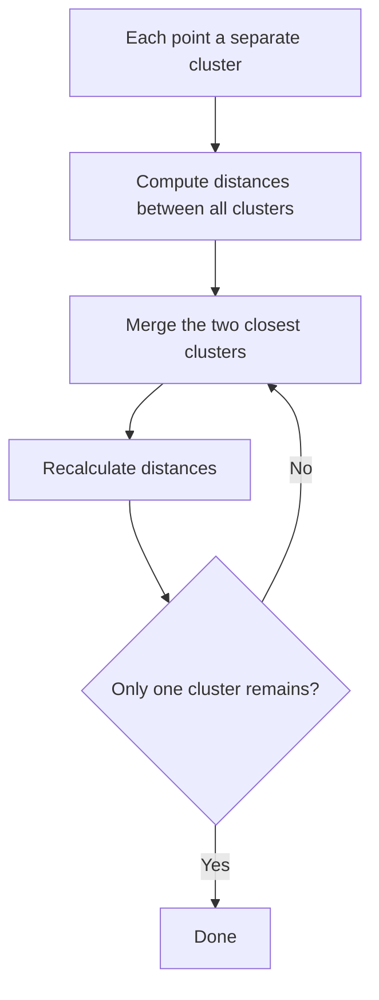

# Hierarchical Clustering

- Hierarchical clustering is an unsupervised machine learning technique used to group similar data points into clusters.
- Unlike algorithms such as K-Means, it does not require the number of clusters to be specified in advance.

### Agglomerative Hierarchical Clustering (Bottom-Up)

- Starts with each data point as an individual cluster.
- Repeatedly merges the two most similar clusters.
- Continues until all points belong to a single cluster or a stopping criterion is reached.
- This is the most commonly used approach.

#### How Agglomerative Hierarchical Clustering Works

1. Suppose you have five data points: A, B, C, D, E.
2. Treat each point as a separate cluster.
3. Compute the distance between all clusters.
4. Merge the two closest clusters.
5. Recalculate distances.
6. Repeat until only one cluster remains.

#### Linkage Methods

| Linkage Method | Description |
| --- | --- |
| Single Linkage | Minimum distance between two clusters |
| Complete Linkage | Maximum distance between two clusters |
| Average Linkage | Average distance between all pairs of points |
| Ward's Linkage | Minimizes the increase in within-cluster variance |

### Divisive Hierarchical Clustering (Top-Down)

- Starts with all data points in one cluster.
- Repeatedly splits clusters into smaller clusters.
- Continues until each data point forms its own cluster or the desired number of clusters is obtained.
