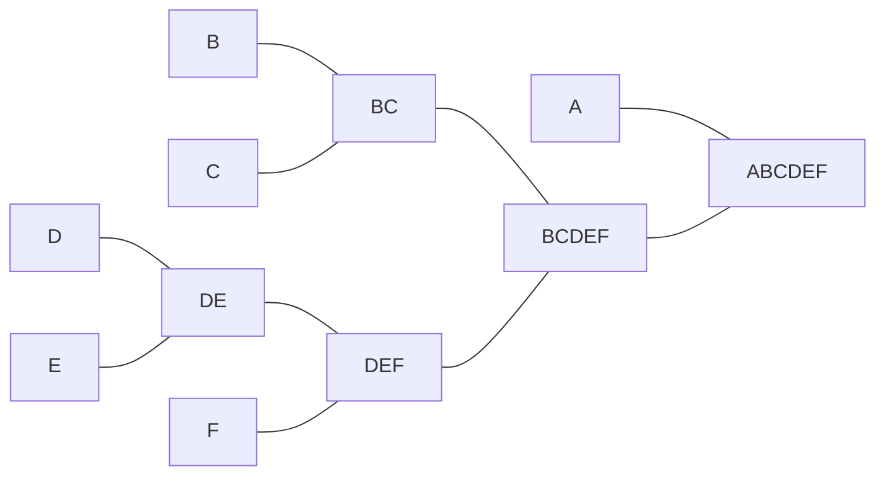
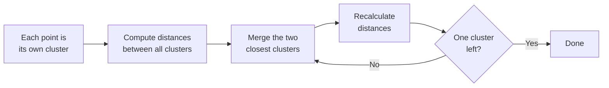

# Hierarchical Clustering

- Hierarchical clustering is an unsupervised machine learning technique used to group similar data points into clusters.
- Unlike algorithms such as K-Means, it does not require the number of clusters to be specified in advance.

That is the headline advantage. K-Means demands $k$ up front; hierarchical clustering builds a whole nested tree of clusters and lets you decide the number *afterwards* by cutting the tree at a chosen height. The result is a hierarchy: pairs of very similar points merge at the lowest level, those small clusters merge into larger ones, and the outermost level contains the entire dataset.

### Agglomerative Hierarchical Clustering (Bottom-Up)

- Starts with each data point as an individual cluster.
- Repeatedly merges the two most similar clusters.
- Continues until all points belong to a single cluster or a stopping criterion is reached.
- This is the most commonly used approach.

Reading the merges for six points: **B** and **C** join first, **D** and **E** join, then **DE** absorbs **F** to give **DEF**, then **BC** and **DEF** merge into **BCDEF**, and finally **A** joins to give the root **ABCDEF**. Starting from $N$ points there are $N$ clusters, and each step reduces the count by one.

#### How Agglomerative Hierarchical Clustering Works

1. Suppose you have five data points: A, B, C, D, E.
2. Treat each point as a separate cluster.
3. Compute the distance between all clusters.
4. Merge the two closest clusters.
5. Recalculate distances.
6. Repeat until only one cluster remains.

Step 5 is the subtle one: after a merge, the distance from the *new* cluster to every remaining cluster must be recomputed, and how that is done is exactly what a linkage method specifies.

Worked through for five points A–E: A and B merge first, then D and E, then (A,B) absorbs C, then the two groups (A,B,C) and (D,E) merge, leaving one cluster.

#### Linkage Methods

A linkage method defines how the distance between two *clusters* (rather than two points) is computed.

| Linkage Method | Description |
| --- | --- |
| Single Linkage | Minimum distance between two clusters |
| Complete Linkage | Maximum distance between two clusters |
| Average Linkage | Average distance between all pairs of points |
| Ward's Linkage | Minimizes the increase in within-cluster variance |

Formally, for clusters $A$ and $B$:

$$d_{\text{single}}(A,B) = \min\{d(a,b) : a \in A, b \in B\}$$

$$d_{\text{complete}}(A,B) = \max\{d(a,b) : a \in A, b \in B\}$$

$$d_{\text{average}}(A,B) = \frac{1}{|A| \cdot |B|} \sum_{a \in A} \sum_{b \in B} d(a,b)$$

Ward's method uses no direct distance at all: it merges whichever pair produces the **smallest increase in the total within-cluster sum of squares**, which makes its objective very close to that of K-Means.

| Linkage method | Distance between clusters | Cluster shape | Robustness to noise | Best used when |
| --- | --- | --- | --- | --- |
| Single (minimum) | Minimum distance between points | Long, irregular | Low | Clusters are non-compact, chaining acceptable |
| Complete (maximum) | Maximum distance between points | Compact, spherical | High | Clusters are compact and well separated |
| Average (UPGMA) | Average over all pairs | Moderate | Medium | General purpose |
| Ward's (min. variance) | Minimum increase in within-cluster variance | Compact, spherical | High | Clusters of similar size and variance |

The failure mode with a name is the **chaining effect** in single linkage: because only one close pair is needed for a merge, a single noisy point sitting between two groups can pull them together, producing long thin "chains". Complete linkage requires *all* members to be reasonably close and so resists this. **UPGMA** stands for Unweighted Pair Group Method with Arithmetic Mean. Single linkage does have its uses — it is the right choice for genuinely elongated shapes such as concentric rings or crescents.

### Divisive Hierarchical Clustering (Top-Down)

- Starts with all data points in one cluster.
- Repeatedly splits clusters into smaller clusters.
- Continues until each data point forms its own cluster or the desired number of clusters is obtained.

The mirror image of agglomerative: begin with the root **ABCDEF**, split off **A** from **BCDEF**, split that into **BC** and **DEF**, then break each down until every point stands alone. At each step the algorithm must choose which cluster to split *and* how to split it — often by running a flat algorithm such as K-Means inside the cluster.

| Feature | Divisive (top-down) | Agglomerative (bottom-up) |
| --- | --- | --- |
| Start | All points in one cluster | Each point as a single cluster |
| Operation | Repeatedly split clusters | Repeatedly merge clusters |
| End | Each point is a cluster (or the desired number) | All points in one cluster (or the desired number) |
| Complexity | Higher | Lower — more commonly used |

Why divisive costs more: a cluster of size $n$ can be split into two non-empty subsets in $2^{n-1} - 1$ ways, so finding the *best* split is expensive, whereas agglomerative merging only has to find the closest existing pair. **DIANA** (Divisive Analysis) is the classic algorithm. Stopping criteria for either direction: a target number of clusters, a minimum cluster size, or a maximum tree depth.

Applications of both: market segmentation, document classification, gene expression analysis, social network analysis.
