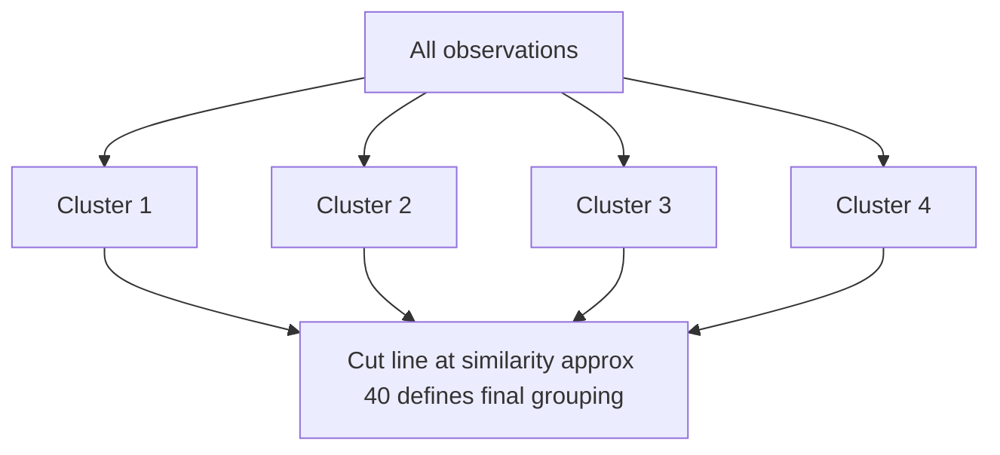

# Dendrograms

- A dendrogram is a tree-like diagram that shows how clusters are merged.
- The dendrogram is a tree diagram that displays the groups that are formed by clustering observations at each step and their similarity levels.
- The similarity level is measured along the vertical axis (alternately, you can display the distance level), and the different observations are listed along the horizontal axis.

### Interpretation

1. Use the dendrogram to view how the clusters are formed at each step and to assess the similarity (or distance) levels of the clusters that are formed.
2. To view the similarity (or distance) levels, hold your pointer over a horizontal line in the dendrogram. The pattern of how similarity or distance values change from step to step can help you to choose the final grouping for your data.
3. The step where the values change abruptly may identify a good point to define the final grouping.
4. The decision about final grouping is also called cutting the dendrogram. Cutting the dendrogram is similar to drawing a line across the dendrogram to specify the final grouping.
5. You can also compare dendrograms for different final groupings to determine which final grouping makes the most sense for your data.

### Example Dendrogram

1. This dendrogram was created using a final partition of 4 clusters, which occurs at a similarity level of approximately 40.
2. The first cluster (far left) is composed of seven observations (the observations in rows 1, 3, 6, 9, 10, 11, and 15 of the worksheet).
3. The second cluster, directly to the right, is composed of 3 observations (the observations in rows 4, 12, and 19 in the worksheet).
4. The third cluster is composed of 7 observations (the observations in rows 2, 14, 17, 20, 18, 5, and 8). The fourth cluster, on the far right, is composed of 3 observations (the observations in rows 7, 13, and 16).
5. If you cut the dendrogram higher, then there would be fewer final clusters, but their similarity level would be lower.
6. If you cut the dendrogram lower, then the similarity level would be higher, but there would be more final clusters.

