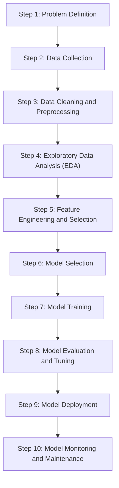
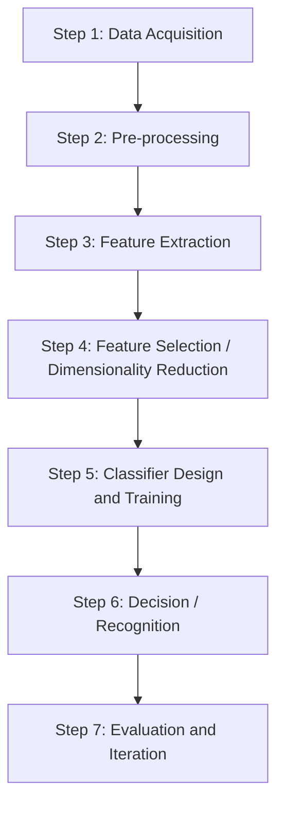
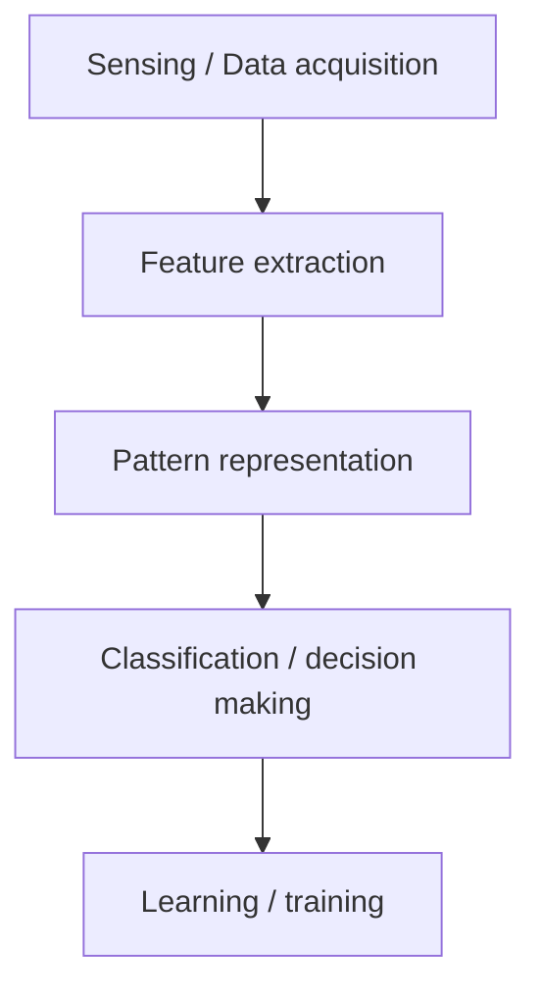
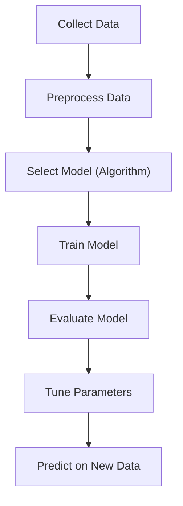

# Unit I — Introduction to Machine Learning

## What Is Machine Learning?

Machine learning is an application of artificial intelligence that involves algorithms and data that automatically analyze and make decision by itself without human intervention.

OR

Machine Learning (ML) is a branch of Artificial Intelligence (AI) that enables systems to learn from data, identify patterns, and make decisions with minimal human intervention.

Instead of being explicitly programmed to perform a task, ML algorithms learn from experience.

## ML Applications

### Technology / Internet

- Search engines → Google, Bing use ML for ranking search results.
- Recommendation systems → Netflix, YouTube, Amazon suggest content/products based on your behavior.
- Spam detection → Email providers use ML to filter out spam and phishing emails.
- Speech recognition & virtual assistants → Siri, Alexa, Google Assistant rely on ML to understand voice commands.

### Business / Finance

- Fraud detection → Banks use ML to detect unusual transactions and potential fraud.
- Credit scoring → Algorithms assess loan risk based on applicant data.
- Algorithmic trading → ML models predict stock movements to automate trades.

### Medical

- Medical image analysis → Detecting tumors in X-rays, MRIs, CT scans.
- Disease prediction → Predicting diseases like diabetes, heart disease based on patient data.
- Drug discovery → ML helps identify potential compounds for new medications faster.

### Automotive

- Self-driving cars → ML enables perception (e.g., recognizing pedestrians, traffic signs) and decision-making.
- Ex: Amazon or Tesla use ML
- Driver assistance systems → Lane-keeping, adaptive cruise control.

### Agriculture

- Crop yield prediction
- Pest detection using image classification
- Soil health monitoring

### Smart devices / IoT

- Home automation :- Learning your preferences for lighting, temperature, security.
- Energy consumption optimization

### Entertainment

- Game AI → Non-player characters that learn and adapt.
- Music composition → ML models that generate melodies or assist artists.

### Environment

- Climate modeling
- Wildlife monitoring using camera traps
- Air quality prediction

## Major Categories of ML Techniques

- Supervised Learning
- Unsupervised Learning
- Semi-supervised Learning
- Reinforcement Learning

### 1. Supervised Learning

Definition: The algorithm learns from labeled data, where the input comes with a known output.

Algorithm Used:

1. Linear Regression
2. Logistic Regression
3. Decision Trees
4. Support Vector Machines (SVM)
5. Neural Networks

Linear Regression: A 2D scatter plot of data points. A straight line ($y = mx + c$) fitted through the points, minimizing residuals (errors).

Logistic Regression: Logistic Regression is a supervised machine learning algorithm used for classification problems. It predicts the probability that an input belongs to a particular class, such as Yes/No, Pass/Fail, Spam/Not Spam, or Disease/No Disease.

#### Application of Supervised Learning

- Spam detection in emails
- Credit scoring
- Disease diagnosis
- Customer churn Prediction

### 2. Unsupervised Learning

Unsupervised learning is a type of machine learning where the model is trained on data without labeled outputs.

Unlike supervised learning, where the algorithm learns from input-output pairs, in unsupervised learning the model tries to find:

1. patterns
2. structures
3. groupings in the data on its own.

Unsupervised learning works with unlabeled data, meaning the target/output variable is not provided. The goal is to discover hidden patterns, structures, or relationships in the data.

#### Most Commonly Used Unsupervised Algorithms in Machine Learning Practical's

- K-Means Clustering
- Hierarchical Clustering
- DBSCAN
- PCA (Principal Component Analysis)
- Apriori Algorithm

#### Characteristics

- No labels: The algorithm only sees input features.
- Goal: Discover hidden patterns or intrinsic structures in the data.
- Common tasks:
  - Clustering (e.g., grouping similar customers)
  - Dimensionality reduction (e.g., reducing the number of features while preserving information)
  - Anomaly detection

| Algorithm | Technique | Main Use |
| --- | --- | --- |
| K-Means | Clustering | Group similar data |
| Hierarchical Clustering | Clustering | Build cluster hierarchy |
| DBSCAN | Clustering | Density-based clustering & outlier detection |
| PCA | Dimensionality Reduction | Reduce features |
| Apriori | Association | Find item relationships |
| FP-Growth | Association | Efficient rule mining |
| GMM | Clustering | Probabilistic clustering |
| Autoencoder | Representation Learning | Feature extraction |
| SOM | Visualization | Pattern discovery |

### 3. Semi-supervised Learning

Semi-Supervised Learning is a machine learning approach that uses both labeled and unlabeled data for training. Typically, a small portion of the dataset is labeled, while a large portion is unlabeled.

#### Why Use Semi-Supervised Learning?

Labeling data is often expensive and time-consuming, while unlabeled data is abundant. Semi-supervised learning leverages both to improve model performance.

Example:

- 1000 student records available
- Only 100 records have labels (Pass/Fail)
- Remaining 900 records are unlabeled
- A semi-supervised algorithm learns from both datasets to make better predictions.

#### Applications

- Email Spam Detection
- Image Classification
- Speech Recognition
- Medical Diagnosis
- Text Classification
- Fraud Detection

### 4. Reinforcement Learning

Reinforcement Learning is a type of machine learning where an agent learns by interacting with an environment and receives rewards or penalties based on its actions. The goal is to maximize the total reward over time.

#### Basic Components

- Agent – The learner or decision-maker.
- Environment – The world in which the agent operates.
- Action – A move made by the agent.
- State – The current situation of the environment.
- Reward – Feedback received after an action.
- Policy – Strategy used by the agent to choose actions.

#### Working Process

- Agent observes the current state.
- Agent takes an action.
- Environment responds with a new state.
- Agent receives a reward or penalty.
- Agent learns from the feedback and improves future decisions.

#### Example: Maze Game

- Agent: Robot
- Environment: Maze
- Action: Move Up, Down, Left, Right
- Reward: +10 for reaching the goal
- Penalty: -1 for hitting a wall
- The robot learns the shortest path by maximizing rewards.

#### Common Reinforcement Learning Algorithms

- Q-Learning
  - Model-free RL algorithm.
  - Learns the value of actions in each state.
- SARSA (State-Action-Reward-State-Action)
  - Updates values based on the action actually taken.
- Deep Q-Network (DQN)
  - Combines Q-Learning with neural networks.
  - Used in game-playing AI.
- Policy Gradient Methods
  - Directly learn the policy function.
- Actor-Critic Methods
  - Combine value-based and policy-based learning.

#### Applications

- Game Playing (e.g., Chess AI)
- Robotics
- Self-Driving Cars
- Traffic Signal Control
- Recommendation Systems
- Resource Management

### Comparison of all Learning Types

| Learning Type | Data Used | Goal |
| --- | --- | --- |
| Supervised Learning | Labelled Data | Predict outputs |
| Unsupervised Learning | Unlabelled Data | Find patterns |
| Semi-Supervised Learning | Both labelled & unlabelled data | Improve learning |
| Reinforcement Learning | Rewards & Penalties | Learn optimal actions |

## The Machine Learning Pipeline

### Step 1: Problem Definition

The first step is clearly defining the problem that needs to be solved. A well-framed problem provides the foundation to determine the project goals, expected outcomes and the type of solution required.

- Ensures alignment between business needs and technical solutions
- Define project objectives, scope and success criteria
- Ensure clarity in desired outcomes

### Step 2: Data Collection

Data Collection phase involves systematic collection of datasets that can be used as raw data to train model. The quality and variety of data directly affect the model's performance.

Here are some basic features of Data Collection:

- Relevance: Collect data should be relevant to the defined problem and include necessary features.
- Quality: Ensure data quality by considering factors like accuracy and ethical use.
- Quantity: Gather sufficient data volume to train a robust model.
- Diversity: Include diverse datasets to capture a broad range of scenarios and patterns.

### Step 3: Data Cleaning and Preprocessing

Raw data is often messy and unstructured and if we use this data directly to train then it can lead to poor accuracy.

We need to do data cleaning and preprocessing which often involves:

- Data Cleaning: Address issues such as missing values, outliers and inconsistencies in the data.
- Data Preprocessing: Standardize formats, scale values and encode categorical variables for consistency.
- Data Quality: Ensure that the data is well-organized and prepared for meaningful analysis.

### Step 4: Exploratory Data Analysis (EDA)

To find patterns and characteristics hidden in the data Exploratory Data Analysis (EDA) is used to uncover insights and understand the dataset's structure. During EDA patterns, trends and insights are provided which may not be visible by naked eyes. This valuable insight can be used to make informed decision.

Here are the basic features of Exploratory Data Analysis:

- Exploration: Use statistical and visual tools to explore patterns in data.
- Patterns and Trends: Identify underlying patterns, trends and potential challenges within the dataset.
- Insights: Gain valuable insights for informed decisions making in later stages.
- Decision Making: Use EDA for feature engineering and model selection

### Step 5: Feature Engineering and Selection

Feature engineering and selection is a transformative process that involve selecting only relevant features to enhance model efficiency and prediction while reducing complexity.

Here are the basic features of Feature Engineering and Selection:

- Feature Engineering: Create new features or transform existing ones to capture better patterns and relationships.
- Feature Selection: Identify subset of features that most significantly impact the model's performance.
- Domain Expertise: Use domain knowledge to engineer features that contribute meaningfully for prediction.
- Optimization: Balance set of features for accuracy while minimizing computational complexity.

| Aspect | Feature Selection | Feature Engineering |
| --- | --- | --- |
| Purpose | Choose the most useful existing features | Create new or transformed features |
| Input | Existing variables | Existing variables + domain knowledge |
| Goal | Reduce irrelevant/redundant data | Improve representation of patterns |
| Effect | Simpler, faster, less overfitting | Better predictive power |
| Example | Selecting age and salary from 100 columns | Creating BMI from weight and height |

### Step 6: Model Selection

For a good machine learning model, model selection is a very important part as we need to find model that aligns with our defined problem, nature of the data, complexity of problem and the desired outcomes.

Here are the basic features of Model Selection:

- Complexity: Consider the complexity of the problem and the nature of the data when choosing a model.
- Decision Factors: Evaluate factors like performance, interpretability and scalability when selecting a model.
- Experimentation: Experiment with different models to find the best fit for the problem.

### Step 7: Model Training

With the selected model the machine learning lifecycle moves to model training process.

This process involves exposing model to historical data allowing it to learn patterns, relationships and dependencies within the dataset.

Here are the basic features of Model Training:

- Iterative Process: Train the model iteratively, adjusting parameters to minimize errors and enhance accuracy.
- Optimization: Fine-tune model to optimize its predictive capabilities.
- Validation: Rigorously train model to ensure accuracy to new unseen data.

### Step 8: Model Evaluation and Tuning

Model evaluation involves rigorous testing against validation or test datasets to test accuracy of model on new unseen data. It provides insights into model's strengths and weaknesses. If the model fails to acheive desired performance levels we may need to tune model again and adjust its hyperparameters to enhance predictive accuracy.

Here are the basic features of Model Evaluation and Tuning:

- Evaluation Metrics: Use metrics like accuracy, precision, recall and F1 score to evaluate model performance.
- Strengths and Weaknesses: Identify the strengths and weaknesses of the model through rigorous testing.
- Iterative Improvement: Initiate model tuning to adjust hyperparameters and enhance predictive accuracy.
- Model Robustness: Iterative tuning to achieve desired levels of model robustness and reliability.

### Step 9: Model Deployment

Now model is ready for deployment for real-world application. It involves integrating the predictive model with existing systems allowing business to use this for informed decision-making.

Here are the basic features of Model Deployment:

- Integrate with existing systems
- Enable decision-making using predictions
- Ensure deployment scalability and security
- Provide APIs or pipelines for production use

### Step 10: Model Monitoring and Maintenance

After Deployment models must be monitored to ensure they perform well over time. Regular tracking helps detect data drift, accuracy drops or changing patterns and retraining may be needed to keep the model reliable in real-world use.

Here are the basic features of Model Monitoring and Maintenance:

- Track model performance over time
- Detect data drift or concept drift
- Update and retrain the model when accuracy drops
- Maintain logs and alerts for real-time issues

## Data Preprocessing

### Definition

Data Preprocessing is the process of cleaning, transforming, and preparing raw data before feeding it into a machine learning model. It improves data quality and helps models learn more effectively.

### Need for Data Preprocessing

- Removes errors and inconsistencies
- Handles missing values
- Reduces noise and outliers
- Converts data into a suitable format
- Improves model accuracy and performance

### Feature Scaling: Standardization

Normalization

### Steps in Data Preprocessing

#### 1. Data Collection

Gather data from various sources such as:

- Databases
- CSV/Excel files
- Sensors
- Websites
- APIs

#### 2. Data Cleaning

Identify and correct errors in the dataset.

Handling Missing Values

Methods:

- Remove records with missing values
- Replace with Mean
- Replace with Median
- Replace with Mode

Handling Duplicate Data

- Remove repeated records to avoid bias.

Handling Outliers

Outliers are unusually high or low values.

Example:

- Salary = [25,000, 30,000, 35,000, 500,000]
- Here, 500,000 is an outlier.

Techniques:

- Z-Score
- IQR (Interquartile Range)
- Clipping

#### B. Standardization

Transforms data to have mean = 0 and standard deviation = 1.

$$z=\frac{x-\mu}{\sigma}$$

#### 4. Data Transformation

Convert data into a suitable format.

##### A. Normalization

Scales values between 0 and 1.

$$\frac{x-x_{min}}{x_{max}-x_{min}}$$

Example: Marks = 50, Min = 0, Max = 100

Normalized value = 0.5

#### 3. Data Integration

Combine data from multiple sources into a single dataset.

Example:

- Student information database
- Examination database
- Merged into one dataset.

#### C. Encoding Categorical Data

| Gender | Label Encoding |
| --- | --- |
| Male | 0 |
| Female | 1 |

## Pattern Recognition

### What is Pattern Recognition?

Pattern recognition is the automated or cognitive process of identifying recurring structures, trends, or regularities within data. It enables humans and machines to categorize information, predict outcomes, and learn from their environment.

Pattern recognition is the automated discovery and classification of patterns in data using algorithms. Given an input (like an image, sound, or text), the system learns to identify which class or category it belongs to.

Examples:

- Identifying handwritten digits (0–9) from images → Digit recognition
- Recognizing faces in photos → Face recognition
- Classifying emails as spam or not → Spam detection

Pattern Recognition is the process of using machine learning algorithms to recognize patterns. It means sorting data into categories by analyzing the patterns present in the data. One of the main benefits of pattern recognition is that it can be used in many different areas. In a typical pattern recognition application, the raw data is processed and converted into a form that a machine can use.

Pattern recognition involves classifying and clustering patterns.

- Classification: Classification is when we teach a system to put things into categories. We do this by showing the system examples with known labels (like "apple" or "orange") so it can learn and label new things. This is part of supervised learning, where we give the system the answers to learn from.
- Clustering: Clustering is when the system groups similar things together without any labels. It looks at the data and tries to find natural groups. This is part of unsupervised learning, where the system learns by itself without knowing the answers beforehand.

### Core concepts of pattern recognition

- Pattern: Any measurable object, signal or data instance that contains identifiable characteristics.
- Feature: A measurable property used to describe a pattern and distinguish between classes.
- Classifier: A model or function that assigns class labels based on features.
- Decision Boundary: The separating surface in feature space that divides different classes.
- Feature Space: A multidimensional space where each pattern is represented as a vector of features.
- Training Data: Labelled examples used to teach the model how to recognize patterns.

### Working of a Pattern Recognition System

#### Step 1: Data Acquisition

Use a sensor to collect raw data. Examples:

- Camera captures object images.
- Microphone records speech.
- Wearable sensor records heart-rate signals.

#### Step 2: Pre-processing

1. Clean and standardize raw data to make it suitable for analysis:
   - Noise removal (smoothing, filtering).
   - Normalization/standardization (e.g., scaling pixel values to [0, 1]).
   - Segmentation (extracting the object of interest from the background).
2. Goal: reduce variability that is not relevant to the pattern itself.

#### Step 3: Feature Extraction

1. Transform pre-processed data into feature vectors:
   - Image: edges, color histograms, shapes, deep learned embeddings.
   - Audio: MFCCs, spectral features, energy.
   - Text: n-grams, TF–IDF, embeddings.
2. These features should capture the essential properties that help distinguish classes.

#### Step 4: Feature Selection / Dimensionality Reduction

1. Remove redundant or irrelevant features using:
   - Correlation analysis, mutual information, filter/wrapper methods.
   - PCA or other dimensionality reduction techniques.
2. Benefits: less overfitting, faster training/inference, simpler models.

#### Step 5: Classifier Design and Training

1. Choose a model family: k-NN, logistic regression, SVM, decision trees, random forests, neural networks, etc.
2. Train the model using the training set:
   - Learn parameters (weights, thresholds) or store instances (instance-based methods like k-NN).
   - Tune hyperparameters (regularization strength, number of neighbors, network depth) using validation data.

#### Step 6: Decision / Recognition

For a new input pattern:

- Apply the same preprocessing and feature extraction steps.
- Feed the resulting feature vector into the trained classifier.
- Obtain predicted class label (and optionally class probabilities or scores).

#### Step 7: Evaluation and Iteration

- Evaluate performance on a separate test set: Use metrics such as accuracy, precision, recall, F1-score, confusion matrix, ROC–AUC.
- Identify failure cases: Misclassified patterns, borderline cases, classes with poor recall.
- Iterate: Improve features, adjust preprocessing, change model or gather more/better data.

## Pattern Representation

Pattern representation in machine learning is the mathematical and structural method used to transform raw, unstructured data (such as images, text, audio, or physical measurements) into a standardized format that computer algorithms can process and analyze.

Because machine learning models cannot interpret raw real-world objects directly, representation acts as the crucial translation layer that distills complex inputs into distinct, quantifiable properties

### Core Paradigms of Pattern Representation

Depending on the nature of the data and the learning task, patterns are represented using one of three primary frameworks:

#### 1. Statistical (Vector) Representation

This is the most popular approach in machine learning. A pattern is represented as a single point or a feature vector in a multi-dimensional mathematical space.

- Feature Vector: An ordered set of $d$ measurable attributes, written as $X = [x_1, x_2, ..., x_d]^T$.
- Feature Space: The multi-dimensional space formed by these vectors.
- Example: Representing a house pattern by its size ($x_{1}$), number of bedrooms ($x_{2}$), and age ($x_{3}$)

#### 2. Structural (Syntactic) Representation

When the relationships between parts of an object are more important than individual numeric values, structural representation is used.

- Graphs & Trees: Patterns are modeled as nodes (sub-patterns) connected by edges (relationships).
- Strings & Grammars: Complex patterns are broken down into a sequence of simpler primitives, much like words in a sentence.
- Example: Describing a chemical molecule by how its atoms are bonded together.

#### 3. Neural-Based (Hierarchical) Representation

Deep learning models automate representation through artificial neural networks.

- Tensors: High-dimensional arrays (e.g., matrices for 2D images, 3D tensors for video).
- Latent Spaces: Raw data passes through layers, and the network extracts condensed, hierarchical representations automatically.
- Example: A face image is represented as raw pixels, which the network converts into edge representations, then facial feature representations

### Pattern representation

Pattern representation is: How we represent the data for the machine learning algorithm. The form of representation influences the accuracy of classification.

### Concept of Pattern Recognition

Pattern recognition involves following stages:

- Sensing / Data acquisition (e.g., capturing an image or recording audio)
- Feature extraction (extract meaningful properties like edges in an image, frequency in audio)
- Pattern representation (representing data in a form suitable for classification, like vectors)
- Classification / decision making (assigning the input to a class using a model, like k-NN, SVM, neural network)
- Learning / training (training the model on labeled examples so it can generalize to new inputs)

Example:

Suppose we want to classify flowers:

| Feature | Meaning |
| --- | --- |
| petal length | numerical value |
| petal width | numerical value |
| sepal length | numerical value |
| sepal width | numerical value |

A flower can be represented as a vector of features:

$$X = [\text{petal length}, \text{petal width}, \text{sepal length}, \text{sepal width}]$$

If we want to recognize handwritten digits:

$$X = [\text{pixel 1 intensity}, \text{pixel 2 intensity}, ..., \text{pixel n intensity}]$$

In speech recognition:

$$X = [\text{frequency at time t1}, \text{frequency at time t2}, ...]$$

### Pattern representation forms

- Vector → Most common (e.g., $[x_1, x_2, ..., x_n]$)
- Graph → For relational patterns (e.g., social networks)
- Strings → For text or DNA sequences
- Trees → For hierarchical data

## Basics of Probability and Bayes' Theorem

Probability provides a foundation for reasoning about uncertainty in machine learning.

Key ideas:

- Probability of event A ($P(A)$) → Likelihood that event A happens ($0 \le P(A) \le 1$)
- Joint probability ($P(A, B)$) → Probability A and B both happen
- Conditional probability ($P(A|B)$) → Probability A happens given B happens
- Bayes' rule:

$$P(A\mid B)=\frac{P(B\mid A)\,P(A)}{P(B)}$$

In pattern recognition, probability tells us how likely it is that an input belongs to a certain class.

### Bayes' Theorem

Bayes' Theorem is a fundamental concept in probability and statistics, widely used in machine learnings:- specially in classification tasks.

Advantages:

- Easy to implement
- Handles uncertainty well
- Works well with small data
- Performs well in text classification problems

### Applications of Bayes Theorem

1. Naive Bayes Classifier
2. Bayes optimal classifier
3. Bayesian Optimization

Bayes' Theorem is used in Naive Bayes classifiers to calculate the probability of a class label given a set of features, assuming that the features are conditionally independent.

Role of Bayes' Theorem in Naive Bayes classifiers:

- The Naive Bayes classifier is a simple probabilistic classifier based on applying Bayes' theorem with a strong (naive) independence assumption between the features.
- It is widely used for text classification, spam filtering, and other tasks involving high-dimensional data.
- Despite its simplicity, the Naive Bayes classifier often performs well in practice and is computationally efficient.

## Maximum Likelihood Estimation

Maximum Likelihood Estimation (MLE) is a statistical technique used to estimate the parameters of a probability distribution by maximizing the likelihood function.

It is widely applied in machine learning, statistics, and AI to optimize models for tasks such as classification, regression, and generative modeling.

### What does Likelihood mean?

Likelihood is a fundamental concept in statistics and machine learning that measures how well a set of parameters explains a given dataset.

Unlike probability, which measures the chance of an event occurring. likelihood quantifies how probable the observed data is under a specific model.

### Difference between Likelihood and Probability

- Probability: Given a known model and parameters, probability predicts future outcomes.
- Likelihood: Given observed data, likelihood estimates the best parameters for a model.

Maximum Likelihood Estimation with Binomial Distribution:

## Modeling

### What is Modeling?

Modeling is the process of creating a machine learning model that learns patterns from the training data and can make predictions or decisions on new (unseen) data.

### Modeling Workflow

- Collect Data: Input dataset (e.g., CSV, Excel)
- Preprocess Data: Cleaning, encoding, normalization, feature scaling, splitting
- Select Model (Algorithm)
  - Classification → SVM, KNN, Decision Tree
  - Regression → Linear Regression
  - Clustering → K-Means
- Train Model: Model learns from training data
- Evaluate Model: Accuracy, precision, recall, confusion matrix, etc.
- Tune Parameters: Adjust hyperparameters (e.g., GridSearchCV)
- Predict on New Data: Final model makes predictions on unseen data

### Goal of Modeling

To build a generalized model that performs well on unseen/test data, not just the training data.

### Good Modeling Practices

- Use cross-validation (e.g., K-Fold)
- Avoid overfitting (model memorizes training data)
- Avoid underfitting (model is too simple)
- Use feature scaling when needed
- Choose the right evaluation metric for your problem

### Types of Models based on Task

| Task | Examples |
| --- | --- |
| Classification | SVM, KNN, Naive Bayes |
| Regression | Linear Regression, Ridge, Lasso |
| Clustering | K-Means, DBSCAN |
| Dim. Reduction | PCA, t-SNE |
| Deep Learning | ANN, CNN, RNN |

## Regression

### What is Regression?

Regression is a type of supervised learning algorithm used to predict continuous numerical values based on input features.

For example:

- Predicting house price based on area
- Predicting temperature based on time of year

### Types of Regression

- Linear Regression: Predicts output using a straight-line equation. Formula: $y = mx + c$
- Multiple Linear Regression: Involves more than one input feature. Formula: $y = b_0 + b_1 x_1 + b_2 x_2 + ... + b_n x_n$
- Polynomial Regression: Fits a non-linear curve (polynomial equation)
- Ridge and Lasso Regression: Regularized versions of linear regression to reduce over fitting
- Logistic Regression (Actually for classification): Predicts probability of class (used in classification)

### Steps in Regression Modeling

- Collect and prepare data
- Split data into training and testing sets
- Train the regression model
- Predict on test data
- Evaluate using metrics

### Linear Regression Equation

$$y = \beta_0 + \beta_1 x + \varepsilon$$

Where:

- $y$ = predicted value
- $x$ = input feature
- $\beta_0$ = intercept
- $\beta_1$ = slope/coefficient
- $\varepsilon$ = error term

Multiple Linear Regression:

## Discriminant Functions

A discriminant function is a function used in pattern recognition and machine learning to classify data points into different classes.

It evaluates a feature vector and assigns it to one of the predefined classes by comparing the function values.

### Why Use Discriminant Functions?

- They provide a decision boundary between classes.
- Useful in supervised learning for classification tasks.
- Allow for probabilistic or distance-based interpretations

### Types of Discriminant Functions

- Linear Discriminant Function (LDF)
- Quadratic Discriminant Function (QDF)
- Bayesian Discriminant Function (BDF)

### Applications Of Discriminant Functions

- Face recognition
- Handwriting digit recognition
- Medical diagnosis
- Spam detection

### Linear Discriminant Function

Linear discriminant analysis (LDA) is a supervised learning algorithm used for classification and dimensionality reduction in machine learning.

It aims to find a linear combination of features that best separates different classes in a dataset.

### Decision surface

A decision surface is a plot that shows how a fit machine learning algorithm divides the input feature space by class label.

A decision surface is a powerful tool for understanding how a given model visualizes the prediction and how it decides to divide the input feature space by class label.

Visualization Of Decision Surface:

## Fisher's Linear Discriminant

### Fisher's linear discriminant

The Basis of Linear Discriminant Analysis LDA is a widely used dimensionality reduction technique built on Fisher's linear discriminant.

Fisher Discriminant Analysis (FDA) is also known as Linear Discriminant Analysis (LDA) when used for classification:- is a supervised dimensionality reduction technique. Classifier that finds a linear combination of features that best separates two or more classes.

Fisher's linear discriminant can be used as a supervised learning classifier.

- Given labeled data, the classifier can find a set of weights to draw a decision boundary, classifying the data.
- Fisher's linear discriminant attempts to find the vector that maximizes the separation between classes of the projected data.
- Maximizing "separation" can be ambiguous.
- The criteria that Fisher's linear discriminant follows: To maximize the distance of the projected means and to minimize the projected within-class variance.

For fully separate them, Fisher's linear discriminant minimizes the within-class variance of the projections at the same time as maximizing the projections between the means.

### GOAL OF FDA

To project high-dimensional data onto a line (or lower-dimensional space) such that:

- The distance between class means is maximized.
- The variance within each class is minimized.

### Difference between FDA and PCA

| Feature | FDA (Fisher) | PCA |
| --- | --- | --- |
| Supervision | Supervised (uses class labels) | Unsupervised |
| Goal | Maximize class separability | Maximize variance |
| Use case | Classification | Data compression |
| Output | Best directions for class separation | Best directions for data spread |

### How does LDA compare to other dimensionality reduction techniques?

- Another very common way to reduce dimensionality is PCA, which maximizes the amount of information carried over onto smaller dimensions.
- Instead of Fisher's linear discriminant direction, PCA uses the principal components found through singular value decomposition.
- Principal components are the directions that maximize variation in the projected data (this does not take into account categories of data).
- LDA takes into account the categories in the data, whereas PCA does not.

## Learning Theory

ML teaches the systems to think and understand like humans by learning from the data.

Machine Learning is mainly divided into three core types:

- Supervised
- Unsupervised
- Reinforcement Learning
- Semi-Supervised
- Self-Supervised Learning.
