# Unit I — Introduction to Machine Learning

## What Is Machine Learning?

Machine learning is an application of artificial intelligence that involves algorithms and data that automatically analyze and make decision by itself without human intervention.

OR

Machine Learning (ML) is a branch of Artificial Intelligence (AI) that enables systems to learn from data, identify patterns, and make decisions with minimal human intervention.

Instead of being explicitly programmed to perform a task, ML algorithms learn from experience.

### The three pillars of the definition

1. **Relationship to AI** — ML is a subset, or "application", of the broader field of Artificial Intelligence.
2. **The inputs** — ML needs two things and only two things to work: **algorithms** (the mathematical instructions) and **data** (the experience to learn from).
3. **The goal** — autonomy. The system *automatically* analyses information and decides by itself, so the programmer never has to write a rule for every possible case.

### ML versus traditional programming

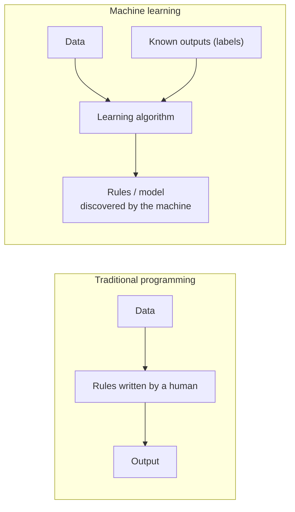

In traditional programming a human writes the rules and the computer applies them. In machine learning the human supplies data and examples of the right answer, and the machine works out the rules. This single reversal is what the whole subject rests on.


## ML Applications

### Technology / Internet

- Search engines → Google, Bing use ML for ranking search results.
- Recommendation systems → Netflix, YouTube, Amazon suggest content/products based on your behavior.
- Spam detection → Email providers use ML to filter out spam and phishing emails.
- Speech recognition & virtual assistants → Siri, Alexa, Google Assistant rely on ML to understand voice commands.

How each one works:

- **Search engines** process billions of queries to learn intent and context, so the most relevant pages rank first.
- **Recommendation systems** use collaborative filtering (people like you liked this) or content-based filtering (items like the ones you liked).
- **Spam detection** is a textbook **classification** problem: Spam vs Ham, learned from millions of labelled emails.
- **Speech recognition** converts an audio waveform to text, then parses the text for intent — signal processing plus NLP.

### Business / Finance

- Fraud detection → Banks use ML to detect unusual transactions and potential fraud.
- Credit scoring → Algorithms assess loan risk based on applicant data.
- Algorithmic trading → ML models predict stock movements to automate trades.

Rule-based finance systems fire on static thresholds ("flag anything over ₹5,00,000"). ML instead learns the *normal* behaviour of each individual customer and flags **anomalies** — a purchase in a new country, a sudden change in spending rhythm — in real time. Credit scoring is predictive modelling: the probability of default given the applicant's features. Algorithmic trading is time-series forecasting executed faster than a human can react.

### Medical

- Medical image analysis → Detecting tumors in X-rays, MRIs, CT scans.
- Disease prediction → Predicting diseases like diabetes, heart disease based on patient data.
- Drug discovery → ML helps identify potential compounds for new medications faster.

Image analysis is computer vision trained on thousands of labelled scans; it catches patterns that are subtle enough to escape the human eye. Disease prediction is predictive analytics over biometrics and history, which buys time for early intervention. Drug discovery uses models to virtually screen millions of compounds before anything reaches a laboratory bench.

### Automotive

- Self-driving cars → ML enables perception (e.g., recognizing pedestrians, traffic signs) and decision-making.
- Ex: Amazon or Tesla use ML
- Driver assistance systems → Lane-keeping, adaptive cruise control.

Two distinct jobs sit inside an autonomous vehicle. **Perception** is the "eyes": camera, LiDAR and radar data turned into objects — pedestrians, cyclists, signs. **Decision-making** is the "thinking": brake, accelerate or steer. ADAS features such as lane-keeping assist and adaptive cruise control are the same machinery applied at a smaller scope.

### Agriculture

- Crop yield prediction
- Pest detection using image classification
- Soil health monitoring

Yield prediction combines weather history, soil quality and past harvests. Pest detection is **image classification** on drone or phone photographs, which allows a localised treatment instead of blanket spraying. Soil monitoring turns sensor streams (moisture, pH, nutrients) into irrigation and fertiliser decisions.

### Smart devices / IoT

- Home automation :- Learning your preferences for lighting, temperature, security.
- Energy consumption optimization

The value of ML in IoT is **personalisation** (the thermostat learns when you come home and what you like at night) plus **efficiency** (dim empty rooms, run heavy appliances off-peak).

### Entertainment

- Game AI → Non-player characters that learn and adapt.
- Music composition → ML models that generate melodies or assist artists.

A scripted NPC repeats itself; a learning NPC observes the player and adapts its strategy. Generative models compose original melodies or act as a co-pilot suggesting chords for a human artist.

### Environment

- Climate modeling
- Wildlife monitoring using camera traps
- Air quality prediction

Climate modelling digests satellite and historical data into simulations. Wildlife monitoring runs computer vision over thousands of hours of **camera-trap** footage, counting and identifying species at a scale no human team could match. Air-quality prediction is time-series forecasting over pollutant sensors and weather.


## Major Categories of ML Techniques

- Supervised Learning
- Unsupervised Learning
- Semi-supervised Learning
- Reinforcement Learning

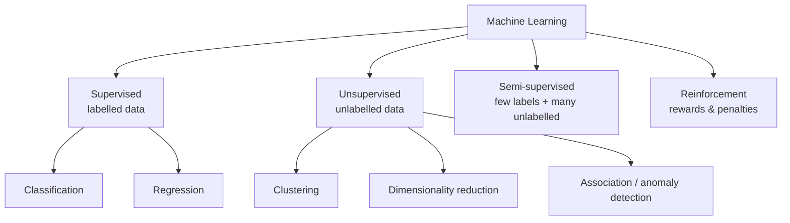

### 1. Supervised Learning

Definition: The algorithm learns from labeled data, where the input comes with a known output.

Algorithm Used:

1. Linear Regression
2. Logistic Regression
3. Decision Trees
4. Support Vector Machines (SVM)
5. Neural Networks

**Labelled data** means that for every training input the correct answer — the *label* or *target* — is supplied alongside it. The labels act as a teacher: the algorithm predicts, compares against the known answer, and adjusts its parameters to shrink the error. The goal is to learn a mapping $Y = f(X)$ that generalises to new, unseen $X$.

Supervised learning solves exactly two kinds of problem:

- **Regression** — predict a quantity (house price, temperature).
- **Classification** — predict a category (spam/ham, benign/malignant).

#### Linear Regression

A 2D scatter plot of data points. A straight line ($y = mx + c$) fitted through the points, minimizing residuals (errors).

$$y = mx + c$$

- $y$ — the dependent variable, the value being predicted.
- $x$ — the independent variable, the input feature.
- $m$ — the slope: how much $y$ changes per one-unit change in $x$.
- $c$ — the y-intercept: the value of $y$ when $x = 0$.

For each real point $(x_i, y_i)$ the model predicts $\hat{y}_i$, and the **residual** is $y_i - \hat{y}_i$ — the vertical gap between the point and the line. Ordinary Least Squares picks the $m$ and $c$ that minimise the sum of the *squares* of those residuals, which is what "best fit" means.

#### Logistic Regression

Logistic Regression is a supervised machine learning algorithm used for classification problems. It predicts the probability that an input belongs to a particular class, such as Yes/No, Pass/Fail, Spam/Not Spam, or Disease/No Disease.

The output of a linear equation is squashed into $[0, 1]$ by the **sigmoid** (S-curve):

$$\sigma(z) = \frac{1}{1 + e^{-z}}, \qquad z = w^T x + b$$

The curve rises from an asymptote at $y = 0$ to an asymptote at $y = 1$, so its output reads directly as a probability. A **threshold** — conventionally $0.5$ — converts that probability into a label:

- if $P(y = 1 \mid x) \ge 0.5$ → predict class 1
- if $P(y = 1 \mid x) < 0.5$ → predict class 0

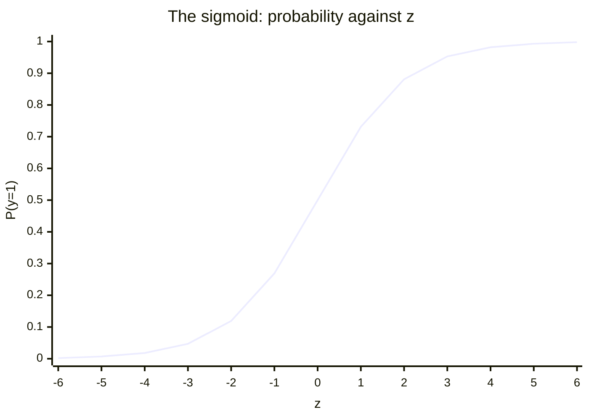

The curve is bounded by asymptotes at 0 and 1, crosses $0.5$ at $z = 0$, and is steepest there — the region where the model is least certain.

A point read off the curve at $y = 0.8$ means an 80 % chance of the positive class; $y = 0.3$ means 30 %. The threshold can be moved away from $0.5$ to make a model deliberately more sensitive (catch every disease case) or more specific (never raise a false alarm).

#### Application of Supervised Learning

- Spam detection in emails
- Credit scoring
- Disease diagnosis
- Customer churn Prediction

All four need a large body of **labelled historical data**. Three of them are classification; credit scoring can be either classification (approve/reject) or regression (predict a numeric score).

### 2. Unsupervised Learning

Unsupervised learning is a type of machine learning where the model is trained on data without labeled outputs.

Unlike supervised learning, where the algorithm learns from input-output pairs, in unsupervised learning the model tries to find:

1. patterns
2. structures
3. groupings in the data on its own.

Unsupervised learning works with unlabeled data, meaning the target/output variable is not provided. The goal is to discover hidden patterns, structures, or relationships in the data.

Supervised learning has $(X, Y)$; unsupervised learning has only $X$. There is no cheat sheet, so the algorithm must find the relationships itself.

#### Most Commonly Used Unsupervised Algorithms in Machine Learning Practical's

- K-Means Clustering
- Hierarchical Clustering
- DBSCAN
- PCA (Principal Component Analysis)
- Apriori Algorithm

#### Characteristics

- No labels: The algorithm only sees input features.
- Goal: Discover hidden patterns or intrinsic structures in the data.
- Common tasks:
  - Clustering (e.g., grouping similar customers)
  - Dimensionality reduction (e.g., reducing the number of features while preserving information)
  - Anomaly detection

**Clustering** partitions the data so that members of a group resemble each other more than they resemble outsiders — for example splitting a customer base into "big spenders" and "bargain hunters" without being told those groups exist. **Dimensionality reduction** cuts the number of input variables to simplify the model, speed up training and make high-dimensional data drawable in 2D or 3D. **Anomaly detection** picks out the rare observation that differs sharply from the rest, which is how a fraudulent transaction gets flagged.

| Algorithm | Technique | Main Use |
| --- | --- | --- |
| K-Means | Clustering | Group similar data |
| Hierarchical Clustering | Clustering | Build cluster hierarchy |
| DBSCAN | Clustering | Density-based clustering & outlier detection |
| PCA | Dimensionality Reduction | Reduce features |
| Apriori | Association | Find item relationships |
| FP-Growth | Association | Efficient rule mining |
| GMM | Clustering | Probabilistic clustering |
| Autoencoder | Representation Learning | Feature extraction |
| SOM | Visualization | Pattern discovery |

Reading the table by technique: most of these algorithms are clustering methods. K-Means uses distance to centroids, DBSCAN uses **density** and so finds arbitrarily shaped clusters plus noise, and GMM is the probabilistic ("soft") counterpart that assumes a mixture of Gaussians. PCA reduces features. Apriori and FP-Growth mine **association rules** ("people who buy bread also buy butter"). Autoencoders learn compact representations with a neural network, and Self-Organising Maps project the input space onto a low-dimensional grid for visualisation.

### 3. Semi-supervised Learning

Semi-Supervised Learning is a machine learning approach that uses both labeled and unlabeled data for training. Typically, a small portion of the dataset is labeled, while a large portion is unlabeled.

#### Why Use Semi-Supervised Learning?

Labeling data is often expensive and time-consuming, while unlabeled data is abundant. Semi-supervised learning leverages both to improve model performance.

Example:

- 1000 student records available
- Only 100 records have labels (Pass/Fail)
- Remaining 900 records are unlabeled
- A semi-supervised algorithm learns from both datasets to make better predictions.

The economics drive the method. Getting a label usually needs a human expert — a doctor must look at the X-ray to call it "pneumonia" — which is slow and costly, while collecting raw unlabelled X-rays is cheap. Semi-supervised learning uses the small labelled seed to anchor the classes and the large unlabelled pool to learn the shape of the data, so the decision boundary is far better than what 100 records alone could support.

#### Applications

- Email Spam Detection
- Image Classification
- Speech Recognition
- Medical Diagnosis
- Text Classification
- Fraud Detection

### 4. Reinforcement Learning

Reinforcement Learning is a type of machine learning where an agent learns by interacting with an environment and receives rewards or penalties based on its actions. The goal is to maximize the total reward over time.

#### Basic Components

- Agent – The learner or decision-maker.
- Environment – The world in which the agent operates.
- Action – A move made by the agent.
- State – The current situation of the environment.
- Reward – Feedback received after an action.
- Policy – Strategy used by the agent to choose actions.

In symbols: state $s_t$, action $a_t$, reward $r_t$, and policy $\pi$ mapping states to actions.

#### Working Process

- Agent observes the current state.
- Agent takes an action.
- Environment responds with a new state.
- Agent receives a reward or penalty.
- Agent learns from the feedback and improves future decisions.

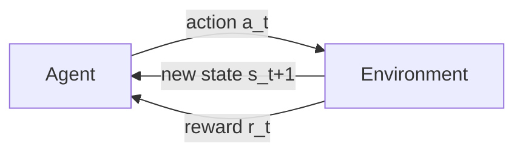

The loop runs thousands or millions of times. The objective is never the immediate reward but the **cumulative** reward over time, so the agent will accept a small loss now for a larger gain later.

#### Example: Maze Game

- Agent: Robot
- Environment: Maze
- Action: Move Up, Down, Left, Right
- Reward: +10 for reaching the goal
- Penalty: -1 for hitting a wall
- The robot learns the shortest path by maximizing rewards.

The robot starts with no map. Because every wall collision costs $-1$ and only the goal pays $+10$, maximising the total reward is the same thing as finding the shortest collision-free path.

#### Common Reinforcement Learning Algorithms

- Q-Learning
  - Model-free RL algorithm.
  - Learns the value of actions in each state.
- SARSA (State-Action-Reward-State-Action)
  - Updates values based on the action actually taken.
- Deep Q-Network (DQN)
  - Combines Q-Learning with neural networks.
  - Used in game-playing AI.
- Policy Gradient Methods
  - Directly learn the policy function.
- Actor-Critic Methods
  - Combine value-based and policy-based learning.

Q-Learning is **off-policy**: it learns about the optimal policy while behaving differently. SARSA is **on-policy**: it updates using the action the agent actually took. DQN replaces the Q-table with a deep network so the method survives huge state spaces such as raw game pixels. Policy-gradient methods skip value estimation and optimise the policy directly. Actor-Critic keeps both: the **actor** proposes actions, the **critic** scores them.

#### Applications

- Game Playing (e.g., Chess AI)
- Robotics
- Self-Driving Cars
- Traffic Signal Control
- Recommendation Systems
- Resource Management

Games are *closed* environments — fixed rules, well-defined states — which is why RL excels there. Robotics and driving are *open* environments full of uncertainty. Traffic control and data-centre resource management are, at heart, optimisation problems.

### Comparison of all Learning Types

| Learning Type | Data Used | Goal |
| --- | --- | --- |
| Supervised Learning | Labelled Data | Predict outputs |
| Unsupervised Learning | Unlabelled Data | Find patterns |
| Semi-Supervised Learning | Both labelled & unlabelled data | Improve learning |
| Reinforcement Learning | Rewards & Penalties | Learn optimal actions |

The choice of paradigm is dictated by two questions: what data do you have, and what do you want out of it. No labels and a need for groups → unsupervised. Labels and a need for prediction → supervised. Expensive labels → semi-supervised. A sequence of decisions with delayed feedback → reinforcement.


## The Machine Learning Pipeline

<div class="figsvg" title="Click to view full screen">
<svg viewBox="0 0 720 660" role="img" aria-label="The machine learning lifecycle as a ten-step cycle">
  <circle class="cyc-ring" cx="360.0" cy="330.0" r="190.0"/>
  <path class="cyc-tip" d="M -6 -5 L 0 0 L -6 5" transform="translate(418.7 149.3) rotate(18.0)"/>
  <path class="cyc-tip" d="M -6 -5 L 0 0 L -6 5" transform="translate(513.7 218.3) rotate(54.0)"/>
  <path class="cyc-tip" d="M -6 -5 L 0 0 L -6 5" transform="translate(550.0 330.0) rotate(90.0)"/>
  <path class="cyc-tip" d="M -6 -5 L 0 0 L -6 5" transform="translate(513.7 441.7) rotate(126.0)"/>
  <path class="cyc-tip" d="M -6 -5 L 0 0 L -6 5" transform="translate(418.7 510.7) rotate(162.0)"/>
  <path class="cyc-tip" d="M -6 -5 L 0 0 L -6 5" transform="translate(301.3 510.7) rotate(198.0)"/>
  <path class="cyc-tip" d="M -6 -5 L 0 0 L -6 5" transform="translate(206.3 441.7) rotate(234.0)"/>
  <path class="cyc-tip" d="M -6 -5 L 0 0 L -6 5" transform="translate(170.0 330.0) rotate(270.0)"/>
  <path class="cyc-tip" d="M -6 -5 L 0 0 L -6 5" transform="translate(206.3 218.3) rotate(306.0)"/>
  <path class="cyc-tip" d="M -6 -5 L 0 0 L -6 5" transform="translate(301.3 149.3) rotate(342.0)"/>
  <g class="cyc-node">
    <circle cx="360.0" cy="140.0" r="26.0"/>
    <text class="cyc-num" x="360.0" y="145.0" text-anchor="middle">01</text>
    <text class="cyc-lab" x="360.0" y="90.0" text-anchor="middle"><tspan x="360.0">Problem</tspan><tspan x="360.0" dy="15">definition</tspan></text>
  </g>
  <g class="cyc-node">
    <circle cx="471.7" cy="176.3" r="26.0"/>
    <text class="cyc-num" x="471.7" y="181.3" text-anchor="middle">02</text>
    <text class="cyc-lab" x="498.7" y="135.1" text-anchor="start"><tspan x="498.7">Data</tspan><tspan x="498.7" dy="15">collection</tspan></text>
  </g>
  <g class="cyc-node">
    <circle cx="540.7" cy="271.3" r="26.0"/>
    <text class="cyc-num" x="540.7" y="276.3" text-anchor="middle">03</text>
    <text class="cyc-lab" x="584.4" y="257.1" text-anchor="start"><tspan x="584.4">Cleaning &</tspan><tspan x="584.4" dy="15">preprocessing</tspan></text>
  </g>
  <g class="cyc-node">
    <circle cx="540.7" cy="388.7" r="26.0"/>
    <text class="cyc-num" x="540.7" y="393.7" text-anchor="middle">04</text>
    <text class="cyc-lab" x="584.4" y="402.9" text-anchor="start"><tspan x="584.4">Exploratory</tspan><tspan x="584.4" dy="15">data analysis</tspan></text>
  </g>
  <g class="cyc-node">
    <circle cx="471.7" cy="483.7" r="26.0"/>
    <text class="cyc-num" x="471.7" y="488.7" text-anchor="middle">05</text>
    <text class="cyc-lab" x="498.7" y="536.9" text-anchor="start"><tspan x="498.7">Feature</tspan><tspan x="498.7" dy="15">engineering</tspan></text>
  </g>
  <g class="cyc-node">
    <circle cx="360.0" cy="520.0" r="26.0"/>
    <text class="cyc-num" x="360.0" y="525.0" text-anchor="middle">06</text>
    <text class="cyc-lab" x="360.0" y="582.0" text-anchor="middle"><tspan x="360.0">Model</tspan><tspan x="360.0" dy="15">selection</tspan></text>
  </g>
  <g class="cyc-node">
    <circle cx="248.3" cy="483.7" r="26.0"/>
    <text class="cyc-num" x="248.3" y="488.7" text-anchor="middle">07</text>
    <text class="cyc-lab" x="221.3" y="536.9" text-anchor="end"><tspan x="221.3">Model</tspan><tspan x="221.3" dy="15">training</tspan></text>
  </g>
  <g class="cyc-node">
    <circle cx="179.3" cy="388.7" r="26.0"/>
    <text class="cyc-num" x="179.3" y="393.7" text-anchor="middle">08</text>
    <text class="cyc-lab" x="135.6" y="402.9" text-anchor="end"><tspan x="135.6">Evaluation</tspan><tspan x="135.6" dy="15">& tuning</tspan></text>
  </g>
  <g class="cyc-node">
    <circle cx="179.3" cy="271.3" r="26.0"/>
    <text class="cyc-num" x="179.3" y="276.3" text-anchor="middle">09</text>
    <text class="cyc-lab" x="135.6" y="257.1" text-anchor="end"><tspan x="135.6">Model</tspan><tspan x="135.6" dy="15">deployment</tspan></text>
  </g>
  <g class="cyc-node">
    <circle cx="248.3" cy="176.3" r="26.0"/>
    <text class="cyc-num" x="248.3" y="181.3" text-anchor="middle">10</text>
    <text class="cyc-lab" x="221.3" y="135.1" text-anchor="end"><tspan x="221.3">Monitoring &</tspan><tspan x="221.3" dy="15">maintenance</tspan></text>
  </g>
  <text class="cyc-hub" x="360.0" y="324.0" text-anchor="middle">Machine Learning</text>
  <text class="cyc-hub" x="360.0" y="348.0" text-anchor="middle">Lifecycle</text>
</svg>
</div>

The dotted return arrow is the reason this is called a **lifecycle** rather than a checklist: monitoring turns up drift, drift triggers a new problem definition, and the cycle starts again.

A shorter seven-stage form of the same pipeline is also common — Data Collection → Feature Engineering → Model Training → Evaluation → Deployment → Monitoring → Maintenance.

### The training loop inside the pipeline

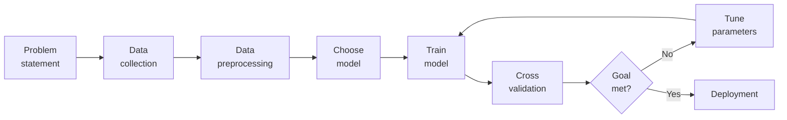

Everything inside the loop repeats: train, cross-validate, check the goal, tune hyperparameters, train again. Only when the performance target is met does the model leave for deployment.

### Step 1: Problem Definition

The first step is clearly defining the problem that needs to be solved. A well-framed problem provides the foundation to determine the project goals, expected outcomes and the type of solution required.

- Ensures alignment between business needs and technical solutions
- Define project objectives, scope and success criteria
- Ensure clarity in desired outcomes

This step decides what the model actually predicts — "will this customer churn?" (classification) is a different project from "how much will this customer spend?" (regression). It also bridges stakeholders who want revenue and engineers who need a loss function to minimise. A badly framed problem wastes the entire budget downstream because there is no agreed measure of success.

### Step 2: Data Collection

Data Collection phase involves systematic collection of datasets that can be used as raw data to train model. The quality and variety of data directly affect the model's performance.

Here are some basic features of Data Collection:

- Relevance: Collect data should be relevant to the defined problem and include necessary features.
- Quality: Ensure data quality by considering factors like accuracy and ethical use.
- Quantity: Gather sufficient data volume to train a robust model.
- Diversity: Include diverse datasets to capture a broad range of scenarios and patterns.

This is where "garbage in, garbage out" is decided. Relevance means the features actually influence the target. Quality means accurate *and* ethically obtained. Quantity means enough samples that the model learns patterns instead of coincidences. Diversity means every real-world situation the model will meet is represented, which is the first defence against bias.

### Step 3: Data Cleaning and Preprocessing

Raw data is often messy and unstructured and if we use this data directly to train then it can lead to poor accuracy.

We need to do data cleaning and preprocessing which often involves:

- Data Cleaning: Address issues such as missing values, outliers and inconsistencies in the data.
- Data Preprocessing: Standardize formats, scale values and encode categorical variables for consistency.
- Data Quality: Ensure that the data is well-organized and prepared for meaningful analysis.

Typical defects: a blank age field (missing value), a height recorded as 10 feet (outlier from a typo), "USA" in one row and "United States" in the next (inconsistency). Scaling stops one large-magnitude feature from dominating; encoding turns "Red"/"Blue" into numbers the algorithm can compute with.

### Step 4: Exploratory Data Analysis (EDA)

To find patterns and characteristics hidden in the data Exploratory Data Analysis (EDA) is used to uncover insights and understand the dataset's structure. During EDA patterns, trends and insights are provided which may not be visible by naked eyes. This valuable insight can be used to make informed decision.

Here are the basic features of Exploratory Data Analysis:

- Exploration: Use statistical and visual tools to explore patterns in data.
- Patterns and Trends: Identify underlying patterns, trends and potential challenges within the dataset.
- Insights: Gain valuable insights for informed decisions making in later stages.
- Decision Making: Use EDA for feature engineering and model selection

EDA leans on **visualisation** (histograms, scatter plots, box plots) and **descriptive statistics** (mean, median, standard deviation, correlation matrices). It is not decoration: what you see here dictates which features you build next and which algorithm suits the data's shape.

### Step 5: Feature Engineering and Selection

Feature engineering and selection is a transformative process that involve selecting only relevant features to enhance model efficiency and prediction while reducing complexity.

Here are the basic features of Feature Engineering and Selection:

- Feature Engineering: Create new features or transform existing ones to capture better patterns and relationships.
- Feature Selection: Identify subset of features that most significantly impact the model's performance.
- Domain Expertise: Use domain knowledge to engineer features that contribute meaningfully for prediction.
- Optimization: Balance set of features for accuracy while minimizing computational complexity.

| Aspect | Feature Selection | Feature Engineering |
| --- | --- | --- |
| Purpose | Choose the most useful existing features | Create new or transformed features |
| Input | Existing variables | Existing variables + domain knowledge |
| Goal | Reduce irrelevant/redundant data | Improve representation of patterns |
| Effect | Simpler, faster, less overfitting | Better predictive power |
| Example | Selecting age and salary from 100 columns | Creating BMI from weight and height |

Selection is **subtractive** — drop 98 of 100 columns and keep Age and Salary. Engineering is **additive/transformative** — compute $\text{BMI} = \text{weight} / \text{height}^2$, a quantity that was not in the raw data at all. Selection is the primary tool against overfitting and the curse of dimensionality; engineering is usually the fastest route to higher accuracy.

#### Feature selection methods compared

| Point of comparison | Filter | Wrapper | Embedded | Hybrid |
| --- | --- | --- | --- | --- |
| How it works | Statistical scores computed before any model is trained | Trains a model repeatedly on different subsets and keeps the best | The model selects features while it trains | Filter out weak features first, then refine with wrapper/embedded |
| Math intuition | correlation $r$, chi-square $\chi^2$, ANOVA F, mutual information | accuracy, F1, RMSE over the subset space | L1 penalty driving coefficients to 0; Gini / information gain | statistical score + model-based selection |
| Model dependency | Independent of the model | Strongly model-dependent | Tied to the specific algorithm | Partly independent, partly dependent |
| Captures interactions | No | Yes | Sometimes (trees yes, Lasso partly) | Yes, after the filter stage |
| Speed | Fastest — no training | Slowest — repeated training | Medium | Medium to slow |
| Accuracy | Moderate — may miss interactions | Highest — considers combinations | High and reliable in practice | Very high |
| Best used for | High-dimensional data, initial cleaning | Small/medium data where accuracy dominates | Tree models, regularised linear models, production | Large noisy data needing speed and accuracy |

Filter methods look only at intrinsic properties of the data, which makes them fast but blind to features that are useless alone and powerful together. Wrapper methods treat selection as a search problem and pay for it in compute, with a real risk of overfitting to one dataset. Embedded methods get selection for free: a decision tree naturally splits on the best feature, and Lasso (L1) drives useless coefficients to exactly zero. Hybrid methods drop the obvious junk with a filter and then spend wrapper effort only on what survives.

### Step 6: Model Selection

For a good machine learning model, model selection is a very important part as we need to find model that aligns with our defined problem, nature of the data, complexity of problem and the desired outcomes.

Here are the basic features of Model Selection:

- Complexity: Consider the complexity of the problem and the nature of the data when choosing a model.
- Decision Factors: Evaluate factors like performance, interpretability and scalability when selecting a model.
- Experimentation: Experiment with different models to find the best fit for the problem.

No single algorithm wins everywhere — this is the "No Free Lunch" theorem. The three decision factors pull against each other: **performance** (how accurate), **interpretability** (can a human explain a decision, which is mandatory in medicine and law) and **scalability** (millions of rows, millisecond responses). Because the trade-off is empirical, model selection is inherently experimental.

### Step 7: Model Training

With the selected model the machine learning lifecycle moves to model training process.

This process involves exposing model to historical data allowing it to learn patterns, relationships and dependencies within the dataset.

Here are the basic features of Model Training:

- Iterative Process: Train the model iteratively, adjusting parameters to minimize errors and enhance accuracy.
- Optimization: Fine-tune model to optimize its predictive capabilities.
- Validation: Rigorously train model to ensure accuracy to new unseen data.

One training step is: predict → measure the error → nudge the parameters to reduce it. Repeat for many passes over the data (**epochs**), typically driven by **gradient descent**. The target is never a perfect score on the training set but low error on data the model has never seen.

### Step 8: Model Evaluation and Tuning

Model evaluation involves rigorous testing against validation or test datasets to test accuracy of model on new unseen data. It provides insights into model's strengths and weaknesses. If the model fails to achieve desired performance levels we may need to tune model again and adjust its hyperparameters to enhance predictive accuracy.

Here are the basic features of Model Evaluation and Tuning:

- Evaluation Metrics: Use metrics like accuracy, precision, recall and F1 score to evaluate model performance.
- Strengths and Weaknesses: Identify the strengths and weaknesses of the model through rigorous testing.
- Iterative Improvement: Initiate model tuning to adjust hyperparameters and enhance predictive accuracy.
- Model Robustness: Iterative tuning to achieve desired levels of model robustness and reliability.

**Accuracy** is the share of correct predictions; **precision**, **recall** and **F1** matter when the classes are imbalanced, such as a rare disease. Tuning adjusts **hyperparameters** — the settings that are *not* learned from data, such as the learning rate or a tree's maximum depth — as opposed to **parameters**, which are learned.

### Step 9: Model Deployment

Now model is ready for deployment for real-world application. It involves integrating the predictive model with existing systems allowing business to use this for informed decision-making.

Here are the basic features of Model Deployment:

- Integrate with existing systems
- Enable decision-making using predictions
- Ensure deployment scalability and security
- Provide APIs or pipelines for production use

A model in a notebook is worth nothing. Deployment wires it into the website, app or database so it receives live data automatically. **Scalability** keeps it standing under traffic spikes; **security** protects the model and the data flowing through it; an **API** lets other software call it, and a **pipeline** automates the flow from source to prediction to consumer.

### Step 10: Model Monitoring and Maintenance

After Deployment models must be monitored to ensure they perform well over time. Regular tracking helps detect data drift, accuracy drops or changing patterns and retraining may be needed to keep the model reliable in real-world use.

Here are the basic features of Model Monitoring and Maintenance:

- Track model performance over time
- Detect data drift or concept drift
- Update and retrain the model when accuracy drops
- Maintain logs and alerts for real-time issues

A model is trained on the past, and the world moves. A house-price model fitted in 2019 misprices 2024 houses.

- **Data drift** — the statistical properties of the *inputs* change.
- **Concept drift** — the *relationship* between inputs and target changes.

The response is retraining on recent data, with logging and alerting so engineers hear about it before the users do.


## Data Preprocessing

### Definition

Data Preprocessing is the process of cleaning, transforming, and preparing raw data before feeding it into a machine learning model. It improves data quality and helps models learn more effectively.

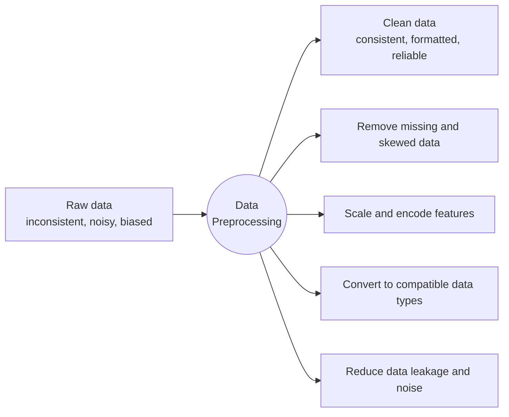

Preprocessing is the bridge between collection and training, and it has three moves: **cleaning** (fix typos, drop duplicates, deal with impossible values), **transforming** (normalise, encode) and **preparing** (split into train and test).

### Need for Data Preprocessing

- Removes errors and inconsistencies
- Handles missing values
- Reduces noise and outliers
- Converts data into a suitable format
- Improves model accuracy and performance

Note the last item on the diagram: **data leakage**, where information from the test set — or from the future — sneaks into training and produces a model that looks brilliant in the lab and fails in production. Scaling parameters such as the mean or the maximum must be computed on the training set alone and then applied to the test set.

### The Data Preprocessing Pipeline

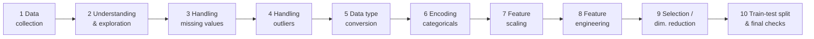

### Data Cleaning Steps

| Step | What it does | Why it matters |
| --- | --- | --- |
| Handling missing values | Fill in or remove missing data | Many algorithms simply refuse to run on nulls |
| Removing duplicates | Ensure unique records | Duplicates give some patterns extra weight → model bias |
| Handling outliers | Prevent extreme values from skewing results | Outliers drag the mean and the regression line |
| Fixing data types | Convert incorrect types | You cannot do arithmetic on a string, or time-series analysis on a text date |

### Feature Scaling: Standardization

Standardization (also called Z-score normalisation) transforms a feature to have mean $0$ and standard deviation $1$:

$$z = \frac{x - \mu}{\sigma}$$

- $z$ — the standardised value (the Z-score), i.e. how many standard deviations the point sits from the mean.
- $x$ — the original value.
- $\mu$ — the mean of that feature across the dataset. Subtracting it **centres** the data at zero.
- $\sigma$ — the standard deviation of that feature. Dividing by it **scales** the spread to one.

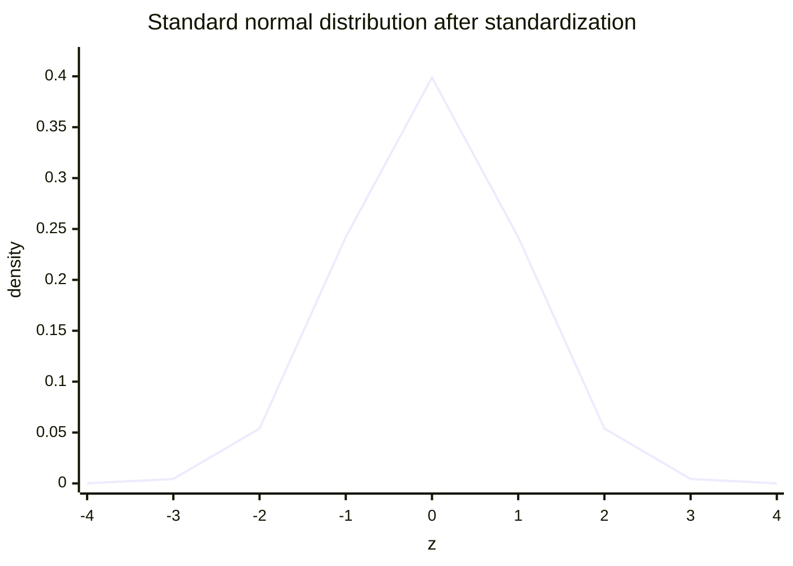

A normally distributed feature becomes the **standard normal distribution**, with the bulk of the data between $-3$ and $+3$. Standardisation is unbounded, which is exactly why it is more robust to outliers than Min-Max scaling: one extreme value cannot squash everything else into a sliver of the range. It is essential for PCA (which hunts directions of maximum variance), SVM and k-NN (which measure distances), and gradient descent (which converges faster when features share a scale). Note that standardisation changes location and scale but not shape — a skewed feature stays skewed, just centred at zero.

### Normalization

Min-Max normalisation squeezes a feature into $[0, 1]$:

$$X_{new} = \frac{X - X_{min}}{X_{max} - X_{min}}$$

- $X_{min}$ — the minimum observed value of the feature; subtracting it maps the minimum to $0$.
- $X_{max} - X_{min}$ — the range; dividing by it maps the maximum to $1$.

Why it is needed: if Age runs 0–100 and Annual Income runs 20 000–200 000, any distance-based algorithm (k-NN, K-Means, SVM) is effectively deciding on income alone. After normalisation both features get an equal vote. The weakness is the mirror image of the strength — because it depends on $X_{min}$ and $X_{max}$, a single huge outlier compresses every other point into a narrow band near zero.

### Normalisation versus standardisation

| Parameter | Normalisation | Standardisation |
| --- | --- | --- |
| Scaling | Uses the highest and lowest values | Uses mean and standard deviation |
| Applying | When features are on separate scales | When zero mean and unit standard deviation are wanted |
| Range | Bounded, 0 to 1 | Not bounded |
| Effect of outliers | Affected by outliers | Less affected by outliers |
| Data distribution | Use when the distribution is unknown | Use when the data is Gaussian / normally distributed |
| Also known as | Scaling normalisation, Min-Max scaling | Z-score |

### Data Transformation Techniques

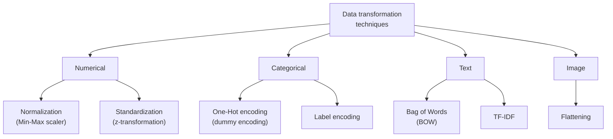

- **Numerical** — normalisation squashes into a range; standardisation centres and scales.
- **Categorical** — label encoding assigns an integer per category; one-hot encoding creates a binary column per category so that no false ordering is implied.
- **Text** — Bag of Words counts occurrences; TF-IDF weights a word by how distinctive it is to one document relative to the whole corpus, which is how common words like "the" get discounted.
- **Image** — flattening turns a $28 \times 28$ pixel grid into a 784-element 1D vector so it can enter a dense layer.

### Steps in Data Preprocessing

#### 1. Data Collection

Gather data from various sources such as:

- Databases
- CSV/Excel files
- Sensors
- Websites
- APIs

Databases hold structured data (SQL or NoSQL); CSV and Excel are flat tabular exports; sensors stream real-time IoT readings; websites are scraped for semi-structured content; **APIs** (Application Programming Interfaces) let one program request data from another, such as weather or market feeds.

#### 2. Data Cleaning

Identify and correct errors in the dataset.

Handling Missing Values

Methods:

- Remove records with missing values
- Replace with Mean
- Replace with Median
- Replace with Mode

Which to choose:

- **Deletion** — only when the dataset is large and the missing entries are few; otherwise you lose information and can introduce bias.
- **Mean** — numerical data without significant outliers.
- **Median** — numerical data *with* outliers, because the median is robust.
- **Mode** — categorical data such as Colour or City.

Handling Duplicate Data

- Remove repeated records to avoid bias.

A repeated record tells the model that a pattern is more common than it really is, which inflates test metrics and hurts generalisation.

Handling Outliers

Outliers are unusually high or low values.

Example:

- Salary = [25,000, 30,000, 35,000, 500,000]
- Here, 500,000 is an outlier.

The first three values sit within ₹10,000 of each other; the fourth is more than fourteen times the next highest, which is what makes it an outlier rather than merely a large value.

Techniques:

- Z-Score
- IQR (Interquartile Range)
- Clipping

- **Z-Score** — flag a point when $|z| > 3$, i.e. more than three standard deviations from the mean.
- **IQR** — with $IQR = Q_3 - Q_1$, flag anything below $Q_1 - 1.5 \times IQR$ or above $Q_3 + 1.5 \times IQR$.
- **Clipping (Winsorising)** — do not delete; cap the value at a threshold such as the 1st and 99th percentile.

#### 3. Data Integration

Combine data from multiple sources into a single dataset.

Example:

- Student information database
- Examination database
- Merged into one dataset.

Two problems dominate integration. **Entity identification** — is `customer_id` in system A the same thing as `cust_no` in system B? And **value conflicts** — the same real-world attribute recorded in different units or formats (kg versus lb). Integration also tends to create redundancy, the same attribute arriving twice under two names, which must be resolved or the model will double-count it.

#### 4. Data Transformation

Convert data into a suitable format.

##### A. Normalization

Scales values between 0 and 1.

$$X_{new} = \frac{x-x_{min}}{x_{max}-x_{min}}$$

Example: Marks = 50, Min = 0, Max = 100

$$\frac{50 - 0}{100 - 0} = \frac{50}{100} = 0.5$$

Normalized value = 0.5

##### B. Standardization

Transforms data to have mean = 0 and standard deviation = 1.

$$z=\frac{x-\mu}{\sigma}$$

##### C. Encoding Categorical Data

| Gender | Label Encoding |
| --- | --- |
| Male | 0 |
| Female | 1 |

Label encoding exists because models do arithmetic, and arithmetic needs numbers rather than the words "Male" and "Female". Its limitation is that the model may read the integers as a *ranking* — that $1$ is somehow greater or better than $0$ — which is meaningless for nominal data such as gender or city. One-hot encoding avoids that by giving each category its own binary column, at the cost of extra columns and the dummy-variable trap (multicollinearity), which is why one column is often dropped.


## Pattern Recognition

### What is Pattern Recognition?

Pattern recognition is the automated or cognitive process of identifying recurring structures, trends, or regularities within data. It enables humans and machines to categorize information, predict outcomes, and learn from their environment.

Pattern recognition is the automated discovery and classification of patterns in data using algorithms. Given an input (like an image, sound, or text), the system learns to identify which class or category it belongs to.

Examples:

- Identifying handwritten digits (0–9) from images → Digit recognition
- Recognizing faces in photos → Face recognition
- Classifying emails as spam or not → Spam detection

The definition is deliberately dual — **cognitive** (what a brain does) and **automated** (what software does), because the machine is imitating a natural human ability. What is being looked for is threefold: **recurring structures** (the arrangement of pixels that forms a face), **trends** (a rising stock price) and **regularities** (the grammar of a language). What it buys is also threefold: **categorisation**, **prediction** and **learning**.

Pattern Recognition is the process of using machine learning algorithms to recognize patterns. It means sorting data into categories by analyzing the patterns present in the data. One of the main benefits of pattern recognition is that it can be used in many different areas. In a typical pattern recognition application, the raw data is processed and converted into a form that a machine can use.

### From raw data to knowledge

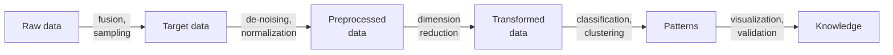

Data is useless raw. It is fused and sampled into target data, de-noised and normalised into preprocessed data, compressed by dimension reduction into transformed data, turned into patterns by classification or clustering, and finally validated and visualised into **knowledge** — the actionable insight that was the point of the exercise.

### Classification and clustering

Pattern recognition involves classifying and clustering patterns.

- Classification: Classification is when we teach a system to put things into categories. We do this by showing the system examples with known labels (like "apple" or "orange") so it can learn and label new things. This is part of supervised learning, where we give the system the answers to learn from.
- Clustering: Clustering is when the system groups similar things together without any labels. It looks at the data and tries to find natural groups. This is part of unsupervised learning, where the system learns by itself without knowing the answers beforehand.

**Classification worked example.** Feature tables are recorded for two known classes — apples measured at $(150, 0.80, 7.0)$ and $(170, 0.78, 7.5)$, oranges at $(130, 0.40, 6.3)$ and $(145, 0.38, 6.7)$, where the three rows might be weight, a colour index and a diameter. Those labelled vectors run through preprocessing → feature extraction → classification → recognition, and a new fruit comes out labelled "Apple". Notice that the apple values are consistently higher on these features; that consistency is precisely what the classifier learns.

**Clustering worked example.** A jumbled pile of oranges, strawberries and blackberries goes in with no labels. The algorithm compares colour, size and texture, and three groups come out — one box of each fruit. It never learns the *names*, only that these things belong together and those do not.

### Core concepts of pattern recognition

- Pattern: Any measurable object, signal or data instance that contains identifiable characteristics.
- Feature: A measurable property used to describe a pattern and distinguish between classes.
- Classifier: A model or function that assigns class labels based on features.
- Decision Boundary: The separating surface in feature space that divides different classes.
- Feature Space: A multidimensional space where each pattern is represented as a vector of features.
- Training Data: Labelled examples used to teach the model how to recognize patterns.

Read them as a chain. The **pattern** is the whole object; a **feature** is one measurable attribute of it; plot the features and you get the **feature space**, in which every pattern is a point (a vector); the **classifier** is the function that decides which region a point falls in; the **decision boundary** is the line, surface or hyperplane between regions; and **training data** is the labelled study material from which the boundary is learned.

### Working of a Pattern Recognition System

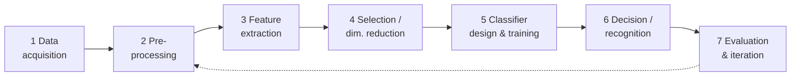

#### Step 1: Data Acquisition

Use a sensor to collect raw data. Examples:

- Camera captures object images.
- Microphone records speech.
- Wearable sensor records heart-rate signals.

The sensor is the interface between a physical phenomenon and digital data: light becomes a pixel array, sound waves become a digital audio signal, an electrical or optical body signal becomes a time series.

#### Step 2: Pre-processing

1. Clean and standardize raw data to make it suitable for analysis:
   - Noise removal (smoothing, filtering).
   - Normalization/standardization (e.g., scaling pixel values to [0, 1]).
   - Segmentation (extracting the object of interest from the background).
2. Goal: reduce variability that is not relevant to the pattern itself.

That last line is the whole purpose. Static in audio, graininess in a photograph and the room behind a face are all variability that has nothing to do with the identity being recognised; **segmentation** in particular isolates the object from its background.

#### Step 3: Feature Extraction

1. Transform pre-processed data into feature vectors:
   - Image: edges, color histograms, shapes, deep learned embeddings.
   - Audio: MFCCs, spectral features, energy.
   - Text: n-grams, TF–IDF, embeddings.
2. These features should capture the essential properties that help distinguish classes.

#### Step 4: Feature Selection / Dimensionality Reduction

1. Remove redundant or irrelevant features using:
   - Correlation analysis, mutual information, filter/wrapper methods.
   - PCA or other dimensionality reduction techniques.
2. Benefits: less overfitting, faster training/inference, simpler models.

Step 3 *creates* features from raw data; step 4 *refines* the list down to the useful ones. Selection picks a subset; dimensionality reduction such as PCA mathematically compresses many features into fewer new ones that retain most of the information.

#### Step 5: Classifier Design and Training

1. Choose a model family: k-NN, logistic regression, SVM, decision trees, random forests, neural networks, etc.
2. Train the model using the training set:
   - Learn parameters (weights, thresholds) or store instances (instance-based methods like k-NN).
   - Tune hyperparameters (regularization strength, number of neighbors, network depth) using validation data.

Parametric models (logistic regression, neural networks) learn weights. Instance-based models (k-NN) store the training examples and compare at prediction time. Hyperparameters — the $k$ in k-NN, a tree's depth — are never learned from the data; they are tuned on a **validation set**.

#### Step 6: Decision / Recognition

For a new input pattern:

- Apply the same preprocessing and feature extraction steps.
- Feed the resulting feature vector into the trained classifier.
- Obtain predicted class label (and optionally class probabilities or scores).

"The same" is not optional. A model trained on height in metres cannot be fed height in inches; if test-time processing differs from training-time processing, the features no longer mean what the model learned.

#### Step 7: Evaluation and Iteration

- Evaluate performance on a separate test set: Use metrics such as accuracy, precision, recall, F1-score, confusion matrix, ROC–AUC.
- Identify failure cases: Misclassified patterns, borderline cases, classes with poor recall.
- Iterate: Improve features, adjust preprocessing, change model or gather more/better data.

A single score is not analysis. Looking at *which* patterns failed — the borderline cases, the class with poor recall, the confusions visible in the matrix — is what tells you whether to fix the features, the preprocessing, the model or the data.

### Two processes: training mode and classification mode

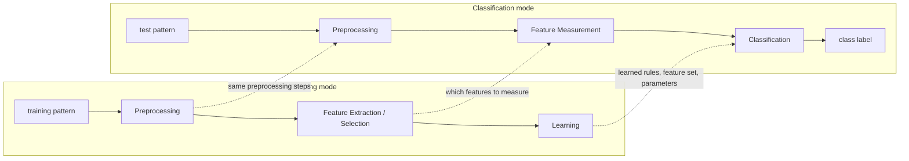

Training mode consumes labelled patterns and produces a model, with a feedback loop back to preprocessing and feature extraction when learning goes badly. Classification mode consumes an unlabelled test pattern and produces a label. The vertical arrows carry everything learned in training — the preprocessing recipe, the chosen features, the classifier parameters — into the operational path, which is why the two pipelines must stay in step.

### Generic concepts for pattern recognition

- **Feature vector** $\mathbf{x} \in X$ — a vector of observations (measurements); $\mathbf{x}$ is a point in the feature space $X$.
- **Hidden state** $y \in Y$ — cannot be measured directly; patterns with equal hidden state belong to the same class.
- **Task** — design a classifier (decision rule) $q: X \to Y$ that decides the hidden state from an observation.

Every pattern carries a hidden state — its identity, its category — which we cannot observe. So we take measurements $x_1, x_2, \dots, x_n$, bundle them into a feature vector $\mathbf{x}$ (a numerical fingerprint of the pattern), and build a function that maps that fingerprint back to the hidden state.

### Pattern Representation by Feature Vector for Character Recognition

$$X = [x_1, x_2, \dots, x_n], \quad \text{each } x_j \in \mathbb{R}$$

- $x_j$ may be an object measurement.
- $x_j$ may be a count of object parts.
- Example: object represented as [#holes, area, moments, …].

A digitised character is a grid of 0s and 1s — 0 for background, 1 for ink. Two routes lead from that grid to a feature vector. **Flatten it**, so every pixel becomes one component $x_j$; this is simple but very high-dimensional and sensitive to noise. Or **extract structure** — the number of closed loops (B has 2, O has 1, C has 0), the area, statistical moments that describe the pixel distribution regardless of position or rotation. The second route gives fewer, more robust dimensions at the cost of more preprocessing.

Good features are **discriminative**: very similar for objects of the same class (all the A's), very different across classes (an A versus a B).

### Example: a linear classifier

Task: identity recognition. Measure **height** and **weight**, so the hidden-state set is $Y = \{H, J\}$ and the feature space is $X = \mathbb{R}^2$.

$$q(\mathbf{x}) = \begin{cases} H & \text{if } (\mathbf{w} \cdot \mathbf{x}) + b \ge 0 \\ J & \text{if } (\mathbf{w} \cdot \mathbf{x}) + b < 0 \end{cases}$$

Training examples: $\{(\mathbf{x}_1, y_1), \dots, (\mathbf{x}_l, y_l)\}$.

- $\mathbf{w}$ — the weight vector, which fixes the orientation of the boundary.
- $b$ — the bias, which shifts the boundary away from the origin.
- $(\mathbf{w} \cdot \mathbf{x}) + b = 0$ — the decision boundary itself, the line at which the classifier is indifferent.

Plot $x_1$ (height) against $x_2$ (weight) and the two people form two clusters; the line separates them. Data that *can* be split by such a line is called **linearly separable**. Training means learning the $\mathbf{w}$ and $b$ that separate the training set best; prediction means substituting a new $(\text{height}, \text{weight})$ and reading the sign.

### Feature extraction: good and bad features

Task: to extract features which are good for classification. Good features mean that

- objects from the same class have similar feature values, and
- objects from different classes have different values.

Plotted, "good" features give two tight clusters with a clean gap that a straight line can exploit. "Bad" features give one intermingled cloud in which no boundary — simple or complex — can separate the classes, because the features simply do not carry the distinguishing information. The two properties have names: **intra-class similarity** (tight clusters) and **inter-class separability** (distance between clusters). No algorithm recovers from bad features.

### Feature extraction methods

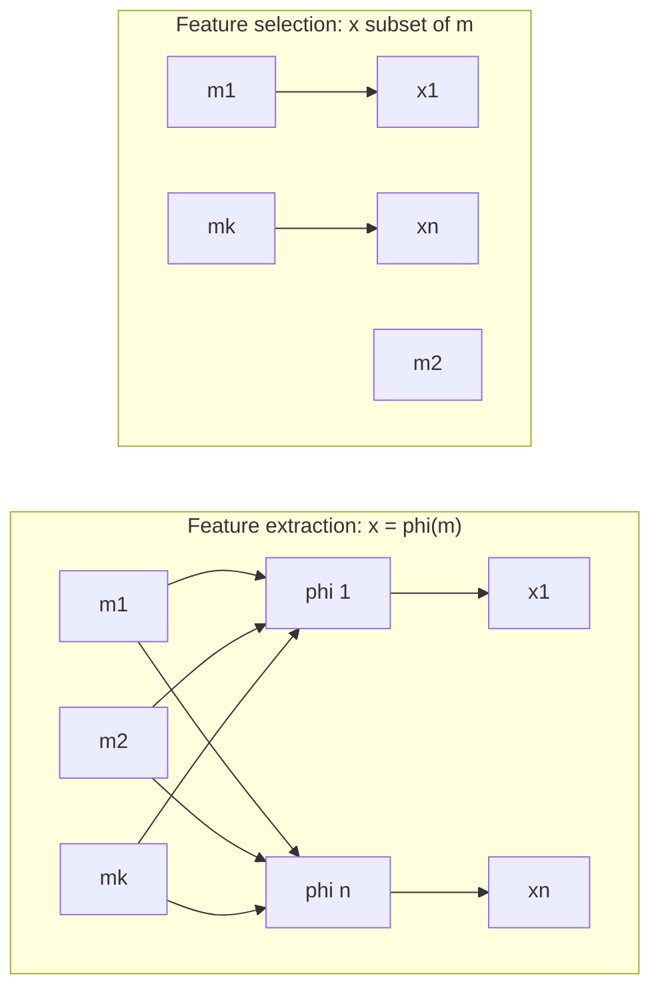

The problem is an optimisation over the parameters of the feature extractor:

- **Supervised methods** — the objective function is a criterion of separability (discriminability) of labelled examples, e.g. linear discriminant analysis (LDA).
- **Unsupervised methods** — a lower-dimensional representation that preserves important characteristics of the input data is sought, e.g. principal component analysis (PCA).

In extraction every new feature $x_j$ is a function $\varphi_j$ of all the original measurements $m_1 \dots m_k$ — a change of coordinate system, like turning height and weight into BMI. In selection the outputs are simply a subset of the inputs, drawn straight through with no transformation. Both move from a $k$-dimensional space to an $n$-dimensional one with $n < k$.

### Pattern Recognition for Embedded Vision

Three families of technique apply:

- Template matching
- Statistical / structural pattern recognition
- Neural networks

Real embedded-vision data is rarely linearly separable: plot two extracted features and the two classes overlap in the middle, so the decision boundary that separates them is a **wavy, non-linear** curve rather than a straight line. In an SVM picture, the circled points near the boundary are the **support vectors** — the few examples that actually determine where the boundary sits.

- **Template matching** compares a stored template against the image pixel-by-pixel (cross-correlation). Direct, but expensive over large searches.
- **Statistical** treats features as random variables and models each class with a distribution — Bayesian classifiers, SVMs.
- **Structural** looks at the relationships between parts ("a face has two eyes above a nose") using graphs or formal grammars.
- **Neural networks** learn the pattern hierarchy themselves; in modern embedded vision this means CNNs.

### Embedded Vision System

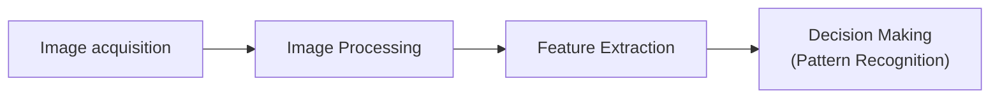

An embedded vision system runs computer vision inside a device that is not a general-purpose computer — a drone, a smart camera, medical equipment, an industrial robot — under tight limits on power, memory and speed. Acquisition is hardware (a CMOS or CCD sensor turning light into pixels). Image processing is *low-level* vision: noise reduction, sharpening, RGB-to-greyscale. Feature extraction is *mid-level*: edges, corners, blobs, textures. Decision making is *high-level*: classify and act — stop the car, unlock the phone, reject the part. Features rather than raw pixels are used precisely because the device cannot afford the pixels.

### Pattern Recognition models

1. **Template matching**
2. **Statistical Pattern Recognition** — based on an underlying statistical model of patterns and pattern classes.
3. **Structural (or syntactic) Pattern Recognition** — pattern classes represented by means of formal structures such as grammars, automata, strings, etc.
4. **Neural networks** — the classifier is represented as a network of cells modelling neurons of the human brain (the connectionist approach).

Statistical PR places patterns as points in a feature space and separates them with probability-based boundaries. Structural PR decomposes a complex pattern into **primitives** and describes how they legally combine, exactly as grammar governs a language. The neural approach stores its knowledge implicitly in connection weights learned during training rather than in explicit rules.

The same three-way split is often drawn as **Statistical / Syntactic / Neural** pattern recognition models. Statistical suits quantitative data; syntactic suits structured, qualitative data such as character recognition or scene analysis; neural suits large, high-dimensional, unstructured data.

### Pattern Recognition System

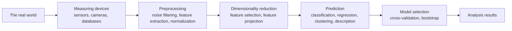

Preprocessing here includes vector normalisation, $u = v / \|v\|$, which rescales a vector to unit length so that no single feature dominates by magnitude alone. After dimensionality reduction the classes become visible as separated clusters in a low-dimensional plot of $f_1$ against $f_2$. **Model selection** closes the loop with cross-validation and bootstrap resampling, which estimate how well the system will generalise rather than how well it memorised.

A second common drawing of the same system splits the output by task:

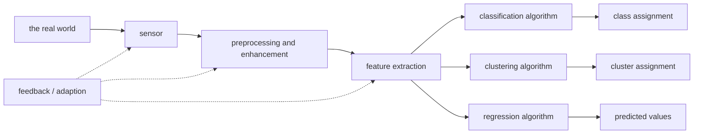

The same features feed three different destinations: **classification** for a discrete label, **clustering** for a group, **regression** for a continuous value. The feedback path lets performance at the output retune the sensor, the preprocessing or the feature set.

A third variant emphasises the learning algorithm:

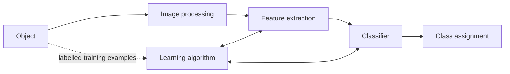

- Image acquisition and image processing.
- Feature extraction aims to create discriminative features good for classification.
- Classifier.
- The learning algorithm sets the PR system from training examples — supervised learning.

The bidirectional arrows matter: during training the learning algorithm tunes *both* the feature extractor and the classifier.

### Sensing to post-processing

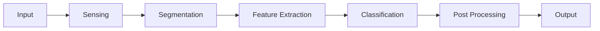

Segmentation finds *where* the object is; classification decides *what* it is; post-processing filters, thresholds and formats the result for the application.

### Applications of PR

- Image recognition — objects, places, people, handwriting, actions.
- Text pattern recognition and NLP — sentiment analysis, spam detection, translation.
- Audio and voice recognition — spoken words, speaker identification, music recognition.
- Medicine — medical imaging, genomic sequencing, diagnostic assistance.
- Cybersecurity — network intrusion, malware signatures, fraudulent transactions.

Pattern recognition is what lets a computer "see" and "hear": without it an image is only a grid of numbers.


## Pattern Representation

Pattern representation in machine learning is the mathematical and structural method used to transform raw, unstructured data (such as images, text, audio, or physical measurements) into a standardized format that computer algorithms can process and analyze.

Because machine learning models cannot interpret raw real-world objects directly, representation acts as the crucial translation layer that distills complex inputs into distinct, quantifiable properties.

A pattern is represented by a set of $d$ features, or attributes, viewed as a $d$-dimensional feature vector:

$$\mathbf{x} = (x_1, x_2, \dots, x_d)^T$$

The superscript $T$ is the **transpose**: the vector is written horizontally to save space but is mathematically a **column vector**, which is the standard convention in linear algebra and machine learning. The dimensionality $d$ is the number of attributes measured, and it is the dimensionality of the feature space in which the pattern is a single point. That abstraction is what lets algorithms compute distances between patterns, find clusters and draw boundaries.

### Core Paradigms of Pattern Representation

Depending on the nature of the data and the learning task, patterns are represented using one of three primary frameworks:

#### 1. Statistical (Vector) Representation

This is the most popular approach in machine learning. A pattern is represented as a single point or a feature vector in a multi-dimensional mathematical space.

- Feature Vector: An ordered set of $d$ measurable attributes, written as $X = [x_1, x_2, ..., x_d]^T$.
- Feature Space: The multi-dimensional space formed by these vectors.
- Example: Representing a house pattern by its size ($x_{1}$), number of bedrooms ($x_{2}$), and age ($x_{3}$).

The **order** is part of the representation: if the first slot is size, it must be size in every vector. Two features give a plane, three a volume, $d$ a $d$-dimensional hyperspace in which the learning algorithm looks for clusters and boundaries.

#### 2. Structural (Syntactic) Representation

When the relationships between parts of an object are more important than individual numeric values, structural representation is used.

- Graphs & Trees: Patterns are modeled as nodes (sub-patterns) connected by edges (relationships).
- Strings & Grammars: Complex patterns are broken down into a sequence of simpler primitives, much like words in a sentence.
- Example: Describing a chemical molecule by how its atoms are bonded together.

The focus shifts from values to **topology**. A chair is four legs, a seat and a back in a particular arrangement, whatever the exact dimensions; a molecule's properties come from which atom bonds to which, not from the atom count. **Nodes** are the primitives, **edges** are the relationships, and a **grammar** states which combinations are legal.

#### 3. Neural-Based (Hierarchical) Representation

Deep learning models automate representation through artificial neural networks.

- Tensors: High-dimensional arrays (e.g., matrices for 2D images, 3D tensors for video).
- Latent Spaces: Raw data passes through layers, and the network extracts condensed, hierarchical representations automatically.
- Example: A face image is represented as raw pixels, which the network converts into edge representations, then facial feature representations.

This is the shift from human-engineered features to learned ones. Low layers detect edges and colour gradients, middle layers assemble them into parts (an eye, a nose), high layers assemble parts into objects (a face). The intermediate encodings live in a **latent space** — a compressed representation that keeps what matters and discards noise.

### Pattern representation

Pattern representation is: How we represent the data for the machine learning algorithm. The form of representation influences the accuracy of classification.

Which is the practical point of the whole section: choosing the right features and the right way to encode them often matters more than choosing the algorithm.

### Concept of Pattern Recognition

Pattern recognition involves following stages:

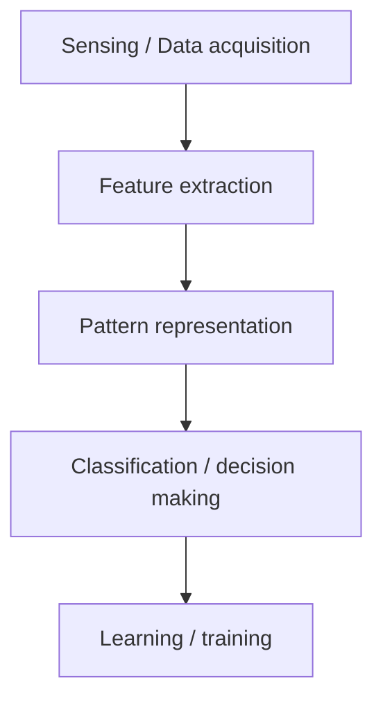

- Sensing / Data acquisition (e.g., capturing an image or recording audio)
- Feature extraction (extract meaningful properties like edges in an image, frequency in audio)
- Pattern representation (representing data in a form suitable for classification, like vectors)
- Classification / decision making (assigning the input to a class using a model, like k-NN, SVM, neural network)
- Learning / training (training the model on labeled examples so it can generalize to new inputs)

Example:

Suppose we want to classify flowers:

| Feature | Meaning |
| --- | --- |
| petal length | numerical value |
| petal width | numerical value |
| sepal length | numerical value |
| sepal width | numerical value |

These four continuous measurements are the standard feature set of the **Iris** dataset, the classic introductory classification problem.

A flower can be represented as a vector of features:

$$X = [\text{petal length}, \text{petal width}, \text{sepal length}, \text{sepal width}]$$

If we want to recognize handwritten digits:

$$X = [\text{pixel 1 intensity}, \text{pixel 2 intensity}, ..., \text{pixel n intensity}]$$

In speech recognition:

$$X = [\text{frequency at time t1}, \text{frequency at time t2}, ...]$$

Note the dimensionalities: 4 for the flower, $784$ for a $28 \times 28$ greyscale digit, one component per time step for the speech signal. Because all three end up as vectors of numbers, the *same* algorithms — linear regression, SVM, neural networks — apply to all three problems.

### Pattern representation forms

- Vector → Most common (e.g., $[x_1, x_2, ..., x_d]$)
- Graph → For relational patterns (e.g., social networks)
- Strings → For text or DNA sequences
- Trees → For hierarchical data

Vectors align with linear algebra and standard statistical models, which is why they dominate. Graphs win when the connections matter as much as the entities. Strings win when order is critical — language, DNA, protein sequences. Trees win on nested parent-child data — file systems, org charts, parse trees.


## Classifiers and Decision Regions

### Classifier as a partition of feature space

A classifier partitions feature space $X$ into **class-labeled regions** such that

$$X = X_1 \cup X_2 \cup \dots \cup X_{|Y|}, \qquad X_i \cap X_j = \emptyset \ \ (i \neq j)$$

Classification consists of determining to which region a feature vector $\mathbf{x}$ belongs. The borders between decision **regions** are called decision **boundaries**.

The two set conditions carry real meaning:

- **Exhaustive** — the union of the regions is the whole space, so every possible input gets a class. There are no undefined zones.
- **Mutually exclusive** — the regions are disjoint, so no point belongs to two classes at once.

A simple classifier carves the space into a few contiguous regions with near-straight edges. A more powerful one (a decision tree, k-NN) produces wavy boundaries and can even assign **non-contiguous** regions to the same class — two separate territories both labelled $X_1$ — which is perfectly legal and often necessary.

### Decision-Tree Classifier

Character recognition worked as a tree over geometric features:

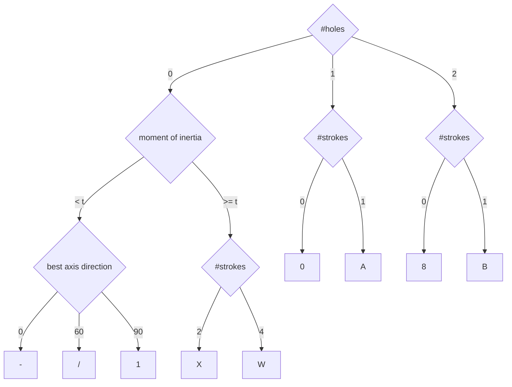

- Uses subsets of features in sequence.
- Feature extraction may be interleaved with classification decisions.
- Can be easy to design and efficient in execution.

Three properties are worth naming. **Sequential feature use** — each node tests one feature rather than all of them at once. **Interleaved, lazy extraction** — "best axis direction" is computed only for characters that have zero holes and a low moment of inertia; a character with one hole never pays that cost. **Interpretability** — the whole model reads as IF-THEN rules, unlike a neural network.

Splits can be categorical (0, 1 or 2 holes) or numerical against a threshold (moment of inertia $< t$ versus $\ge t$). Features nearer the root are the more discriminative ones. Trees can be hand-designed for simple problems or learned by ID3, C4.5 or CART.

### Classification using nearest class mean

- Compute the Euclidean distance between feature vector $X$ and the mean of each class.
- Choose the closest class, if close enough (reject otherwise).

$$d(X, \mu) = \sqrt{(x_1 - \mu_1)^2 + (x_2 - \mu_2)^2}$$

Training is trivial: average the feature vectors of each class to get its centroid. Prediction: measure the distance from the new point to every centroid and take the nearest. The **reject** clause matters — if even the nearest mean is further away than some threshold, the classifier declines to answer and labels the point unknown, which is safer than a confident wrong guess.

NCM is extremely cheap because only one mean vector per class is stored, unlike k-NN which keeps the entire training set. Its assumption is the price: classes are taken to be roughly spherical with similar spread, so elongated or very unequal clusters break it. Mahalanobis distance can replace Euclidean to soften that.

### Unsupervised learning as an iterative loop

- **Input** — training examples $\{x_1, \dots, x_l\}$ without information about the hidden state.
- **Clustering** — the goal is to find clusters of data sharing similar properties.
- Classifier $q: X \times \Theta \to Y$
- Learning algorithm (supervised) $L: (X \times Y)^l \to \Theta$

```mermaid
flowchart LR
    D["{x1 ... xl}"] --> CL["Classifier"]
    D --> LA["Learning algorithm"]
    CL -- "labels {y1 ... yl}" --> LA
    LA -- "parameters theta" --> CL
    CL --> OUT["{y1 ... yl}"]
```

Read the loop carefully, because the diagram deliberately contains a *supervised* learner inside an *unsupervised* framework. We have no labels, so we guess: the classifier assigns provisional labels from the current parameters $\theta$, the learning algorithm treats those provisional labels as if they were ground truth and updates $\theta$, and the improved $\theta$ produces better labels next round. The cycle repeats until the assignment stops changing.

### Example of an unsupervised learning algorithm: k-Means

$$y = q(x) = \arg \min_{i=1, \dots, k} \| x - m_i \|$$

$$m_i = \frac{1}{|I_i|} \sum_{j \in I_i} x_j, \qquad I_i = \{ j : q(x_j) = i \}$$

with parameters $\theta = \{m_1, \dots, m_k\}$, and the goal of minimising

$$\sum_{i=1}^{l} \| x_i - m_{q(x_i)} \|^2$$

That objective is the **Within-Cluster Sum of Squares** (WCSS): the total squared Euclidean distance from every point to the centroid of the cluster it was assigned to. The algorithm alternates two steps, which map exactly onto the loop above:

1. **Assignment (the classifier)** — give each point the label of its nearest centroid, via $\arg\min$.
2. **Update (the learning algorithm)** — move each centroid to the arithmetic mean of the points currently assigned to it.

Convergence to a *local* minimum of WCSS is guaranteed; the global minimum is not. The resulting boundaries are **Voronoi** boundaries — the perpendicular bisectors between centroids — so every point in a region is genuinely closer to that region's centroid than to any other.


## Basics of Probability and Bayes' Theorem

Probability provides a foundation for reasoning about uncertainty in machine learning.

Key ideas:

- Probability of event A ($P(A)$) → Likelihood that event A happens ($0 \le P(A) \le 1$)
- Joint probability ($P(A, B)$) → Probability A and B both happen
- Conditional probability ($P(A|B)$) → Probability A happens given B happens
- Bayes' rule:

$$P(A\mid B)=\frac{P(B\mid A)\,P(A)}{P(B)}$$

In pattern recognition, probability tells us how likely it is that an input belongs to a certain class.

Machine learning models almost never deal in certainties, so probability is how a model expresses how sure it is. In classification the quantity we want is $P(\text{class} \mid \text{features})$, and Bayes' rule is what lets us compute it from the more accessible $P(\text{features} \mid \text{class})$.

### Conditional Probability

Conditional probability is the probability of an event occurring based on the occurrence of another event. Conditional probability questions often involve picking two objects from a set, because once the first object has been picked the probabilities change for the second pick.

**Marble example.** A bag holds 3 red and 4 blue marbles:

$$P(\text{red}) = \frac{3}{7}, \qquad P(\text{blue}) = \frac{4}{7}$$

Pick one red marble out and do not replace it. Two red and four blue remain:

$$P(\text{red}) = \frac{2}{6}, \qquad P(\text{blue}) = \frac{4}{6}$$

The probabilities are calculated based on what has already occurred. These are **dependent events**, and the mechanism is sampling **without replacement**: the denominator (the sample space) drops by one on every draw, and the numerator drops too if the item removed belonged to the event being measured. Note that $P(\text{blue})$ changed from $4/7$ to $4/6$ even though no blue marble was touched — a shrinking sample space is enough.

### Formal definition

The conditional probability of an event $A$ assuming that $B$ has occurred, denoted $P(A \mid B)$, equals

$$P(A \mid B) = \frac{P(A \cap B)}{P(B)} \tag{1}$$

which can be proven directly using a Venn diagram. Multiplying through, this becomes the **multiplication rule**

$$P(A \mid B)\,P(B) = P(A \cap B) \tag{2}$$

which generalises to the **chain rule**

$$P(A \cap B \cap C) = P(A)\,P(B \mid A)\,P(C \mid A \cap B) \tag{3}$$

and rearranging (1) gives

$$P(B \mid A) = \frac{P(B \cap A)}{P(A)} \tag{4}$$

Equation (1) requires $P(B) > 0$. The intuition is a **shrinking sample space**: instead of considering every outcome, look only at the outcomes where $B$ holds, and ask what fraction of *that* smaller universe also has $A$ — which is exactly why the division by $P(B)$ appears. On a Venn diagram, $P(A \mid B)$ is the share of circle $B$ that overlaps $A$. The chain rule extends this to a sequence of events and is the foundation of Bayesian networks, Naive Bayes and Hidden Markov Models.

**Birthday example.** Let $A$ = today is your birthday and $B$ = your birthday is in this month. The events are dependent. In a 31-day month:

- $P(A) = 1/31$
- $P(A \mid B) = (1/31) / 1 = 1/31$
- $P(B \mid A) = (1/31) / (1/31) = 1$

The last line is the instructive one: if today *is* your birthday, then your birthday being in this month is certain, so the conditional probability is exactly 1. Note also the test for independence — events are independent when $P(B \mid A) = P(B)$; here they are not equal, so the events are dependent.

### Bayes' Theorem

Bayes' Theorem is a fundamental concept in probability and statistics, widely used in machine learning — especially in classification tasks.

$$P(A|B) = \frac{P(B|A) \cdot P(A)}{P(B)}$$

| Term | Name | Reading |
| --- | --- | --- |
| $P(A \mid B)$ | Posterior | probability of $A$ being true given that $B$ is true |
| $P(B \mid A)$ | Likelihood | probability of $B$ being true given that $A$ is true |
| $P(A)$ | Prior | probability of $A$ being true — the existing knowledge |
| $P(B)$ | Evidence / marginalisation | probability of $B$ being true; normalises the result |

In machine-learning terminology the same equation reads

$$\text{Posterior} = \frac{\text{prior} \times \text{likelihood}}{\text{evidence}}$$

**Spam-filter reading of each term.** The **prior** is the general probability that any email is spam. The **likelihood** is the probability that a spam email contains the word "Winner". The **evidence** is the probability that *any* email contains "Winner". The **posterior** is what we actually want: given that this email contains "Winner", how likely is it to be spam? The evidence term is what forces the posteriors across all classes to sum to 1.

Note that $P(A \mid B) \neq P(B \mid A)$. Confusing the two — the probability of the hypothesis given the data versus the probability of the data given the hypothesis — is the classic error.

### Components of Bayes' Theorem

```mermaid
flowchart TD
    L["Likelihood"] --> B["Bayes' Theorem"]
    D["Data"] --> B
    P["Prior"] --> B
    B --> PO["Posterior Distribution"]
```

Bayesian inference updates belief as evidence arrives. The **prior** is what we believed beforehand (drawn as a dotted, wide curve — plenty of uncertainty). The **data** is what we observed (a histogram). The **likelihood** says how well the data supports each hypothesis. The **posterior** is the synthesis: a single narrower curve sitting between the prior and the data, closer to whichever is stronger. The posterior is proportional to likelihood × prior.

Advantages:

- Easy to implement
- Handles uncertainty well
- Works well with small data
- Performs well in text classification problems

The small-data strength comes from the prior: existing knowledge supplements limited training data, which is why Bayesian methods are often chosen over deep learning when data is scarce.

### Applications of Bayes Theorem

1. Naive Bayes Classifier
2. Bayes optimal classifier
3. Bayesian Optimization

Bayes' Theorem is used in Naive Bayes classifiers to calculate the probability of a class label given a set of features, assuming that the features are conditionally independent.

### The Naive Bayes Classifier

Role of Bayes' Theorem in Naive Bayes classifiers:

- The Naive Bayes classifier is a simple probabilistic classifier based on applying Bayes' theorem with a strong (naive) independence assumption between the features.
- It is widely used for text classification, spam filtering, and other tasks involving high-dimensional data.
- Despite its simplicity, the Naive Bayes classifier often performs well in practice and is computationally efficient.

$$P(C_k \mid \mathbf{x}) = \frac{P(\mathbf{x} \mid C_k)\,P(C_k)}{P(\mathbf{x})}$$

```mermaid
flowchart LR
    IN["mixed unlabelled<br/>feature vectors"] --> NB["Naive Bayes<br/>classifier"]
    NB --> C1["class 1"]
    NB --> C2["class 2"]
    NB --> C3["class 3"]
```

The word **naive** names the simplifying assumption: every feature is taken to be independent of every other feature given the class. Classifying a fruit as an apple from "red" and "round", the model treats redness as telling it nothing about roundness. That is rarely true in the real world, yet the assumption collapses the maths to a product of simple terms and the classifier still performs remarkably well — the performance paradox worth remembering for a viva.

In a two-feature plot the classifier's regions are separated by curved boundaries meeting at a junction, and a new point is assigned to whichever class has the highest posterior. Naive Bayes is a **generative** model: it models each class's distribution rather than the boundary directly. Its strengths are speed, modest data requirements, natural multi-class handling and excellent behaviour on high-dimensional text where every word is a feature.


## Maximum Likelihood Estimation

Maximum Likelihood Estimation (MLE) is a statistical technique used to estimate the parameters of a probability distribution by maximizing the likelihood function.

It is widely applied in machine learning, statistics, and AI to optimize models for tasks such as classification, regression, and generative modeling.

The procedure: assume the data comes from some family of distributions (say Gaussian) whose parameters — the mean $\mu$, the standard deviation $\sigma$ — are unknown; write the likelihood as a function of those parameters with the data held fixed; then find the parameter values at the peak, usually by differentiating the **log**-likelihood and setting it to zero.

MLE is not a side topic. Logistic regression finds its weights by MLE. Linear regression under Gaussian noise has an OLS solution that *is* the MLE solution. Generative models learn a data distribution by maximising likelihood.

### What does Likelihood mean?

Likelihood is a fundamental concept in statistics and machine learning that measures how well a set of parameters explains a given dataset.

Unlike probability, which measures the chance of an event occurring, likelihood quantifies how probable the observed data is under a specific model.

Numerically the likelihood $L(\theta \mid x)$ equals the density $P(x \mid \theta)$, but it is read as a function of the **parameters** $\theta$ with the data $x$ fixed, rather than a function of the data with the parameters fixed. A higher likelihood means the parameters fit the observed data better.

### Difference between Likelihood and Probability

- Probability: Given a known model and parameters, probability predicts future outcomes.
- Likelihood: Given observed data, likelihood estimates the best parameters for a model.

```mermaid
flowchart LR
    M["Model<br/>(parameters)"] -- "probability" --> O["Outcomes<br/>(data)"]
    O -- "likelihood" --> M
```

Geometrically, on the same bell curve:

- **Probability is an area.** $P(a \le X \le b) = \int_a^b f(x \mid \theta)\,dx$ — the shaded region between two data values.
- **Likelihood is a height.** $L(\theta \mid x) = f(x \mid \theta)$ — the value of the curve at one observed point.

**Worked numbers.** Take a normal distribution with $\mu = 13$ and $\sigma = 4$:

$$f(x \mid \mu, \sigma) = \frac{1}{\sigma\sqrt{2\pi}}\, e^{-\frac{1}{2}\left(\frac{x-\mu}{\sigma}\right)^2}$$

- Probability that $5 \le x \le 10$: $0.204$ (an area).
- Probability that $-1000 \le x \le 1000$: $1.000$ — effectively the whole curve, and the total area under any density is always 1.
- Likelihood of $\mu = 13, \sigma = 4$ if the observed value was $x = 10$: $0.075$ (a height).
- Likelihood of the same parameters if the observed value was $x = 14$: $0.097$.

```mermaid
xychart-beta
  title "Normal density, mu = 13 and sigma = 4"
  x-axis "x" [0,2,4,6,8,10,12,14,16,18,20,22,24,26,28,30]
  y-axis "density f(x)" 0 --> 0.11
  line [0.0005,0.0023,0.0079,0.0216,0.0457,0.0753,0.0967,0.0967,0.0753,0.0457,0.0216,0.0079,0.0023,0.0005,0.0001,0]
```

Read the curve two ways. **Probability** is an area under it — the region between $x=5$ and $x=10$ integrates to $0.204$. **Likelihood** is a height on it: at the observed $x = 10$ the curve stands at $0.0753$, and at $x = 14$ it stands at $0.0967$. Those are exactly the $0.075$ and $0.097$ quoted below.

Conclusion: if the observed value was 14, it is *more likely* that the parameters are $\mu = 13$ and $\sigma = 4$, because $0.097 > 0.075$. In probability the parameters are fixed and the data varies; in likelihood the data is fixed and the parameters vary.

### Recursive estimation: prior, likelihood, posterior over time

When the quantity being estimated changes over time — a robot's position, a tracked object — the same three terms recur at every step:

```mermaid
flowchart LR
    P0["Posterior at step k-1"] -- "(1) Prediction" --> PR["Prior p(theta_k)"]
    PR -- "(2) Update with likelihood L(z_k | theta_k)" --> W["weighted particles"]
    W -- "(3) Resampling" --> P1["Posterior p(theta_k | x_1:k)"]
    P1 -- "Prediction" --> PR2["Prior at step k+1"]
```

- $\theta$ — the state being estimated; $z_k$ — the measurement at time $k$; $x_{1:k}$ — all observations up to $k$.
- **Prediction** moves the particles (candidate states) forward with a motion model, spreading them out — this produces the prior.
- **Update** weights each particle by the likelihood $L(z_k \mid \theta_k)$: particles near the peak of the likelihood curve get large weights, particles at the edges get small ones. This is where "maximum likelihood" enters — the best-matching hypotheses are the most important.
- **Resampling** duplicates heavy particles and discards light ones, concentrating computation in high-probability regions and solving the degeneracy problem where one particle would eventually hold all the weight.

Unlike a Kalman filter, which assumes a Gaussian, this particle-based scheme represents distributions of any shape.

### Maximum Likelihood Estimation with the Binomial Distribution

Consider an experiment with two outcomes, success ($S$) and failure ($F$), for each subject, run over $n$ subjects. The sequence of outcomes can be arranged as

```
S S F S F F F S S F S ...... F
```

where there are $x$ successes out of $n$ trials. The probability distribution of $x$ is

$$f(x) = \binom{n}{x} p^x (1-p)^{n-x}, \qquad x = 0, 1, \dots, n$$

where $p = \text{prob}(S)$ and $1 - p = \text{prob}(F)$. The mean and variance of $x$ are $np$ and $np(1-p)$.

Written out with factorials:

$$P(X) = \frac{n!}{X!\,(n-X)!}\, p^X q^{\,n-X}, \qquad 0 \le X \le n$$

$$\mu = n \cdot p, \qquad \sigma^2 = n \cdot p \cdot q, \qquad \sigma = \sqrt{n \cdot p \cdot q}$$

Term by term:

- $\binom{n}{x} = \frac{n!}{x!(n-x)!}$ — the binomial coefficient, the number of ways to arrange $x$ successes among $n$ trials.
- $p^x$ — the probability of getting those $x$ successes.
- $(1-p)^{n-x}$ or $q^{n-x}$ — the probability of the remaining $n - x$ failures, with $p + q = 1$.

The four assumptions of a binomial experiment: a **fixed** number of trials $n$; **independent** trials; exactly **two** outcomes per trial; and a **constant** success probability $p$.

For MLE this PMF is read as the likelihood function $L(p \mid x, n)$, and the task is to find the $p$ that maximises it given the observed number of successes $x$ — which, for the binomial, works out to the intuitive $\hat{p} = x/n$.


## Modeling

### What is Modeling?

Modeling is the process of creating a machine learning model that learns patterns from the training data and can make predictions or decisions on new (unseen) data.

Four parts: the **training data** (historical, with known answers), the **learning** (finding relationships in it), the **model** (the functional form of what was learned) and the **goal** — applying it to unseen data to produce a prediction ("this image is a cat") or a decision ("deny this transaction"). Building the model is *training*; using it afterwards is *inference*.

### Modeling Workflow

```mermaid
flowchart LR
    A["Collect<br/>data"] --> B["Preprocess<br/>data"]
    B --> C["Select model<br/>(algorithm)"]
    C --> D["Train<br/>model"]
    D --> E["Evaluate<br/>model"]
    E --> F["Tune<br/>parameters"]
    F --> G["Predict on<br/>new data"]
    F -.-> D
```

- Collect Data: Input dataset (e.g., CSV, Excel)
- Preprocess Data: Cleaning, encoding, normalization, feature scaling, splitting
- Select Model (Algorithm)
  - Classification → SVM, KNN, Decision Tree
  - Regression → Linear Regression
  - Clustering → K-Means
- Train Model: Model learns from training data
- Evaluate Model: Accuracy, precision, recall, confusion matrix, etc.
- Tune Parameters: Adjust hyperparameters (e.g., GridSearchCV)
- Predict on New Data: Final model makes predictions on unseen data

Model selection is driven by the output you need: a category → classification, a number → regression, hidden groups → clustering. Hyperparameter tuning turns the algorithm's external knobs — the $k$ in k-NN, a tree's depth — often by grid search (`GridSearchCV`), and feeds straight back into training.

### Goal of Modeling

To build a generalized model that performs well on unseen/test data, not just the training data.

**Generalisation** is the ability to be right about data never seen in training, which requires learning the underlying pattern rather than memorising examples. High training accuracy alone proves nothing; it may simply be **overfitting**.

### Good Modeling Practices

- Use cross-validation (e.g., K-Fold)
- Avoid overfitting (model memorizes training data)
- Avoid underfitting (model is too simple)
- Use feature scaling when needed
- Choose the right evaluation metric for your problem

- **K-Fold cross-validation** splits the data into $K$ subsets and trains $K$ times, each time holding out a different subset for testing. Averaging those results estimates performance far more reliably than one arbitrary split.
- **Overfitting** is a too-complex model learning the noise: excellent on training data, poor on new data. It is the high-**variance** failure.
- **Underfitting** is a too-simple model — a straight line through curved data. Poor on both training and test data. It is the high-**bias** failure.
- **Feature scaling** is mandatory for distance-based algorithms (k-NN, clustering) and gradient-descent-based ones (linear regression, neural networks).
- **Metric choice** matters: on a dataset where 99 % of samples are one class, a model that always predicts the majority scores 99 % accuracy and is useless. Precision, recall and F1 expose that; for regression, MSE or $R^2$ are appropriate.

### Types of Models based on Task

| Task | Examples |
| --- | --- |
| Classification | SVM, KNN, Naive Bayes |
| Regression | Linear Regression, Ridge, Lasso |
| Clustering | K-Means, DBSCAN |
| Dim. Reduction | PCA, t-SNE |
| Deep Learning | ANN, CNN, RNN |

One task, many algorithms. Classification predicts discrete categories; regression predicts continuous values; clustering groups unlabelled data; dimensionality reduction simplifies by cutting features; deep learning stacks layers to model complex patterns in unstructured data — CNNs typically for images, RNNs for sequences such as text and time series.


## Regression

### What is Regression?

Regression is a type of supervised learning algorithm used to predict continuous numerical values based on input features.

For example:

- Predicting house price based on area
- Predicting temperature based on time of year

The defining property is the **output type**: a continuous number, not a category. A house price is a specific amount that can vary by a rupee, not the label "expensive" or "cheap". Classification predicts labels; regression predicts quantities.

### Types of Regression

- Linear Regression: Predicts output using a straight-line equation. Formula: $y = mx + c$
- Multiple Linear Regression: Involves more than one input feature. Formula: $y = b_0 + b_1 x_1 + b_2 x_2 + ... + b_n x_n$
- Polynomial Regression: Fits a non-linear curve (polynomial equation)
- Ridge and Lasso Regression: Regularized versions of linear regression to reduce over fitting
- Logistic Regression (Actually for classification): Predicts probability of class (used in classification)

- **Simple linear** assumes one input drives the output, and draws a line.
- **Multiple linear** takes several inputs and fits a **hyperplane** in a multi-dimensional space, so it can account for combined influences.
- **Polynomial** models the relationship as an $n$-th degree polynomial, $y = \beta_0 + \beta_1 x + \beta_2 x^2 + \dots + \beta_n x^n$, for data that follows a curve.
- **Ridge (L2)** and **Lasso (L1)** add a penalty on the size of the coefficients so the model cannot grow complex enough to memorise noise. Lasso can drive coefficients to exactly zero, which makes it a feature selector as well.
- **Logistic** is classification: a sigmoid turns a linear combination into a probability in $[0, 1]$.

### Steps in Regression Modeling

- Collect and prepare data
- Split data into training and testing sets
- Train the regression model
- Predict on test data
- Evaluate using metrics

Splits are typically 70/30 or 80/20. Model parameters are adjusted **only** during training — never in response to the test set, or the test set stops being an honest estimate. Evaluation uses MAE, MSE, RMSE or $R^2$.

### Linear Regression Equation

$$y = \beta_0 + \beta_1 x + \varepsilon$$

Where:

- $y$ = predicted value
- $x$ = input feature
- $\beta_0$ = intercept
- $\beta_1$ = slope/coefficient
- $\varepsilon$ = error term

### Simple Linear Regression: population model and estimated model

The **population model** describes the true relationship in the whole population and uses Greek letters:

$$y = \beta_0 + \beta_1 x + \varepsilon$$

- $\beta_0$ — the population's y-intercept, the expected $y$ when $x = 0$.
- $\beta_1$ — the slope of the population regression line, the average change in $y$ per unit change in $x$.
- $\varepsilon$ — the error term, the variation in $y$ that the linear relationship with $x$ cannot explain.

Because $\beta_0$ and $\beta_1$ are unknown in practice, we estimate them from a sample, giving the **estimated model** in Latin letters:

$$\hat{Y}_i = b_0 + b_1 X_i, \qquad e_i = Y_i - \hat{Y}_i$$

- $\hat{Y}_i$ — the predicted value of $Y$ for observation $i$; the hat always means "estimated".
- $b_0, b_1$ — the sample estimates of the intercept and slope.
- $e_i$ — the **residual**: the vertical distance between the observed point $Y_i$ and the fitted line. Positive means the model under-predicted, negative means it over-predicted.

Fitting means choosing $b_0$ and $b_1$ to minimise the **Sum of Squared Errors**, $\sum e_i^2$ — the method of **Ordinary Least Squares (OLS)**. Interpretation matters as much as the algebra: if $b_1 = 2$, then $Y$ is expected to rise by 2 units for every 1-unit rise in $X$, and $b_0$ is simply where the line crosses the vertical axis.

### Multiple Linear Regression

Multiple Linear Regression (MLR), also known as multiple regression, is a statistical technique that uses several explanatory variables to predict the outcome of a response variable. The relationship between one dependent and two or more independent variables is a linear function.

Population model:

$$Y_i = \beta_0 + \beta_1 X_{1i} + \beta_2 X_{2i} + \dots + \beta_p X_{pi} + \varepsilon_i$$

Sample (estimated) model with $k$ independent variables:

$$\hat{Y}_i = b_0 + b_1 X_{1i} + b_2 X_{2i} + \dots + b_k X_{ki}$$

- $\hat{Y}_i$ — the estimated (predicted) value of $Y$ for observation $i$.
- $b_0$ — the estimated intercept: the predicted $Y$ when every independent variable is zero.
- $b_1, \dots, b_k$ — the estimated slope coefficients, also called **partial** regression coefficients.
- $X_{1i}, \dots, X_{ki}$ — the values of the $k$ predictors for observation $i$.

The crucial interpretation: each $b_j$ is the change in the mean of $Y$ per one-unit change in $X_j$ **while holding all other independent variables constant** — the *ceteris paribus* condition. Predicting a house price from square footage, bedrooms and age, $b_1$ tells you what an extra square foot is worth for houses of the same age with the same number of bedrooms.

Geometrically, one predictor gives a line, two give a plane, and $k$ give a hyperplane. The coefficients are estimated from sample data by OLS, minimising the sum of squared differences between observed and predicted values.


## Discriminant Functions

A discriminant function is a function used in pattern recognition and machine learning to classify data points into different classes.

It evaluates a feature vector and assigns it to one of the predefined classes by comparing the function values.

Although we have focused on probability distribution functions, the decision on class membership in our classifiers has been based solely on the **relative sizes** of the probabilities. That observation allows the classification process to be reformulated in terms of a set of discriminant functions $y_1(\mathbf{x}), \dots, y_c(\mathbf{x})$, where an input vector $\mathbf{x}$ is assigned to class $C_k$ if

$$y_k(\mathbf{x}) > y_j(\mathbf{x}) \quad \text{for all } j \neq k$$

and the rule that minimises the probability of misclassification is obtained by choosing

$$y_k(\mathbf{x}) = P(C_k \mid \mathbf{x})$$

The point is that we never need the exact probability values, only which one is largest. Any monotonic transformation of the posterior — the logarithm, for instance — is an equally valid discriminant function because it preserves the ordering.

### The general decision rule

$$\text{choose } C_i \text{ if } g_i(\mathbf{x}) = \max_k g_k(\mathbf{x})$$

with $g_i(\mathbf{x})$ chosen from any of the equivalent forms

$$g_i(\mathbf{x}) = \begin{cases} -R(\alpha_i \mid \mathbf{x}) & \text{negative conditional risk} \\ P(C_i \mid \mathbf{x}) & \text{posterior probability (MAP rule)} \\ p(\mathbf{x} \mid C_i)\,P(C_i) & \text{likelihood} \times \text{prior} \end{cases}$$

For $K$ classes this yields $K$ **decision regions** $\mathcal{R}_1, \dots, \mathcal{R}_K$ with

$$\mathcal{R}_i = \{ \mathbf{x} \mid g_i(\mathbf{x}) = \max_k g_k(\mathbf{x}) \}$$

The three forms are interchangeable for different purposes. Minimising risk is the same as maximising negative risk. Maximising the posterior is the MAP rule, which minimises error probability. And since the denominator $p(\mathbf{x})$ in Bayes' rule is identical for every class, maximising $p(\mathbf{x} \mid C_i) P(C_i)$ gives the same answer as maximising the posterior — which is convenient, because the numerator is the part we can actually estimate.

The boundary between $\mathcal{R}_i$ and $\mathcal{R}_j$ is the set of points where $g_i(\mathbf{x}) = g_j(\mathbf{x})$. A **reject** region can be added in the middle, where the largest $g_i(\mathbf{x})$ is not sufficiently larger than the rest: rather than guess under high uncertainty, the classifier declines — valuable when a wrong answer is costly.

### Why Use Discriminant Functions?

- They provide a decision boundary between classes.
- Useful in supervised learning for classification tasks.
- Allow for probabilistic or distance-based interpretations

The two interpretations are worth separating. **Probabilistic** — logistic regression outputs a number in $[0, 1]$ read as $P(\text{class} \mid x)$. **Distance-based** — SVM and LDA place the boundary by geometry, measuring distance from a separating hyperplane or from a class prototype. A related viva question: discriminant functions are **discriminative** models, targeting $P(y \mid x)$ directly, in contrast to **generative** models such as Naive Bayes which model $P(x \mid y)$ and $P(y)$.

### Two-class case and non-linear discriminants

For two classes a single function $g(\mathbf{x})$ suffices — a **dichotomiser** ($R = 2$):

- decide Class 1 if $g(\mathbf{x}) > 0$
- decide Class 2 if $g(\mathbf{x}) < 0$
- $g(\mathbf{x}) = 0$ defines the **decision surface**

When the classes are not linearly separable, the design of the discriminator is not straightforward, and the discriminant functions may result as **non-linear** functions of $x_1$ and $x_2$ — containing terms such as $x_1^2$, $x_2^2$ or $x_1 x_2$ — which bend the boundary into a curve that a straight line could never match.

### Types of Discriminant Functions

- Linear Discriminant Function (LDF)
- Quadratic Discriminant Function (QDF)
- Bayesian Discriminant Function (BDF)

- **LDF** assumes all classes share one covariance matrix, so the boundaries are straight lines, planes or hyperplanes.
- **QDF** lets each class have its own covariance matrix, producing quadratic boundaries — parabolas, ellipses, hyperbolas. More flexible, and more expensive because a covariance matrix must be estimated per class.
- **BDF** applies the Bayes decision rule: compute $P(C_i \mid \mathbf{x})$ from the priors and class-conditional densities and pick the maximum, which minimises average risk.

### Applications Of Discriminant Functions

- Face recognition
- Handwriting digit recognition
- Medical diagnosis
- Spam detection

Handwriting recognition is multi-class (ten digits); spam detection and most diagnostic tasks are binary.

### Linear Discriminant Function

Linear discriminant analysis (LDA) is a supervised learning algorithm used for classification and dimensionality reduction in machine learning.

It aims to find a linear combination of features that best separates different classes in a dataset.

LDA does two jobs from one computation. As a **classifier** it predicts the class of new points. As a **dimensionality reducer** it projects the data into fewer dimensions while keeping the class-discriminatory information — maximising the distance between class means while minimising the spread within each class. Unlike PCA it is **supervised**: it uses the labels. For a $C$-class problem LDA can project into at most $C - 1$ dimensions.

### Decision surface

A decision surface is a plot that shows how a fit machine learning algorithm divides the input feature space by class label.

A decision surface is a powerful tool for understanding how a given model visualizes the prediction and how it decides to divide the input feature space by class label.

With $N$ input features the decision surface is an $(N-1)$-dimensional hypersurface: in a 2D feature space it is a curve, in 3D a surface. Plotting it exposes the model's character — a straight boundary means a linear model such as logistic regression; wavy, intricate boundaries mean a kernel SVM, a random forest or a neural network, and boundaries that wriggle to capture every outlier are a visual signature of **overfitting**, while a boundary too simple for the data shows **underfitting**.

A worked visualisation uses the Iris features **petal length** against **petal width**: the background splits into three shaded zones, one per species, with the class points inside them and non-linear curves at the borders. A companion 3D plot of a cost function $J(\theta)$ shows peaks and valleys, where training is the search for the lowest valley.


## Fisher's Linear Discriminant

### Fisher's linear discriminant

The Basis of Linear Discriminant Analysis LDA is a widely used dimensionality reduction technique built on Fisher's linear discriminant.

Fisher Discriminant Analysis (FDA) is also known as Linear Discriminant Analysis (LDA) when used for classification:- is a supervised dimensionality reduction technique. Classifier that finds a linear combination of features that best separates two or more classes.

Fisher's linear discriminant can be used as a supervised learning classifier.

- Given labeled data, the classifier can find a set of weights to draw a decision boundary, classifying the data.
- Fisher's linear discriminant attempts to find the vector that maximizes the separation between classes of the projected data.
- Maximizing "separation" can be ambiguous.
- The criteria that Fisher's linear discriminant follows: To maximize the distance of the projected means and to minimize the projected within-class variance.

For fully separate them, Fisher's linear discriminant minimizes the within-class variance of the projections at the same time as maximizing the projections between the means.

### Why a random projection is not enough

Take two Gaussian classes in 2D, one centred near $(5, -2.5)$ and the other near $(-5, 2.5)$, drawn with elliptical contour lines. In the original 2D space they are clearly separated. Now project every point onto some arbitrary line through the origin and histogram the resulting 1D values: the two histograms **overlap heavily**. A random direction ignores the labels, so it can squash the classes together and destroy the separability that existed in 2D. Any classifier built on that 1D projection would have a high error rate.

This is exactly the gap Fisher's criterion fills.

### The Fisher criterion

$$J(\mathbf{w}) = \frac{(\mu_2 - \mu_1)^2}{s_1^2 + s_2^2}$$

where the projection is $y = \mathbf{w}^T \mathbf{x}$, and

- $(\mu_2 - \mu_1)^2$ — the squared distance between the **means of the projected classes**, the *between-class* scatter $S_B$. Maximise this.
- $s_1^2 + s_2^2$ — the sum of the **within-class variances** of the projections, the *within-class* scatter $S_W$. Minimise this.

Maximising the ratio does both at once. Projecting the same two Gaussians onto the Fisher direction instead of a random one gives histograms that are widely separated and narrow, with almost no overlap; a single threshold on the projected axis then separates the classes, and that threshold — a line perpendicular to $\mathbf{w}$ in the original 2D space — is the **decision boundary**.

Why not simply push the means apart? Because two classes whose centres are far apart can still overlap badly if each class is broadly spread. Tight clusters *and* distant centres are both required, which is why the criterion is a ratio and not a difference.

### GOAL OF FDA

To project high-dimensional data onto a line (or lower-dimensional space) such that:

- The distance between class means is maximized.
- The variance within each class is minimized.

Projecting onto a single line is the most extreme useful reduction: on a line, a class decision is just a threshold point. **Multiple Discriminant Analysis (MDA)** extends the same principle to three or more classes.

### Difference between FDA and PCA

| Feature | FDA (Fisher) | PCA |
| --- | --- | --- |
| Supervision | Supervised (uses class labels) | Unsupervised |
| Goal | Maximize class separability | Maximize variance |
| Use case | Classification | Data compression |
| Output | Best directions for class separation | Best directions for data spread |

The failure mode this table implies is worth drawing once: in the "adversary situation for PCA", two classes sit side by side along the direction of greatest spread, so PCA's first principal component — the direction of maximum variance — projects them right on top of each other, while the LDA direction, which has *less* variance, keeps them apart. Maximum spread is not the same thing as maximum separation.

### How does LDA compare to other dimensionality reduction techniques?

- Another very common way to reduce dimensionality is PCA, which maximizes the amount of information carried over onto smaller dimensions.
- Instead of Fisher's linear discriminant direction, PCA uses the principal components found through singular value decomposition.
- Principal components are the directions that maximize variation in the projected data (this does not take into account categories of data).
- LDA takes into account the categories in the data, whereas PCA does not.


## Learning Theory

ML teaches the systems to think and understand like humans by learning from the data.

Machine Learning is mainly divided into three core types:

- Supervised
- Unsupervised
- Reinforcement Learning
- Semi-Supervised
- Self-Supervised Learning.

The traditional three pillars are **supervised**, **unsupervised** and **reinforcement** learning; semi-supervised and self-supervised are modern specialised extensions of the same ideas.

- **Supervised** — learns from labelled input-output pairs.
- **Unsupervised** — finds hidden structure in unlabelled data.
- **Reinforcement** — an agent acts in an environment to maximise cumulative reward.
- **Semi-supervised** — a small labelled set plus a large unlabelled set.
- **Self-supervised** — the system manufactures its own labels from the data itself: predict the masked patch of an image, predict the next word in a sentence. This is how modern language models are pre-trained.

What separates these paradigms is the nature of the data (labelled, unlabelled, mixed) and the feedback signal (labels, rewards, or structure discovered in the data). The formal treatment of *when* and *why* learning generalises — hypothesis spaces, empirical risk, VC dimension, PAC learning — is developed in Unit III.

