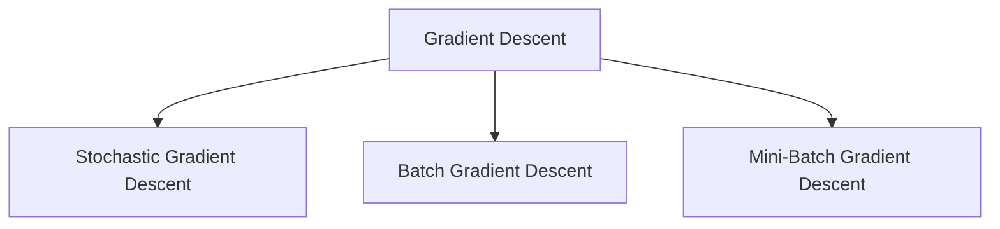
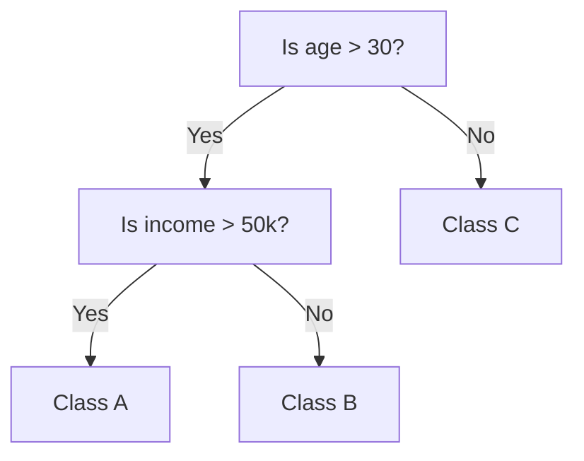
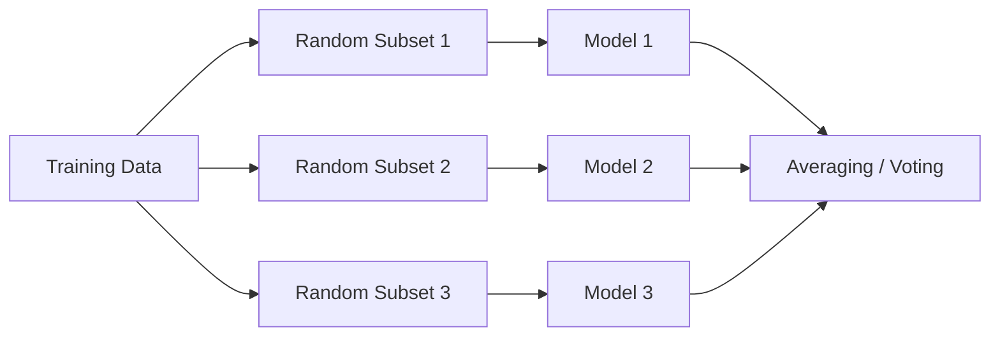
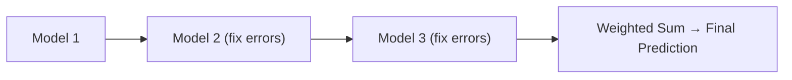
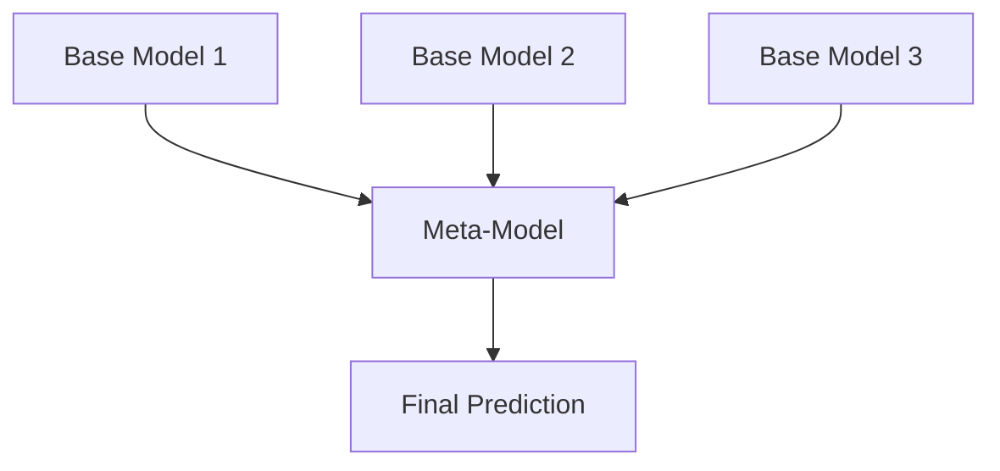
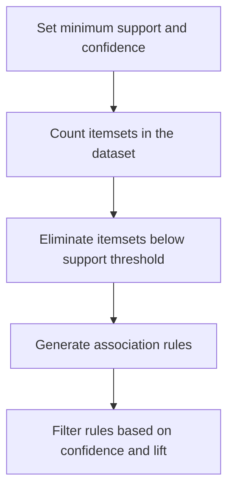
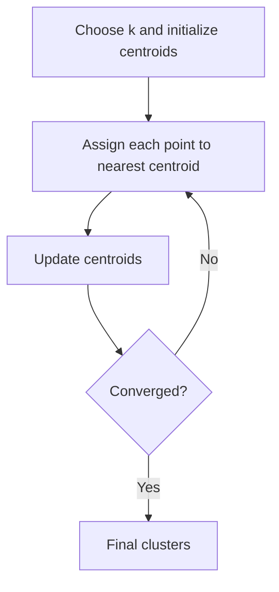
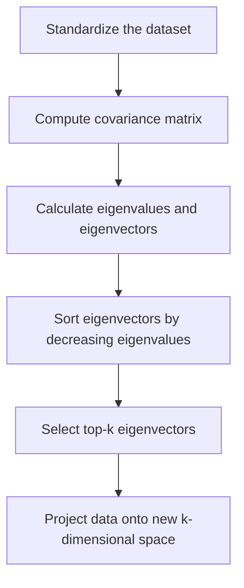

# Unit II — Supervised & Unsupervised Learning

## Gradient Descent for Convex Functions

- Gradient Descent is an optimization algorithm used to minimize a function by updating parameters in the opposite direction of the gradient of the loss function.
- Gradient Descent is an optimization algorithm that is used to minimize a function by slowly moving in the direction of steepest descent, which is defined by the negative of the gradient.

The gradient-descent update rule:

$$\theta := \theta - \alpha \nabla_\theta J(\theta)$$

### Types of Gradient Descents

3 types of gradient descent:

1. Stochastic Gradient Descent
2. Batch Gradient Descent
3. Mini-Batch Gradient Descent

- **Stochastic Gradient Descent** — in extreme cases, gradient descent picks one instance of training data at every step and update based on that one instance of data point
- **Batch Gradient Descent** — in batch gradient descent, the algorithm uses whole data-set to update the values of coefficients.
- **Mini-Batch Gradient Descent** — in mini-batch gradient descent, algorithm picks a mini batch from the whole data-set at every step and update the values of coefficients. This method has the advantages of both stochastic and batch gradient descent.

Different Types of Gradient Descent:



### What is Convex Function?

- A convex function is a function where the line segment between any two points on the graph lies above or on the graph itself.

### Properties of Convex Functions

| Property | Explanation |
| --- | --- |
| Single global minimum | Only one lowest point; no local minima |
| Second derivative ≥ 0 | $f''(x) \geq 0$ for all $x$ |
| Gradient always increasing | Slope gets steeper as $x$ increases |
| Easy to optimize | Gradient descent always converges to the global minimum |

### Why Are Convex Functions Important in ML?

- Most machine learning algorithms (like linear regression, logistic regression) use convex cost functions.
- Convexity ensures easy optimization with algorithms like gradient descent.
- It don't get stuck in local minima.

### Real-World Applications of Convex Cost Functions

| Application | Convex Function Used | Algorithm |
| --- | --- | --- |
| House price prediction | MSE | Linear Regression |
| Spam classification | Log Loss (cross-entropy) | Logistic Regression |
| Face recognition | Hinge Loss | SVM |
| Resource allocation in cloud | Quadratic Cost Functions | Optimization Systems |

### Real Time Example

Let's say we want to predict the price of a house based on its size (in square feet). We can use Linear Regression, where the cost function used is a convex function.

1. Predict house price using:
2. Model (Hypothesis Function):

$$\hat{y} = w_0 + w_1 x$$

This is a convex function. Its plot looks like a bowl-shaped curve, and it has only one global minimum. Since, the MSE is convex, algorithms like gradient descent can find the best $w_0$, $w_1$ easily.

## Logistic Regression

- **Purpose:** Used for binary classification (e.g., spam or not spam).
- **Concept:**
  1. Logistic regression uses the logistic (sigmoid) function to predict probabilities.
  2. It models the probability that an instance belongs to a particular class.
- **Formula:**

$$\sigma(z) = \frac{1}{1 + e^{-z}}$$

### Main key definition

- Output is between 0 and 1 (probability).
- If probability > 0.5 → class 1, else class 0.
- Assumes linear relationship between input features and log-odds.

### Examples

- Email spam detection
- Disease prediction (e.g., diabetes: yes/no)
- Loan approval

## Decision Tree

- **Purpose:** Used for both classification and regression.
- **Concept:**
  - A tree-like structure where each internal node tests a feature.
  - Branches represent outcomes of the test.
  - Leaf nodes represent class labels or predicted values.

A decision tree is a type of machine learning model that is used when the relationship between a set of predictor variables and a response variable is non-linear.

### How it works

- Uses measures like Gini Impurity or Entropy to split nodes.
- Greedy algorithm (splits that give the best immediate gain).

```
Is age > 30?
    Yes: Is income > 50k?
            Yes → Class A
            No  → Class B
    No → Class C
```



### Advantages

- Easy to understand and visualize.
- Handles both numerical and categorical data.

### Limitations

- Prone to over fitting.

## Random Forest

- **Purpose:** An ensemble method for classification and regression.
- **Concept:**
  - Combines many decision trees (a "forest").
  - Each tree is trained on a random subset of data and features (bootstrap).
  - Final output:
    - Classification → majority voting
    - Regression → average prediction

- Reduces over fitting of individual trees.

### Advantages

- More accurate and stable than a single decision tree.

### Key Concepts

- Bagging (Bootstrap Aggregating)
- Randomness in feature selection and data sample improves generalization.

### Use Cases

- Fraud detection
- Medical diagnosis
- Stock market prediction

### Difference Between Random Forest and Decision Tree

| Property | Random Forest | Decision Tree |
| --- | --- | --- |
| Nature | Ensemble of multiple decision trees | Single Decision Tree |
| Interpretability | Less interpretable due to ensemble nature. | Highly interpretable. |
| Overfitting | Due to ensemble averaging it is less prone to overfitting. | More prone to overfitting specially in case of deep trees. |
| Training Time | Since multiple trees are constructed, training time becomes more, and training speed becomes less. | A single tree needs to be built and trained, hence faster in comparison. |
| Stability to change | Since overall average is taken due to ensemble, it is more stable to change. | It becomes quite sensitive to variation in data. |
| Predictive Time | Multiple predictions, hence longer prediction time and slower prediction speed. | Faster prediction as compared to random forest, since a single prediction is made. |
| Performance | Generally performs well on large datasets. | It can perform well on small and large dataset as well. |
| Handling Outliers | Due to ensemble averaging more robust to outliers. | It is more susceptible to outliers. |
| Feature Importance | Do not provide feature score directly rather uses ensemble to decide feature score. | Provide feature score directly which are less reliable. |

| Feature | Logistic Regression | Decision Tree | Random Forest |
| --- | --- | --- | --- |
| Type | Linear Model | Non-linear Tree | Ensemble of Trees |
| Use for | Classification | Both | Both |
| Interpretability | High | Moderate | Low (Black Box) |
| Over fitting Risk | Low | High | Low |
| Performance | Moderate | Fast but unstable | High accuracy |

## Neural Networks

### What is Neural Network?

- Neural networks are machine learning models that mimic the complex functions of the human brain.
- These models consist of interconnected nodes or neurons that process data, learn patterns and enable tasks such as pattern recognition and decision-making.
- They are inspired by the human brain and consist of interconnected nodes or neurons arranged in layers.

### Understanding Neural Networks in Deep Learning

Neural networks are capable of learning and identifying patterns directly from data without pre-defined rules. These networks are built from several key components:

- **Neurons:** The basic units that receive inputs, each neuron is governed by a threshold and an activation function.
- **Connections:** Links between neurons that carry information, regulated by weights and biases.
- **Weights and Biases:** These parameters determine the strength and influence of connections.
- **Propagation Functions:** Mechanisms that help process and transfer data across layers of neurons.
- **Learning Rule:** The method that adjusts weights and biases over time to improve accuracy.

Learning in neural networks follows a structured, three-stage process:

- **Input Computation:** Data is fed into the network.
- **Output Generation:** Based on the current parameters, the network generates an output.
- **Iterative Refinement:** The network refines its output by adjusting weights and biases, gradually improving its performance on diverse tasks.

## Ensemble Learning

- Ensemble learning is a technique in machine learning where multiple models (often called "weak learners") are trained and combined to solve the same problem.
- The idea is that a group of models working together can outperform a single strong model.

### When to Use Ensemble Learning?

- You have high variance or high bias in your model.
- Your base models are diverse and complementary.
- You want to increase model performance in competitions (e.g., Kaggle).

### Real-Life Example

Imagine trying to guess a movie's rating:

- One friend uses past ratings
- Another reads online reviews
- A third watches the trailer

Each has weaknesses alone, but combining their opinions gives a better estimate. That's ensemble learning!

- Accuracy: Highest

### Types of Ensemble learning

#### Bagging (Bootstrap Aggregating)

- Models are trained independently on different random subsets of the training data.
- Their results are then combined—usually by averaging (for regression) or voting (for classification).
- This helps reduce variance and prevents over fitting.

Example Algorithms:

- Random Forest (uses decision trees + bagging)

How Bagging Learning model works:



#### Boosting

- Models are trained one after another. Each new model focuses on fixing the errors made by the previous ones.
- The final prediction is a weighted combination of all models, which helps reduce bias and improve accuracy.
- Models are trained sequentially, each new model focusing on correcting the errors of the previous ones.
- Final prediction is a weighted sum of all models.
- Reduces bias and variance

Popular Boosting Algorithms:

- AdaBoost (Adaptive Boosting)
- Gradient Boosting (GBM)
- XGBoost
- LightGBM
- CatBoost



#### Stacking (Stacked Generalization)

- Multiple different models (often of different types) are trained, and their predictions are used as inputs to a final model, called a meta-model.
- The meta-model learns how to best combine the predictions of the base models, aiming for better performance than any individual model.
- The predictions of base models are fed to a meta-model (e.g., logistic regression) that learns how to best combine them.
- Leverages strengths of different models
- Useful when base learners are diverse.



## Apriori Algorithm for Association Rules

- Association rule learning is a rule-based machine learning method to find relationships (associations) between variables in large datasets.

Real life example:

- If a customer buys bread and butter, they are likely to buy jam. This is an example of a market basket analysis.

### Steps of Apriori Algorithm

- Set minimum support and confidence
- Generate all frequent itemsets:
  - Count itemsets in the dataset
  - Eliminate itemsets below the support threshold
- Generate association rules from the frequent item sets
- Filter rules based on confidence and lift



### Applications of Apriori Algorithm

- **E-commerce:** Used to recommend products that are often bought together like laptop + laptop bag, increasing sales.
- **Food Delivery Services:** Identifies popular combos such as burger + fries, to offer combo deals to customers.
- **Streaming Services:** Recommends related movies or shows based on what users often watch together like action + superhero movies.
- **Financial Services:** Analyzes spending habits to suggest personalized offers such as credit card deals based on frequent purchases.
- **Travel & Hospitality:** Creates travel packages like flight + hotel by finding commonly purchased services together.
- **Health & Fitness:** Suggests workout plans or supplements based on users' past activities like protein shakes + workouts.

## Empirical Risk Minimization

- ERM is a principle for training machine learning models where we aim to minimize the average loss (error) on the training data.
- Instead of minimizing the true risk (which we don't know) we minimize the empirical risk, i.e., the average error on the observed data.

$$R_{emp}(f) = \frac{1}{n} \sum_{i=1}^{n} L(y_i, f(x_i))$$

## Loss Functions

- Loss functions measure how far the predicted value is from the actual value.

Good loss functions are:

- Differentiable (for gradient-based methods)
- Convex (for easier optimization)

| Problem Type | Loss Function | Formula | Description |
| --- | --- | --- | --- |
| Regression | Mean Squared Error (MSE) | $\frac{1}{n} \sum (y_i - \hat{y}_i)^2$ | Penalizes large errors more |
| | Mean Absolute Error (MAE) | $\frac{1}{n} \sum \lvert y_i - \hat{y}_i \rvert$ | |
| Classification | 0–1 Loss | 0 if correct, 1 if wrong | Simplest, but non-differentiable |
| | Cross-Entropy Loss | $-\sum y_i \log(\hat{y}_i)$ | Used for probabilistic classifiers |
| | Hinge Loss | $\max(0, 1 - y_i \cdot f(x_i))$ | Used in SVMs |

## VC Dimension

### VC Dimension (Vapnik–Chervonenkis Dimension)

- VC dimension measures the capacity (complexity) of a hypothesis space — how well a model can fit various patterns.
- It is the maximum number of points that can be shattered (i.e., classified correctly in all possible ways) by the hypothesis class.

Examples:

- VC Dimension of a linear classifier in 2D: 3
- VC Dimension of a decision stump (1-level decision tree): 1
- VC Dimension of a k-nearest neighbor (if k=1): infinite

- The Vapnik-Chervonenkis (VC) dimension is a measure of the capacity of a hypothesis set to fit different data sets.
- It was introduced by Vladimir Vapnik and Alexey Chervonenkis in the 1970s and has become a fundamental concept in statistical learning theory.
- The VC dimension is a measure of the complexity of a model, which can help us understand how well it can fit different data sets.
- The VC dimension of a hypothesis set H is the largest number of points that can be shattered by H.
- A hypothesis set H shatters a set of points S if, for every possible labeling of the points in S, there exists a hypothesis in H that correctly classifies the points

### Why is it important?

- Helps understand underfitting vs overfitting
- A model with high VC dimension can overfit.
- A balance is needed between model complexity and generalization

## Data Partitioning

### Data Partitioning (Train/Test/Validation)

In Machine Learning, the dataset is typically split into three subsets:

#### a. Training Set

- Used to train the model (i.e., fit the parameters).
- Usually comprises 60–80% of the original dataset.

#### b. Validation Set

- Used to tune hyperparameters (like learning rate, regularization strength, etc.).
- Helps in preventing overfitting.
- Typically 10–20% of the data.

#### c. Test Set

- Used to evaluate the final model performance.
- Never used in training or validation.
- Also about 10–20% of the data.

Example: If you have 1000 samples, you might split them as:

- Train: 700 samples
- Test: 150 samples
- Validation: 150

## Cross-Validation

- Cross-validation is a technique to ensure that your model generalizes well. It is used instead of a single validation set, especially when you have less data.

### a. K-Fold Cross-Validation

- The dataset is split into K equal parts (folds).
- The model is trained on K-1 folds and validated on the remaining fold.
- This is repeated K times, and performance is averaged.
- Exa: For 5-Fold CV, the model is trained and evaluated 5 times using different folds each time.

### b. Leave-One-Out CV (LOOCV)

- Each sample is used once as validation; the rest as training.
- Very computationally expensive.

types of prediction errors: 1. Bias  2. Variance

| Term | Description | Effect | Cause |
| --- | --- | --- | --- |
| Bias | Error from wrong assumptions | Underfitting | Model too simple |
| Variance | Error from too much sensitivity to training data | Overfitting | Model too complex |

## Regularization

- Regularization adds a penalty term to the loss function to reduce over fitting by discouraging overly complex models.

### a. L1 Regularization (Lasso)

- Adds absolute value of weights.
- Can shrink some weights to zero → performs feature selection.

$$\lambda \sum_{j} \lvert w_j \rvert$$

### b. L2 Regularization (Ridge)

- Adds square of weights.
- Penalizes large weights but doesn't eliminate features.

$$\lambda \sum_{j} w_j^2$$

### c. Elastic Net

- Combination of L1 and L2.

$$\text{Regularized Loss} = \text{Original Loss} + \lambda \cdot (\text{Penalty})$$

Where $\lambda$ (lambda) controls the strength of the penalty.

## Clustering: K-Means and Kernel K-Means

- Clustering is an unsupervised learning technique used to group similar data points into clusters, where the similarity is measured using a distance metric (Centroid) (like Euclidean distance).
- **Goal:** Partitions data into (k) clusters by minimizing the sum of squared distances between data points and their cluster centroids.

K-Means Model work flow:



### K-Kernel Means Algorithm

- **Algorithm:** Extends K-means by using a kernel function to map data into a higher-dimensional space, enabling the detection of non-linear clusters.
- **Assumptions:** Relies on the choice of an appropriate kernel (e.g., RBF, polynomial).

## Dimensionality Reduction: PCA and Kernel PCA

### What is Dimensionality Reduction?

- Dimensionality Reduction reduces the number of input variables (features) in a dataset while preserving as much information (variance) as possible.

Benefits:

- Reduces computational cost
- Removes noise/redundancy
- Improves visualization (e.g., 2D plots)
- Avoids curse of dimensionality

### Steps of PCA

- Standardize the dataset.
- Compute the covariance matrix of the data.
- Calculate eigenvalues and eigenvectors of the covariance matrix.
- Sort eigenvectors by decreasing eigenvalues.
- Select top-k eigenvectors (principal components).
- Project data onto the new k-dimensional space.



- Principal Component Analysis (PCA) is a technique used to reduce the dimensionality of a dataset while preserving most of its original variation.
- PCA is a linear method and it may not work well when the data has a non-linear structure. In such cases, instead of PCA, Kernel PCA can be used.

### Kernel PCA

- **Goal:** Extend PCA to capture non-linear patterns using the kernel trick — project data into a higher-dimensional space.
- **Idea:**
  - Use a non-linear mapping $\phi(x)$ to map input data into high-dimensional space.
  - Compute PCA in that space using only dot products via a kernel function.

## Matrix Factorization

### What is Matrix Factorization?

- Matrix Factorization refers to breaking a large matrix into a product of two or more smaller matrices. It is used to discover hidden (latent) features underlying the data.

Common Scenario (e.g., Movie Recommendation):

Let's say we have a user-item rating matrix $R$, where:

- Rows = users
- Columns = items (movies)
- Entries = known ratings; missing entries are unrated.

We want to predict missing entries using Matrix Factorization.

Solved Using:

1. Stochastic Gradient Descent (SGD)
2. Alternating Least Squares (ALS)

## Matrix Completion

- Matrix Completion is the task of filling in missing values in a partially observed matrix.

Problem:

- Given: Incomplete matrix $R$
- Goal: Predict missing entries assuming $R$ is low-rank

Example:

- In a Netflix recommendation system, users rate only a few movies.
- We aim to complete the rating matrix so that we can recommend unseen movies.

## Generative Models

### What are Generative Models?

- Generative models learn the joint probability distribution $P(X, Y)$ of data and labels (if any), enabling them to generate new data that resembles the training data.

They can:

- Model data probabilistically
- Generate new samples
- Handle unsupervised learning, missing data
- Infer hidden (latent) structure

## Latent Factor Models

- Latent Factor Models assume that observed data is generated from unobserved (latent) variables/factors.
- **Goal:** Explain observed data using a lower-dimensional hidden structure.

### Example of Latent Factor Model
