# Unit II — Supervised & Unsupervised Learning

## Regression

Regression is a supervised learning technique used to predict **continuous numerical values** by learning relationships between input variables (features) and an output variable (target).

It helps understand how changes in one or more factors influence a measurable outcome and is widely used in forecasting, risk analysis, decision-making and trend estimation.

In data science and statistics, regression is a **predictive modeling technique** used to estimate the relationship between a **dependent variable** (the outcome you want to predict) and one or more **independent variables** (the factors influencing the outcome).

### How and where it works

- Works with real valued output variables
- Helps to identify strengths and the type of relationships
- Supports both simple and complex predictive models.
- Used for tasks like price prediction, trend forecasting and risk scoring.

Regression tells you two things about a relationship: its **strength** (weak or strong) and its **type** (positive or negative, linear or non-linear). Because the target is continuous, the output is a quantity — 72.5, ₹45,00,000 — not a category.

### Types of Regression

Regression is classified by the **number of predictor variables** and the **nature of the relationship** between variables:

1. Simple Linear Regression
2. Multiple Linear Regression
3. Polynomial Regression
4. Ridge and Lasso Regression
5. Support Vector Regression
6. Decision Tree Regression
7. Random Forest Regression

- **Simple** uses one independent variable; **multiple** uses two or more.
- **Linear** assumes a straight-line relationship; **polynomial**, decision trees and random forests model curved or segmented relationships.
- **Ridge and Lasso** are regularised linear models that fight overfitting and multicollinearity.
- **Support Vector Regression** applies SVM machinery, fitting within an error margin $\varepsilon$.
- **Random Forest Regression** is an *ensemble*: many trees averaged.

### 1. Simple Linear Regression

Models the relationship between one independent variable and a continuous dependent variable by fitting a straight line that minimizes the sum of squared errors. It assumes a constant rate of change, meaning the output varies proportionally with the input.

- **Application:** Estimating house price from only its size
- **Advantage:** Highly interpretable due to its simple mathematical structure
- **Disadvantage:** Cannot capture curved or complex data patterns

The three phrases in that definition map onto three pieces of mathematics: "straight line" is $y = \beta_0 + \beta_1 x$, "sum of squared errors" is the cost function minimised by Ordinary Least Squares, and "constant rate of change" is the slope $\beta_1$.

### Linear Regression: the worked example

Linear Regression is a fundamental supervised learning algorithm used to model the relationship between a **dependent variable and one or more independent variables**. It predicts continuous values by fitting a straight line that best represents the data.

1. It assumes that there is a linear relationship between the input and output
2. Uses a best-fit line to make predictions
3. Commonly used in forecasting, trend analysis, and predictive modelling

Suppose we want to predict a student's exam score based on the number of hours studied. As study hours increase, exam scores generally increase as well. Here:

- **Independent variable (input):** Hours studied, because it is the factor we control or observe.
- **Dependent variable (output):** Exam score, because it depends on how many hours were studied.

Linear regression uses the independent variable to predict the dependent variable.

### Best Fit Line

In linear regression, the best-fit line is the straight line that best represents the relationship between the independent variable (input) and the dependent variable (output). The goal is to minimize the difference between the actual data points and the predicted values generated by the model.

#### 1. Goal of the Best-Fit Line

The goal of linear regression is to find a straight line that minimizes the error (the difference) between the observed data points and the predicted values. This line helps us predict the dependent variable for new, unseen data.

$$Y = \theta_1 + \theta_2 X, \qquad \text{slope} = \tan\theta = \theta_2$$

- $\theta_1$ — the intercept, the value of $Y$ when $X = 0$.
- $\theta_2$ — the slope, how much $Y$ changes for a unit change in $X$; geometrically the tangent of the angle the line makes with the horizontal.
- For a specific input $X_i$ there is an observed value $y_i$ and a predicted value $yp_i$ on the line; the gap between them is the **random error** $\epsilon_i = y_i - yp_i$.

Here $Y$ is called a dependent or target variable and $X$ is called an independent variable, also known as the predictor of $Y$. A linear function is the simplest type of function usable for regression; $X$ may be a single feature or multiple features representing the problem.

#### 2. Equation of the Best-Fit Line

For simple linear regression (with one independent variable), the best-fit line is represented by

$$y = mx + c$$

- $y$ is the predicted value (dependent variable)
- $x$ is the input (independent variable)
- $m$ is the slope of the line (how much $y$ changes when $x$ changes), i.e. $\Delta y / \Delta x$
- $c$ (also written $b$) is the intercept, the value of $y$ when $x = 0$

The best-fit line is the one that optimizes the values of $m$ and $b$ so that the predicted $y$ values are as close as possible to the actual data points.

#### 3. Minimizing the Error using the Least Squares Method

To determine the best-fit line, linear regression uses the **Least Squares Method**, which minimizes the difference between actual and predicted values. These differences are called residuals:

$$\text{Residual} = y_i - \hat{y}_i$$

where $y_i$ is the actual observed value and $\hat{y}_i$ is the predicted value from the line for that $x_i$. The least squares method minimizes the **sum of the squared residuals**:

$$\sum (y_i - \hat{y}_i)^2$$

This ensures the line best represents the data, in the sense that the sum of squared differences between predicted and actual values is as small as possible. Squaring does two jobs: it stops positive and negative errors cancelling, and it penalises large errors more heavily than small ones.

#### 4. Interpretation of the Best-Fit Line

1. **Slope ($m$):** how much the dependent variable changes for every one-unit increase in the independent variable. If the slope is 5, then $y$ increases by 5 units for every 1-unit increase in $x$.
2. **Intercept ($b$):** the predicted value of $y$ when $x = 0$ — where the line crosses the y-axis. In some problems this has no physical meaning (a 0-year-old does not have zero height), and that is acceptable.
3. In linear regression some hypotheses are made to ensure reliability of the model's results — for instance homoscedasticity and normality of residuals.
4. **Limitations:**
   - **Assumes linearity.** If the true relationship is non-linear, a straight line fits badly.
   - **Sensitivity to outliers.** Because OLS squares distances, one far-off point can pull the line towards itself and distort both slope and intercept.

### Hypothesis Function

In linear regression, the hypothesis function is the equation used to make predictions about the dependent variable based on the independent variables. It represents the relationship between the input features and the target output.

For one independent variable:

$$h(x) = \beta_0 + \beta_1 x$$

- $h(x)$, also written $\hat{y}$, is the predicted value of the dependent variable $y$.
- $x$ is the independent variable.
- $\beta_0$ is the intercept, the value of $y$ when $x$ is 0.
- $\beta_1$ is the slope, indicating how much $y$ changes for each unit change in $x$.

The sign of $\beta_1$ carries the meaning: positive means a direct relationship, negative an inverse one, and zero means $x$ tells us nothing about $y$.

For more than one independent variable the hypothesis expands to

$$h(x_1, x_2, \dots, x_k) = \beta_0 + \beta_1 x_1 + \beta_2 x_2 + \dots + \beta_k x_k$$

- $x_1, x_2, \dots, x_k$ are the independent variables.
- $\beta_0$ is the intercept.
- $\beta_1, \beta_2, \dots, \beta_k$ are the coefficients, representing the influence of each respective independent variable on the predicted output — each one read *holding the other variables constant*.

### Evaluation Metrics

A variety of evaluation measures can be used to determine the strength of any linear regression model. These assessment metrics give an indication of how well the model is producing the observed outputs.

| Metric | Formula | What it tells you |
| --- | --- | --- |
| Mean Squared Error (MSE) | $\frac{1}{n}\sum (y_i - \hat{y}_i)^2$ | Average squared difference; avoids cancellation of errors and punishes large errors. Units are squared. |
| Mean Absolute Error (MAE) | $\frac{1}{n}\sum \lvert y_i - \hat{y}_i \rvert$ | Average absolute difference; linear, in the original units, treats all errors equally. |
| Root Mean Squared Error (RMSE) | $\sqrt{\text{MSE}}$ | Square root of the residual variance; back in the original units, so it reads as a typical error. |
| R-squared ($R^2$) | $1 - \frac{\sum(y_i-\hat{y}_i)^2}{\sum(y_i-\bar{y})^2}$ | Proportion of variance explained. Usually in $[0,1]$, but **can be negative** if the model is worse than predicting the mean. |
| Adjusted $R^2$ | penalised $R^2$ | Same idea, but penalises extra predictors, so it does not rise merely because a useless feature was added. |

Plain $R^2$ *always* increases when a variable is added, even a worthless one — which is exactly why adjusted $R^2$ exists.

### Applications

- **Real estate price prediction:** estimate house prices using features such as location, area, and number of rooms.
- **Sales and demand forecasting:** predict future sales and product demand from historical trends and seasonal data.
- **Financial analysis:** analyse market trends, stock prices, and the impact of economic factors like inflation and interest rates.
- **Healthcare and medical research:** predict disease progression, patient outcomes, and treatment effectiveness.
- **Marketing and advertising analysis:** measure how campaigns and promotional spending influence sales and engagement.


## Cost Function

In Linear Regression, the cost function measures how far the predicted values $\hat{y}$ are from the actual values $y$. It helps identify and reduce errors to find the best-fit line. The most common cost function is **Mean Squared Error (MSE)**, the average of squared differences between actual and predicted values:

$$J = \frac{1}{n} \sum_{i=1}^{n} (\hat{y}_i - y_i)^2, \qquad \hat{y}_i = \theta_1 + \theta_2 x_i$$

- $J$ — the cost (loss, objective) function, a single number summarising total error.
- $n$ — the number of data points; the factor $\frac{1}{n}$ turns the sum into a mean.
- $\hat{y}_i$ — the model's prediction; $y_i$ — the ground truth.
- $(\hat{y}_i - y_i)^2$ — the squared error for one prediction.
- $\theta_1$ is the intercept and $\theta_2$ the slope, the two parameters being learned.

To minimise this cost we use **gradient descent**, which iteratively updates $\theta_1$ and $\theta_2$ until the MSE reaches its lowest value. That state is called **convergence**.

Written with weights and bias, the same cost appears as

$$\text{cost}(W, b) = \frac{1}{m} \sum_{i=1}^{m} \left( H(x^{(i)}) - y^{(i)} \right)^2$$

where $H(x^{(i)})$ is the hypothesis (prediction) for the $i$-th input, $y^{(i)}$ is its actual target, and $m$ is the number of training examples.

### The cost curve

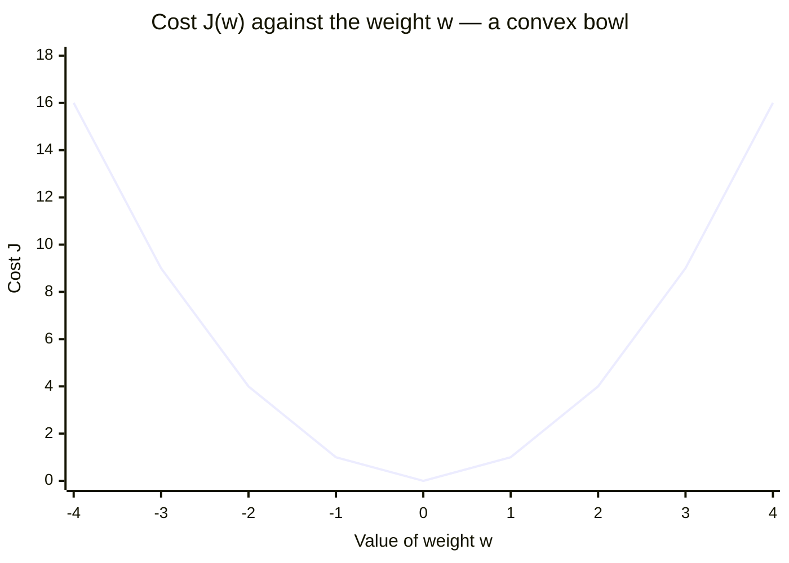

Reading the curve: the model starts at some **initial weight** high on one arm, the **derivative of cost** $\frac{dJ}{dw}$ at that point gives the slope, each **learning step** moves downhill by an amount set by the learning rate, and the **point of convergence** is the vertex where $\frac{dJ}{dw} \approx 0$ and the cost is minimum. In two parameters the same shape becomes a 3D bowl (a paraboloid) over the $(W, b)$ plane, with the deep blue minimum at the centre.


## Gradient Descent for Convex Functions

- Gradient Descent is an optimization algorithm used to minimize a function by updating parameters in the opposite direction of the gradient of the loss function.
- Gradient Descent is an optimization algorithm that is used to minimize a function by slowly moving in the direction of steepest descent, which is defined by the negative of the gradient.

The gradient-descent update rule:

$$\theta := \theta - \alpha \nabla_\theta J(\theta)$$

- $\nabla_\theta J(\theta)$ — the gradient, a vector of partial derivatives that points in the direction of steepest **ascent**.
- The minus sign is the whole idea: to go down, step *against* the gradient.
- $\alpha$ — the **learning rate**, the step size. Too large and the algorithm overshoots or diverges; too small and training crawls.

The classic image is standing on a hillside in fog: you cannot see the valley floor, but you can feel which way the ground falls, so you step that way and repeat.

### How it works

1. Start with random values for slope and intercept.
2. Calculate the error between predicted and actual values.
3. Find how much each parameter contributes to the error (gradient).
4. Update the parameters in the direction that reduces the error.
5. Repeat until the error is as small as possible.
6. This helps the model find the best-fit line for the data.

Step 3 is calculus — $\frac{\partial J}{\partial m}$ and $\frac{\partial J}{\partial c}$ — and step 4 is the update rule above.

### Types of Gradient Descents

3 types of gradient descent:

1. Stochastic Gradient Descent
2. Batch Gradient Descent
3. Mini-Batch Gradient Descent

- **Stochastic Gradient Descent** — in extreme cases, gradient descent picks one instance of training data at every step and update based on that one instance of data point
- **Batch Gradient Descent** — in batch gradient descent, the algorithm uses whole data-set to update the values of coefficients.
- **Mini-Batch Gradient Descent** — in mini-batch gradient descent, algorithm picks a mini batch from the whole data-set at every step and update the values of coefficients. This method has the advantages of both stochastic and batch gradient descent.

The only thing that changes between the three is **how much data is used to compute one update**. Batch is stable but slow and memory-hungry; SGD is fast but its path to the minimum is noisy, and that noise can actually help it escape poor local minima; mini-batch (typically 32, 64 or 128 samples) is the modern default because it balances the two and vectorises well on a GPU.

Different Types of Gradient Descent:

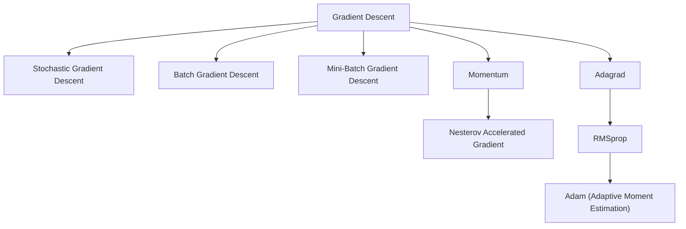

Beyond the three data-based variants, the family extends in two directions. **Velocity** methods — Momentum, and its look-ahead refinement Nesterov Accelerated Gradient — add a fraction of the previous update to the current one, gaining speed in a consistent direction and damping oscillations. **Adaptive learning rate** methods give every parameter its own step size: Adagrad scales by the history of gradients (good for sparse data), RMSprop replaces that history with an exponentially decaying average so the rate cannot vanish, and Adam combines momentum with RMSprop and is the standard choice in deep learning.

| Variant | Advantages | Disadvantages |
| --- | --- | --- |
| Batch gradient descent | Guaranteed convergence to global optimum (for convex functions) | Computationally expensive for large datasets, slow convergence |
| Stochastic gradient descent | Faster convergence, more efficient for large datasets | High variance, may not converge to the global optimum |
| Mini-batch gradient descent | Balanced convergence speed and computational cost, efficient for large datasets | Choice of mini-batch size can be a challenge |
| Momentum gradient descent | Faster convergence, less likely to get stuck in local minima | May overshoot and oscillate around the optimum |
| Adagrad | Adaptive learning rate, efficient for sparse data | Can stop learning too early |
| RMSProp | Adaptive learning rate, efficient for non-stationary problems | Can stop learning too early, requires tuning of hyperparameters |
| Adam | Adaptive learning rate, efficient for large datasets and noisy data | Can converge to suboptimal solutions, requires tuning of hyperparameters |

Adagrad's failure mode has a name worth remembering: the accumulated squared gradients in its denominator keep growing, so the effective learning rate shrinks towards zero and training stalls. RMSprop's decaying average is the fix.

### What is Convex Function?

- A convex function is a function where the line segment between any two points on the graph lies above or on the graph itself.

Geometrically, pick any two points on the bowl and join them: the chord passes through the air *inside* the bowl, never below the surface. In 2D this is the familiar "U"; in two parameters it is a paraboloid.

### Properties of Convex Functions

| Property | Explanation |
| --- | --- |
| Single global minimum | Only one lowest point; no local minima |
| Second derivative ≥ 0 | $f''(x) \geq 0$ for all $x$ |
| Gradient always increasing | Slope gets steeper as $x$ increases |
| Easy to optimize | Gradient descent always converges to the global minimum |

The second-order condition $f''(x) \ge 0$ is the formal test for convexity: the curvature never turns downward. Consequently the gradient is **monotonically increasing**, and any local minimum is automatically the global minimum.

### Why Are Convex Functions Important in ML?

- Most machine learning algorithms (like linear regression, logistic regression) use convex cost functions.
- Convexity ensures easy optimization with algorithms like gradient descent.
- It don't get stuck in local minima.

If the cost surface were non-convex — wavy, full of pits — gradient descent could settle in a local minimum that is not the best solution. Deep neural networks live in exactly that non-convex world, which is why their training is so much more delicate than fitting a linear regression.

### Real-World Applications of Convex Cost Functions

| Application | Convex Function Used | Algorithm |
| --- | --- | --- |
| House price prediction | MSE | Linear Regression |
| Spam classification | Log Loss (cross-entropy) | Logistic Regression |
| Face recognition | Hinge Loss | SVM |
| Resource allocation in cloud | Quadratic Cost Functions | Optimization Systems |

MSE is quadratic and therefore convex. Log loss stays convex while penalising confident mistakes ever more steeply. Hinge loss is piecewise-linear and convex, and it is what turns maximum-margin classification into a solvable convex program. Quadratic costs of the form $ax^2+bx+c$ with $a>0$ are convex by construction.

### Real Time Example

Let's say we want to predict the price of a house based on its size (in square feet). We can use Linear Regression, where the cost function used is a convex function.

1. Predict house price using: input $x$ = size of the house, output $y$ = price of the house
2. Model (Hypothesis Function):

$$\hat{y} = w_0 + w_1 x$$

where $\hat{y}$ is the predicted price, $w_0$ the intercept, and $w_1$ the slope — how much the price changes per square foot.

We use Mean Squared Error as the loss function:

$$J(w_0, w_1) = \frac{1}{n} \sum_{i=1}^{n} (\hat{y}_i - y_i)^2$$

This is a convex function. Its plot looks like a bowl-shaped curve, and it has only one global minimum. Since the MSE is convex, algorithms like gradient descent can find the best $w_0$, $w_1$ easily.


## Logistic Regression

- **Purpose:** Used for binary classification (e.g., spam or not spam).
- **Concept:**
  1. Logistic regression uses the logistic (sigmoid) function to predict probabilities.
  2. It models the probability that an instance belongs to a particular class.
- **Formula:**

$$P(Y = 1) = \frac{1}{1 + e^{-(\beta_0 + \beta_1 X_1 + \dots + \beta_n X_n)}}$$

which is the sigmoid applied to a linear combination of the features:

$$\sigma(z) = \frac{1}{1 + e^{-z}}, \qquad z = \beta_0 + \beta_1 X_1 + \dots + \beta_n X_n$$

- $P(Y=1)$ — the probability that the instance belongs to the positive class.
- $e$ — Euler's number, $\approx 2.718$.
- $\beta_0$ — the intercept; $\beta_1 \dots \beta_n$ — the weights on the features $X_1 \dots X_n$.
- As the linear sum grows large and positive, $P \to 1$; as it grows large and negative, $P \to 0$.

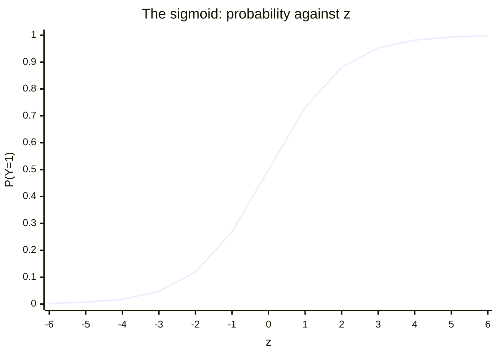

The curve is bounded by asymptotes at 0 and 1, passes through $0.5$ at $z = 0$, and is steepest there — which is why the region near the decision threshold is where the model is least certain.

### Main key definition

- Output is between 0 and 1 (probability).
- If probability > 0.5 → class 1, else class 0.
- Assumes linear relationship between input features and log-odds.

That third point is the precise statement of the model. The **logit** — the log of the odds — is linear in the features:

$$\text{logit}(p) = \ln\!\left(\frac{p}{1-p}\right) = \beta_0 + \beta_1 x_1 + \dots + \beta_n x_n$$

So logistic regression *is* a linear model; the sigmoid is only the link that converts that linear score into a probability. The name says "regression" because of this linear core, but the task is **classification**. The threshold of $0.5$ is a convention and can be moved to trade sensitivity against specificity.

### Examples

- Email spam detection
- Disease prediction (e.g., diabetes: yes/no)
- Loan approval


## Decision Tree

- **Purpose:** Used for both classification and regression.
- **Concept:**
  - A tree-like structure where each internal node tests a feature.
  - Branches represent outcomes of the test.
  - Leaf nodes represent class labels or predicted values.

A decision tree is a type of machine learning model that is used when the relationship between a set of predictor variables and a response variable is non-linear.

That is the tree's real selling point: it assumes no functional form at all. Instead of fitting one global equation, it partitions the feature space into regions, which lets it capture complex non-linear patterns that a linear model would miss.

### How it works

- Uses measures like Gini Impurity or Entropy to split nodes.
- Greedy algorithm (splits that give the best immediate gain).

At each node the algorithm asks which feature and which threshold best increase the **purity** of the resulting children. **Gini impurity** measures how often a randomly chosen element would be labelled wrongly; **entropy** measures disorder, and the reduction in entropy is the **information gain**. The algorithm is **greedy** because it takes the best split available right now, without checking whether a worse split now would allow a better tree later.

```
Is age > 30?
    Yes: Is income > 50k?
            Yes → Class A
            No  → Class B
    No → Class C
```

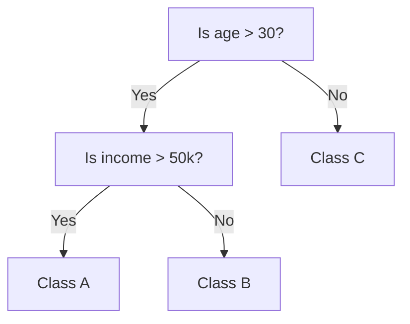

Trace a 35-year-old earning ₹40k: age > 30 is Yes, income > 50k is No, so the prediction is **Class B**.

### Advantages

- Easy to understand and visualize.
- Handles both numerical and categorical data.

A decision tree is **white-box** AI: the path from root to leaf *is* the explanation. And unlike linear models or SVMs, it splits on categories directly ("Colour is Red") without one-hot encoding.

### Limitations

- Prone to over fitting.

Left unchecked, a tree will keep splitting until every training example is perfectly classified — memorising noise and outliers along the way. The fixes are **pruning** (cutting branches that add little) and limiting the **maximum depth**, or moving to an ensemble.


## Random Forest

- **Purpose:** An ensemble method for classification and regression.
- **Concept:**
  - Combines many decision trees (a "forest").
  - Each tree is trained on a random subset of data and features (bootstrap).
  - Final output:
    - Classification → majority voting
    - Regression → average prediction

- Reduces over fitting of individual trees.

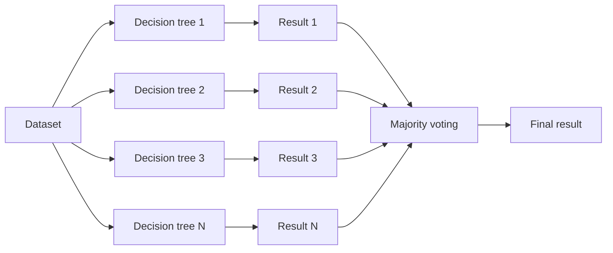

For classification the aggregation is the mode of the individual predictions:

$$\hat{y} = \text{mode}\{h_1(x), h_2(x), \dots, h_N(x)\}$$

If 80 of 100 trees say Class A and 20 say Class B, the forest says Class A. For regression the mode is replaced by the mean.

### Two sources of randomness

A forest only works if its trees are **different**, and the difference comes from two deliberate injections of randomness:

1. **Bootstrap sampling of rows** — each tree sees a random sample of the data drawn *with replacement*, so some rows repeat and others are left out.
2. **Random subset of features at each split** — instead of considering all features, each split considers only $m_{try}$ of them, which stops one dominant feature from appearing at the top of every tree.

Typical settings differ by task:

| Setting | Classification | Regression |
| --- | --- | --- |
| `mtry` (features per split) | $\sqrt{\text{no. of descriptors}}$ | (no. of descriptors) / 3 |
| `nodesize` (minimum leaf size) | 1 | 5 |
| `ntree` (trees in the forest) | ~500 | ~500 |
| Pruning | none — trees grown fully | none |

Because each tree is trained on a bootstrap sample, the rows it did *not* see — the **out-of-bag (OOB)** samples — can be used to validate that tree, giving an internal cross-validation for free without a separate hold-out set. Trees are deliberately left unpruned: each one is high-variance on its own, and the averaging across the forest is what removes that variance.

### Advantages

- More accurate and stable than a single decision tree.
- Improved accuracy, a built-in method for descriptor selection, resistance to overfitting, easy to train, and still built from human-interpretable trees.

### Key Concepts

- Bagging (Bootstrap Aggregating)
- Randomness in feature selection and data sample improves generalization.

### Use Cases

- Fraud detection
- Medical diagnosis
- Stock market prediction

### Worked example: churn classification

Run Random Forest classification on the independent variables *Contract, Tenure, Internet Service, Tech Support, Online Security* with target variable *Churn*:

| Churn (Y) | Contract | Tenure | Internet Service | Tech Support | Online Security |
| --- | --- | --- | --- | --- | --- |
| Yes | Month-to-month | 2 | DSL | No internet service | Yes |
| No | Two-year | 72 | Fibre optic | No | No |
| Yes | Month-to-month | 29 | Fibre optic | No | No internet service |
| No | One-year | 12 | DSL | Yes | No |
| Yes | Month-to-month | 30 | DSL | Yes | No |

| Classification evaluation metric | Value |
| --- | --- |
| Accuracy | 78.6 % |
| Classification error | 21.4 % |

$$\text{Classification error} = 100\% - \text{Accuracy} = 100 - 78.6 = 21.4\%$$

Classification accuracy is a crucial criterion for assessing model performance, and by the heuristic used here a model with prediction accuracy above 75 % is useful — so this model is an excellent fit. The 21.4 % error means roughly a 1-in-5 chance of misclassifying a customer's churn status.

### Difference Between Random Forest and Decision Tree

| Property | Random Forest | Decision Tree |
| --- | --- | --- |
| Nature | Ensemble of multiple decision trees | Single Decision Tree |
| Interpretability | Less interpretable due to ensemble nature. | Highly interpretable. |
| Overfitting | Due to ensemble averaging it is less prone to overfitting. | More prone to overfitting specially in case of deep trees. |
| Training Time | Since multiple trees are constructed, training time becomes more, and training speed becomes less. | A single tree needs to be built and trained, hence faster in comparison. |
| Stability to change | Since overall average is taken due to ensemble, it is more stable to change. | It becomes quite sensitive to variation in data. |
| Predictive Time | Multiple predictions, hence longer prediction time and slower prediction speed. | Faster prediction as compared to random forest, since a single prediction is made. |
| Performance | Generally performs well on large datasets. | It can perform well on small and large dataset as well. |
| Handling Outliers | Due to ensemble averaging more robust to outliers. | It is more susceptible to outliers. |
| Feature Importance | Do not provide feature score directly rather uses ensemble to decide feature score. | Provide feature score directly which are less reliable. |

The trade-off in one line: the forest buys stability and accuracy with training time, inference time and interpretability. Where millisecond latency matters, a single tree traverses once while a forest traverses 500 times.

| Feature | Logistic Regression | Decision Tree | Random Forest |
| --- | --- | --- | --- |
| Type | Linear Model | Non-linear Tree | Ensemble of Trees |
| Use for | Classification | Both | Both |
| Interpretability | High | Moderate | Low (Black Box) |
| Over fitting Risk | Low | High | Low |
| Performance | Moderate | Fast but unstable | High accuracy |


## Neural Networks

### What is Neural Network?

- Neural networks are machine learning models that mimic the complex functions of the human brain.
- These models consist of interconnected nodes or neurons that process data, learn patterns and enable tasks such as pattern recognition and decision-making.
- They are inspired by the human brain and consist of interconnected nodes or neurons arranged in layers.

### Understanding Neural Networks in Deep Learning

Neural networks are capable of learning and identifying patterns directly from data without pre-defined rules. These networks are built from several key components:

- **Neurons:** The basic units that receive inputs, each neuron is governed by a threshold and an activation function.
- **Connections:** Links between neurons that carry information, regulated by weights and biases.
- **Weights and Biases:** These parameters determine the strength and influence of connections.
- **Propagation Functions:** Mechanisms that help process and transfer data across layers of neurons.
- **Learning Rule:** The method that adjusts weights and biases over time to improve accuracy.

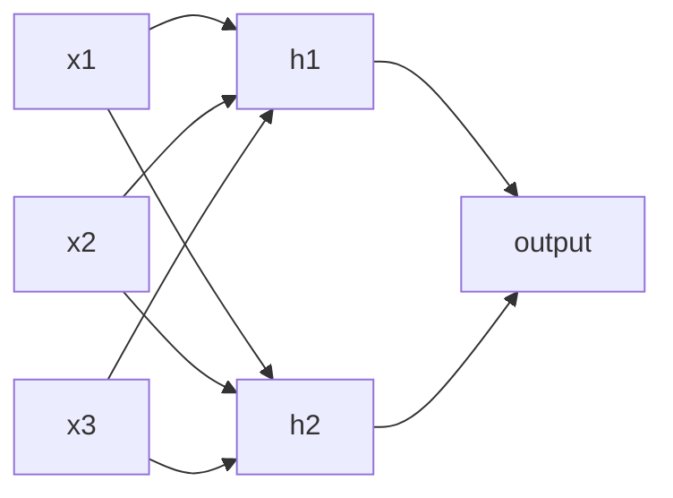

A single neuron computes a weighted sum of its inputs plus a bias and passes it through an activation function:

$$a = f\!\left(\sum_j w_j x_j + b\right)$$

Learning in neural networks follows a structured, three-stage process:

- **Input Computation:** Data is fed into the network.
- **Output Generation:** Based on the current parameters, the network generates an output.
- **Iterative Refinement:** The network refines its output by adjusting weights and biases, gradually improving its performance on diverse tasks.

That refinement is gradient descent again, with the gradients supplied by backpropagation. Note that the loss surface of a deep network is **non-convex**, which is why the convexity discussion above matters: the guarantees available to linear and logistic regression do not carry over.


## Ensemble Learning

- Ensemble learning is a technique in machine learning where multiple models (often called "weak learners") are trained and combined to solve the same problem.
- The idea is that a group of models working together can outperform a single strong model.

A **weak learner** is a model only slightly better than random guessing — a shallow tree, for instance. The ensemble bet is that their individual errors are different enough to cancel, leaving the shared signal behind. This is the "wisdom of the crowd".

### When to Use Ensemble Learning?

- You have high variance or high bias in your model.
- Your base models are diverse and complementary.
- You want to increase model performance in competitions (e.g., Kaggle).

The **diversity** condition is not optional: if all base models make the same mistakes, averaging them changes nothing. Which failure you are fixing decides the method — bagging attacks **variance**, boosting attacks **bias**.

### Real-Life Example

Imagine trying to guess a movie's rating:

- One friend uses past ratings
- Another reads online reviews
- A third watches the trailer

Each has weaknesses alone, but combining their opinions gives a better estimate. That's ensemble learning!

Each friend is a base learner drawing on a different information source: historical data, text sentiment, audio-visual content. A trailer can mislead; past ratings can miss a change in a director's style. Combined, the individual biases partly cancel.

A heterogeneous ensemble of Linear Regression, SVM, Decision Tree and a Neural Network feeding one combiner can reach the highest accuracy of any arrangement here — around 96 % on the deck's illustration — at the cost of compute and interpretability.

### Types of Ensemble learning

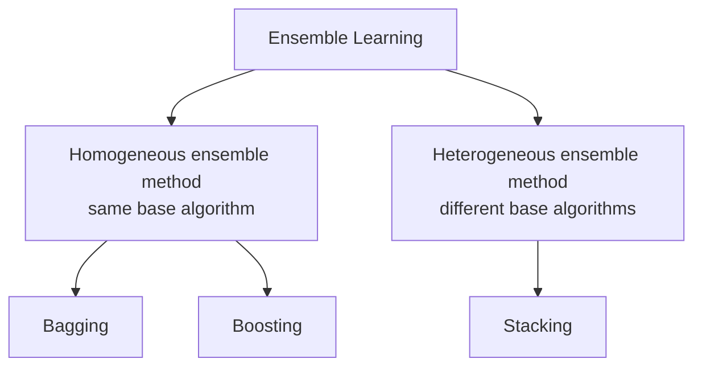

**Homogeneous** ensembles repeat one algorithm and get their diversity from the data (Random Forest is all decision trees). **Heterogeneous** ensembles combine different algorithm families, which is what stacking is built for.

#### Bagging (Bootstrap Aggregating)

- Models are trained independently on different random subsets of the training data.
- Their results are then combined—usually by averaging (for regression) or voting (for classification).
- This helps reduce variance and prevents over fitting.

Example Algorithms:

- Random Forest (uses decision trees + bagging)

How Bagging Learning model works:

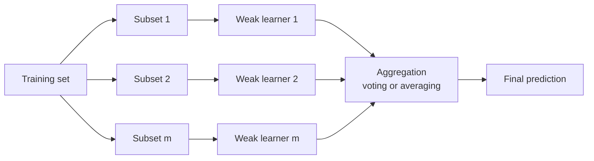

Notation for the process: there are $m$ subsets and therefore $m$ weak learners, $n$ instances in the initial dataset, and $N$ sample points in a particular subset, with ideally $n > N$. (In textbook bagging $N = n$, but sampling *with replacement* means some points repeat and others are left out — those left out are the out-of-bag samples.)

Two properties define bagging: the learners are trained **independently and in parallel**, and the aggregation is a plain vote or average. It reduces **variance** without materially increasing bias.

#### Boosting

- Models are trained one after another. Each new model focuses on fixing the errors made by the previous ones.
- The final prediction is a weighted combination of all models, which helps reduce bias and improve accuracy.
- Models are trained sequentially, each new model focusing on correcting the errors of the previous ones.
- Final prediction is a weighted sum of all models.
- Reduces bias and variance

Popular Boosting Algorithms:

- AdaBoost (Adaptive Boosting)
- Gradient Boosting (GBM)
- XGBoost
- LightGBM
- CatBoost

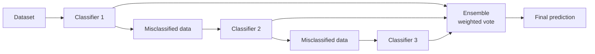

The mechanism is *learning from mistakes*: train a weak learner, find which points it got wrong, raise the weight of those points, train the next learner to concentrate on them, and repeat for $m$ rounds. The final answer is a weighted vote in which more accurate learners get more say:

$$H(x) = \text{sign}\!\left(\sum_t \alpha_t h_t(x)\right)$$

Boosting is **sequential** — it cannot be parallelised across rounds the way bagging can — and its primary target is **bias**.

#### Stacking (Stacked Generalization)

- Multiple different models (often of different types) are trained, and their predictions are used as inputs to a final model, called a meta-model.
- The meta-model learns how to best combine the predictions of the base models, aiming for better performance than any individual model.
- The predictions of base models are fed to a meta-model (e.g., logistic regression) that learns how to best combine them.
- Leverages strengths of different models
- Useful when base learners are diverse.

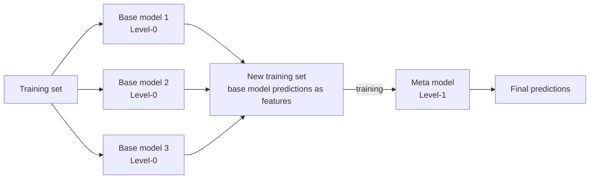

The four steps: train the Level-0 base models on the training set; collect their predictions; assemble those predictions as the **features** of a new training set; train the Level-1 **meta-model** on it. The meta-model does not see the original raw features — it sees only what the base models said, and it learns whom to trust when they disagree ("when the SVM and the tree conflict, the SVM is usually right"). Logistic regression is a common choice of meta-model for classification.

Two cautions. Stacking needs **diverse** base learners, since correlated learners give the meta-model nothing to arbitrate. And it overfits easily if the meta-model is trained on predictions the base models made on data they were themselves trained on — the standard remedy is **out-of-fold** (cross-validated) predictions when building the new training set.

### Bagging versus boosting versus stacking

| | Bagging | Boosting | Stacking |
| --- | --- | --- | --- |
| Base learners | Same type | Same type | Usually different types |
| Training order | Parallel, independent | Sequential | Base models parallel, then a meta-model |
| Data per learner | Bootstrap sample | Reweighted towards past errors | Full set (out-of-fold predictions) |
| Combination | Vote / average | Weighted vote | Learned by the meta-model |
| Primarily reduces | Variance | Bias | Both, by learning the combination |
| Example | Random Forest | AdaBoost, XGBoost | Stacked generalisation |


## Evaluation Metrics and the Confusion Matrix

A **confusion matrix** is used to evaluate the performance of a **classification model** by comparing the actual values with the predicted values. Accuracy alone tells you how often the model is right; the matrix tells you *how* it is wrong.

### Real-time example: email spam detection

Suppose an AI model classifies 100 emails as **Spam** or **Not Spam**:

| | Predicted: Spam | Predicted: Not Spam |
| --- | --- | --- |
| **Actual: Spam** | 35 (True Positive) | 5 (False Negative) |
| **Actual: Not Spam** | 10 (False Positive) | 50 (True Negative) |

### Understanding Each Term

| Term | Meaning | Example |
| --- | --- | --- |
| True Positive (TP) | Model correctly predicts Spam | 35 spam emails correctly identified as spam |
| True Negative (TN) | Model correctly predicts Not Spam | 50 normal emails correctly identified |
| False Positive (FP) | Model predicts Spam but email is actually Not Spam | 10 normal emails marked as spam |
| False Negative (FN) | Model predicts Not Spam but email is actually Spam | 5 spam emails missed |

Read the names literally: **True/False** says whether the model was right, **Positive/Negative** says what the model predicted. A False Positive is a **Type I error**, a false alarm. A False Negative is a **Type II error**, a missed detection.

### Performance Metrics

**1. Accuracy** — how many predictions were correct?

$$\text{Accuracy} = \frac{TP + TN}{TP + TN + FP + FN} = \frac{35 + 50}{35 + 50 + 10 + 5} = \frac{85}{100} = 85\%$$

**2. Precision** — out of all emails predicted as spam, how many were actually spam?

$$\text{Precision} = \frac{TP}{TP + FP} = \frac{35}{35 + 10} = \frac{35}{45} = 77.78\%$$

**3. Recall (Sensitivity)** — out of all actual spam emails, how many were detected?

$$\text{Recall} = \frac{TP}{TP + FN} = \frac{35}{35 + 5} = \frac{35}{40} = 87.5\%$$

**4. F1 Score** — balances precision and recall:

$$F1 = 2 \times \frac{\text{Precision} \times \text{Recall}}{\text{Precision} + \text{Recall}} = 2 \times \frac{0.7778 \times 0.875}{0.7778 + 0.875} \approx 82.3\%$$

F1 is the **harmonic** mean, not the arithmetic one, and that choice matters: the harmonic mean is dragged down by whichever value is smaller. A model with precision 1.0 and recall 0.0 has an arithmetic mean of 0.5 but an F1 of 0.0. This is what makes F1 honest on imbalanced data, where plain accuracy is misleading — on a dataset that is 99 % one class, predicting the majority always scores 99 % accuracy and finds nothing.

### Real-time example: disease detection

Suppose an AI predicts whether a patient has COVID-19, over 200 patients:

| Actual / Predicted | Positive | Negative |
| --- | --- | --- |
| **Positive** | 90 (TP) | 10 (FN) |
| **Negative** | 15 (FP) | 85 (TN) |

- TP = 90: sick patients correctly identified.
- TN = 85: healthy patients correctly identified.
- FP = 15: healthy patients wrongly diagnosed as sick.
- FN = 10: sick patients missed by the model.

$$\text{Accuracy} = \frac{90+85}{200} = 87.5\%, \quad \text{Precision} = \frac{90}{105} \approx 85.7\%$$

$$\text{Recall} = \frac{90}{100} = 90\%, \quad \text{Specificity} = \frac{TN}{TN+FP} = \frac{85}{100} = 85\%$$

In healthcare, **False Negatives are often the most dangerous**, because an infected patient may not receive treatment and may go on to infect others. Compare that with the spam filter, where the False Positive is the worse error — an important email hidden in the junk folder. Same matrix, opposite priorities: which error costs more is a property of the domain, not of the mathematics.

Think of a COVID test:

1. **TP:** sick person → test says sick.
2. **TN:** healthy person → test says healthy.
3. **FP:** healthy person → test says sick (false alarm).
4. **FN:** sick person → test says healthy (missed case).


## Bias–Variance Tradeoff

Every time we train a model we are trying to minimise the **Total Error**, and that error decomposes into three parts:

$$\text{Total Error} = \text{Bias}^2 + \text{Variance} + \text{Irreducible Error}$$

- **Bias²** — reducible. Error from approximating a complex real problem with a much simpler model.
- **Variance** — reducible. Error from sensitivity to small fluctuations in the training set.
- **Irreducible error** — noise inherent in the problem itself, which no model can remove. It is why the total-error curve never touches zero.

Bias is squared because bias can be positive or negative; squaring measures the magnitude of the deviation from the truth.

### 1. What is Bias? (the "underfitter")

Bias is the error introduced by approximating a real-life problem (which is usually complicated) with a much simpler model.

- **The problem:** the model makes too many assumptions. It is "prejudiced" about what the data should look like.
- **Result: underfitting.** No matter how much data you give it, it just cannot learn the pattern.
- **Visual:** a straight line trying to fit a curved U-shaped dataset. It is simply too simple to get it right.

Plot a linear fit against U-shaped (quadratic) data and the failure is systematic, not random: the line sits below the points at both edges and above them in the middle. Adding more data does not help, because the *architecture* is what is limiting. High bias, low variance — consistently wrong.

### 2. What is Variance? (the "overfitter")

Variance is the model's sensitivity to small fluctuations in the training set.

1. **The problem:** the model learns the "noise" in the data rather than just the signal. It follows every single data point like a hyper-active puppy.
2. **Result: overfitting.** The model performs amazingly on training data but fails miserably on new, unseen data.
3. **Visual:** a wiggly, complex line that passes through every single point on your graph but looks like a mess.

A high-degree polynomial $y = w_0 + w_1x + \dots + w_nx^n$ on noisy data produces exactly that: many inflection points, sharp turns to reach each individual point, and a shape that would change drastically if one point moved. Low bias, high variance.

### The tradeoff curve

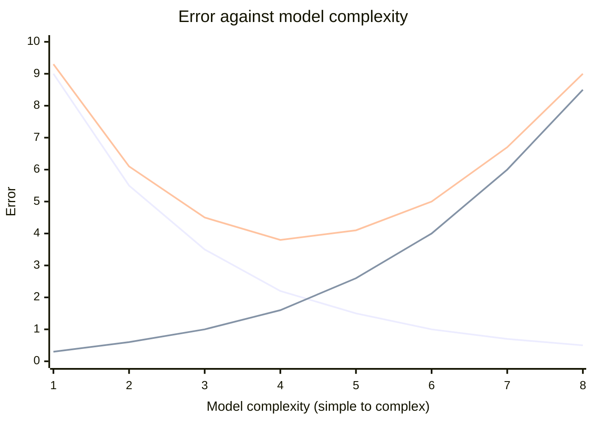

Three curves, in the order plotted: **Bias²** falls monotonically as the model grows more flexible; **Variance** rises monotonically for the same reason; **Total Error** is their sum and therefore U-shaped. Its minimum is the **optimal model complexity** — the "sweet spot". To the left of it the model underfits; to the right it overfits.

### Why do we need to "balance" them?

In a perfect world we want **low bias** and **low variance**. In reality there is a tug-of-war:

- As you make a model more **complex** (to reduce bias), it starts to pick up noise, and **variance** increases.
- As you make a model **simpler** (to reduce variance), it loses its ability to learn, and **bias** increases.

**The sweet spot:** the point where the sum of Bias² and Variance is at its lowest — the best model complexity.

### The golf pro analogy

Imagine a golfer taking several practice shots toward a hole. The hole represents the **true relationship** in your data, the balls are the model's predictions.

- **Bias** is the distance between the centre of your ball cluster and the hole.
- **Variance** is the "spread", how scattered the balls are from each other.

The four scenarios on the green:

1. **Low bias / low variance (the Pro):** all balls land in or right next to the hole — accurate and consistent. The ideal.
2. **Low bias / high variance (the Wild Hitter):** balls scattered all over the green but centred on the hole. Right on average, wildly inconsistent. **Overfitting.**
3. **High bias / low variance (the Consistent Miss):** a tight cluster, twenty feet left of the hole. Consistent, systematically wrong. **Underfitting.**
4. **High bias / high variance (the Amateur):** scattered *and* nowhere near the hole. The worst case.

The same four states are often drawn as bullseye targets: tight-and-off-centre, tight-and-centred, spread-and-centred, spread-and-off-centre.

### The bridge to regularization

When we find ourselves with **high variance (overfitting)**, our model is being too "flexible" — trying too hard to please every data point in the training set.

This is exactly where **regularization (L1 and L2)** comes in. Regularization acts like a "penalty" or a "leash" that prevents the model from becoming too complex. It forces the model to stay simpler, effectively trading a tiny bit of bias to significantly reduce the variance.

Mathematically, overfitting shows up as **exceptionally large coefficients** $W$: to produce the sharp wiggles needed to pass through every noisy point, the weights must blow up. So the fix is to penalise their size:

$$L = \text{Residual Sum of Squares (RSS)} + \text{Penalty}$$


## Regularization

- Regularization adds a penalty term to the loss function to reduce over fitting by discouraging overly complex models.
- By adding a penalty for complexity, regularization encourages simpler and more generalizable models.
- **Prevents overfitting:** adds constraints to the model to reduce the risk of memorising noise in the training data.
- **Improves generalization:** encourages simpler models that perform better on new, unseen data.

The principle behind it is Occam's razor: given two models that fit equally well, the simpler one is more likely to be right about the future.

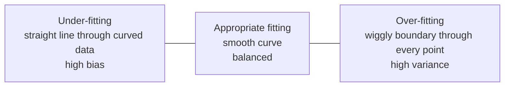

Regularization is the force that pulls the right-hand picture back towards the middle one.

### Types of Regularization

There are mainly 3 types of regularization techniques, each applying penalties in different ways to control model complexity and improve generalization.

### a. L1 Regularization (Lasso)

A regression model which uses the L1 regularization technique is called **LASSO (Least Absolute Shrinkage and Selection Operator)** regression.

1. It adds the absolute value of magnitude of the coefficient as a penalty term to the loss function $L$.
2. This penalty can shrink some coefficients to zero, which helps in selecting only the important features and ignoring the less important ones.

$$\text{Cost} = \frac{1}{n} \sum_{i=1}^{n} (y_i - \hat{y}_i)^2 + \lambda \sum_{j=1}^{m} \lvert w_j \rvert$$

Where $m$ is the number of features, $n$ the number of examples, $y_i$ the actual target value, $\hat{y}_i$ the predicted target value, $w_j$ the coefficient of feature $j$, and $\lambda$ the regularization parameter controlling the strength of the penalty. If $\lambda = 0$ the cost reduces to ordinary least squares; as $\lambda \to \infty$ all coefficients are driven towards zero.

Lasso does two things at once: it **shrinks** coefficients, and because the L1 penalty can push them to *exactly* zero, it performs **automatic feature selection**, producing a sparse and more interpretable model.

```python
from sklearn.linear_model import Lasso
from sklearn.model_selection import train_test_split
from sklearn.datasets import make_regression
from sklearn.metrics import mean_squared_error

X, y = make_regression(n_samples=100, n_features=5, noise=0.1, random_state=42)
X_train, X_test, y_train, y_test = train_test_split(X, y, test_size=0.2, random_state=42)

lasso = Lasso(alpha=0.1)
lasso.fit(X_train, y_train)
y_pred = lasso.predict(X_test)

mse = mean_squared_error(y_test, y_pred)
print(f"Mean Squared Error: {mse}")
print("Coefficients:", lasso.coef_)
```

```
Mean Squared Error: 0.06362439921332456
Coefficients: [60.50305581 98.52475354 64.3929265 56.96061238 35.52928502]
```

- `make_regression(n_samples=100, n_features=5, noise=0.1, random_state=42)` generates a regression dataset with 100 samples, 5 features and some noise.
- `train_test_split(..., test_size=0.2, random_state=42)` splits the data into 80 % training and 20 % testing sets.
- `Lasso(alpha=0.1)` creates a Lasso model with regularization strength `alpha` set to 0.1; `alpha` is the code's name for $\lambda$.
- `random_state=42` fixes the seed so the data and the split are reproducible.
- The learned weights live in `.coef_`; with a larger `alpha`, more of them would be exactly zero.

### b. L2 Regularization (Ridge)

A regression model that uses the L2 regularization technique is called **Ridge regression**. It adds the squared magnitude of the coefficient as a penalty term to the loss function. It handles **multicollinearity** by shrinking the coefficients of correlated features, reducing their variance and preventing any single feature from dominating the model.

$$\text{Cost} = \frac{1}{n} \sum_{i=1}^{n} (y_i - \hat{y}_i)^2 + \lambda \sum_{j=1}^{m} w_j^2$$

Ridge shrinks coefficients **towards** zero but never exactly to zero, so every feature stays in the model with reduced influence. That is the crucial contrast with Lasso.

```python
from sklearn.linear_model import Ridge
from sklearn.datasets import make_regression
from sklearn.model_selection import train_test_split
from sklearn.metrics import mean_squared_error

X, y = make_regression(n_samples=100, n_features=5, noise=0.1, random_state=42)
X_train, X_test, y_train, y_test = train_test_split(X, y, test_size=0.2, random_state=42)

ridge = Ridge(alpha=1.0)
ridge.fit(X_train, y_train)
y_pred = ridge.predict(X_test)

mse = mean_squared_error(y_test, y_pred)
print("Mean Squared Error:", mse)
print("Coefficients:", ridge.coef_)
```

```
Mean Squared Error: 4.114050771972589
Coefficients: [59.87954432 97.15091098 63.24364738 56.31999433 35.34591136]
```

Note that none of Ridge's coefficients is zero, and compare with the Lasso run above.

### Why L1 zeroes coefficients and L2 does not

Both penalties can be written as a **constraint** on the coefficients rather than as an added term:

$$\text{L1 (Lasso)}: \ \lvert \beta_1 \rvert + \lvert \beta_2 \rvert \le C \qquad\qquad \text{L2 (Ridge)}: \ \beta_1^2 + \beta_2^2 \le C$$

In the $(\beta_1, \beta_2)$ plane the least-squares error forms concentric elliptical contours around the unconstrained OLS solution, and the regularised answer is the point where the smallest ellipse first **touches** the constraint region.

- The L1 region is a **diamond** with sharp corners *on the axes*. An ellipse approaching it very often touches a corner — and a corner means one coefficient is exactly zero. Hence sparsity and feature selection.
- The L2 region is a smooth **circle** with no corners, so the touch point almost never lands on an axis. Every coefficient is shrunk, none eliminated.

A smaller budget $C$ corresponds to a larger penalty $\lambda$.

### c. Elastic Net

**Elastic Net Regression** is a combination of both L1 as well as L2 regularization. It combines both L1 (absolute values) and L2 (squared values) penalties on the coefficients, with the help of an extra hyperparameter that controls the ratio of the L1 and L2 regularization.

$$\text{Cost} = \frac{1}{n} \sum_{i=1}^{n}(y_i - \hat{y}_i)^2 + \lambda \left( (1 - \alpha) \sum_{j=1}^{m} \lvert w_j \rvert + \alpha \sum_{j=1}^{m} w_j^2 \right)$$

- $\lambda$ — overall regularization strength.
- $\alpha$ — the mixing parameter, $0 \le \alpha \le 1$. In this form $\alpha = 0$ leaves only the L1 term (pure Lasso) and $\alpha = 1$ leaves only the L2 term (pure Ridge); values in between blend the two. **Conventions differ between textbooks and libraries** — in scikit-learn the parameter is `l1_ratio`, where `l1_ratio=1` is pure Lasso and `l1_ratio=0` is pure Ridge — so always check which convention a question is using.

Why it exists: faced with a group of highly correlated features, Lasso arbitrarily keeps one and zeroes the rest, while Ridge keeps them all. Elastic Net finds the middle ground, which is why it is preferred on wide datasets with correlated predictors.

```python
from sklearn.linear_model import ElasticNet
from sklearn.datasets import make_regression
from sklearn.model_selection import train_test_split
from sklearn.metrics import mean_squared_error

X, y = make_regression(n_samples=100, n_features=10, noise=0.1, random_state=42)
X_train, X_test, y_train, y_test = train_test_split(X, y, test_size=0.2, random_state=42)

model = ElasticNet(alpha=1.0, l1_ratio=0.5)
model.fit(X_train, y_train)

y_pred = model.predict(X_test)
mse = mean_squared_error(y_test, y_pred)

print("Mean Squared Error:", mse)
print("Coefficients:", model.coef_)
```

```
Mean Squared Error: 7785.886176938014
Coefficients: [16.84528938 31.77080959 4.05901996 40.18486737 57.25856154
 45.81463318 58.97979422 -0. 3.82816854 41.1096051]
```

The `-0.` in that output is the point of the example: the L1 half of Elastic Net has performed feature selection and eliminated one feature entirely.

In general:

$$\text{Regularized Loss} = \text{Original Loss} + \lambda \cdot (\text{Penalty})$$

Where $\lambda$ (lambda) controls the strength of the penalty.

### Benefits of Regularization

1. **Prevents overfitting:** helps models focus on underlying patterns instead of memorising noise in the training data.
2. **Enhances performance:** prevents excessive weighting of outliers or irrelevant features, improving overall model accuracy.
3. **Stabilizes models:** reduces sensitivity to minor data changes, ensuring consistency across different data subsets.
4. **Prevents complexity:** keeps the model from becoming too complex, which matters most with limited or noisy data.
5. **Handles multicollinearity:** reduces the magnitudes of correlated coefficients, improving model stability.
6. **Promotes consistency:** ensures reliable performance across different datasets, reducing the risk of large performance shifts.


## Apriori Algorithm for Association Rules

- Association rule learning is a rule-based machine learning method to find relationships (associations) between variables in large datasets.

Real life example:

- If a customer buys bread and butter, they are likely to buy jam. This is an example of a market basket analysis.

A rule has two halves, and the vocabulary is examinable:

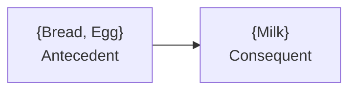

with **Itemset** $=$ {Bread, Egg, Milk}, the union of the two sides. The rule $X \Rightarrow Y$ asserts co-occurrence, not causation.

### Support, confidence and lift

For an itemset $X = \{x_1, \dots, x_k\}$, find all rules $X \Rightarrow Y$ with minimum support and confidence, where

- **support** $s$ is the probability that a transaction contains $X \cup Y$;
- **confidence** $c$ is the conditional probability that a transaction having $X$ also contains $Y$.

$$s(X \Rightarrow Y) = \frac{\sigma(X \cup Y)}{N}, \qquad c(X \Rightarrow Y) = \frac{\sigma(X \cup Y)}{\sigma(X)} = P(Y \mid X)$$

**Lift** is the ratio of the observed support to the support expected if $X$ and $Y$ were independent; a lift greater than 1 indicates a genuine positive association rather than coincidence.

Worked example on five transactions:

| Transaction-id | Items bought |
| --- | --- |
| 10 | A, B, D |
| 20 | A, C, D |
| 30 | A, D, E |
| 40 | B, E, F |
| 50 | B, C, D, E, F |

With $sup_{min} = 50\%$ and $conf_{min} = 50\%$, the frequent patterns are $\{A{:}3, B{:}3, D{:}4, E{:}3, AD{:}3\}$ and the association rules are

- $A \Rightarrow D$ — support $3/5 = 60\%$, confidence $3/3 = 100\%$
- $D \Rightarrow A$ — support $3/5 = 60\%$, confidence $3/4 = 75\%$

Note the asymmetry: support is symmetric, but confidence is not. Whenever $A$ appears, $D$ appears too, so $c(A \Rightarrow D) = 100\%$; but $D$ also appears without $A$, so $c(D \Rightarrow A)$ is only 75 %.

### Steps of Apriori Algorithm

- Set minimum support and confidence
- Generate all frequent itemsets:
  - Count itemsets in the dataset
  - Eliminate itemsets below the support threshold
- Generate association rules from the frequent item sets
- Filter rules based on confidence and lift

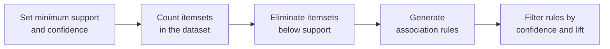

The engine underneath is the **Apriori property** (downward closure): every non-empty subset of a frequent itemset must itself be frequent. Contrapositively, if any subset is infrequent then the superset cannot be frequent — so it can be **pruned** without ever being counted. Without that pruning the number of candidate combinations grows exponentially.

### Worked example of the level-wise search

Database $D$ with four transactions, $minsup = 0.5$, so the required support count is $0.5 \times 4 = 2$:

| TID | Items |
| --- | --- |
| 100 | 1 3 4 |
| 200 | 2 3 5 |
| 300 | 1 2 3 5 |
| 400 | 2 5 |

**Scan 1** — count single items to get $C_1$, then prune below count 2 to get $L_1$:

| $C_1$ itemset | sup | | $L_1$ itemset | sup |
| --- | --- | --- | --- | --- |
| {1} | 2 | | {1} | 2 |
| {2} | 3 | | {2} | 3 |
| {3} | 3 | | {3} | 3 |
| {4} | 1 | | | |
| {5} | 3 | | {5} | 3 |

{4} is dropped: its count of 1 is below the threshold.

**Scan 2** — self-join $L_1$ to get the candidate pairs $C_2 = \{12, 13, 15, 23, 25, 35\}$, count them, and prune:

| $C_2$ itemset | sup | | $L_2$ itemset | sup |
| --- | --- | --- | --- | --- |
| {1 2} | 1 | | | |
| {1 3} | 2 | | {1 3} | 2 |
| {1 5} | 1 | | | |
| {2 3} | 2 | | {2 3} | 2 |
| {2 5} | 3 | | {2 5} | 3 |
| {3 5} | 2 | | {3 5} | 2 |

**Scan 3** — the only 3-item candidate is $C_3 = \{2\,3\,5\}$, because all of its 2-subsets ({2 3}, {2 5}, {3 5}) are in $L_2$. Its count is 2, so $L_3 = \{2\,3\,5\}$ with support 2. Three database scans in total, one per level.

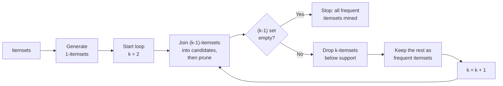

### Applications of Apriori Algorithm

- **E-commerce:** Used to recommend products that are often bought together like laptop + laptop bag, increasing sales.
- **Food Delivery Services:** Identifies popular combos such as burger + fries, to offer combo deals to customers.
- **Streaming Services:** Recommends related movies or shows based on what users often watch together like action + superhero movies.
- **Financial Services:** Analyzes spending habits to suggest personalized offers such as credit card deals based on frequent purchases.
- **Travel & Hospitality:** Creates travel packages like flight + hotel by finding commonly purchased services together.
- **Health & Fitness:** Suggests workout plans or supplements based on users' past activities like protein shakes + workouts.


## Empirical Risk Minimization

- ERM is a principle for training machine learning models where we aim to minimize the average loss (error) on the training data.
- Instead of minimizing the true risk (which we don't know) we minimize the empirical risk, i.e., the average error on the observed data.

$$R_{emp}(f) = \frac{1}{n} \sum_{i=1}^{n} L(y_i, f(x_i))$$

The **true (expected) risk** is the average loss over the entire data distribution, and it is unknowable in practice because we never have the distribution — only a sample from it. ERM substitutes the sample average and hopes the two track each other. The danger is precisely the bias-variance story: a hypothesis flexible enough can drive the empirical risk to zero by memorising noise, leaving the true risk high. That is overfitting, and it is why ERM alone is not enough — see Structural Risk Minimization in Unit III.

## Loss Functions

- Loss functions measure how far the predicted value is from the actual value.

Good loss functions are:

- Differentiable (for gradient-based methods)
- Convex (for easier optimization)

| Problem Type | Loss Function | Formula | Description |
| --- | --- | --- | --- |
| Regression | Mean Squared Error (MSE) | $\frac{1}{n} \sum (y_i - \hat{y}_i)^2$ | Penalizes large errors more |
| | Mean Absolute Error (MAE) | $\frac{1}{n} \sum \lvert y_i - \hat{y}_i \rvert$ | Linear in the error; robust to outliers |
| Classification | 0–1 Loss | 0 if correct, 1 if wrong | Simplest, but non-differentiable |
| | Cross-Entropy Loss | $-\sum y_i \log(\hat{y}_i)$ | Used for probabilistic classifiers |
| | Hinge Loss | $\max(0, 1 - y_i \cdot f(x_i))$ | Used in SVMs |

The two requirements at the top explain the table. The 0–1 loss is what we actually care about in classification, but it is a step function — its gradient is zero almost everywhere — so it cannot drive gradient descent. Cross-entropy and hinge loss are convex, differentiable (or subdifferentiable) **surrogates** that we optimise instead.

## VC Dimension

### VC Dimension (Vapnik–Chervonenkis Dimension)

- VC dimension measures the capacity (complexity) of a hypothesis space — how well a model can fit various patterns.
- It is the maximum number of points that can be shattered (i.e., classified correctly in all possible ways) by the hypothesis class.

Examples:

- VC Dimension of a linear classifier in 2D: 3
- VC Dimension of a decision stump (1-level decision tree): 1
- VC Dimension of a k-nearest neighbor (if k=1): infinite

- The Vapnik-Chervonenkis (VC) dimension is a measure of the capacity of a hypothesis set to fit different data sets.
- It was introduced by Vladimir Vapnik and Alexey Chervonenkis in the 1970s and has become a fundamental concept in statistical learning theory.
- The VC dimension is a measure of the complexity of a model, which can help us understand how well it can fit different data sets.
- The VC dimension of a hypothesis set H is the largest number of points that can be shattered by H.
- A hypothesis set H shatters a set of points S if, for every possible labeling of the points in S, there exists a hypothesis in H that correctly classifies the points

**Shattering** is a counting condition: a set of $N$ points admits $2^N$ possible binary labellings, and the hypothesis class shatters that set only if it can realise **all** $2^N$. Formally,

$$VC(H) = \max\{\,n : \exists S,\ |S| = n,\ H \text{ shatters } S\,\}$$

If $VC(H) = k$ then for every set of $k+1$ points there is at least one labelling no hypothesis in $H$ can produce. For a linear classifier in $d$ dimensions, $VC = d + 1$ — hence 3 in the plane. A 1-nearest-neighbour model memorises any labelling of any size, so its VC dimension is infinite. Unit III develops this further, including the circles-in-2D example and the risk bound.

### Why is it important?

- Helps understand underfitting vs overfitting
- A model with high VC dimension can overfit.
- A balance is needed between model complexity and generalization

## Data Partitioning

### Data Partitioning (Train/Test/Validation)

In Machine Learning, the dataset is typically split into three subsets:

#### a. Training Set

- Used to train the model (i.e., fit the parameters).
- Usually comprises 60–80% of the original dataset.

#### b. Validation Set

- Used to tune hyperparameters (like learning rate, regularization strength, etc.).
- Helps in preventing overfitting.
- Typically 10–20% of the data.

#### c. Test Set

- Used to evaluate the final model performance.
- Never used in training or validation.
- Also about 10–20% of the data.

Example: If you have 1000 samples, you might split them as:

- Train: 700 samples
- Test: 150 samples
- Validation: 150

The three-way split exists because hyperparameters need their own data. If you tuned on the test set, the test score would no longer be an honest estimate of performance on unseen data — you would have leaked information about it into the model.

## Cross-Validation

- Cross-validation is a technique to ensure that your model generalizes well. It is used instead of a single validation set, especially when you have less data.

### a. K-Fold Cross-Validation

- The dataset is split into K equal parts (folds).
- The model is trained on K-1 folds and validated on the remaining fold.
- This is repeated K times, and performance is averaged.
- Exa: For 5-Fold CV, the model is trained and evaluated 5 times using different folds each time.

Averaging over $K$ runs removes the luck of a single arbitrary split, giving a lower-variance estimate of performance.

### b. Leave-One-Out CV (LOOCV)

- Each sample is used once as validation; the rest as training.
- Very computationally expensive.

LOOCV is $K$-fold with $K = N$: it extracts the maximum training data from every fold, at the cost of retraining the model $N$ times.

types of prediction errors: 1. Bias  2. Variance

| Term | Description | Effect | Cause |
| --- | --- | --- | --- |
| Bias | Error from wrong assumptions | Underfitting | Model too simple |
| Variance | Error from too much sensitivity to training data | Overfitting | Model too complex |

## Clustering: K-Means and Kernel K-Means

- Clustering is an unsupervised learning technique used to group similar data points into clusters, where the similarity is measured using a distance metric (Centroid) (like Euclidean distance).
- **Goal:** Partitions data into (k) clusters by minimizing the sum of squared distances between data points and their cluster centroids.

That objective is the **within-cluster sum of squares**:

$$\min \sum_{i=1}^{l} \| x_i - m_{q(x_i)} \|^2$$

where $m_j$ is the centroid of cluster $j$ and $q(x_i)$ is the cluster assigned to point $x_i$.

K-Means Model work flow:

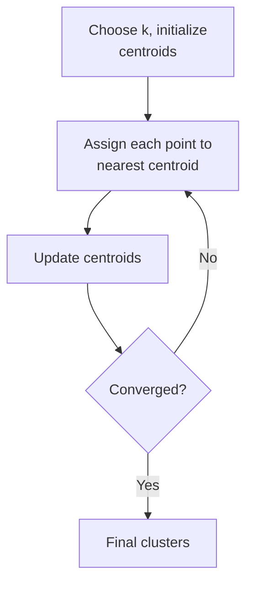

The two steps in the loop are the assignment step, $q(x) = \arg\min_i \|x - m_i\|$, and the update step, $m_i = \frac{1}{|I_i|}\sum_{j \in I_i} x_j$. Convergence to a *local* minimum is guaranteed; the global minimum is not, which is why K-Means is usually run several times from different initialisations.

### K-Kernel Means Algorithm

- **Algorithm:** Extends K-means by using a kernel function to map data into a higher-dimensional space, enabling the detection of non-linear clusters.
- **Assumptions:** Relies on the choice of an appropriate kernel (e.g., RBF, polynomial).

Plain K-Means can only draw straight-edged (Voronoi) boundaries, so concentric rings or crescent shapes defeat it. Mapping the data through $\phi(x)$ first makes those shapes linearly separable in the new space, and the kernel trick means we never have to compute $\phi(x)$ explicitly — only inner products.

## Dimensionality Reduction: PCA and Kernel PCA

### What is Dimensionality Reduction?

- Dimensionality Reduction reduces the number of input variables (features) in a dataset while preserving as much information (variance) as possible.

Benefits:

- Reduces computational cost
- Removes noise/redundancy
- Improves visualization (e.g., 2D plots)
- Avoids curse of dimensionality

### Steps of PCA

- Standardize the dataset.
- Compute the covariance matrix of the data.
- Calculate eigenvalues and eigenvectors of the covariance matrix.
- Sort eigenvectors by decreasing eigenvalues.
- Select top-k eigenvectors (principal components).
- Project data onto the new k-dimensional space.

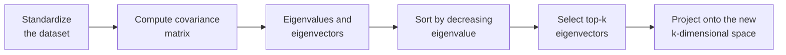

Standardisation comes first for a reason: PCA chases variance, so a feature measured in large units would dominate the components purely because of its scale. Each **eigenvector** of the covariance matrix is a direction in feature space and its **eigenvalue** is the variance captured along that direction — so sorting by eigenvalue ranks the directions by how much information they carry.

- Principal Component Analysis (PCA) is a technique used to reduce the dimensionality of a dataset while preserving most of its original variation.
- PCA is a linear method and it may not work well when the data has a non-linear structure. In such cases, instead of PCA, Kernel PCA can be used.

Note also that PCA is **unsupervised** — it ignores class labels — which is exactly the contrast with LDA drawn in Unit I: maximum spread is not the same thing as maximum class separation.

### Kernel PCA

- **Goal:** Extend PCA to capture non-linear patterns using the kernel trick — project data into a higher-dimensional space.
- **Idea:**
  - Use a non-linear mapping $\phi(x)$ to map input data into high-dimensional space.
  - Compute PCA in that space using only dot products via a kernel function.

## Matrix Factorization

### What is Matrix Factorization?

- Matrix Factorization refers to breaking a large matrix into a product of two or more smaller matrices. It is used to discover hidden (latent) features underlying the data.

Common Scenario (e.g., Movie Recommendation):

Let's say we have a user-item rating matrix $R$, where:

- Rows = users
- Columns = items (movies)
- Entries = known ratings; missing entries are unrated.

We want to predict missing entries using Matrix Factorization.

The factorisation approximates $R \approx U V^T$, where $U$ holds one latent-factor vector per user and $V$ one per item, so a predicted rating is the dot product $\hat{r}_{ui} = u_u \cdot v_i$. The latent factors are learned, not designed — they often end up corresponding to interpretable notions such as genre or tone.

Solved Using:

1. Stochastic Gradient Descent (SGD)
2. Alternating Least Squares (ALS)

ALS exploits a useful fact: with $U$ held fixed the problem in $V$ is an ordinary least-squares problem, and vice versa — so the algorithm alternates between two closed-form solves.

## Matrix Completion

- Matrix Completion is the task of filling in missing values in a partially observed matrix.

Problem:

- Given: Incomplete matrix $R$
- Goal: Predict missing entries assuming $R$ is low-rank

Example:

- In a Netflix recommendation system, users rate only a few movies.
- We aim to complete the rating matrix so that we can recommend unseen movies.

The **low-rank** assumption is what makes the problem solvable at all: it says the millions of ratings are really generated by a few underlying factors, so the matrix has far fewer degrees of freedom than it has entries.

## Generative Models

### What are Generative Models?

- Generative models learn the joint probability distribution $P(X, Y)$ of data and labels (if any), enabling them to generate new data that resembles the training data.

They can:

- Model data probabilistically
- Generate new samples
- Handle unsupervised learning, missing data
- Infer hidden (latent) structure

The contrast to hold on to: a **generative** model learns $P(X \mid Y)$ and $P(Y)$ and applies Bayes' rule to classify — Naive Bayes from Unit I is the standard example — while a **discriminative** model learns the boundary $P(Y \mid X)$ directly, as logistic regression does. Only the generative one can sample new data.

## Latent Factor Models

- Latent Factor Models assume that observed data is generated from unobserved (latent) variables/factors.
- **Goal:** Explain observed data using a lower-dimensional hidden structure.

### Example of Latent Factor Model

In a movie recommender, no one records "how much comedy is in this film" or "how much this user likes comedy". Those are latent factors. Matrix factorisation infers them from the ratings alone: if a user's factor vector and a film's factor vector point in the same direction, the predicted rating is high. The same idea underlies PCA (latent directions of variance) and Gaussian Mixture Models (a latent cluster identity per point).

