# Unit III — Unsupervised Learning & Algorithms

## 3.1 Evaluating Machine Learning Algorithms and Model Selection

Once a model is trained it must be tested to see how well it performs, and often several algorithms or configurations must be compared before one is chosen. Those two activities — **evaluation** and **model selection** — are what this section covers, and both exist for a single reason: to make sure the model generalises to real, unseen data rather than merely memorising the training set.

### Introduction

- Why evaluation is important in ML?
- Difference between training performance and real-world performance
- Bias–variance tradeoff

Building a model is only half the task. Evaluation decides whether it actually solves the problem, lets us compare algorithms, and gives the number that hyperparameter tuning optimises.

The gap between the second and third bullets has a name: the **generalization gap**, the difference between performance on the training data and performance on unseen data. A model can score 99 % on data it has already seen and fail in production, which is exactly the symptom of overfitting. The bias–variance tradeoff (developed in Unit II) is the framework that explains why: **bias** is error from overly simplistic assumptions and causes underfitting; **variance** is error from sensitivity to noise in the training set and causes overfitting.

## Performance Metrics

### For Classification

- Accuracy, Precision, Recall, F1-score
- Confusion matrix
- ROC curve, AUC

Standard formulas:

$$\text{Accuracy} = \frac{TP + TN}{TP + TN + FP + FN}$$

$$\text{Precision} = \frac{TP}{TP + FP}$$

$$\text{Recall} = \frac{TP}{TP + FN}$$

$$F_1 = 2 \cdot \frac{\text{Precision} \cdot \text{Recall}}{\text{Precision} + \text{Recall}}$$

Accuracy is the simplest metric and the most misleading on imbalanced data. Precision, recall and F1 handle that imbalance by focusing on the positive class and the trade-off between false positives and false negatives. The **confusion matrix** breaks the result down cell by cell so you can see *which* classes are being confused. **ROC–AUC** goes further and measures the model's ability to separate the classes across *every* decision threshold, not just the default 0.5. (The worked confusion-matrix arithmetic is in Unit II.)

### For Regression

- Mean Squared Error (MSE), Root Mean Squared Error (RMSE)
- Mean Absolute Error (MAE)
- R² score (coefficient of determination)

Standard formulas:

$$\text{MSE} = \frac{1}{n} \sum_{i=1}^{n} (y_i - \hat{y}_i)^2$$

$$\text{RMSE} = \sqrt{\frac{1}{n} \sum_{i=1}^{n} (y_i - \hat{y}_i)^2}$$

$$\text{MAE} = \frac{1}{n} \sum_{i=1}^{n} |y_i - \hat{y}_i|$$

$$R^2 = 1 - \frac{\sum_{i=1}^{n} (y_i - \hat{y}_i)^2}{\sum_{i=1}^{n} (y_i - \bar{y})^2}$$

MSE and RMSE square the errors and so penalise large mistakes heavily; MAE treats every error in proportion to its size and is therefore more robust to outliers. RMSE is preferred for reporting because it lands back in the original units. $R^2$, the **coefficient of determination**, is the fraction of the variance in the target that the model explains — 1.0 is perfect, and it can go **negative** when the model does worse than simply predicting the mean.

### For Ranking/Recommendation

- Precision@k, Recall@k, MAP, NDCG

Here the *order* of the results is what matters. The "@k" notation means the metric is computed over only the top $k$ items — the first page of search results, say. **MAP** (Mean Average Precision) and **NDCG** (Normalized Discounted Cumulative Gain) go further and account for the exact position of each relevant item, discounting hits that appear far down the list.

## Validation Techniques

- Hold-out method (train/test split)
- k-Fold Cross-Validation
- Leave-One-Out Cross-Validation (LOOCV)
- Stratified sampling (for imbalanced datasets)

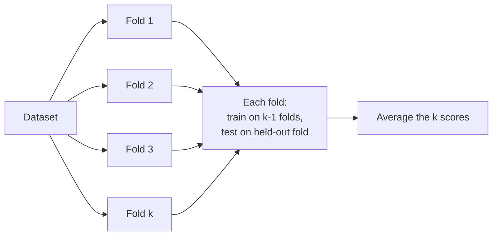

- **Hold-out** splits the data once, commonly 80/20. It is fast, but the estimate depends on the luck of that single split.
- **k-Fold** trains $k$ times, each time holding out a different fold, and averages the $k$ scores. More computation, far lower variance in the estimate.
- **LOOCV** is the extreme case $k = N$: one sample held out per round. It squeezes the maximum training data out of the dataset but requires $N$ retrainings, so it is expensive.
- **Stratified sampling** preserves the class proportions inside every fold. On a dataset that is 95 % "no disease" and 5 % "disease", an unstratified fold could contain almost no positive cases, making the evaluation meaningless.

## Model Selection Strategies

- Comparing multiple algorithms
- Hyperparameter tuning
  - Grid Search
  - Random Search
  - Bayesian Optimization
- Automated Machine Learning (AutoML)

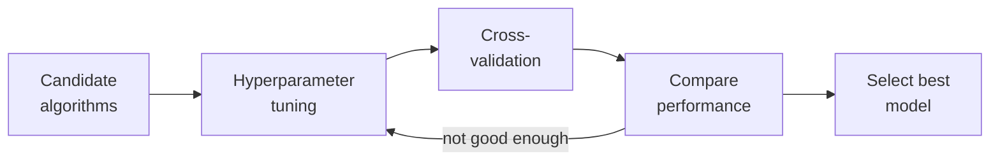

Selection happens at three levels. First, **compare algorithm families** — logistic regression against random forest against gradient boosting — to see which architecture suits the data. Second, **tune the hyperparameters** of the chosen algorithm, the settings that are not learned from data:

- **Grid Search** is brute force: try every combination in a predefined grid. Systematic, exhaustive, and expensive.
- **Random Search** samples combinations at random. Often finds a better configuration than grid search in far fewer trials, especially in high-dimensional parameter spaces.
- **Bayesian Optimization** is *informed* search: it builds a probabilistic model of the objective and uses it to choose the most promising configuration to try next, so each evaluation improves the next guess.

Third, **AutoML** automates the whole pipeline — feature engineering, algorithm choice and tuning together.

## Overfitting and Underfitting

- Causes and detection
- Regularization (L1, L2, dropout)
- Early stopping

**Overfitting** is low bias and high variance: the model has learned the noise, so training accuracy is high while validation accuracy is poor. That gap *is* the detection method. **Underfitting** is high bias and low variance: the model is too simple and performs badly on both sets.

The remedies:

- **L1 (Lasso)** adds a penalty on the absolute size of the coefficients and can drive some to exactly zero, giving sparse models and feature selection.
- **L2 (Ridge)** penalises the squared size, shrinking coefficients without eliminating them.
- **Dropout** is specific to neural networks: randomly ignore a fraction of neurons during each training step so the network cannot rely on any single unit and is forced to learn redundant representations.
- **Early stopping** halts training as soon as validation performance starts to degrade, even though training error is still falling. Training to zero training error would simply memorise noise; early stopping catches the model at the point of best generalisation.

## Model Complexity and Generalization

- Bias–variance tradeoff revisited
- Model capacity vs dataset size
- Occam's razor principle in ML

**Capacity** is the range of functions a model can represent. A high-capacity model — a deep network, a high-degree polynomial — can learn intricate patterns, but it needs a correspondingly large dataset, because with too little data that same capacity gets spent on memorising noise. So capacity and dataset size must be matched to one another.

**Occam's razor** supplies the tie-breaker: if two models perform comparably, prefer the simpler one, because it is more likely to generalise. This is the same principle that justifies regularization.

## Machine Learning Security

Evaluation asks whether a model is accurate. Security asks whether it can be **attacked**, and the attack surface splits neatly across the two phases of the lifecycle.

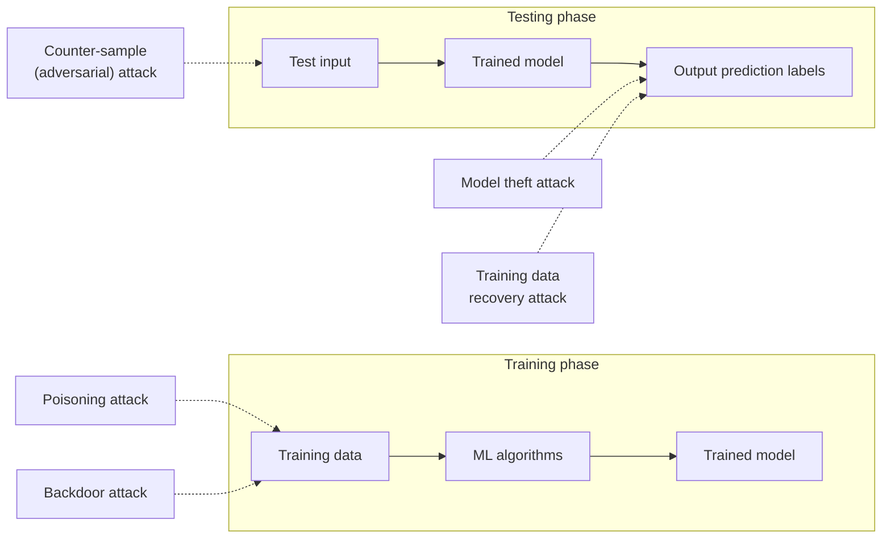

**Integrity attacks on training data:**

- **Poisoning attack** — the attacker injects malicious samples into the training set to degrade overall performance or force specific misclassifications.
- **Backdoor attack** — the attacker plants a *trigger* in the training data. The model behaves normally on ordinary inputs but acts maliciously whenever the trigger appears.

**Evasion attack at inference:**

- **Counter-sample (adversarial) attack** — the input is perturbed by an amount often invisible to a human, yet enough to flip the trained model's prediction. The model itself is untouched; it is simply fooled.

**Privacy and confidentiality attacks on outputs:**

- **Model theft attack** — the attacker queries the model repeatedly and uses the answers to train a shadow model that mimics it, stealing the intellectual property.
- **Training data recovery (inversion) attack** — the attacker analyses the outputs to reconstruct or infer sensitive information about the data the model was trained on.

The lesson is that securing an ML system is not just server security: the integrity of the *data*, the robustness of the *inputs*, and the privacy of the *outputs* are all separate attack surfaces.

## 3.2 Introduction to Statistical Learning Theory

- Statistical Learning Theory (SLT) is a theoretical framework for understanding how machines learn from data and make predictions.
- It provides the mathematical foundations behind many modern machine learning algorithms and helps explain their performance, limitations, and generalization ability.

Where the rest of the course studies particular algorithms, SLT studies the *general* problem of inferring a predictive function from data. It answers "why does this work, and when will it fail?" using probability theory, and it delivers three things: an account of **performance**, an account of **limitations**, and mathematical bounds on **generalization ability**.

The goals of learning are **understanding** and **prediction**. Learning falls into many categories — supervised, unsupervised, online, reinforcement — and in all of them the learning problem consists of **inferring the function that maps between the input and the output**, such that the learned function can be used to predict output from future input.

### Where statistical learning sits

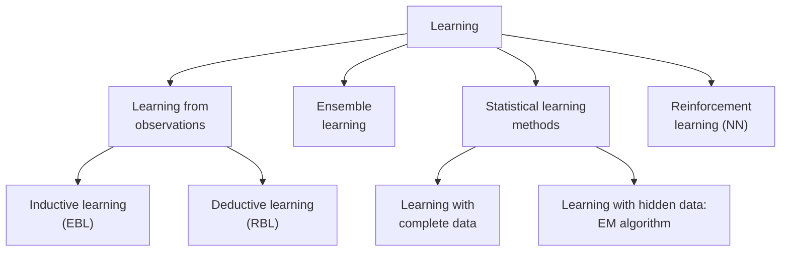

**Inductive** learning generalises from specific examples; **deductive** learning derives specifics from general rules. Within statistical learning, the split is by data availability: with **complete data** every variable is observed, while with **hidden (latent)** variables the standard tool is the **Expectation–Maximization (EM)** algorithm.

### Learning Problem

- Input: A dataset consisting of feature vectors and corresponding labels.
- Goal: Learn a function (hypothesis) that maps inputs to outputs with minimal error.

In symbols: feature vectors $x \in \mathbb{R}^d$, labels $y$, and a hypothesis $h(x) = \hat{y}$ chosen to minimise error.

### Hypothesis Space (H)

- The set of all possible models the learning algorithm can choose from.
- Example: In linear regression, the hypothesis space is the set of all linear functions.

If you are searching a house for a lost key, the hypothesis space is the inside of the house — you do not look in the garden, because it lies outside the defined search space. Choosing $H$ is therefore choosing the model's **inductive bias**: if the true relationship is not inside $H$, no amount of training will find it.

### Risk and Loss Functions

- Loss function: Measures the error of predictions (e.g., squared error, hinge loss, cross-entropy).
- Expected Risk (True Risk): Average loss over the entire data distribution (unknown in practice).
- Empirical Risk: Average loss over the training dataset (known).

The distinction to keep straight: **loss** is the error on one data point, **risk** is the average loss. True risk is an expectation over the joint distribution of inputs and outputs, and since we never possess that distribution, true risk is a theoretical quantity we cannot compute. Empirical risk is what we can actually measure.

Empirical Risk:

$$R_{\text{emp}}(h) = \frac{1}{n} \sum_{i=1}^{n} L(y_i, h(x_i))$$

#### Empirical Risk Minimization (ERM)

- A principle where the learner chooses the hypothesis that minimizes the training error.
- Problem: ERM may lead to overfitting if the hypothesis is too complex.

$$h^* = \arg\min_{h \in H} R_{\text{emp}}(h)$$

ERM bets that the hypothesis which performs best on the training sample will also perform well on unseen data. The bet fails when $H$ is flexible enough to drive the training error to zero by memorising noise — a model with sufficient capacity can always do this, which is why ERM needs a complexity control bolted on.

### Generalization

- The ability of a model to perform well on unseen data.
- Statistical Learning Theory provides tools (like VC dimension, bounds, and regularization) to study generalization.

### VC Dimension and Capacity Control

- Vapnik–Chervonenkis (VC) dimension: A measure of the complexity or capacity of a hypothesis space.
- Models with very high VC dimension can overfit; too low VC dimension may underfit.

**Capacity control** is the act of choosing the right level of flexibility. High VC dimension means the model can fit intricate patterns — including the noise, which is overfitting (low training error, high test error). Low VC dimension means the model cannot capture the true pattern at all, which is underfitting (high error on both).

### Structural Risk Minimization (SRM)

- An approach that balances model complexity and training error.
- Introduces regularization to avoid overfitting and improve generalization.

SRM replaces "minimise the training error" with "minimise the training error **plus** a penalty for complexity":

$$R(h) \le R_{\text{emp}}(h) + \Omega(h)$$

where $\Omega$ is a confidence term that grows with the VC dimension and shrinks as the sample size grows, roughly as $\sqrt{h/N}$. **Regularization** (L1, L2) is the practical implementation of that penalty.

### PAC Learning (Probably Approximately Correct)

- Framework that defines conditions under which a learning algorithm can guarantee that the learned hypothesis is close to the true function, with high probability.

The two words in the name are the two parameters:

- **Approximately correct** — the error of the learned hypothesis is at most $\epsilon$. We do not demand perfection, only "close enough".
- **Probably** — the algorithm achieves that with probability at least $1 - \delta$, where $\delta$ is the confidence parameter.

Introduced by Leslie Valiant, the framework's practical output is **sample complexity**: how many training examples are needed to be probably approximately correct.

## Hierarchical Clustering

- Hierarchical clustering is an unsupervised machine learning technique used to group similar data points into clusters.
- Unlike algorithms such as K-Means, it does not require the number of clusters to be specified in advance.

That is the headline advantage. K-Means demands $k$ up front; hierarchical clustering builds a whole nested tree of clusters and lets you decide the number *afterwards* by cutting the tree at a chosen height. The result is a hierarchy: pairs of very similar points merge at the lowest level, those small clusters merge into larger ones, and the outermost level contains the entire dataset.

### Agglomerative Hierarchical Clustering (Bottom-Up)

- Starts with each data point as an individual cluster.
- Repeatedly merges the two most similar clusters.
- Continues until all points belong to a single cluster or a stopping criterion is reached.
- This is the most commonly used approach.

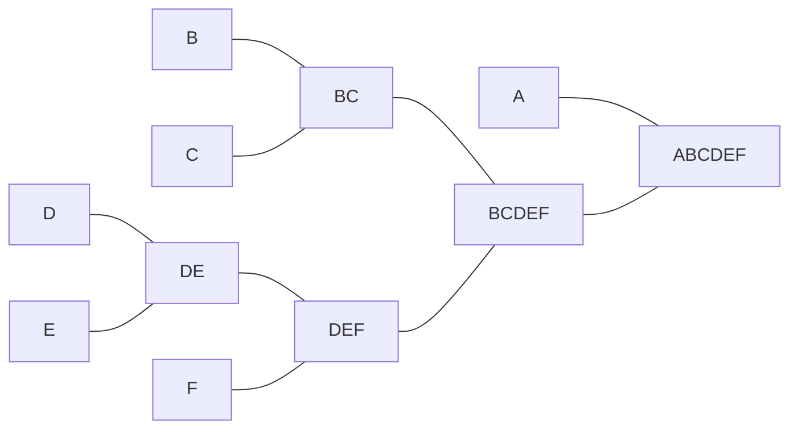

Reading the merges for six points: **B** and **C** join first, **D** and **E** join, then **DE** absorbs **F** to give **DEF**, then **BC** and **DEF** merge into **BCDEF**, and finally **A** joins to give the root **ABCDEF**. Starting from $N$ points there are $N$ clusters, and each step reduces the count by one.

#### How Agglomerative Hierarchical Clustering Works

1. Suppose you have five data points: A, B, C, D, E.
2. Treat each point as a separate cluster.
3. Compute the distance between all clusters.
4. Merge the two closest clusters.
5. Recalculate distances.
6. Repeat until only one cluster remains.

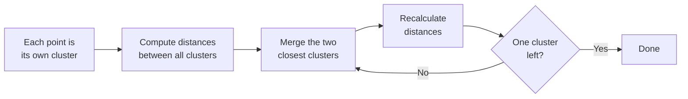

Step 5 is the subtle one: after a merge, the distance from the *new* cluster to every remaining cluster must be recomputed, and how that is done is exactly what a linkage method specifies.

Worked through for five points A–E: A and B merge first, then D and E, then (A,B) absorbs C, then the two groups (A,B,C) and (D,E) merge, leaving one cluster.

#### Linkage Methods

A linkage method defines how the distance between two *clusters* (rather than two points) is computed.

| Linkage Method | Description |
| --- | --- |
| Single Linkage | Minimum distance between two clusters |
| Complete Linkage | Maximum distance between two clusters |
| Average Linkage | Average distance between all pairs of points |
| Ward's Linkage | Minimizes the increase in within-cluster variance |

Formally, for clusters $A$ and $B$:

$$d_{\text{single}}(A,B) = \min\{d(a,b) : a \in A, b \in B\}$$

$$d_{\text{complete}}(A,B) = \max\{d(a,b) : a \in A, b \in B\}$$

$$d_{\text{average}}(A,B) = \frac{1}{|A| \cdot |B|} \sum_{a \in A} \sum_{b \in B} d(a,b)$$

Ward's method uses no direct distance at all: it merges whichever pair produces the **smallest increase in the total within-cluster sum of squares**, which makes its objective very close to that of K-Means.

| Linkage method | Distance between clusters | Cluster shape | Robustness to noise | Best used when |
| --- | --- | --- | --- | --- |
| Single (minimum) | Minimum distance between points | Long, irregular | Low | Clusters are non-compact, chaining acceptable |
| Complete (maximum) | Maximum distance between points | Compact, spherical | High | Clusters are compact and well separated |
| Average (UPGMA) | Average over all pairs | Moderate | Medium | General purpose |
| Ward's (min. variance) | Minimum increase in within-cluster variance | Compact, spherical | High | Clusters of similar size and variance |

The failure mode with a name is the **chaining effect** in single linkage: because only one close pair is needed for a merge, a single noisy point sitting between two groups can pull them together, producing long thin "chains". Complete linkage requires *all* members to be reasonably close and so resists this. **UPGMA** stands for Unweighted Pair Group Method with Arithmetic Mean. Single linkage does have its uses — it is the right choice for genuinely elongated shapes such as concentric rings or crescents.

### Divisive Hierarchical Clustering (Top-Down)

- Starts with all data points in one cluster.
- Repeatedly splits clusters into smaller clusters.
- Continues until each data point forms its own cluster or the desired number of clusters is obtained.

The mirror image of agglomerative: begin with the root **ABCDEF**, split off **A** from **BCDEF**, split that into **BC** and **DEF**, then break each down until every point stands alone. At each step the algorithm must choose which cluster to split *and* how to split it — often by running a flat algorithm such as K-Means inside the cluster.

| Feature | Divisive (top-down) | Agglomerative (bottom-up) |
| --- | --- | --- |
| Start | All points in one cluster | Each point as a single cluster |
| Operation | Repeatedly split clusters | Repeatedly merge clusters |
| End | Each point is a cluster (or the desired number) | All points in one cluster (or the desired number) |
| Complexity | Higher | Lower — more commonly used |

Why divisive costs more: a cluster of size $n$ can be split into two non-empty subsets in $2^{n-1} - 1$ ways, so finding the *best* split is expensive, whereas agglomerative merging only has to find the closest existing pair. **DIANA** (Divisive Analysis) is the classic algorithm. Stopping criteria for either direction: a target number of clusters, a minimum cluster size, or a maximum tree depth.

Applications of both: market segmentation, document classification, gene expression analysis, social network analysis.

## Dendrograms

- A dendrogram is a tree-like diagram that shows how clusters are merged.
- The dendrogram is a tree diagram that displays the groups that are formed by clustering observations at each step and their similarity levels.
- The similarity level is measured along the vertical axis (alternately, you can display the distance level), and the different observations are listed along the horizontal axis.

The axes carry all the information. Along the **horizontal axis** sit the individual observations, the leaves of the tree — ordered so that branches do not cross, which is why they are rarely in numerical order. The **vertical axis** is distance or similarity, and the height of each horizontal connector is the distance at which those two clusters merged. Low merge, very similar; high merge, quite different.

### Interpretation

1. Use the dendrogram to view how the clusters are formed at each step and to assess the similarity (or distance) levels of the clusters that are formed.
2. To view the similarity (or distance) levels, hold your pointer over a horizontal line in the dendrogram. The pattern of how similarity or distance values change from step to step can help you to choose the final grouping for your data.
3. The step where the values change abruptly may identify a good point to define the final grouping.
4. The decision about final grouping is also called cutting the dendrogram. Cutting the dendrogram is similar to drawing a line across the dendrogram to specify the final grouping.
5. You can also compare dendrograms for different final groupings to determine which final grouping makes the most sense for your data.

Point 3 is the practical rule for choosing $k$: look for a **large vertical gap** between one merge and the next. A big jump means the next merge is joining things that are substantially unalike, which makes the level just below it a natural place to stop.

Cutting the tree is a simple mechanic with a precise meaning: draw a horizontal line at a chosen height, and the number of vertical branches it crosses is the number of clusters. Cutting a dendrogram of A–E at distance 5, for instance, yields two clusters, {A, B, C} and {D, E}. For a divisive tree over A–H, cutting at dissimilarity 6 gives {A, B, C, D} and {E, F, G, H}.

The trade-off is fixed and symmetric:

- Cut **higher** → **fewer** clusters, but **lower** similarity within them.
- Cut **lower** → **more** clusters, but **higher** similarity within them.

### Example Dendrogram

Complete linkage, Euclidean distance, twenty observations, with the vertical axis running from 100 (maximum similarity, every point its own cluster) down to 0 (all points merged):

1. This dendrogram was created using a final partition of 4 clusters, which occurs at a similarity level of approximately 40.
2. The first cluster (far left) is composed of seven observations (the observations in rows 1, 3, 6, 9, 10, 11, and 15 of the worksheet).
3. The second cluster, directly to the right, is composed of 3 observations (the observations in rows 4, 12, and 19 in the worksheet).
4. The third cluster is composed of 7 observations (the observations in rows 2, 14, 17, 20, 18, 5, and 8). The fourth cluster, on the far right, is composed of 3 observations (the observations in rows 7, 13, and 16).
5. If you cut the dendrogram higher, then there would be fewer final clusters, but their similarity level would be lower.
6. If you cut the dendrogram lower, then the similarity level would be higher, but there would be more final clusters.

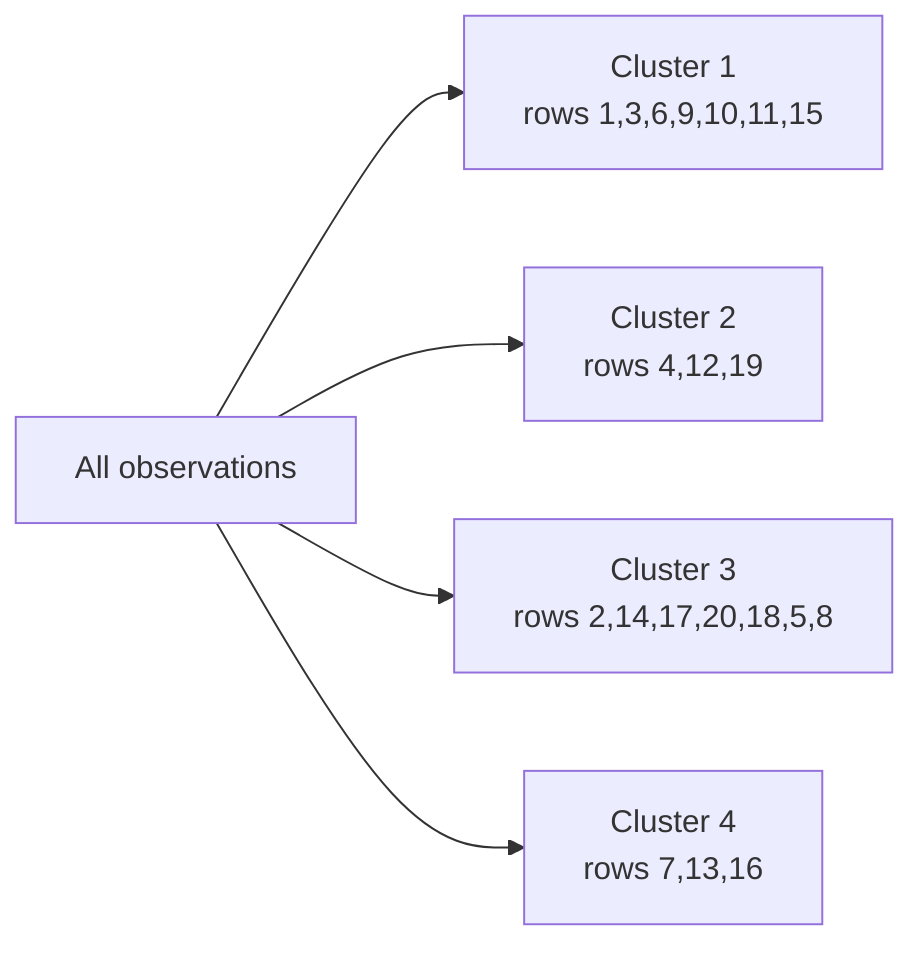

Within that tree, observations 17 and 20 merge at a similarity near 95 — they are almost identical — while the final merge of the two halves happens at similarity 0, showing those halves are maximally distinct. Cutting at 66.67 would give many small clusters; cutting near 20 would give two large ones.

The underlying metric is Euclidean distance,

$$d(p, q) = \sqrt{\sum_{i=1}^{n} (p_i - q_i)^2}$$

and the linkage is complete, $D(C_1, C_2) = \max\{d(a,b) : a \in C_1, b \in C_2\}$, which is why the clusters come out compact.

## Apriori Algorithm for Association Rules

- Association rule learning is a rule-based machine learning method to find relationships (associations) between variables in large datasets.

Real life example:

- If a customer buys bread and butter, they are likely to buy jam.
- This is an example of a market basket analysis.

A rule $X \Rightarrow Y$ has an **antecedent** $X$ (the "if" side, e.g. {Bread, Egg}) and a **consequent** $Y$ (the "then" side, e.g. {Milk}); together they form the **itemset** {Bread, Egg, Milk}. The rule states co-occurrence, not causation.

Given an itemset $X = \{x_1, \dots, x_k\}$, we look for all rules with minimum support and confidence, where **support** $s$ is the probability that a transaction contains $X \cup Y$ and **confidence** $c$ is the conditional probability that a transaction containing $X$ also contains $Y$:

$$s(X \Rightarrow Y) = \frac{\sigma(X \cup Y)}{N}, \qquad c(X \Rightarrow Y) = \frac{\sigma(X \cup Y)}{\sigma(X)} = P(Y \mid X)$$

Support is symmetric; confidence is not. **Lift** compares the observed support against what it would be if $X$ and $Y$ were independent, so lift $> 1$ signals a real association rather than a coincidence.

### Steps of Apriori Algorithm

- Set minimum support and confidence
- Generate all frequent itemsets:
  - Count itemsets in the dataset
  - Eliminate itemsets below the support threshold
- Generate association rules from the frequent item sets
- Filter rules based on confidence and lift

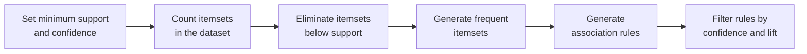

The **Apriori property** (downward closure) is what makes this tractable: every non-empty subset of a frequent itemset must itself be frequent, so any candidate containing an infrequent subset can be pruned before it is ever counted. Without that pruning the candidate count grows exponentially. The algorithm proceeds level by level — join the frequent $(k-1)$-itemsets to form candidates, prune, scan the database to count, keep what clears the threshold, increment $k$ — and stops when a level produces nothing frequent. A full numeric trace of the level-wise search appears in Unit II.

### Applications of Apriori Algorithm

- E-commerce: Used to recommend products that are often bought together like laptop + laptop bag, increasing sales.
- Food Delivery Services: Identifies popular combos such as burger + fries, to offer combo deals to customers.
- Streaming Services: Recommends related movies or shows based on what users often watch together like action + superhero movies.
- Financial Services: Analyzes spending habits to suggest personalized offers such as credit card deals based on frequent purchases.
- Travel & Hospitality: Creates travel packages like flight + hotel by finding commonly purchased services together.
- Health & Fitness: Suggests workout plans or supplements based on users' past activities like protein shakes + workouts.

The business patterns behind these are **cross-selling** (laptop → bag), **product bundling** (flight + hotel) and **personalisation** (recommendations from past activity).

## Discriminant Functions

- A discriminant function is a function used in pattern recognition and machine learning to classify data points into different classes.
- It evaluates a feature vector and assigns it to one of the predefined classes by comparing the function values.

The decision rule is a comparison: assign $\mathbf{x}$ to class $C_k$ if $g_k(\mathbf{x}) > g_j(\mathbf{x})$ for all $j \neq k$. Only the *relative* sizes matter, which is why any monotonic transformation of the posterior works equally well as a discriminant function. Unit I develops the full treatment, including decision regions, reject regions and non-linear discriminants.

### Why Use Discriminant Functions?

- They provide a decision boundary between classes.
- Useful in supervised learning for classification tasks.
- Allow for probabilistic or distance-based interpretations.

### Types of Discriminant Functions

- Linear Discriminant Function (LDF)
- Quadratic Discriminant Function (QDF)
- Bayesian Discriminant Function (BDF)

LDF assumes a common covariance matrix across classes and produces straight boundaries; QDF allows each class its own covariance matrix and produces quadratic ones; BDF applies the Bayes decision rule directly, choosing the class with the highest posterior. When classes are not linearly separable the discriminant must be **non-linear**, containing terms such as $x_1^2$ or $x_1 x_2$.

### Applications Of Discriminant Functions

- Face recognition
- Handwriting digit recognition
- Medical diagnosis
- Spam detection

### Linear Discriminant Function

- Linear discriminant analysis (LDA) is a supervised learning algorithm used for classification and dimensionality reduction in machine learning.
- It aims to find a linear combination of features that best separates different classes in a dataset.

LDA is **supervised** — it uses the class labels — which is the essential contrast with PCA, and for a $C$-class problem it can project into at most $C - 1$ dimensions. Fisher's criterion and the PCA comparison are covered in Unit I.

## Hypothesis Space

### What is a Hypothesis?

- In Machine Learning, a hypothesis is a mathematical function or model that maps input features (X) to an output (Y).
- It is the model's prediction function learned from the training data.
- Mathematically, $Y = h(X)$ where:
  - X = Input (Features)
  - Y = Output (Target/Class)
  - h = Hypothesis

Written as a mapping,

$$h : X \to Y$$

which says that $h$ takes any element of the input (feature) space $X$ and produces a prediction in the output (label) space $Y$. $Y$ may be continuous (regression) or discrete (classification). A hypothesis is not fixed in advance — it is *selected* by the learning algorithm during training.

#### Example

Suppose we want to predict the marks of a student based on study hours.

| Study Hours | Marks |
| --- | --- |
| 2 | 35 |
| 4 | 55 |
| 6 | 72 |

A possible hypothesis is $h(x)$, where:

- x = Study Hours
- h(x) = Predicted Marks

$$h(x) = 10x + 15$$

Check it against the table: $h(2) = 35$ and $h(4) = 55$ match exactly, while $h(6) = 75$ against an actual 72 — an error of 3. That is why the slide calls it a *possible* hypothesis rather than the right one: many lines fit this data, and the learning algorithm's job is to find the one with the least total error. Here 10 is the weight (marks gained per extra hour of study) and 15 is the bias (predicted marks for zero hours).

### What is Hypothesis Space?

- The Hypothesis Space is the set of all possible hypotheses (models) that a learning algorithm can choose from to solve a problem.
- It is denoted by $H$, where each hypothesis represents a different model.
- Hypothesis Space is the collection of all candidate functions that can approximate the relationship between inputs and outputs.

$$H = \{h_1, h_2, h_3, \dots, h_n\}$$

The set may be finite or, more usually, infinite — every possible straight line, every possible decision tree. Choosing a model class *is* choosing $H$, and learning is then a **search** through $H$ for the member with the lowest error.

### Why is Hypothesis Space Needed?

1. A machine learning algorithm does not know the correct model initially.
2. Instead, it searches among many possible models to find the one that best fits the training data.
3. The collection of all these possible models is called the Hypothesis Space.

Without a defined $H$ the search would be unbounded and there would be no systematic way to look for a solution. The size of $H$ also sets the two failure modes: too small and the correct solution may not be inside it (underfitting, high bias); too large and the search can land on a hypothesis tuned to the training set's noise (overfitting).

### Real-Life Analogy

- "Find the best route from your home to college."
- Possible routes are: 1. Route A  2. Route B  3. Route C  4. Route D
- Each route is a possible solution.
- Similarly,
  1. Each model = one hypothesis
  2. All models together = hypothesis space
  3. The ML algorithm chooses the best route (best hypothesis).

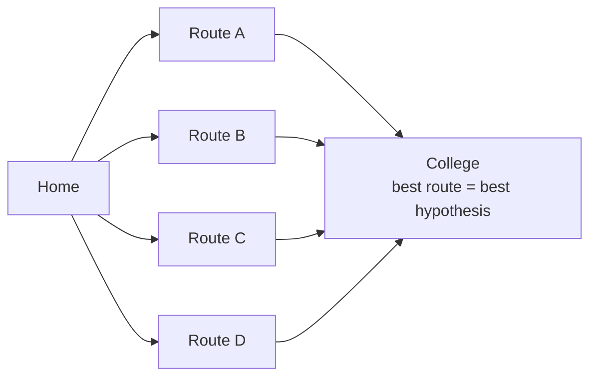

### Example of Hypothesis Space

Suppose we want to classify emails as Spam or Not Spam. Possible hypotheses:

1. Hypothesis 1: If email contains "Lottery" → Spam
2. Hypothesis 2: If email contains "Free" → Spam
3. Hypothesis 3: If email contains "Lottery" AND "Prize" → Spam
4. Hypothesis 4: Always predict Not Spam

All these hypothesis together form Hypothesis SPACE.

Note the range on display: three feature-based rules, one of which uses a logical AND, plus a **constant** baseline hypothesis that ignores the input entirely. The baseline is a legitimate member of $H$ — and a useful one, because any real model must beat it.

### Mathematical Representation

- Suppose $h(x) = wx + b$.
- Different values of w and b produce different hypotheses.

$$h_1(x) = 2x + 1, \qquad h_2(x) = 3x + 5, \qquad h_3(x) = 5x - 2$$

The collection

$$H = \{2x + 1,\; 3x + 5,\; 5x - 2,\; \dots\}$$

is the Hypothesis Space — here, the set of *all* linear functions of one variable. Every distinct pair $(w, b)$ is one hypothesis inside it, and training is the search for the best pair. Choosing this $H$ is also a commitment: a linear hypothesis space cannot represent a non-linear pattern, no matter how much data it is given.

## VC Dimension

### VC Dimension (Vapnik–Chervonenkis Dimension)

1. VC dimension measures the capacity (complexity) of a hypothesis space — how well a model can fit various patterns.
2. It is the maximum number of points that can be shattered (i.e., classified correctly in all possible ways) by the hypothesis class.

Examples:

- VC Dimension of a linear classifier in 2D: 3
- VC Dimension of a decision stump (1-level decision tree): 1
- VC Dimension of a k-nearest neighbor (if k=1): infinite

**Shattering** is a counting condition. A set of $N$ points admits $2^N$ possible binary labellings; the hypothesis class shatters that set only if for *every one* of those $2^N$ labellings there exists a hypothesis in the class that realises it exactly.

- A line in 2D can shatter 3 points in general position, but not 4 in an XOR/checkerboard arrangement — hence $VC = 3$. In general, a linear classifier in $d$ dimensions has $VC = d + 1$.
- A 1-nearest-neighbour model assigns each point the label of its nearest training point, so it can reproduce *any* labelling of *any* number of points. Its capacity — and its appetite for overfitting — is unbounded.

### VC Dimension (Detail)

- The Vapnik-Chervonenkis (VC) dimension is a measure of the capacity of a hypothesis set to fit different data sets.
- It was introduced by Vladimir Vapnik and Alexey Chervonenkis in the 1970s and has become a fundamental concept in statistical learning theory.
- The VC dimension is a measure of the complexity of a model, which can help us understand how well it can fit different data sets.
- The VC dimension of a hypothesis set H is the largest number of points that can be shattered by H.
- A hypothesis set H shatters a set of points S if, for every possible labeling of the points in S, there exists a hypothesis in H that correctly classifies the points.

Formally, $VC(H)$ is the size of the largest finite subset of $X$ shattered by $H$:

$$VC(H) = \max\{\,n : \exists S,\ |S| = n,\ H \text{ shatters } S\,\}$$

If $VC(H) = k$, then for every set of $k+1$ points there exists a labelling that cannot be shattered — no hypothesis in $H$ is consistent with it. If arbitrarily large finite subsets of $X$ can be shattered, then $VC(H) = \infty$.

The proof obligations are asymmetric and worth memorising: to show $VC(H) \ge k$ you need **one** set of $k$ points that *is* shattered; to show $VC(H) < k+1$ you must show that **no** set of $k+1$ points can be shattered.

#### Example: spherical decision functions

Spherical decision functions $f(c, r, \mathbf{x})$ — circles in the plane, with centre $c$, radius $r$, and the rule $h(\mathbf{x}) = +1$ if $\|\mathbf{x} - c\| \le r$ — **can shatter 3 points but cannot shatter 4**.

With three points in a triangle, some circle picks out any subset you like: one point alone, a pair, or all three — all $2^3 = 8$ labellings are achievable. With four points arranged as a triangle plus one point *inside* it, label the three outer points positive and the inner point negative: no circle can enclose the three outer points without also enclosing the inner one. One impossible labelling is enough, so the VC dimension of circles in 2D is 3.

### VC dimension and empirical risk

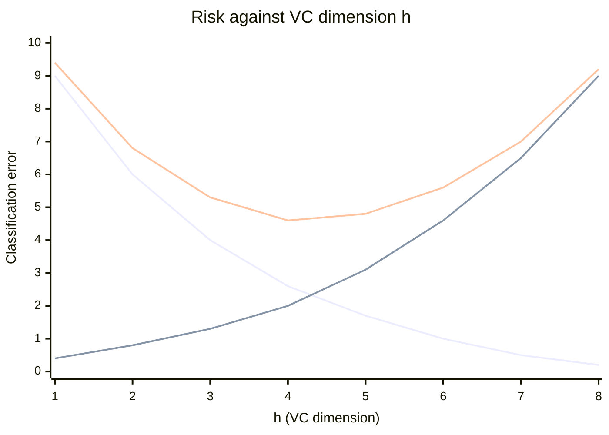

Three curves, in the order plotted: **empirical risk** falls monotonically as capacity grows, because a more flexible model fits the training data ever more closely; the **confidence interval** (the complexity penalty, roughly $\propto \sqrt{h/N}$) rises monotonically; and **true risk**, their sum, is U-shaped. The minimum of that U is the optimal capacity. To its left the model **underfits**; to its right it **overfits**.

$$R(h) \le R_{\text{emp}}(h) + \Omega\!\left(\frac{h}{N}\right)$$

This picture is the argument for **Structural Risk Minimization** over plain ERM: empirical risk is a decreasing function of VC dimension, so minimising it alone drives capacity upward without limit. The optimal model sits at the minimum of the *true* risk curve, not the empirical one.

### Why is it important?

- Helps understand underfitting vs overfitting
- A model with high VC dimension can overfit.
- A balance is needed between model complexity and generalization.

## 3.3 Ensemble Methods

Ensemble Methods (Boosting, Bagging, Random Forests)

### Ensemble learning

- Ensemble learning is a technique in machine learning where multiple models (often called "weak learners") are trained and combined to solve the same problem.
- The idea is that a group of models working together can outperform a single strong model.

A **weak learner** performs only slightly better than chance on its own. The ensemble works because their errors are not identical: aggregate enough diverse learners and the individual mistakes cancel while the shared signal survives.

### When to Use Ensemble Learning?

- You have high variance or high bias in your model.
- Your base models are diverse and complementary.
- You want to increase model performance in competitions (e.g., Kaggle).

Which problem you have decides the method: **bagging** attacks high variance, **boosting** attacks high bias. The **diversity** requirement is strict — models that make the same errors add nothing when combined.

#### Real-Life Example

- Imagine trying to guess a movie's rating:
  - One friend uses past ratings
  - Another reads online reviews
  - A third watches the trailer
- Each has weaknesses alone, but combining their opinions gives a better estimate. That's ensemble learning!

Each friend is a base learner on a different information source — historical data, text sentiment, audio-visual content — and each has a characteristic blind spot. A trailer can mislead; past ratings can miss a change in style. Averaging the three opinions cancels part of every individual bias.

Accuracy: Highest

### Types of Ensemble learning

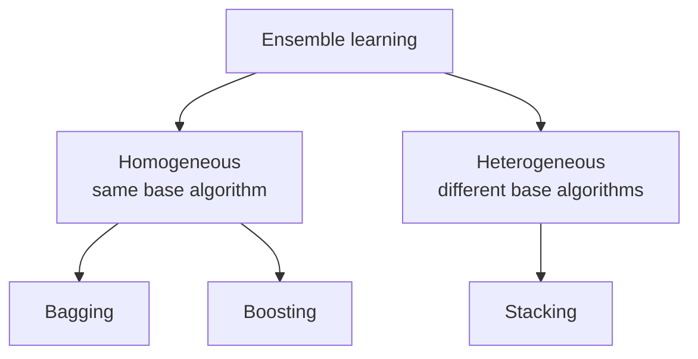

#### Bagging (Bootstrap Aggregating)

- Models are trained independently on different random subsets of the training data.
- Their results are then combined—usually by averaging (for regression) or voting (for classification).
- This helps reduce variance and prevents over fitting.
- Example Algorithms:
  - Random Forest (uses decision trees + bagging)

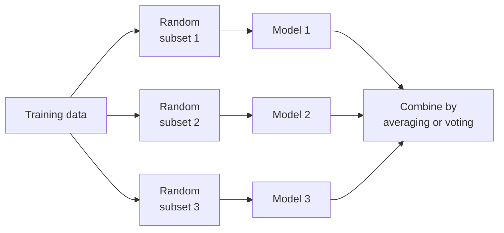

The subsets are drawn **with replacement**, so a point can appear more than once in one subset and not at all in another; the ones left out are the out-of-bag samples used for internal validation. The learners train **independently and in parallel**, and the aggregation is a plain vote or mean:

$$H(x) = \text{mode}\{h_1(x), h_2(x), h_3(x)\}$$

Bagging reduces **variance** without materially increasing bias.

#### Boosting

- Models are trained one after another. Each new model focuses on fixing the errors made by the previous ones.
- The final prediction is a weighted combination of all models, which helps reduce bias and improve accuracy.
- Models are trained sequentially, each new model focusing on correcting the errors of the previous ones.
- Final prediction is a weighted sum of all models.
- Reduces bias and variance

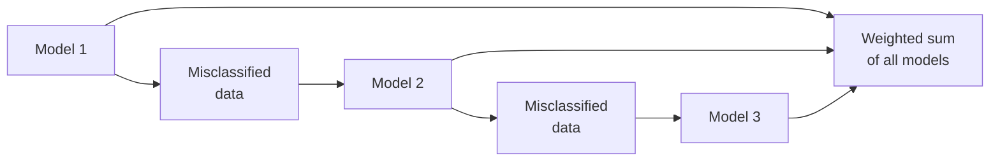

The loop is train → test → find the false predictions → raise the weight of those examples → train the next weak learner on them, repeated for $m$ rounds. The final decision is a weighted vote in which the more accurate learners speak louder:

$$H(x) = \text{sign}\!\left(\sum_t \alpha_t h_t(x)\right)$$

Because each round depends on the previous one, boosting cannot be parallelised across rounds the way bagging can.

Popular Boosting Algorithms:

- AdaBoost (Adaptive Boosting)
- Gradient Boosting (GBM)
- XGBoost
- LightGBM
- CatBoost

#### Stacking (Stacked Generalization)

- Multiple different models (often of different types) are trained, and their predictions are used as inputs to a final model, called a meta-model.
- The meta-model learns how to best combine the predictions of the base models, aiming for better performance than any individual model.
- The predictions of base models are fed to a meta-model (e.g., logistic regression) that learns how to best combine them.
- Leverages strengths of different models
- Useful when base learners are diverse.

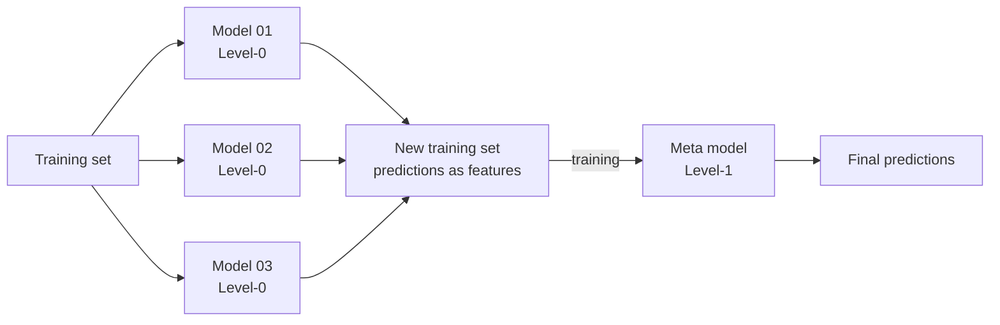

Four steps: train the Level-0 base models on the training set; collect their predictions; treat those predictions as the **features** of a new training set; train the Level-1 **meta-model** on it. The meta-model never sees the original raw features — it sees only what the base models said, and it learns whom to trust when they disagree. Logistic regression is a common meta-model for classification because it blends inputs smoothly.

Two cautions. Base learners must be **diverse**, or there is nothing for the meta-model to arbitrate. And stacking overfits if the meta-model is trained on predictions the base models made about their own training data — the standard fix is **out-of-fold** (cross-validated) predictions when constructing the new training set.

| | Bagging | Boosting | Stacking |
| --- | --- | --- | --- |
| Base learners | Same type | Same type | Usually different types |
| Training order | Parallel, independent | Sequential | Base models parallel, then a meta-model |
| Combination | Vote / average | Weighted vote | Learned by the meta-model |
| Primarily reduces | Variance | Bias | Both, by learning the combination |
| Example | Random Forest | AdaBoost, XGBoost | Stacked generalisation |

#### Real-Life Example

- Imagine trying to guess a movie's rating:
  - One friend uses past ratings
  - Another reads online reviews
  - A third watches the trailer
- Each has weaknesses alone, but combining their opinions gives a better estimate. That's ensemble learning!

